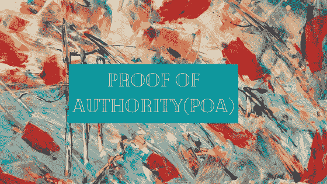

# 权威证明

> 原文：<https://medium.com/coinmonks/proof-of-authority-ac34f1b3a2c2?source=collection_archive---------1----------------------->

区块链行业自诞生以来一直在不断进步。共识机制是去中心化生态系统的核心，帮助它在网络中达成共识。迄今为止，已经发明并实现了许多共识方法来在区块链系统内实现共识。我正在写一系列关于[不同共识机制](/@tulip311bit/understanding-different-consensus-mechanisms-77f088eaacd8)的文章，详细解释它们之间的优缺点。我已经介绍了 [PoW](/@tulip311bit/proof-of-work-explained-e783ccd2f87c) 和 [PoS](/@tulip311bit/proof-of-stake-b1e31f2cf4b6) ，所以在本文中，我将重点介绍 PoA。

比特币使用的 PoW 共识算法被认为是一种可靠和安全的共识机制，但它不支持可扩展性。因此，它限制了比特币网络的性能及其交易速度。这种方法的主要缺点是需要高能量消耗和系统资源来解决复杂的数学难题。

> [在 CoinCodeCap 上购买最佳加密交易](https://coincodecap.com/deals)

随着更多特性的出现，提供比 PoW 更好性能的 Stake Proof 应运而生。有几个 PoS 项目仍在开发中，因此它能提供哪些新功能以及能在多大程度上解决现有共识机制的缺点取决于未来项目的成功率。

此外，还有另一种共识机制，称为权威证明，这是 PoS 的增强版。它通过允许每秒更多的事务来支持更好的性能。现在我们来详细讨论一下。

**什么是权威的证明？**

权威证明(PoA)是一种共识方法，其中一组验证者已经被选为权威。他们的任务是检查和验证所有新添加的身份，验证要添加到网络中的事务和数据块。为了确保网络中的效率和安全性，验证器组通常保持较小的规模(大约 25 个或更少)。

> ***授权证明(PoA)是利益证明(PoS)的增强版本，其中验证者的身份被用作网络中的利益。***

一个节点需要完成一个强制性的过程来验证自己，以获得生成新块的权利。**因此，块和交易由参与者验证，参与者的身份已经被验证，并且充当系统的权威。**

> ***在用户数量有限的情况下，可以采用 PoA 共识作为专用网络而非公共区块链的解决方案。***

PoA 是由一群开发人员在 2017 年 3 月提出的(由 Gavin Wood 创造)，作为基于以太坊协议的区块链。它是为了解决以太坊的 Ropsten 测试网络上的垃圾邮件攻击问题而开发的。新网络被命名为 Kovan，这是今天所有以太坊用户使用的主要测试网络。

**权威共识证明的先决条件**

PoA 共识算法通常基于以下标准:

验证者需要通过提供政府颁发的文件来公开和确认他们的身份。

验证验证者身份的标准程序。

复杂和强大的标准来定义验证者，以便他们可以将他的声誉置于危险之中，并致力于长期联盟。

**PoA 共识的优势**

与其他共识方法相比，PoA 具有以下优势:

交易率高。

不需要高性能硬件。

与功率区块链相比，PoA 网络是非常可扩展

功率范围较小。

交易费用低。

授权网络节点以固定时间间隔顺序生成块。这提高了交易验证速度。

不需要通信来达成节点之间的共识。

网络操作与可用的真正节点的数量无关。

一个节点成为锻造厂的机会取决于它的股份和总持有量。

**缺点**

基于授权证明的网络缺乏分散性。

PoA 验证者的身份在网络中是可见的。

PoA 不保证审查阻力。

**实际实施**

PoA 一致性算法可以应用于各种领域和行业，以实现从供应链到银行部门的高吞吐量。PoA 被认为是一种有效、合理的解决方案，具有成本节约的优势。

以下是采用活动方案的项目清单:

以太坊的测试网 Kovan 建立在奇偶校验的 PoA 协议上

PoA 网络的权威证明，有限责任公司。(以太坊侧链)

VeChainThor 平台。

**结论**

每种共识方法，无论是 PoW、PoS 还是 PoA，都有其自身的优点和缺点。但是，如果我们特别谈论 PoA，它在某种程度上在去中心化领域妥协，以实现可伸缩性和吞吐量。

因此，由于其效率和更低的功耗特性，授权证明可以被视为集中式解决方案的更好选择。

**阅读更多:** [了解 SegWit](/coinmonks/understanding-segwit-7a1e206aff7b)

关注我的 [**推特**](https://twitter.com/rumadas123)

> [在您的收件箱中直接获得最佳软件交易](https://coincodecap.com/?utm_source=coinmonks)

