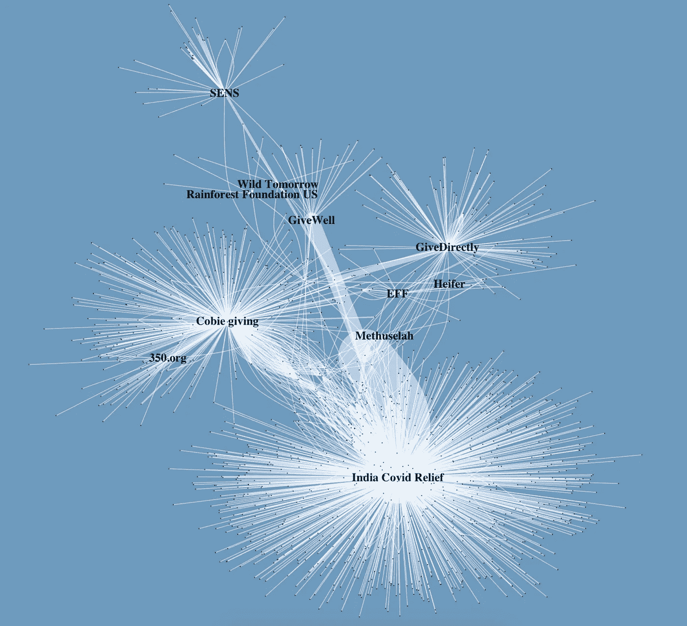
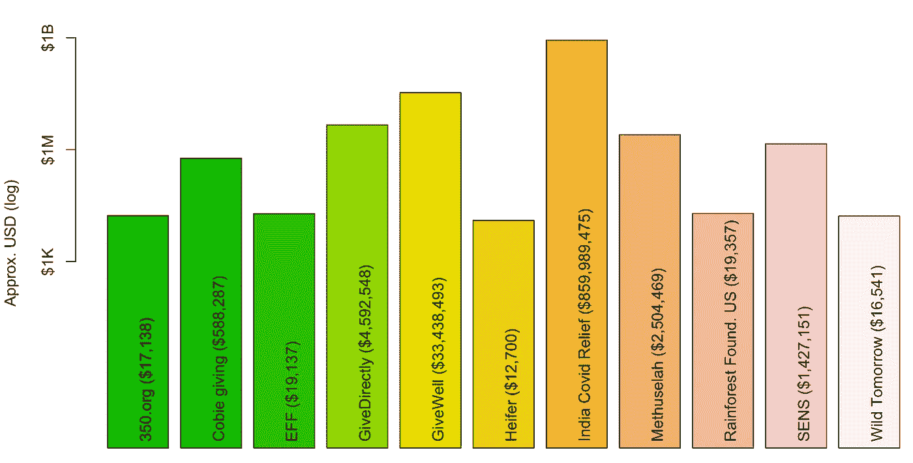

# 给予的证明

> 原文：<https://medium.com/coinmonks/proof-of-giving-2e36823eb146?source=collection_archive---------3----------------------->

## Crypto 比它得到的信任要善良得多

Some 2021 giving. Figure by Takens, data from the amazing [Etherscan](http://etherscan.io).

对许多人来说,“密码”这个词让人联想到兰博基尼和 6 位数的卡通猫。Crypto 的文化习俗包括登月和“数字上升”尽管有这些联系，2021 年的一个主题是慈善捐赠。随着那些长期持有加密货币的人获得难以置信的收益，也出现了一波慈善浪潮。

上面的网络显示了从 2021 年开始在以太坊上进行捐赠，并且只针对十几个已知的慈善活动地址。点是钱包，线是对这些慈善机构的密码捐赠。因为这些地址是公开的，所以区块链充当了“捐赠证明”线条的宽度反映了以美元计算的大致捐款额。你可以看到一些钱包(或交易所)流入了几个慈善机构，有时多次流入同一个慈善机构。

总的来说，按照 2021 年 5 月的价格，这个网络映射了近 10 亿美元的捐赠。这个庞大的数字主要归功于对印度 Covid 加密救济基金的巨额捐赠。在上面的网络图中，这笔捐款显示为进入该慈善机构的大量粗线。

The largest donation was in meme coins.

但即使没有这笔最大的捐赠，仅仅在以太坊上，仅仅在这几个钱包里，就有超过 1 亿美元的捐赠。这里有一些 2021 年秘密空间慈善活动的例子，挑战刻板印象，对许多不幸的人产生积极影响。下面是一些捐赠的简要总结，并附有公开演讲的链接。

## 例子

***科比奇*** 。“Cobie fun”只是著名的 twitch.tv 流中的一个钱包。在这个现场视频流中，crypto 社区的杰出成员 [Cobie](https://twitter.com/CryptoCobain) 有时会跳进 twitch 频道，与他的追随者一起给各种音乐家、艺术家和其他人捐款。[网络上只展示了一个这样的钱包](https://twitter.com/CryptoCred/status/1393379873205403654)，一个获得了极大关注的钱包:科比和他的社区帮助了一个因孩子刚刚战胜癌症(并取得胜利)而陷入医疗债务的家庭。

*。[give direct](https://www.givedirectly.org/how-crypto-can-help-refugees/)和 [GiveWell](https://www.givewell.org/about/donate/cryptocurrency) 接受秘密捐赠已经有一段时间了。这些项目利用科学研究来确定什么样的慈善活动对人类福祉的每一美元都有最大的影响，特别是在服务不足的社区。他们的项目通常关注健康，如疾病预防、手术等。GiveDirectly 最近的一笔捐款包括以太坊联合创始人的数百万美元。两者都是 501(c)(3)慈善机构，接受以太和其他加密货币。*

*Vitalik inspired by giving much.*

****印度 Covid 加密浮雕*** 。Polygon [的联合创始人在 Twitter](https://twitter.com/sandeepnailwal/status/1385968552679727113) 上号召社区帮助应对春季席卷印度的新冠肺炎热潮。他和其他人在以太坊上创建了“[印度 Covid 加密救济](https://etherscan.io/address/0x68A99f89E475a078645f4BAC491360aFe255Dff1)”合同，很快收到了数千笔捐款，其中包括以太坊创始人的一笔捐款，仅在 5 月份的价格中，这笔捐款就高达数亿美元。*

*Birth of India Covid Crypto Relief*

****通过 NFTs*** 给予。这些捐赠中的一部分来自于 [OpenSea](https://opensea.io) 和 [Artblocks.io](http://Artblocks.io) 平台，这使得 NFT 的创作者能够[将他们销售](https://twitter.com/jeffgdavis/status/1362532067838287872)[所得的一部分](https://www.artblocks.io/project/51)自动并直接捐给慈善机构。例如，在 OpenSea 上，创作者只需将版税支付接收者设置为慈善机构的公共地址。一旦以这种方式配置，项目自动给出，没有任何中介。这也可以通过合同来完成。例如，OpenSea 的 Dan 将 [Colorglyphs](https://opensea.io/collection/colorglyphs) NFT 项目(0.05 ETH)的铸造费的支付地址配置为[直接转到电子前沿基金会](https://twitter.com/dan_OpenSea/status/1376740381677740032)。*

*Another charitable NFT project mediated via OpenSea.*

****多样的给予机会*** 。其他各种各样的 501(c)(3)慈善机构都有公开地址:(设计可忽略衰老的策略)和[玛士撒拉](https://mfoundation.org)都是与通过科学技术减缓衰老影响有关的慈善机构；电子前沿基金会捍卫数字世界的公民自由；小母牛在世界各地的当地社区工作，帮助战胜饥饿和贫困；[美国雨林基金会](https://rainforestfoundation.org/donate/cryptocurrency/)与土著社区合作，帮助他们保护和监管自己的土地； [Wild Tomorrow](https://www.wildtomorrowfund.org/donate) 是一家慈善机构，与当地社区合作，帮助维持和保护濒危动物种群。[350.org](https://350.org)是一个 501(c)(3)非营利组织，致力于减少对化石燃料的依赖，扩大可再生能源的研究和可及性。*

**

*Approximate estimate of giving in 2021 based on late May values.*

## *结论*

*crypto 的一个用例在这里似乎很明显。例如，在 NFTs 的情况下，像 OpenSea 这样的平台允许创建者直接和自动地向慈善机构捐款，而不需要任何中介，也不需要任何专门的基础设施来实现这一点——它直接在公共区块链上，作为“捐赠证明”对所有人都是可访问和可见的此外，匿名捐赠要容易得多，可以直接完成，无需分享个人信息(也没有邮寄者和电子邮件的附带损害)。主要行业参与者已经认识到这些积极因素。(**重要提示**:如果你打算申报纳税，这些慈善机构大多允许你分享你的个人信息，以获得官方收据。)*

*这篇博文仅仅基于以太坊，只有大约十几个公开地址。以太坊上还有其他的没有包括在这里。例如， [Cryptotrunks](https://twitter.com/thecryptotrunks) 是一个成功的 NFT 项目，它与 [Offsetra](https://twitter.com/offsetra) 合作，抵消链上活动并支持可再生能源项目。在 Gitcoin 的项目中也有许多慈善和非营利活动[，如](https://gitcoin.co/grants/clr/ethereum/10/gr10-community) [Giveth.io](https://gitcoin.co/grants/795/givethio-panvala-league) ，它准备扩大这一趋势。如果算上用比特币进行的慈善捐赠，这个数字可能会高得多。由于慈善机构出于隐私的原因，对许多慈善机构的地址进行了模糊处理，这个数字可能会再次变大。*

*Crypto 比它得到的信任要善良得多。*

*如果你喜欢这个，请在 Twitter 上关注[Takens](https://twitter.com/takenstheorem)。Takens 的“Ethstory”可视化项目为慈善机构筹集了 30 多个 ETH，这些捐款与捐赠证明的链接可以在这里找到。*

> *加入 [Coinmonks 电报频道](https://t.me/coincodecap)，了解加密交易和投资*

## *另外，阅读*

*   *[什么是保证金交易](https://blog.coincodecap.com/margin-trading) | [美元成本平均法](https://blog.coincodecap.com/dca)*
*   *[BigONE 交易所评论](/coinmonks/bigone-exchange-review-64705d85a1d4) | [电网交易机器人](https://blog.coincodecap.com/grid-trading)*
*   *[3 商业评论](/coinmonks/3commas-review-an-excellent-crypto-trading-bot-2020-1313a58bec92) | [Pionex 评论](/coinmonks/pionex-review-exchange-with-crypto-trading-bot-1e459d0191ea) | [Coinrule 评论](/coinmonks/coinrule-review-2021-a-beginner-friendly-crypto-trading-bot-daf0504848ba)*
*   *[莱杰 vs Ngrave](/coinmonks/ledger-vs-ngrave-zero-7e40f0c1d694) | [莱杰 nano s vs x](/coinmonks/ledger-nano-s-vs-x-battery-hardware-price-storage-59a6663fe3b0) | [币安评论](/coinmonks/binance-review-ee10d3bf3b6e)*
*   *[Bybit Exchange 审查](/coinmonks/bybit-exchange-review-dbd570019b71) | [Bityard 审查](/coinmonks/bityard-review-7d104239be35) | [CoinSpot 审查](https://blog.coincodecap.com/coinspot-review)*
*   *[3 commas vs crypto hopper](/coinmonks/3commas-vs-pionex-vs-cryptohopper-best-crypto-bot-6a98d2baa203)|[赚取加密利息](/coinmonks/earn-crypto-interest-b10b810fdda3)*
*   *最好的比特币[硬件钱包](/coinmonks/the-best-cryptocurrency-hardware-wallets-of-2020-e28b1c124069?source=friends_link&sk=324dd9ff8556ab578d71e7ad7658ad7c) | [BitBox02 回顾](/coinmonks/bitbox02-review-your-swiss-bitcoin-hardware-wallet-c36c88fff29)*
*   *[BlockFi vs 摄氏](/coinmonks/blockfi-vs-celsius-vs-hodlnaut-8a1cc8c26630) | [Hodlnaut 点评](/coinmonks/hodlnaut-review-best-way-to-hodl-is-to-earn-interest-on-your-bitcoin-6658a8c19edf) | [KuCoin 点评](https://blog.coincodecap.com/kucoin-review)*
*   *[Bitsgap 审查](/coinmonks/bitsgap-review-a-crypto-trading-bot-that-makes-easy-money-a5d88a336df2) | [Quadency 审查](/coinmonks/quadency-review-a-crypto-trading-automation-platform-3068eaa374e1) | [Bitbns 审查](/coinmonks/bitbns-review-38256a07e161)*
*   *[密码本交易平台](/coinmonks/top-10-crypto-copy-trading-platforms-for-beginners-d0c37c7d698c) | [Coinmama 审核](/coinmonks/coinmama-review-ace5641bde6e)*
*   *[印度的加密交易所](/coinmonks/bitcoin-exchange-in-india-7f1fe79715c9) | [比特币储蓄账户](/coinmonks/bitcoin-savings-account-e65b13f92451)*
*   *[CoinDCX 评论](/coinmonks/coindcx-review-8444db3621a2) | [加密保证金交易交易所](https://blog.coincodecap.com/crypto-margin-trading-exchanges)*
*   *[CoinLoan 评论](/coinmonks/coinloan-review-18128b9badc4) | [YouHodler 评论](/coinmonks/youhodler-4-easy-ways-to-make-money-98969b9689f2) | [BlockFi 评论](/coinmonks/blockfi-review-53096053c097)*
*   *最好的[加密税务软件](/coinmonks/best-crypto-tax-tool-for-my-money-72d4b430816b) | [硬币追踪评论](/coinmonks/cointracking-review-a-reliable-cryptocurrency-tax-software-5114e3eb5737)*
*   *[Stackedinvest 评论](https://blog.coincodecap.com/stackedinvest-review) | [北海巨妖评论](/coinmonks/kraken-review-6165fc1056ac) | [期货交易机器人](/coinmonks/futures-trading-bots-5a282ccee3f5)*
*   *最佳[加密借贷平台](/coinmonks/top-5-crypto-lending-platforms-in-2020-that-you-need-to-know-a1b675cec3fa) | [杠杆代币](/coinmonks/leveraged-token-3f5257808b22)*
*   *最佳[加密制图工具](/coinmonks/what-are-the-best-charting-platforms-for-cryptocurrency-trading-85aade584d80) | [最佳加密交易所](/coinmonks/crypto-exchange-dd2f9d6f3769)*