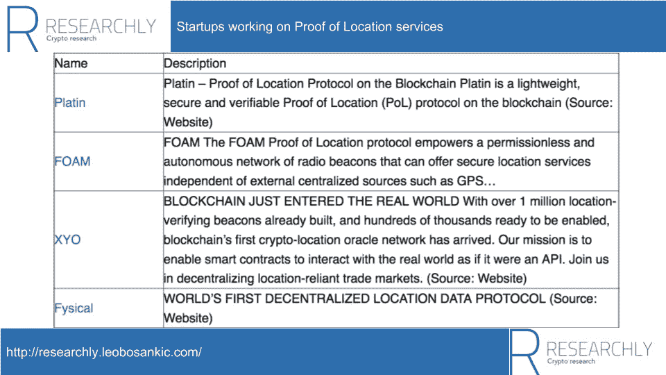

# 位置证明:区块链地理空间数据

> 原文：<https://medium.com/coinmonks/proof-of-location-geospatial-data-on-blockchains-ea973adb0ee5?source=collection_archive---------4----------------------->

位置证明服务致力于开源地图以及可验证和防篡改的地理空间数据。这些地图旨在用于人类、机器(例如自动驾驶汽车)和代码(例如 dapps 或智能合约)。目前，只有一些位置服务的证明，其中 [FOAM](http://researchly.leobosankic.com/cryptos/foam/?utm_source=coinmonks&utm_medium=pol) 可能是最突出的一个。

Overview of Proof of Location services (Source: [Researchly](http://researchly.leobosankic.com/2018/06/19/proof-of-location/?utm_source=coinmonks&utm_medium=pol))

> 在 [Researchly 的密码数据库](http://researchly.leobosankic.com/search_blockchainprojects?utm_source=coinmonks&utm_medium=pol)或 [Researchly 的行业洞察](http://researchly.leobosankic.com/industry-insights?utm_source=coinmonks&utm_medium=pol)中发现这些和更多的密码。

然而，它们都还处于试验阶段。然而，这篇文章描述了定位服务的证明，将它们与现有的解决方案进行了比较，列出了它们的潜在应用领域，并以一些未解决的问题作为结论。基于[泡沫](http://researchly.leobosankic.com/cryptos/foam/?utm_source=coinmonks&utm_medium=pol)提供实现示例。

在位置证明服务的上下文中，存在三种类型的地图:

*   **商业地图**:商业地图由组织集中维护。例如谷歌地图和 Foursquare。
*   **非基于区块链的开源地图**:非基于区块链的开源地图(以下简称开源地图)由志愿个人(制图员)社区维护。最突出的例子就是 [OpenStreetMap](https://www.openstreetmap.org/) 。
*   **基于区块链的开源地图**:与开源地图一样，基于区块链的开源地图(以下简称为区块链地图或位置服务证明)由一个志愿个人社区维护。

在此基础上，以下解释了开源地图和基于区块链的地图之间的差异，以及基于区块链的地图试图解决的商业和开源地图的问题。

# 基于区块链的地图是社区驱动的、开源的、半免费的

基于区块链的地图是社区驱动、开源、半免费的。通过这种方式，它们由更广泛的人群维护，限制更少，租金分配更公平。下一节将更详细地解释这些概念。

# 社区驱动允许更多的人管理和验证地图

位置服务证明的一个重点是他们的地图是社区驱动的。这使得更多的人能够管理和验证地图。因此，这与商业地图形成对比，在商业地图中，只有管理组织可以管理和验证地理空间数据。

# 通过开源减少限制

此外，由于基于区块链的地图是开源的，几乎不存在任何使用限制。因此，举例来说，开发人员可以访问原始地理数据来试验导航软件的新路由算法。同样，这与商业地图形成对比。商业地图是专有的，有限制和要求。除了个人使用前提条件(即条款和条件)，还有版权限制、与某些应用程序的不可分割的联系(例如，Foursquare 的 POI 不能在 Foursquare 之外使用)或无法访问原始地理数据。

# 通过半免租金支付模式实现更公平的租金分配

此外，商业地图和基于区块链的地图有不同的经济模型。商业地图要么全付费，要么半免费。像 Foursquare 这样的半免费商业地图是半免费的，因为它们不花钱，但是人们通过它们的数据间接付费。相比之下，基于区块链的地图的付费模式根据访问参与者的不同而不同。一般来说，有三个角色:用户、策展人和会员。

1.  **用户**:用户是那些使用地图查找对象的演员。对他们来说，区块链地图是免费的。
2.  **成员**:成员是希望作为兴趣点包含在地图上的实体。基于区块链的地图中的兴趣点构成了一个专有列表。为了成为这个名单的一部分，兴趣点必须支付费用。这种排他性列表背后的概念被称为令牌管理的注册表。[1]
3.  **策展人**:策展人是为工作做出贡献并获得回报的实体(人或机器)。一个共同的贡献是兴趣点的治疗(见下文)。

因此，尽管位置证明服务本身或其创建者不产生租金，但基于区块链的地图仍然只是半免租金，因为策展人(可能是创建者)赚取租金。然而，由于策展人得到了回报，而创作者却不一定，有人可能会说，区块链地图仍然比商业地图更公平地分配租金，因为商业地图的所有租金都由地图创作者收取。

此外，这种对策展人的激励是将基于区块链的地图与开源地图区分开来的关键因素之一。

# 位置服务证明的激励

如上所述，位置证明服务激励管理员维护它们。这是与开源地图的本质区别，正是由于缺乏内在的激励，开源地图的采用举步维艰。

除此之外，在位置服务的证明中，有三个方面需要监管:

## 位置服务证明中的监管区域

1.  基于社区的静态地理空间数据(POIs)监管
2.  维护支持动态地理空间数据的替代导航系统的硬件节点
3.  验证动态地理空间数据

## 构成位置服务证明的四大支柱

这三个监管区域也是构成位置服务证明的四个支柱中的三个:

1.  基于社区的静态地理空间数据(POIs)监管
2.  维护支持动态地理空间数据的替代导航系统的硬件节点
3.  验证动态对象的位置
4.  将地理空间数据引入区块链的位置编码

下一节将更详细地解释这些构建块。

# 将地理空间数据引入区块链的位置编码

与 oracle 类似，Proof of Location services 支持将可验证且防篡改的地理空间数据集成到区块链。在他们之前，这样的整合是不可能的。下面列出了可验证和防篡改地理空间数据的应用。必须指出的是，该列表不包含新的应用程序，而是现有应用程序的改进版本。

## 拼车:验证驾驶员位置

在汽车共享网络中，司机可以伪造他们基于 GPS 的位置来收取更高的费用。可验证和防篡改的位置将防止这种欺诈。

## 数据和供应链管理:验证数据和产品的位置

可验证和防篡改的位置可以验证货物在供应链上的真实位置。
同样，位置证明服务可以确保数据(例如，证据图片)在其声明的位置被真实地捕获。

## 遵守当地法律

当安全地知道客户的位置时，企业可以完全遵守当地法律。

## 基于位置的商业案例

通过防篡改位置，公司可以提供基于位置的产品，而没有“位置欺诈”。一个例子是基于位置的汽车保险。

## 基于位置的奖励

可验证和防篡改的位置支持更可信的基于位置的奖励集合。示例包括加密收藏品、工资、忠诚度积分和通行费减免。

## 用于游戏的基于位置的加密收藏品

位置证明服务可以帮助构建游戏，用户可以在游戏中寻找限制在特定位置的加密收藏品(独特的数字收藏品，也是许多[加密经济原语](http://researchly.leobosankic.com/2018/06/18/cryptoeconomic-primitives/?utm_source=intern&utm_medium=pols)中的一种)。因为玩家的位置是可验证的，并且不像 GPS 那样可以被欺骗，所以游戏是真正基于位置的。因此，完全防篡改的 Pokemon Go 变体终于成为可能。

> **更多关于密码收藏品** [**这里**](http://researchly.leobosankic.com/2018/06/18/cryptocollectibles/?utm_source=coinmonks&utm_medium=pol) **。**
> 
> **更多关于密码经济原语** [**这里**](http://researchly.leobosankic.com/2018/06/18/cryptoeconomic-primitives/?utm_source=coinmonks&utm_medium=pol) **。**

## 基于地点的工资

另一种基于位置的奖励是工资。加密货币形式的支付可以设计成只能在规定的地点(例如工作场所)收取。同样，由于工人的位置是可验证的和防篡改的，欺诈被最小化。

## 基于位置的奖励来激励商店访问

公司可以通过将忠诚度积分等奖励附加到预先确定的商店来引导顾客到特定的商店。

## 基于位置的奖励来管理交通流量

与商店访问的激励类似，城市规划者可以通过在特定路线上设置奖励(如部分通行费减免)来引导交通。

# 基于社区的静态地理空间数据(POIs)监管

静态地理数据或 poi 是指几乎不变的具体或虚拟位置。具体位置是像商店或餐馆这样的对象，虚拟位置是根据那里发生的活动进行分类的。虚拟位置的例子是交通瓶颈或犯罪活动增加的区域。

商业和开源地图很难管理这样的兴趣点(由于缺乏激励和兴趣点的数量)。位置服务的证明，通过结合财政激励和开源，试图对抗这些不利因素。

## 由于兴趣点不断变化且缺乏激励，非区块链地图在维护兴趣点方面存在困难

如上所述，兴趣点大多由商业公司集中管理，如 Google 和 Foursquare。由于兴趣点不断变化(例如业务转移)，集中式实体很难保持其最新。由一大群策展人维护的开源替代方案可以通过增加人力来解决这个问题。然而，他们落后了，因为像任何开源项目一样，激励策展人是困难的。

在这方面，基于区块链的地图类似于开源地图；他们可以通过其庞大的会员基础来跟上不断变化的兴趣点。然而，与开源地图相比，基于区块链的地图已经找到了一种激励管理者的方法。

[令牌管理的注册管理机构](http://researchly.leobosankic.com/2018/06/18/token-curated-registries-blockchain-based-mechanism-curate-lists/?utm_source=coinmonks&utm_medium=pol)是基于区块链的方法(许多[密码经济原语](http://researchly.leobosankic.com/2018/06/18/cryptoeconomic-primitives/?utm_source=coinmonks&utm_medium=pol)中的一种)，用于激励分散实体管理高质量列表。此类列表包含符合特定标准的项目。在位置服务证明的情况下，列表是 POI，列表上的每个项目是一个 POI，标准可以是 POI 类型(例如景点),分散的实体是制图员。因此，结合财政激励和开源的位置服务证明，理论上可以激励足够多的人更新兴趣点。

> **更多关于令牌管理的注册表** [**这里**](http://researchly.leobosankic.com/2018/06/18/token-curated-registries-blockchain-based-mechanism-curate-lists/) **。**
> 
> **更多关于密码经济的原语** [**这里**](http://researchly.leobosankic.com/2018/06/18/cryptoeconomic-primitives/)

与静态地理空间数据的监管相关，位置证明服务正致力于替代 GPS 的导航系统，这种导航系统是防篡改的，并且其位置信息可以被验证。

# 为动态地理空间数据构建防篡改和可验证的导航系统替代 GPS

除了相当静态的兴趣点，位置证明服务还希望捕获动态的地理数据。动态地理数据是指可移动的对象，如汽车或人。
传统上，此类物体的位置由
导航系统 GPS 捕获。然而，位置服务的证明认为 GPS 不适合基于区块链的位置数据，因为，除了别的以外，以下原因:

*   **不安全易出故障** : GPS 由于其集中组织，不安全易出故障
*   **有限范围** : GPS 在室内或地下都不起作用
*   **能源密集型**:GPS 的电池消耗使其不适合微控制器等小型设备。这在物联网相关应用中尤为重要，例如汽车的[门禁](http://researchly.leobosankic.com/2018/06/16/project-teardowns-xain/?utm_source=coinmonks&utm_medium=pol)以及[汽车&移动行业](http://researchly.leobosankic.com/2018/06/11/blockchain-in-the-automotive-mobility-industry-the-current-state/?utm_source=coinmonks&utm_medium=pol)的许多其他领域。
*   **不防篡改** : GPS 容易受到欺骗
*   不精确:GPS 5 到 15 米的精度被认为太不精确了

因此，定位服务的证明正在致力于 GPS 的导航系统替代物，其应该是防篡改的(例如，不受欺骗的影响)、更可靠的(由于分散的硬件)、范围更广的(例如，也在室内或地下)、更少的能量消耗并且更准确。

因此，例如，FOAM 提出 LoRa 作为替代品。
LoRA 是一种低能耗的长距离无线传输技术。基于 LoRa 的导航系统将更加可靠(因为节点由多个实体维护，并且因为 LoRa 节点易于更换)、覆盖范围更广(因为它不需要卫星，可以在室内或地下工作)，并且适合小型设备(由于 LoRa 的低能耗)。

然而，要建立一个基于 LoRa 的导航系统，FOAM 需要多个 LoRa 传感器(节点)。FOAM 的目标不是自己设置和维护所有节点，而是让节点运营商来维护它们。如上所述，泡沫将通过泡沫代币奖励节点运营商。

## 验证动态地理空间数据的位置

最后，FOAM 希望 LoRa 网络能够防篡改。与 LoRa 节点的维护类似，FOAM 使用财务激励来确保移动对象的验证位置(所谓的验证者接收用于验证位置的 FOAM 令牌)。

# 开放的问题

说了这么多，我们一定不能忘记权衡开放问题的位置服务的证明。以下问题非常广泛，不涉及执行方面。因此，如果你有区块链的技术经验，甚至是定位服务的证明，你可能已经很熟悉了。

## 需要用户采用

最明显的是，位置证明服务的成功取决于是否能获得足够的用户、管理员(密码学家或节点操作员)和成员。

在某种程度上，这取决于策展人获得的激励有多高。例如，节点运营商(如 FOAM 中的 LoRa 节点)将期望至少与节点成本相等的回报。

另一个阻碍获得策展人的原因是缺乏策展人。如果需要志愿者维护的基于社区的区块链应用程序持续增长，我们可能会遇到工人短缺。同样，根据监管任务的复杂程度，位置服务的证明可能根本找不到足够的合格人员。

## 位置服务的证明仍处于试验阶段

为了完整起见，必须提及的是，通过查看位置证明服务的不同竞争方法，可以观察到它们仍处于试验阶段。除此之外，他们还在尝试位置传感器、安全和隐私配置以及引导方法，

## 未经测试的构建模块

同样，我们不能忘记，位置服务证明的构建模块，如[令牌管理的注册中心](http://researchly.leobosankic.com/2018/06/18/token-curated-registries-blockchain-based-mechanism-curate-lists/?utm_source=coinmonks&utm_medium=pol)或[区块链治理模式](http://researchly.leobosankic.com/2018/04/29/blockchain-governance-takeaways-nine-projects/)也仍处于试验阶段。

## 竞争数据和长期寡头垄断

尽管当前可用的位置服务证明仍然显示出很少或没有吸引力，但是可以预见它们将相互竞争。这种竞争也意味着竞争的地理空间数据集将会存在。然而，由于拥有不同的地理空间数据几乎没有用处(毕竟地理空间数据是主观的——一个对象要么存在要么不存在)，从长远来看，该行业将由寡头垄断的数据提供商主导。这将再次导致回到今天的局面，即只有少数几家公司控制着世界地图。

# 结论和最终想法

位置证明服务有两个目的。一方面，它们改善了地理空间数据(通过更开放、更公平的租金分配、激励和问责以及可验证的真相)。另一方面，他们为区块链带来地理空间数据，充当了区块链 T4 的基石。作为这样的区块链构造块，它们不是支持新的应用程序，而是改进现有的应用程序。这在将来可能会改变。然而，目前，位置服务的证明仍处于试验阶段，必须首先引导其导航网络和所需的地理空间数据。

# 笔记

[1] [令牌管理的注册管理机构](http://researchly.leobosankic.com/2018/06/18/token-curated-registries-blockchain-based-mechanism-curate-lists/?utm_source=coinmonks&utm_medium=pol)是基于区块链的方法(许多[密码经济原语](http://researchly.leobosankic.com/2018/06/18/cryptoeconomic-primitives/)中的一种)，用于激励分散实体管理高质量的列表。此类列表包含符合特定标准的项目。在位置服务证明的情况下，列表是 POI，列表上的每个项目是一个 POI，标准可以是 POI 类型(例如景点),分散的实体是制图员。

> 更多关于令牌管理注册中心[的信息，请点击这里](http://researchly.leobosankic.com/2018/06/18/token-curated-registries-blockchain-based-mechanism-curate-lists/?utm_source=coinmonks&utm_medium=pol)。

*原载于 2018 年 6 月 19 日*[*researchly.leobosankic.com*](http://researchly.leobosankic.com/2018/06/19/proof-of-location/)*。*