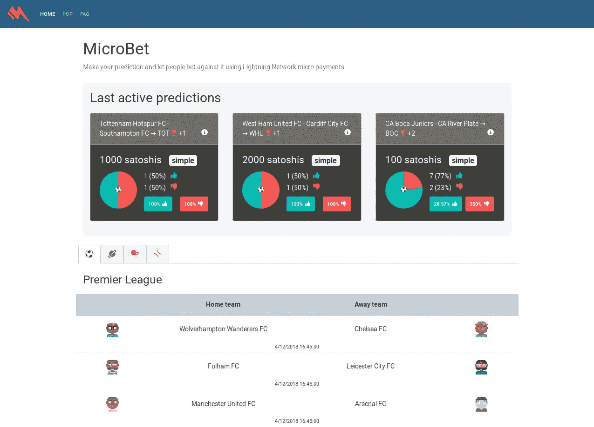

# 闪电网络应用上的支付凭证(PoP)登录

> 原文：<https://medium.com/coinmonks/proof-of-payment-pop-login-on-lightning-network-apps-d9966acc9889?source=collection_archive---------2----------------------->



MicroBet — Home screen

# 概观

[MicroBet](https://microbet.fun/) 是一款生活在闪电网络之上的比特币预测和博彩游戏。它开始只是一个概念验证，但随着时间的推移，人们开始经常使用它，并且工作得相当好和稳定。

由于 MicroBet 在几个月前推出，我希望它使用起来非常简单，但我也希望保持闪电网络为我们提供的用户隐私。这就是为什么它从不询问用户任何信息，甚至是用户名。

# 问题是

为了给用户更好的体验，当用户第一次付款时，会创建一个 cookie 会话。通过该会话，如果用户想要参与其他预测，他/她可以在*我的赌注*部分看到它们，以跟踪用户活动。但问题是如果用户需要注销，系统怎么知道哪个人*拥有*哪个账号？

这个问题的简单答案是使用**原像。**我通过允许人们在几个月内仅使用付费前图像恢复他们的会话来进行试验，我想看看用户是否觉得这有用。在此期间，这个选项是允许的，该网站收到了少量的每周交易，其中大多数是 100 satoshis，为了科学起见，我愿意支付给用户，如果有任何错误。

预像是收款人给付款人作为付款凭证的*秘密*号。问题是这个数字并不那么秘密；付款人节点创建一个节点路由，将钱发送给收款人，在此期间，路由中的每个节点将钱兑换成相同的原像，然后最终交付给付款人，我不打算详细解释支付过程，因为这不是本文的主题，有很多有用的资源可以解释这一点。谷歌是你的朋友😃

这就是问题所在；支付完成后，路由中的所有节点都知道相同的原像。转发钱的节点只知道钱从哪里来，到哪里去，仅此而已。这意味着攻击者很难知道如何处理前图像，但攻击者可以很容易地直接打开一个与最终节点(如微网络节点)的通道，并保存他转发的所有前图像，然后进行暴力攻击，并试图从其他用户那里获得一些资金。

# 解决方案

我一直在思考如何在不危及用户资金的情况下保持这一功能，最后我决定使用一个非常简单的概念，一个解码后的 bolt11 付款请求如下所示:

```
{
    "destination": "03819ddbe246214d4c57b7ea4d28bfe5c09c03bb4308b40c26f1468532131e0cc0",
    "payment_hash": "287a3a66c85caae2f50754a2e5fc80f9d1f8c2fe6df2de9617e29fd91ef83ab6",
    "num_satoshis": "12121",
    "timestamp": "1543522630",
    "expiry": "1800",
    "description": "Lay bet:  Liverpool FC - Everton FC → EVE 🏆 +1 [dKLwm]",
    "description_hash": "",
    "fallback_addr": "",
    "cltv_expiry": "144",
    "route_hints": []
}
```

付款人不需要比这更多的信息来发送付款。我们可以看到有一个描述字段，**这个描述字段位于付款方**。这给了我们一个可以添加小 id 的地方，我称之为 s *id* ，它是一个由字母(大写/小写)和数字组成的伪随机五字符字符串。目前这个字符串只有 5 个字符，但是如果攻击者试图强行破解它，他/她将需要对 n 或 62⁵进行 k 次排列，这等于**每个原图像 916，132，832 个组合**，如果我们考虑到微网络站点每分钟只允许 10 个 IP 地址请求，攻击者将需要 174 年才能破解一个原图像。祝你好运。

# 结论

闪电网络正处于一个非常有趣的时刻，我们有责任去试验和应用想法，即使它们是愚蠢的想法也没关系，因为它们仍然会引导我们提出更多的问题，然后进行更多的思考和解决方案，如果你有什么想法，就在它的基础上构建，我们会看到会发生什么。

原来就是这样！如果你对这种会话恢复方式有什么建议，或者认为我没有考虑其他安全风险，请在评论中告诉我，我总是想知道更多关于安全性的信息，以及如何在我的系统上改进它。如果你想了解更多关于我的工作，你可以在推特上关注我。

微博客 mainnet[https://MicroBet . fun](https://microbet.fun/)

微网 testnet[https://testnet . MicroBet . fun](https://testnet.microbet.fun/)

[](http://bit.ly/2G71Sp7)

[**Click to read today’s top story**](http://bit.ly/2G71Sp7)