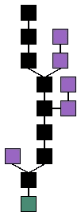
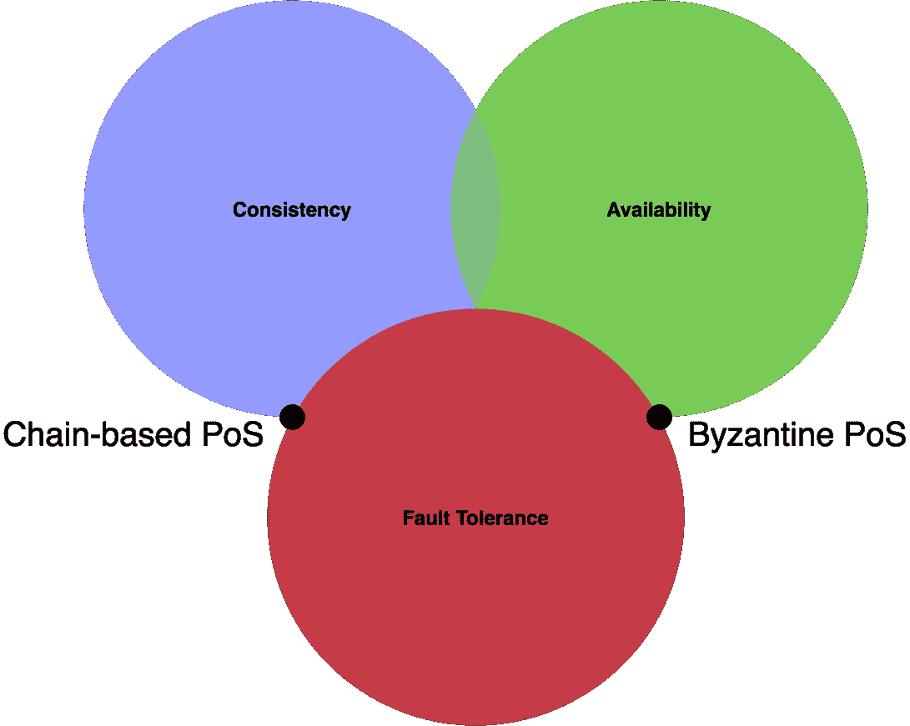

# 股权证明:简介

> 原文：<https://medium.com/coinmonks/proof-of-stake-an-introduction-879a8787acf3?source=collection_archive---------3----------------------->

[每年要消耗 17.22 TWh](https://digiconomist.net/ethereum-energy-consumption) 的电力来保障以太坊网络的安全。这超过了古巴整个国家一年的能源需求，这不禁显得有点过分。虽然工作证明共识算法更容易推理，但在解决共识问题时，它们不是唯一可用的选项。利害关系证明算法发展迅速，旨在:

*   提供与电源同等安全性。
*   比他们权力前辈更不容易形成中央集权/卡特尔。
*   在物理稀缺资源方面比他们的前代产品更有效。

Image Source: [fitvitalik.io](https://fitvitalik.io/)

P 工作屋顶是一种共识模型，其中许多不可信节点计算候选块的数千个哈希，直到发现一个有效的哈希。一旦这个区块被发现，开采 n+1 区块的竞赛就开始了！矿工反复猜测 nonce，直到他们的前一个块的 hash 未完成的事务数据+ nonce 有足够的前导 0 来满足当前的 [*难度*](https://en.bitcoin.it/wiki/Difficulty) 级别。难度级别是自动确定的，以便稳定开采新区块的速度。更多详情请见[比特币维基](https://en.bitcoin.it/wiki/Proof_of_work#Traditional_proof_of_work)。工作证明中的*工作*由采矿方的计算机完成，这耗费了我们矿工的电力和计算时间。

Blockchain formation. The main chain (black) consists of the longest series of blocks from the genesis block (green) to the current block. Orphan blocks (purple) exist outside of the main chain. (Image Source: [Wikipedia](https://en.wikipedia.org/wiki/Blockchain))

如果一个矿工生产了一个其他人认为无效的块，他们不会把它包含在他们的链中。此时，该区块成为*孤儿*，授予其矿工的区块奖励不再存在。

工作证明**起作用**是因为每个矿工被激励在一个链上采矿，仅仅是因为当其他矿工不包括他们的区块时，在任何不正确的链上采矿[都可能](https://en.bitcoin.it/wiki/Majority_attack)导致资源(电力、计算时间)的损失。没有电力、硬件和时间的成本，理性的矿工会试图无限地延长每个候选链，这样他们就有最大的可能性创造一个包含在内的获胜区块。这将阻止网络达成一致意见，并且不存在可靠的分布式分类帐。

## PoS 网络在达成共识时采用方法必然不同于 power 的方法。

一般来说，PoS 一致性算法寻求使用令牌资源而不是物理资源来保证它们的安全性。PoS 一致性算法的两个原型是基于链的和拜占庭的。每个人从 [CAP 定理](https://en.wikipedia.org/wiki/CAP_theorem)中指定的不可实现的三连胜中选择不同的强度。我们将探索属于每个类别的共识算法。

The CAP theorem states that we can have only two of the traits shown above.

PoS 网络的一些常见陷阱包括[无风险、](https://ethereum.stackexchange.com/questions/2402/what-exactly-is-the-nothing-at-stake-problem) [利益冲突](https://github.com/ethereum/wiki/wiki/Proof-of-Stake-FAQ#how-does-validator-selection-work-and-what-is-stake-grinding)和[流动性相关的](http://www.truthcoin.info/blog/pow-cheapest/)问题。有一些技术可以分别处理这些问题，比如斜杠、更好的验证器随机化和特定于标记的标记，但是这些问题的各种形式仍然会出现在主要项目中。

利益证明算法承诺在维护安全性的同时，将我们从工作证明(PoW)共识的环境负担和集中化风险中解放出来，但是距离交付功能性 PoS 机制还有多远？

在本系列的每篇文章中，我们将研究一个 PoS 项目。我们将批判性地分析每个项目关于共识的声明，他们的共识机制设计，以及他们的路线图。除了节点就供应链状态达成共识的方式之外，我们不会花时间审查项目团队、象征性价格前景或他们网络的任何方面。

我们将重点关注的项目是石墨烯(Bitshares，)Tendermint (Cosmos，)和 Casper (Ethereum)。)