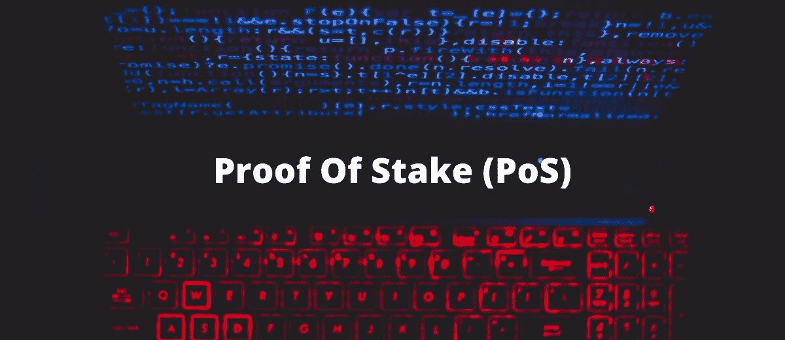

# 利害关系证明

> 原文：<https://medium.com/coinmonks/proof-of-stake-b1e31f2cf4b6?source=collection_archive---------0----------------------->

在我之前的文章中，我已经介绍了最著名的共识机制之一，即[工作证明](/@tulip311bit/proof-of-work-explained-e783ccd2f87c)。但是像任何技术一样，该协议也有一定的缺点，为了克服这些问题，开发了另一种协议，即利害关系证明。

顾名思义，赌注证明依赖于验证者的赌注。像矿工一样，PoS 由一组验证器组成。这些验证器使用伪随机算法来选择一个节点，作为下一个块的验证器。验证者是基于不同因素的组合来决定的，这些因素包括赌注年龄和节点的财富。这意味着一个人拥有的硬币越多，他或她就拥有越多的采矿能力。因此，与 PoW 不同，PoW 是一个非常强大的功能，因为它依赖于解决一个复杂的计算难题来决定下一个块，PoS 中下一个块的验证和生成完全取决于所有者的利益。在桩系统的证据中，开采的区块被称为“伪造的”。

该算法于 2011 年推出，旨在通过工作证明来解决问题。虽然这两种算法都是用于在区块链网络中达成共识，但达到最终目标的底层过程是不同的。

> [在 CoinCodeCap 上购买最佳加密交易](https://coincodecap.com/deals)

一些加密硬币如 Nxt (NXT)、Blackcoin、ShadowCoin 和 Peercoin (PPC)使用 PoS 方法。以太坊(ETH)也在计划改用 PoS 系统。

**PoS 是如何工作的？**

区块链网络由一系列充当挖掘器(在本例中为伪造器)的节点组成。任何想要参与伪造活动的网络用户都需要在网络中投入一定数量的硬币。人们可以通过发送一个特殊的交易来锁定他们的基础加密货币(在以太坊的情况下，是以太)。赌注大小决定了一个节点被选为下一个伪造下一个块的验证者的几率。赌注越大，机会就越大。

被选择来伪造下一个块的新创建的节点检查该块中的事务的有效性。如果交易是有效的，它然后签署块，并将其添加到区块链网络。该节点接收与该块中的交易相关联的交易费作为奖励。

在节点不想充当伪造者的情况下，它可以连同获得的奖励一起撤回其股份。一旦网络成功地检查到该节点没有参与任何恶意活动，它就验证并释放该节点。

**使用 PoS 的优势:-**

o 增强安全性。

o 节能。

o 降低集中化的风险。

**伪造选择方法:-**

在要求不选择具有最大利害关系的节点的情况下，使用两种独特的方法。这些是:-

o **随机区组选择**

在这种方法中，一个节点被选为具有最低散列值和最高股份的验证者。由于赌注是公开的，每个节点可以很容易地预测哪个帐户将获得伪造块的权利

o **硬币年龄选择方法**

在这种方法中，一个节点被选为验证者，这些验证者已经保持了他们的股份很长一段时间。硬币年龄的计算方法是将硬币作为赌注保留的天数乘以可作为赌注的硬币数量。

硬币年龄=投入硬币的天数*投入硬币的总数

一旦一个节点铸造了一个方块，它的硬币年龄就被重置为零。为了伪造另一个块，节点必须等待一段时间。因此，这种方法防止了大股份节点支配区块链网络。

**不同类型的 PoS**

股权证明可分为两部分

o **基于链的利害关系证明**

该算法在可用于创建块的时隙(例如，每 10 秒的时间段可能是一个时隙)期间随机选择一个验证器，然后分配给它一个权限来创建一个块，并限制该块必须指向某个先前的块。一般指向最长链的最后一块。因此，随着时间的推移，这些区块汇聚成一条增长链。

**实现该模型的区块链项目有 Nxt、Peercoin、Ardor。**

o **BFT 式的股权证明**

这种模式提供了“一致性”。这里，随机选择的验证器决定一个特定的块是否可以在每一轮结束时被包含在链中。这种类型可能更有利于“许可”方法。在这种情况下，对一个区块的共识不取决于链的长度或大小。

**实现该模型的区块链项目有 Neo、Tendermint、Polkadot、Hyperledge Fabric。**

**它如何降低网络攻击的风险？**

由于该模型基于验证者所拥有的股份的概念工作，因此为了有效地控制网络并批准欺诈交易，节点必须拥有网络中的多数股份(也称为 51%攻击),这是非常不切实际的，因为如果黑客试图购买硬币总数的 51%,市场会对快速的价格上涨做出反应。

此外，只要网络检测到任何欺诈交易，不仅伪造节点会损失一部分股份，而且还会被限制参与未来的活动。在赌注的成本高于回报之前，验证者在试图欺诈的情况下是不知所措的。

随着以太坊的“Casper”升级，利益证明(POS)模型在其他区块链共识设计中越来越受欢迎。通过这次升级，协议将设置某些标准来识别坏的验证器。如果被证实，坏验证者将失去他们的存款，从而使该模型更加安全。

阅读更多:[了解不同的共识机制](/@tulip311bit/understanding-different-consensus-mechanisms-77f088eaacd8)，[工作证明解释](/@tulip311bit/proof-of-work-explained-e783ccd2f87c)

> [在您的收件箱中直接获得最佳软件交易](https://coincodecap.com/?utm_source=coinmonks)

