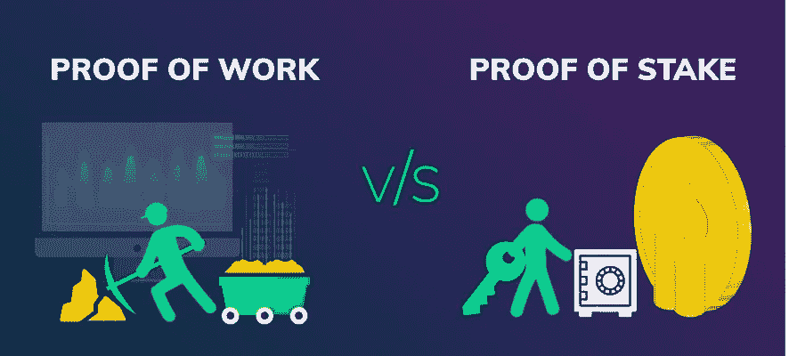

# 工作证明与利益证明

> 原文：<https://medium.com/coinmonks/proof-of-stake-vs-proof-of-work-65cce1b280f3?source=collection_archive---------3----------------------->

在这篇文章中，我想根据区块链、安全性、可伸缩性和去中心化等方法总结两种共识协议最相关的特征。

首先，您必须了解整个区块链是一个会计分类账，它记录一段时间内的资金流动，并有一个一致的方法来记录这些交易，基于一个使用算法的协议，以便一个节点同时验证块，其余的节点同意，链是连续伪造的，并按时间排序。

利益证明算法(PoS)是一种共识协议，它通过证明拥有加密货币来验证分组，因此选择一个节点来伪造分组。

工作证明(PoW)是一个需要验证器节点(即挖掘器)以时间和能量消耗为代价来执行工作的系统。这项工作包括进行不同难度的计算。

# 为什么使用共识？

在分布式网络中，不应该有中央权威。共识意味着大多数参与者(验证者或挖掘节点)在给定时间对某个版本的事实(分类帐记录)达成一致。决定权就是这样分配的。

# 持久性和安全性

持久性是不断添加新块的能力。安全性意味着只添加有效的块。这两种品质相辅相成。

比特币的持久性很高，因为所有矿池都在竞争提议区块。所以如果一个失败了，另一个会准备好。以这种方式，确保了新的块最终在给定的时间准备好。但是，这是一个缓慢的过程，大约需要 10 分钟(不确切)。

PoS 协议主动参与选择有权创建块的节点。被选择的节点会在某个区间产生一个块，必须在交易验证中插入一个密码证明，其他所有节点都可以验证。因为块分配发生在一个时期(时间段)的开始，如果节点由于任何原因不可用(例如离线)，间隔保持为空(无块)。然而，这种情况由于间隔仅持续 20 秒而得到补偿。因此，很有可能在接下来的 20 秒后，另一个可用节点将产生一个块。只有在给定时间没有更多节点可用的情况下，我们才能看到数据块生产延迟。最终，某个正在运行的节点获得了权限并产生了一个块。我们可以得出结论，与比特币相比，持久性也很高，主要是因为批量生产的周期更短。

尽管如此，如果我们不关心其他变量，如块不可撤销性、交易速度和费用，比特币可能会被认为更好一些。

# 分散

PoW 参与者越强大，即具有更高散列率的参与者，他获胜的次数就越多。

这导致了采矿场的共识管理，个体矿工将他们的散列率委托给集体，以获得更高的奖励机会。PoW 中的采矿竞争导致很少有实体收集决策权。目前，在 2022 年，超过 50%的共识是在 3 个采矿农场。

在 PoS 中，拥有 ADA 的所有用户都可以参与共识算法，拥有技术和资金的验证者节点以及拥有加密货币资金的委托者可以将他们委托给股份池。当用户的 ADA 成功创建数据块时，池将代表用户创建数据块。赌注池经营者和用户将获得奖励。通过这种方式，所有用户都被激励参与去中心化。

在激励方面的主要区别在于，在 PoW 中，赢家获得所有，包括发行的新硬币和该区块的费用，而在 PoS 中，奖励是通过首先向运营商分配参与保证金来分配的，其余部分以与赌注池运营商及其委托人之间的资金成比例的形式分配。在权力中，所有者不能参与共识，不像 PoS 那样分散激励。

PoS 根据用户持有的资金按比例公平地奖励参与者。在 PoW 就不是这样了，少数参与者获得了大部分奖励，个体小矿工几乎没有机会创造一个区块。

参与组织的优势在于，与权力相比，激励在分配上更为分散。

PoS 的缺点可能是资金集中在少数人手里，在那里鲸鱼在一致实相中产生了财阀统治。

# 安全性

当不可能任意改变分类账的历史记录，并且只有新的交易被记录时，区块链才是安全的。

账本分布在世界各地的很多电脑上。攻击者没有机会找到所有计算机并试图同时改变所有硬盘驱动器的分类帐。

PoW 的安全性基于它的散列能力，也就是说，网络中的参与者越多，它就变得越强大和安全。电力消耗是最大的成本。

在 PoS 中，哈希能力被科学和数学所取代，协议随机选择每个块的验证者节点，为委托更多的节点权衡更好的运气。因此，PoS 更加复杂，出错的可能性更大，或者您的代码更容易受到攻击。

# 可量测性

可伸缩性是当新用户加入网络时，在设定的时间内处理区块链(第 1 层)中所有事务的能力。当只有少数人使用网络时，很容易扩展。但是随着用户数量的逐渐增长，越来越难。

L2 扩展不被视为区块链(L1)的可扩展性，而是一种补充，可以提高生态系统的可扩展性。

通常，由于散列难度管理，lower 以比 PoS 更低的时间频率产生块。例如，在 Cardano PoS 中，每 20 秒伪造一次区块，而比特币 PoW 为 10 分钟。这种比较是基于时间的，但是您还必须考虑事务的大小和其他参数(如延迟)来定义网络处理的速度，这是以每秒事务数(TPS)来衡量的。

因此，一般来说，不可能说一种协议比另一种协议快。

我们看到，在截至 2022 年 7 月的配置下，在 PoW 中，块大小为 1 MB 的比特币处理~7 TPS，块大小为 32 MB 的比特币现金能够管理每块 25000 笔交易，通过 2018 年 9 月进行的网络压力测试，即~42 TPS。Cardano 使用 PoS 时，每 20 秒可以处理高达 88 KB 的数据，即 10 分钟 2640 KB 或 2.58 MB，平均规模的事务处理速度约为 60 TPS(无智能合约、无元数据、无大型令牌包等)。).

此外，在其他可伸缩性方法中，PoS 允许引入分片，因此在未来我们可以预期每秒数千笔交易。分片是将区块链划分为单独的段或分片，每个段将有一组独特的智能合约和账户余额，从而提高交易性能。

正如我们所见，从理论上讲，通过其他方法，而不仅仅是增加块大小或降低每个交易的权重，PoS 的 L1 可以更具可伸缩性。

# 每笔交易费用

交易费用是可扩展性的一部分，因为非常昂贵的费用不鼓励使用网络。

费用受两个方面的影响。首先是因为网络在给定时间能够处理的事务数量，其次是因为保持网络运行所需的成本。

计算费用的两个最常用的系统是拍卖(市场费用)和固定系统。比特币使用市场费用方法，即网络的使用量越大，费用的成本就越高，以便更快地处理交易。Cardano 有一个固定的收费系统，它只根据交易的权重增加成本(NFT 或智能合约更重)，而不依赖于网络活动。

如果系统以可接受的费用处理更多的交易，并且不提高价格，则系统的可扩展性更好。在这种情况下，理论上，Cardano PoS 看起来性能更好。

# 可持续性

可持续性意味着一个有足够激励的系统在一段时间内的连续性。如果成本上升，收入下降，当然就没有可持续性这回事了。与 PoS 不同，power 在一段时间内需要大量能量消耗。

这种关系并不新鲜，已经有很多谈论，我不是指生态和比特币有害的捍卫者，而是指这样一个事实，即在能源成本高的情况下，只有当矿工可以开发加密货币价格高的活动时，电力网络才是可持续的，因此其回报可以超过成本，此外，网络中必须有使用活动，因为使用越多，费用越多，对加密货币高价的需求越少。

*感谢你鼓励我写文章的贡献*

> ₳da(卡尔达诺)

addr 1 qxdlld 4 mux 6 GL 38860 w 297 LSE 59m 0646v 68 x 6 sraw 0 ASP 85ml 7mth CD 53 lzw 057 u 5 talpngtkl 4t 5 e wd 4 q 86 ulm qz 0 qskgn 43

> 交易新手？试试[密码交易机器人](/coinmonks/crypto-trading-bot-c2ffce8acb2a)或者[复制交易](/coinmonks/top-10-crypto-copy-trading-platforms-for-beginners-d0c37c7d698c)