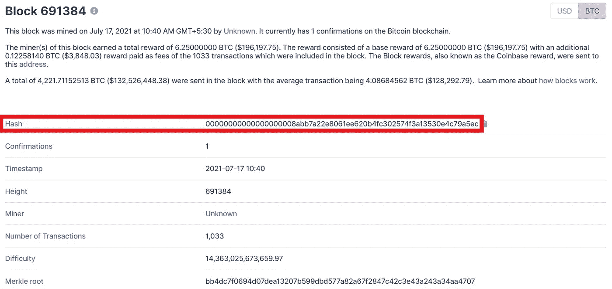
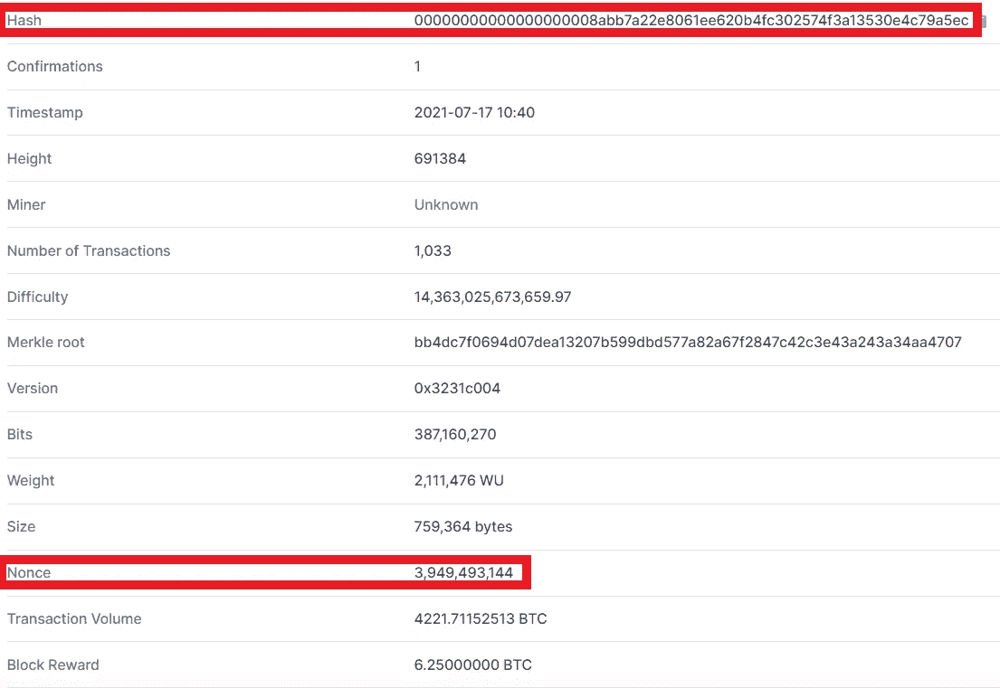

# 工作证明

> 原文：<https://medium.com/coinmonks/proof-of-work-1c95afde541?source=collection_archive---------9----------------------->

Image taken from [here](https://www.dittotrade.academy/wp-content/uploads/2019/09/Webp.net-resizeimage-640x360.jpg)

在我的上一篇博客中，我讨论了双重消费的概念，UTXOs，以及其他与区块链交易相关的概念。在这个博客中，我将讨论区块链的工作证明、难度、它是什么、它的用途以及其他相关问题。

# 1.什么是工作和现时的证明？

区块链的概念是，矿工必须找到区块，区块中包含他们已确认的交易。我们已经看到块的散列在散列中有一些前面的 0。哈希是块头的 **SHA256** 。SHA256 是 256 位哈希，在十六进制中有 64 个字符长。让我们看看块号 [691384](https://www.blockchain.com/btc/block/00000000000000000008abb7a22e8061ee620b4fc302574f3a13530e4c79a5ec) 。这个块的 hash 是**0x 000000000000000008 abb 7a 22 e 8061 ee 620 B4 fc 302574 F3 a 13530 E4 c 79 a5 EC**。

块哈希在哈希中有 19 个前面的 0。来获得这种独特风格的散列，以便它应该以 190 或任何其他取决于情况的数字开始。这个数字不断增加或减少，矿工必须找到相应的散列。

这就是工作的证明。矿工必须使用他们的硬件资源，如 GPU，他们的时间和电力来找到这个单一的散列。现在你会想为什么，它只是一个散列然后为什么它会花费时间和硬件资源？答案是，当你创建一个散列时，计算需要几微秒时间，但是当你应用这样的限制时，计算就变得有些困难，因为这是一场比赛，他们必须尽可能快地找到它以获得块奖励。

我们来看一个例子:
单词 **Hello** 的 SHA256 hash 为:**185 F8 db 32271 Fe 25 f 561 a6fc 938 B2 e 264306 EC 304 EDA 518007d 1764826381969**。它甚至不需要一秒钟来计算。
单词 **hello** 的 SHA256 hash 为:**2 cf 24 DBA 5 FB 0 a 30 e 26 e 83 B2 AC 5b 9 e 29 E1 b 161 E5 C1 fa 7425 e 73043362938 b 9824**。这也没用一秒钟来计算。

# 1.1 上述散列的缺点是什么？

缺点是，任何人都可以很容易地更改块中的值并快速找到散列，然后用新找到的散列来更改它，并在其他块中进行所需的更改，因为我们知道，创建的每个新块也具有前一个块的散列值，如果旧块的散列被更改，后续块的散列也会更改(将在后续博客中详细讨论)。正如我们在上面看到的，让我们假设在块 **Hello** 中有一些数据，黑客来了并对数据做了轻微的改变，新的数据是 **hello** 。攻击者可以很快找到新的散列并将其添加到块中，没有人会知道，并且连续的块散列也会自动改变，因为该块的散列发生了改变。**没有人会知道攻击者改变了任何区块中的东西，因为没有限制**。
现在让我们添加一个限制，即散列应该以至少一个 0 开头。 **Hello** 的 hash 是**185 F8 db 32271 Fe 25 f 561 a6 fc 938 B2 e 264306 EC 304 EDA 518007d 1764826381969**，这只会在我们添加一些字符串或者我们改变字符串中的某些内容 **Hello** 时发生变化。添加的某个字符串被称为 **nonce** ，它是一个数字。是的，也可以使用字母，但是区块链共识只使用数字值作为随机数。

**0 你好**:3573 c 6a 611 c 56 bfc 80541 DC 4 B3 A8 e 631 D4 a 014686 f 0 C3 D3 cc 6a 74 AABB 177 a9 b 9

**1 你好**:5d 4934862 b46d 11597 DD 139 a 6948 a3 ef 13d 10 CBF Fe 8 e 40 e 0826 bfcd 826103 a 03

**2 你好**:***055 e 2022953918 f 07 e 9 f 915535 d8d 52795957 f 90 a3 b 9680 f 6 e 198d 93 da 74 ce 77***

我们为字符串 **Hello** 找到了一个以 0 开始的散列，在这种情况下，nonce 是 **2** 。这很容易，因为限制只针对一个 0。

现在让我们添加一个限制，即散列应该至少以两个 0 开头。

**0 你好**:3573 c 6a 611 c 56 bfc 80541 DC 4 B3 A8 e 631 D4 a 014686 f 0 C3 D3 cc 6a 74 AABB 177 a9 b 9

**1 你好**:5d 4934862 b46d 11597 DD 139 a 6948 a3 ef 13d 10 CBF Fe 8 e 40 e 0826 bfcd 826103 a 03

**2 你好**:055 e 2022953918 f 07 e 9 f 915535d 8d 52795957 f 90 a3 b 9680 f 6 e 198d 93 da 74 ce 77

**3 你好**:d40a 8767 D2 da 3c 7 edcb 423 F4 bb 7968d 797 a 86 c 730 CBF 6b 41 ff 30 CB 54d 950 c6e 9

**4 你好**:1 bad 8475 e 521834 caab 8 defd 97 bfed 44c 88 a 0861 aabe 9 BD 26 a 613 a9 dbb 1 de 37 f

8 你好:ECC 644 a 72 b 42d 4 fc 39 a 514 fc a5 c 690656 c 601899077459 c6d 895 f 187 abbc 4d 6 f

**11 你好**:90959 f 88 AC 30994851 BF 9093 E4 b 166 b 286 efb 8 c 919 ed 2 CFF 3111 cc3 e 617 a 1119

**16 hello**:2111261 f 7 BFA 52 deead 0 D6 F6 d 144 b 0 F2 ba 136 cbad 4825 AEC 709981 a 82721 c 65 c

**25Hello** :49dcd54nd9120b5ef8ff7a1fe06feccae9467213a5217ff02a3a6684293dae2

**32Hello** : 6cd4815ffff13d84e1c274279ebc6b56df5cf8b3f53b626dcfe9d7dc65aae7c8

**37Hello** :652b59ca0026f68aab7d7f009e40704c6775a9d27e8efd4b6c85ca99ea82ef46

**39Hello** :43b76a5a14ea5efae78eb2e58e42984ce821846ba86a0ae3607fc2f2f1f50052

**44Hello** :118fd78c91c895f37ff0a342ddf7f2856e279b0571bb729d3edfd6d6a05a81d

**47Hello** :07c2cec043a59669b8f634bcf53668fd332e0cb24f8dab8f505444fa7d0cbd8f

**52Hello** :45a4a26b4f09ad61116e05ad141f9f3076da1fd2595c53611c5644df27fa5a88

**56Hello** : 210e653d1f8c7fc81115b65e9185eb3a15ec6f53c9069dbaefe2b667144387d1

**58Hello** : 3b5902d144f1de20b5bdbf3716e3925e15b3299d6d511cc62fe979c69c9f7d6d

**60Hello** :36a13df5ef581a31f5f5b0a666277d0da00b8cc207234fcc31589d726095d39e

1a6f452bf08ec1016d036b1d1ef7c3517106499b0ad3797c808a23644592b85a

**66Hello** :bd5aead4ac20f3c46f0e3a5f6ffc4d008f897ba3be2e5a34d87aa6a4d33be25

编辑: 编辑: 编辑: 编辑: 编辑: 编辑: 编辑: 编辑: 编辑: 编辑: 编辑: 编辑: 编辑: 编辑: 编辑: 编辑: 编辑: 编辑: 编辑: 编辑: 编辑: 编辑: 编辑: 编辑: 编辑: 编辑: 编辑: 编辑: 编辑: 编辑: 编辑: 编辑: 编辑: 编辑: 编辑: 编辑: 编辑: 编辑: 编辑: 编辑: 编辑: 编辑: 编辑: 编辑: 编辑: 编辑: 编辑: 编辑: 编辑: 编辑:

**73Hello** :5fb35fb73f1a22af478a7513f65b49fc6f35ed4e108d078dcc4c6953713206a6

301474aaec58d407a7639c2c5f41315c19ab2ffbd7ef14846057b5973584869e

**79Hello** :269796e333567492368fb296466e8a30103561a96ada78878b75d2c8d8817163

**82Hello** : 362978895d779a01fb0a0a71030a8cffe1d9fd6470bc2e6ea0105198d35b681c

编号:68934dd54f8fb39bbc40a2527c8de4c887b0b7168750d44bfc830394c3f06fd5

2c9541f8255e7deb6ff56a695cf67c6766984e43d8c4edb0b0a216f768520b2ba

4e55008223bd88bf8df4642bd5bf6d8fcd4af3540125603209051b25a029c9c2

**97Hello** :9952f54ed1dc6ee6dc144798ce97cc28c7c1fdfd969f5262c6a937fc7fade53e

编号: fc420141671b9ec7a8e4995c8c55966cf389b567066600a17c064e29946d5d70

**107Hello** :5f2ce50647d48922896666caffe03fc706a37f659381832a83a106393bb8da67

**111Hello** :e7010833d041bdb0f12b808cc90c77a27e0a1d3b6ecfcfe97e93c02fa2f97bea

如: 140d9e7f2dc6f561df0a5114fc60115d27297015d7fe4d598599d0ad2f6d4149

**122Hello** :9be8d4067a3d17e8f895acdf1dc855d406d15249d6b5d61d37884b912d5fbb

如: 4f0a79beb31cf1c1bf28e346cc9b0c643e2fe154d86b9434d0a5274ab0b35845

**128Hello** 0969F2767879A5bc528987266532b0ef32679eff80a0aefac0895b0d88b27011

**130Hello** :1743d356db209a1caa5cf8c52fe5541099fd88d31cebaec79682df364a34d5

**136 hello**:ea 83 E6 c 50 DD 3 b 464d 679264300 f 810163651 c7b 3374 e 5158d 8 DDC 4 a 4 Bab 673 f 4

**137 hello**:34d 43 fece 89 B4 dff 57 cebb 297 e 60d 16477 ad 4c 9 f 797036 f 07514 D1 a 75 af DC 9 c 0

**138 你好**:***00 bb 645 c 75727 a5e 63 a9d 91d 1230 DD 314697673 a 66530 c 445081 a1 cc81b 43219***

终于得到了以两个 0 开头的 hash，nonce **138** 和 hash**00 bb 645 c 75727 a5e 63 a9d 91d 1230 DD 314697673 a 66530 c 445081 a1 cc81b 43219**。在增加哈希开头的零的数量时，你会看到我不得不迭代更多次来获得想要的哈希，因此增加零的数量会增加难度。现在想象一下 20 世纪 90 年代的困难。为了得到想要的散列，你使用你的资源、时间和电力；这就是为什么它被称为工作证明。我将讨论如何保证它在区块链使用的安全性。

# 2.为什么一开始增加 0 变得很困难？

SHA256 是 256 位或 64 个十六进制字符。在正常情况下，当没有限制时，散列值位于范围**00000000000000000000000000000000000000000000000000**和**fffffffffffffffffffffffffffffffffffffffffffffffffffffffffffffffffffffffffffffffffffffffffffffffffffffffffffffffffffffffffffffffffffffffffffffffffffffffffffffffffffffffffffffffff 你可以看到，这是一个巨大的范围，这将是很容易找到这个大范围的任务。
当我应用散列应该以一个 0 开始的限制时，那么范围在**00000000000000000000000000000000000000000000**和**0 fffffffffffffffffffffffffffffffffffffffffffffffffffffffffffffffffffffffff 中
当我应用散列应该以两个 0 开始的限制时，范围在**0000000000000000000000000000000000000000000000**和**00 fffffffffffffffffffffffffffffffffffffffffffffffffffffffffffff 中******

# 2.1 你从上面的例子中推断出了什么？

上述场景的结果是，当您应用限制并增加哈希开头的 0 的数量时，值的范围/范围减小，并且您正在该范围内处理更具体的值。随着范围的减小，找到特定散列的时间将会增加，因为根据您选择的随机数，您会剩下一些特定的散列值。还有一点需要注意的是，如果限制是查找开头有 10 个 0 的哈希，并且您在哈希的开头找到了更多个 0(大于 10)，那么这也是可以接受的，因为它将位于开头由 10 个 0 定义的相同范围内，但是发生这种情况的可能性非常小。请参见下面快照中的 [691384](https://www.blockchain.com/btc/block/00000000000000000008abb7a22e8061ee620b4fc302574f3a13530e4c79a5ec) 块的 nonce，以生成包含 19 个 0 的哈希。

# 2.2 生成的概率和平均散列的计算

我们举个例子，目标 hash 是十六进制的**0000 fffffffffffffffffffffffffffffffffffffffffffff**或者**1766847064778384329583297500742918515827483896875618958121606201292611 我们知道可以生成的总哈希是十六进制的**ffffffffffffffffffffffffffffffffffffffffffffffffffff**或**1157920892373161954235709850086879078532698466564056403945758400797913331313333161957195407540754007979792333333333333333375333
概率=(有利结果)/(总结果)****

= > 176684706477838432958329750074291851582748389687518958121606201292619775/115792089237316195423
。

**平均哈希解一个块**
=>11579208923731619542357098500868790785326984665640564039457584007913129639935/1766847064783843
2954054039

# 3.难度规则和公式

大约每过 2160 个街区，区块链的难度就会改变。两周。这是一条规则，即产生的新散列不能超过先前难度的 4 倍，并且不能低于先前难度的 25%。区块链中引入了难度的概念，因此找到一个块散列的平均时间是 10 分钟。如果挖掘者花费更多的时间来寻找块的散列(并且这对于 2160 个块中的大多数块来说是持续的)，那么新的难度将小于当前的难度，或者如果挖掘者非常频繁地寻找块散列，少于 10 分钟的时间(并且这对于 2160 个块中的大多数块来说是持续的)，那么新的难度将大于当前的难度。

**调整哈希目标的公式:**
*新哈希目标=(当前哈希目标)x(生成最后 2016 个块的平均时间)/10*
如果**生成最后 2016 个块的平均时间**小于 10 分钟，则**新哈希目标**的值将小于当前值，否则将增加。

**公式求难度:**
*难度=(创世纪块哈希目标)/(当前块哈希目标)*

*在这篇博客中，我讨论了工作证明、随机数、难度、哈希值范围和一些计算的概念。在我的下一篇博客中，我将讨论 merkle 树和相关概念。*

> 社交媒体链接:[LinkedIn](https://www.linkedin.com/in/ansh-vaid/)|[GitHub](https://github.com/AnshVaid4)|[insta gram](https://www.instagram.com/being_optimist/)|[Twitter](https://twitter.com/anshvaid4)
> 
> 访问我的网站:[https://cybergeeks.website/](https://cybergeeks.website/)
> 
> *原载于*[*https://github.com*](https://github.com/AnshVaid4/Blogs/blob/caff161e83f7cb87d41468660ab5875de2cd47a4/blogs/2021-10-13-ExploitingServices.md)*。*

> 加入 Coinmonks [电报频道](https://t.me/coincodecap)和 [Youtube 频道](https://www.youtube.com/c/coinmonks/videos)了解加密交易和投资

## 另外，阅读

*   [如何开始通过加密贷款赚取被动收入](https://blog.coincodecap.com/passive-income-crypto-lending)
*   [加密货币储蓄账户](/coinmonks/cryptocurrency-savings-accounts-be3bc0feffbf) | [加密交易机器人](https://blog.coincodecap.com/best-crypto-trading-bots)
*   [加密复制交易平台](/coinmonks/top-10-crypto-copy-trading-platforms-for-beginners-d0c37c7d698c) | [五大 BlockFi 替代品](https://blog.coincodecap.com/blockfi-alternatives)
*   [CoinLoan 点评](https://blog.coincodecap.com/coinloan-review)|[Crypto.com 点评](/coinmonks/crypto-com-review-f143dca1f74c) | [火币保证金交易](/coinmonks/huobi-margin-trading-b3b06cdc1519)
*   [Bybit vs 币安](https://blog.coincodecap.com/bybit-binance-moonxbt)|[stealth x 回顾](/coinmonks/stealthex-review-396c67309988) | [Probit 回顾](https://blog.coincodecap.com/probit-review)
*   [顶级付费加密货币和区块链课程](https://blog.coincodecap.com/blockchain-courses)
*   [在美国如何使用 BitMEX？](https://blog.coincodecap.com/use-bitmex-in-usa) | [BitMEX 评论](https://blog.coincodecap.com/bitmex-review)
*   [最佳期货交易信号](https://blog.coincodecap.com/futures-trading-signals) | [流动性交易所评论](https://blog.coincodecap.com/liquid-exchange-review)