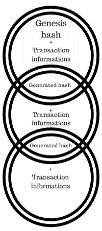

# 工作证明——新经济的困惑

> 原文：<https://medium.com/coinmonks/proof-of-work-a-puzzle-for-the-new-economy-552cb0f1cf45?source=collection_archive---------9----------------------->

区块链的开端是一份 9 页长的白皮书，“比特币:一个点对点的电子现金系统”，笔名中本聪。在论文中，他/她希望建立一种基于无信任和分布式共识的数字货币。

在传统的数字支付方式中，您需要信任一家金融机构作为可信的第三方来处理您的交易。该第三方将维护一个记录所有交易的分类账，以确定每个参与者的余额。由于银行自身必须承担巨大的成本，银行对每笔交易都要收费，这使得互联网商务成本高昂。此外，第三方使整个系统集中化，使其成为单点故障。如果第三方受到威胁，你会失去你的钱。

与此相反，比特币和许多其他加密货币使用的系统涉及到向网络上的每个人提供这个账本的副本，并且网络上的每个人都维护这个账本。该系统允许透明、低交易时间、不变性和信任。但是问题来了:如何保护系统免受攻击者的攻击？由于账本是由网络上的所有节点维护的，任何人都可以加入网络，我们如何防止攻击者获得控制权？这里是*工作证明。*

> *“工作证明描述了一个系统，该系统需要付出相当大但可行的努力，以阻止恶意使用计算能力”*

现在让我们借助一个例子来理解这一点。萨迈报名上学了。但总有一种可能，他会翘课，和朋友去看电影。为了知道沙麦是否真的去了学校，他的父亲给了他一笔钱，这笔钱涵盖了那天学校所教的所有科目，每天都要解答。如果沙麦能够算出总数，他的爸爸就知道他那天去上学了，沙麦会因为表现好而得到一块糖。

在这里，Samay 代表一个矿工(受尊敬的加密货币)，他的知识(那天在学校所做的一切)是一个信息块，父亲代表与所有其他节点(其他矿工)的网络，总和的解决方案是 Samay 那天所做的工作证明，巧克力是矿工得到的奖励(通常是相应的加密货币)。

工作证明(POW)系统只不过是一个数学问题，它对于矿工来说比较难解决，但是对于网络来说很容易检查。这个数学问题基于 SHA 256 算法，并通过在区块链系统中编码先决条件来维护。矿工们竞相解决这个问题。答案是证明他们投入了大量的计算能力，因此被指定以比特币(或受人尊敬的加密货币)的形式奖励。这可以保护网络免受攻击，保证系统正常运行。

要理解这实际上是如何工作的，您需要理解什么是加密哈希函数:

> “加密哈希函数是一种哈希函数，它接受输入(或“消息”)并返回一个固定大小的字母数字字符串，该字符串与“消息”完全不同。”

该字符串简称为“哈希值”或“哈希”。理想的哈希函数有两个主要性质:
*1。从给定的散列计算字母数字文本(消息)在计算上极其困难。
2。两个稍微不同的消息具有相同的散列是极不可能的。*



Blockchain Visualized

现实生活中的过程是这样的。矿工(或区块链网络中的节点)用他们拥有的分类账副本来核实整批交易。如果事务与以前的事务一致，它们必须通过哈希算法将这些信息与以前块的哈希代码放在一起，并获得新的哈希，从而形成一个块链(因此称为区块链)。这种散列是“工作证明”中的“工作”。当这项“工作”成功完成时，矿工将获得比特币(或受尊敬的加密货币)奖励。

从一组信息中生成散列对于现代计算机来说是微不足道的，这将再次使攻击者很容易改变分类帐/区块链。所以，为了让这个过程变成“工作”，比特币设置了一定的难度。比特币会说，产生的每个哈希都应该以一定数量的零开头。通过将随机数(随机字母数字)添加到要被散列的信息中，将所需数量的 0 添加到散列中。

假设要哈希的信息块是“Hello，world！”。使用的哈希算法是 SHA 256。

```
“Hello, world!” = > 1312af178c253f84028d480a6adc1e25e81caa44c749ec81976192e2ec934c64
```

这是我们块的输出散列。现在，为了进行这种费力的哈希运算，比特币会要求你在信息中添加一个随机数(Samay 每天要解决的总数的答案),这样得到的哈希以 4 个零开始。SHA 256 是一种单边算法，这意味着它只能为一个输入给出输出，但不能为一个输出告诉输入。因此，为了获得合适的随机数，必须使用试错法。

让我们在“你好，世界！”之后开始添加数字最终得到以 4 个零开始的散列输出

```
“Hello, world!0” => 1312af178c253f84028d480a6adc1e25e81caa44c749ec81976192e2ec934c64
“Hello, world!1” => e9afc424b79e4f6ab42d99c81156d3a17228d6e1eef4139be78e948a9332a7d8
“Hello, world!2” => ae37343a357a8297591625e7134cbea22f5928be8ca2a32aa475cf05fd4266b7
.
.
.
“Hello, world!4248” => 6e110d98b388e77e9c6f042ac6b497cec46660deef75a55ebc7cfdf65cc0b965
“Hello, world!4249”=> c004190b822f1669cac8dc37e761cb73652e7832fb814565702245cf26ebb9e6
“Hello, world!4250” => 0000c3af42fc31103f1fdc0151fa747ff87349a4714df7cc52ea464e12dcd4e9
```

(请注意，即使添加了一个字符，输出哈希也会完全改变。这被称为雪崩效应)

> 我要猜 4250 次才能猜出正确的随机数。这是一个相当简单的例子。通常 nonce 是一个字母数字，增加了组合集。

现在我们再举一个例子。马克斯给鲍勃 1 个比特币。交易核实后，由一名矿工放入区块链。但是马克斯是一个真正贪婪的家伙。他想更改分类账并删除这笔交易。这样他又可以花他的比特币了。他认为这很容易。就上比特币网，成为矿工，做一个没有交易的区块，再哈希一次。没人会知道。没错。没人会知道这是否会发生。但是，马克斯不明白三件事:

1.他需要很强的计算能力来获得散列值，

2.即使他获得了那么多的能量，他因为他改变了其中一个块的散列(这是下一个块的散列的输入)，他将不得不再次挖掘改变后的块之后的所有块，以使分类帐再次工作，否则整个系统将失败，他的比特币将一文不值。

3.要再次挖掘所有的区块并赶上其他挖掘者，意味着他必须拥有比网络中 51%的节点加起来还要多的计算能力。世界上最大的 75，000 台超级计算机的计算能力加在一起。这在经济上是不可行的

这就是分布式共识确保系统诚实运行的原因。直到诚实节点的数量大于攻击者节点的数量，区块链系统仍然是不可破解的。这就是工作证明如何阻止攻击者接管基于区块链的加密货币。

比特币刚推出的时候，矿工们习惯用自己的标准 CPU 在 PC 上挖矿。慢慢地，他们意识到，他们的计算能力越强，他们首先挖掘正确随机数的机会就越大。因此，他们开始使用 GPU，因为它们计算速度更快。如今，矿工使用 ASICs(专用集成电路)开采比特币。基本上，这些是专门制造的计算机芯片，设计用于执行 SHA256 计算，不做任何其他事情。

随着矿工变得越来越强大，比特币系统不断增加挖掘哈希的难度。这是通过在初始零的数量上再加一个零来实现的。比方说，如果系统要求在散列的开始有 20 个零，则猜测散列所需的最大步骤是 220，即 1048576 步。如果零的数量增加 1，即 21 个零，则涉及的最大词干数变为 221，即 2097152。这样做是为了永远保持 10 分钟的平均计算时间不变，进一步使系统健壮。

工作证明是一种简单但非常有效的方法，它将运行系统的能力分配给所有使用系统的人。这是民主最真实的含义，也是区块链生存并赋予人民权力的原因。