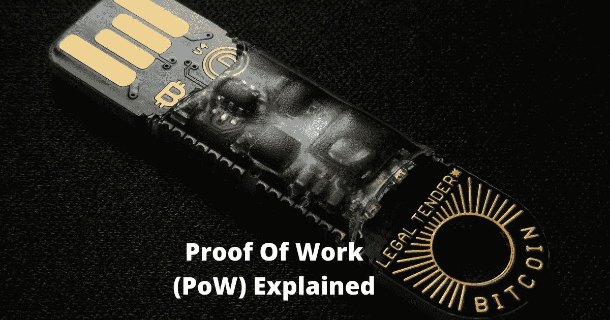
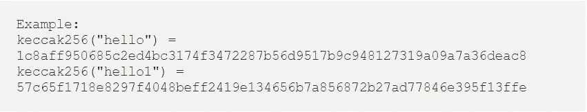
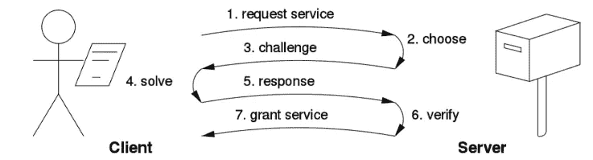
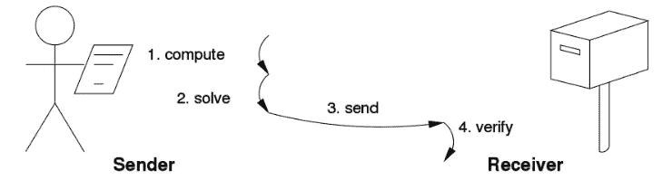

# 工作证明解释

> 原文：<https://medium.com/coinmonks/proof-of-work-explained-e783ccd2f87c?source=collection_archive---------0----------------------->

工作证明(PoW)系统(或协议，或功能)是一种共识机制，由 Cynthia Dwork 和 Moni Naor 在 1993 年的一篇期刊文章中首次发明。1999 年，马库斯·雅各布松和阿里·尤尔斯在一篇论文中正式采用了这一方法，并将其命名为“工作证明”。

开发它是为了防止拒绝服务攻击和其他服务滥用(如网络上的垃圾邮件)。这是许多加密货币(如比特币和以太坊)正在使用的最广泛的共识算法。

> [在 CoinCodeCap 上购买最佳加密交易](https://coincodecap.com/deals)

## **它是如何工作的？**

在这种方法中，一组用户相互竞争寻找复杂数学难题的答案。任何成功找到解决方案的用户都可以将该块广播到网络进行验证。一旦用户验证了解决方案，程序块就开始确认状态。

区块链网络由许多分散的节点组成。这些节点充当管理员或矿工，负责向区块链添加新数据块。矿工立即随机选择一个与区块中存在的数据相结合的数字。为了找到正确的解决方案，矿工需要选择一个有效的随机数，以便新生成的块可以添加到主链中。它向找到解决方案的矿工节点支付报酬。

然后，该块通过一个散列函数来生成匹配所有输入/输出标准的输出。一旦找到结果，网络中的其他节点验证并确认结果。每个新块都保存前一个块的哈希。这就形成了一连串的积木。它们一起在网络中存储信息。更改块需要包含相同前任的新块。几乎不可能重新生成所有继任者并更改他们的数据。这保护了区块链不被篡改。

## **什么是哈希函数？**

哈希函数是一种用于将任意长度的数据映射到一些固定大小的值的函数。哈希函数的结果或输出被称为哈希值、哈希代码、摘要或简称为哈希。

Source: Wikipedia

哈希方法是非常安全的，输入中的任何微小变化都会导致不同的输出，从而进一步导致被网络参与者丢弃。哈希函数生成与输入数据长度相同的输出数据。这是一个单向函数，即该函数不能反转以恢复原始数据。人们只能用原始数据来验证输出数据。

## **实现**

如今，工作证明已经在许多加密货币中使用。但它首先在比特币中实现，之后变得如此流行，以至于被其他几种加密货币采用。比特币使用拼图 Hashcash，拼图的复杂程度取决于网络的总能量。平均来说，阻断形成需要大约 10 分钟。基于比特币的加密货币莱特币也有类似的系统。以太坊也实现了同样的协议。

## **电源类型**

工作证明协议可以分为两部分:-

## **挑战-回应**

这个协议在请求者(客户机)和提供者(服务器)之间创建了一个直接链接。

在这种方法中，请求者需要找到服务器给出的挑战的解决方案。然后，解决方案由提供者进行验证。

提供者当场选择挑战。因此，它的难度可以适应它当前的负载。如果挑战-响应协议具有已知的解决方案，或者已知存在于有界搜索空间内，则请求方的工作可能是有界的。

Source-Wikipedia

## **解决方案–验证**

这些协议在发送方和接收方之间没有任何这样的预先链接。客户自己强加了一个问题并解决了它。然后，它将解决方案发送到服务器，以检查问题选择和结果。像 Hashcash 一样，这些方案也是基于无界的概率迭代过程。

Source-Wikipedia

这两种方法通常基于以下三种技术:-

## **CPU 绑定**

这项技术取决于处理器的速度。处理器能力越高，计算量就越大。

## **内存受限**

这种技术在计算速度上利用了主存储器访问(延迟或带宽)。

## **网络绑定**

在这种技术中，客户端必须执行一些计算，并等待从远程服务器接收一些令牌。

## **工作证明功能列表**

以下是已知工作证明函数的列表:-

o 整数平方根模一个大素数

o 削弱菲亚特-沙米尔签名` 2

o Ong-schn orr-sha mir 签名被波拉德破解

o 部分哈希反转

o 哈希序列

o 谜题

基于 Diffie-Hellman 的谜题

o 温和

o Mbound

o 北海道

哦，布谷鸟周期

基于 o Merkle 树

o 导游拼图协议

对区块链网络的成功攻击需要强大的计算能力和大量的计算时间。工作证明使黑客效率低下，因为所产生的成本将大于攻击网络的潜在回报。矿工也被激励不作弊。

在区块链，它仍然被认为是最受欢迎的达成共识的方法之一。尽管由于大量使用高能量，这可能不是最有效的解决方案。但这也是它保证网络安全的原因。

由于工作证明，改变区块链的任何方面都是不可能的，因为任何此类改变都需要重新开采所有这些后续区块。用户也难以控制网络计算能力，因为该过程需要高能量，从而使得这些散列函数昂贵。

> [在您的收件箱中直接获得最佳软件交易](https://coincodecap.com/?utm_source=coinmonks)

