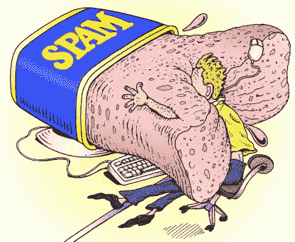

# 工作证明(适用于假人！)

> 原文：<https://medium.com/coinmonks/proof-of-work-for-dummies-5abad1cd744?source=collection_archive---------2----------------------->

*背景:我目前正在从零开始构建一种加密货币。这是许多文章中的第一篇，以一种虚拟友好的形式解释核心思想。*


这是 1997 年。互联网正以惊人的速度发展。活着是一个光荣的时代。

但是，当人类迅速建立起他最伟大的发明时，一些坏演员正悄悄地密谋把它搞砸。

他们想滥用互联网的影响力和可访问性，向互联网发送大量不请自来的促销电子邮件——年轻人称之为“垃圾邮件”。

1997 年，各地的收件箱都一致认为:垃圾邮件发送者赢了。

# 为什么有人会发垃圾邮件？

大多数垃圾邮件要么试图出售某些东西(广告)，要么欺骗用户共享发送者可能恶意使用的敏感信息(网络钓鱼)。

# 为什么发垃圾邮件这么容易？

个人电子邮件是一个很小的文件，可以几乎即时地复制并分发给数百万人，基本上没有任何成本(相对于次佳选择)。

发送电子邮件很便宜，主要是因为:

1.  分销渠道(互联网)基本上是免费的，对任何人开放
2.  发送一封电子邮件只需要微不足道的计算资源

第一个事实，至少在 1997 年，改变是不切实际的。



第二个更好商量。

如果我们的电子邮件协议要求计算机进行一些适度的计算工作来发送信息，那会怎么样？

发送一封电子邮件不会要求过高(可能只需要一秒钟左右)，但发送数百万封邮件会很快变成一项艰巨的工作，需要大量的计算资源，因此也很昂贵。

这催生了工作证明系统。

在工作验证系统中，计算机需要解决一个预先确定难度的计算问题，然后才能被允许采取一些预期的行动。

一旦计算机解决了问题，它就分享它的答案作为它努力的“证明”。

另一台计算机能够快速验证证据，并允许所需的动作发生。

在限制垃圾邮件的情况下，我们希望我们的电子邮件客户端只接受那些提供证据证明他们努力将邮件发送给我们的人的邮件。


# 那么，我们如何验证计算机已经做了特别的努力呢？

假设我们有一个函数，对于任何给定的输入，它都会产生一个固定大小的输出。

很简单。

当我们通过函数发送一个简单的字符串时:

`our_function(“Which one of you bastards ate my pad thai?”)`

它返回:

`'d6b1f2b59a73a93fb62ec75ee5df121f7717a8a757cd15c35bbc20ae8e810379'`

每当我们通过它发送那个字符串时，它就产生这个输出。

现在，看看当我们改变输入中的一个字符时会发生什么:

`our_function(“Which one of you bastards ate my pad thai!”)`

退货:

`'41c4f3e63c45f8cdf7fcd46d32eddbf8bf51bd656919b68ec50d226ca36a951b'`

输出完全不同！

这使得对输入如何转化为输出进行逆向工程变得不切实际。我们输入的微小变化不会对输出产生明显的、可测量的变化。

另外，记住我们的输出总是一个固定大小的字符串。在这个例子中，我们的输出将总是 64 个字符长。

为了简单起见，我们假设输出字符串中的每个字符只能是 16 个十六进制值(0–9，a-f)中的一个。即使有这些限制，我们的函数也会产生大量可能的输出。

```
A math refresher: a 64 character-long string where each character can be one of 16 items produces 16^64 different possible outputs. 16^64 is a ludicrously large number. Like, *total-atoms-in-the-observable-universe* huge.
```

考虑到可能的输出值的巨大范围，我们将能够为几乎任何输入生成唯一的输出字符串。

偶尔，两个不同的输入会映射到同一个值(一个“冲突”)，但是在我们的函数中这是极其罕见的*。*

*简而言之:我们的函数为几乎所有唯一的输入创建一个唯一的标识符。*

*我们刚刚构建的函数类型有一个奇特的名字:“加密哈希函数”*

*加密哈希函数还有一些其他属性，但是我们的例子涵盖了最相关的属性。所以…*

# *如何用这个函数来“证明”一台计算机做了一些工作？*

*回想一下，我们的函数执行得很快。很容易使用任意输入运行并产生唯一的输出。*

*但是，想象一下如果我们问:*

```
*Solve for an input, n, where our_function(n) returns the following output: ‘0c756ce63af37a723cf4f8012f6817a58ba55196bf0f9dc9f962086d24f6ab7f’.*
```

*假设计算机从未见过特定的输出字符串(并且知道产生它的输入)，它将不得不开始随机猜测并检查输出。*

*但是，请记住，它可能需要 16⁶⁴猜测得到正确的答案。[ [1](https://stewfortier.com/#pow-footnote-1)*

*这可能需要几十亿年才能解决，所以我们可能会问一个要求低得多的问题，比如:*

```
*Solve for an input, n, where our_function(n) returns an output where the first three characters are 0’s.*
```

*假设我们过去没有使用我们的 _function(n ),我们将开始进行随机猜测，直到我们收到如下输出:*

*`‘000a58ba55196bf0f56ce63af37a723cf4f8012f68179dc9f962086d24f6ab7f’`*

*猜对三个字符比猜对 64 个字符要容易得多。*

*如果我们想让事情变得更有挑战性，我们会从匹配前 3 个字符到匹配前 4 个，然后是前 5 个。每一步都比上一步难 16 倍，因为，回想一下，每个字符有 16 个可能的值。*

*我们可以认为这是一个工作因素。如果需要，我们希望能够随着时间的推移使问题变得更加困难。毕竟，我们在 1997 年创造的任何挑战，在今天用现代处理器都可以轻而易举地完成。*

*然而，我们仍然有一个问题:一旦有人找到了产生期望输出的输入，他们就可以在下一次被问及同样的问题时重复使用这个答案，只需付出微不足道的努力。*

*因此，为了防止重复使用答案，我们可以在每次提问时生成一个随机值，并要求将它附加到输入中，从而保证他们不能重复使用旧的答案(记住:只改变输入中的一个字符就会极大地改变输出)。*

*我们的问题看起来更像是:*

```
*Given a random string, solve for an input, n, where our_function(n + random_string) returns an output where the first three characters are 0’s. random_string= ‘a562e1L’*
```

*即使他们发现了一个输入 n，它先前已经产生了一个以三个 0 开始的输出，同样的输入 n 与一个随机的字符串组合将产生一个非常不同的值，这要求他们从头开始并求解一个不同的 n。*

*显然，我们的随机字符串生成函数需要真正随机。比纯概率更频繁地产生相同挑战的半吊子随机生成器将增加挑战者接收相同挑战两次的可能性。*

*但是，那是另一天的兔子洞。*

*综上所述，猜测 n 值的简单函数可能如下所示:*

*在上面的代码中，“challenge”是我们发送给挑战者的随机字符串。*

*我们可以用这样的东西来验证 n 的随机猜测。我们只是问 Hash(n + random_string)是否输出一个以足够数量的 0 开头的值。*

*很简单，是吧？*

*我们还需要构建一些东西来使这变得合理，特别是为了对抗垃圾邮件而发明的概念(尤其是 Hashcash)，但希望这说明了工作证明背后的基本理论。*

*目前支撑主要加密货币的工作证明是这里的思想的扩展和相对优雅的实现。*

> *[在您的收件箱中直接获得最佳软件交易](https://coincodecap.com/?utm_source=coinmonks)*

*[](https://coincodecap.com/?utm_source=coinmonks)*