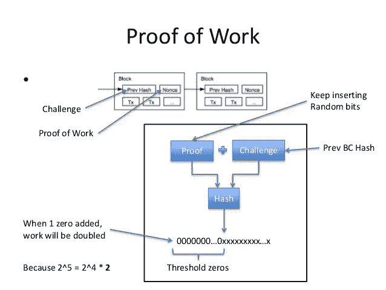

# 工作证明还是利害关系证明？两个都要怎么样？

> 原文：<https://medium.com/coinmonks/proof-of-work-or-proof-of-stake-how-about-both-27ff19b73f51?source=collection_archive---------2----------------------->

在过去几年中，工作证明(PoW)和阶段证明(PoS)共识模型之间的争论一直是加密货币市场的前沿和中心。随着围绕以太坊的性能问题和超预期发布的 Casper 的所有争议，这场辩论最近变得更加明显。PoW 与 PoS 的争论迅速促进了分布式账本架构中术语共识协议的创新。虽然争论的双方主要是由纯粹主义者推动的，他们热情地宣扬一种方法相对于另一种方法的优势，但在密码社区中出现了第三种趋势，他们一直在倡导所罗门式的解决方案:将 PoW 和 PoS 结合在一个单一的治理共识模型中。

# 公地悲剧与无利害关系问题

关于 PoW vs. PoS 已经写了很多，所以我不打算让你厌烦重复同样的论点。概括 PoW vs. PoS 论点的一个好方法是将其视为两个主要经济困境之间的摩擦:“公地悲剧”和“无利害关系挑战”。

在 PoW 系统中，矿工因解决网络中的计算难题而获得报酬。矿工无法欺骗系统，因为它需要真实世界的资源来制定这些解决方案。

随着战俘网络的发展，当区块奖励补贴变得可以忽略不计，并且奖励(几乎)完全由交易费组成时，采矿成本将变得明显不那么有利可图。这背后的基本原理源于一种被称为“公地悲剧”的经济现象，这是经济学和博弈论研究中的一个普遍问题。在最纯粹的形式中，公地悲剧描述了一个参与者有机会自私地行动的系统，采取行动以伤害同伴为代价来为自己谋利。一个自私的理性代理人总是会采取这样的行动，因为她只对自己的幸福感兴趣；但如果每个人都自私地行事，那么每个人的情况都会比每个人都合作的情况更糟。

这和权力有什么关系？嗯，在电力网络中，理性的矿工将被鼓励只处理支付高费用的交易，这样交易的成本就可以被一小群矿工操纵。更糟糕的是，为了避免计算费用，矿工可以通过不验证交易来危及整个 PoW 网络的安全。

在利害关系证明系统中，硬币持有者因确认交易而获得交易费。因此，股权证明为长期持有硬币创造了清晰明确的经济激励。股权证明与采矿无关，它是关于验证的，它发生在矿工设立股权，或锁定一定数量的硬币，以验证大宗交易。每个验证者都拥有网络中的一些股份，他们绑定在一起。债券意味着你把你的硬币留在网络中，在某种意义上，用它作为担保品来担保一个街区。

PoS 系统面临另一个经济挑战，即所谓的“无风险”问题。在 PoS 网络中，验证交易只有奖励，没有惩罚。因此，事务中的参与者可以开始以一种导致网络永远无法达成一致的方式在彼此之上产生块。

# 法令和混合共识的出现

为了利用 PoW 和 PoS 系统的优点，已经产生了新一波的共识模型。可以说，Dash 是使用混合 PoW-PoS 方法的最活跃的加密货币。在这个领域我非常喜欢的另一个项目是[decreed](https://www.decredible.com/)，它在一个非常聪明的彩票系统中结合了 PoW 和 PoS 的优点。

在[规定的](https://www.decredible.com/)世界中，交易首先由在区块链创建区块的电力矿工处理。之后，利益相关方将使用 PoS 模型来确认该区块是否确实有效。他们通过在彩票系统中购买选票来做到这一点。[法令](https://www.decredible.com/)的口头禅可以概括为“挖掘交易难，验证交易易”。

就像[颁布](https://www.decredible.com/)一样，有许多其他项目开始结合 PoW 和 PoS 系统的优势。随着区块链的发展，这些混合模型很可能会找到进入主流应用的方法，从而受益于 PoW 架构的鲁棒性和 PoS 模型的灵活性。