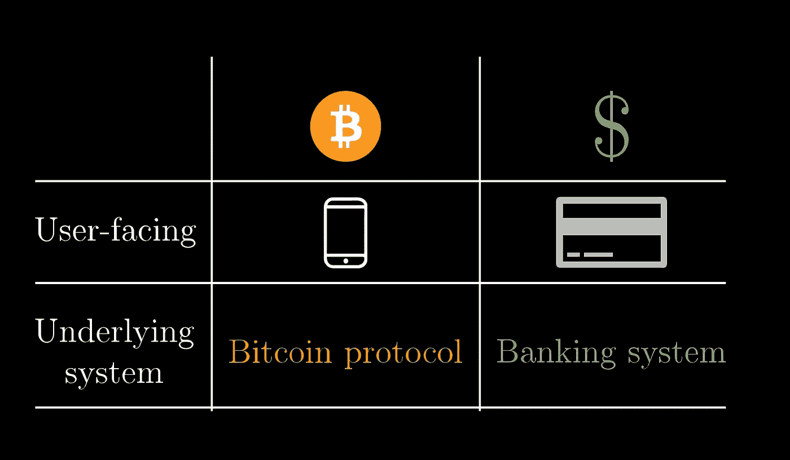
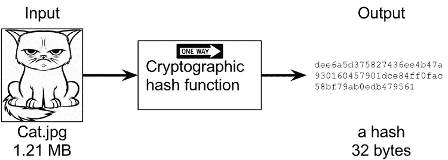
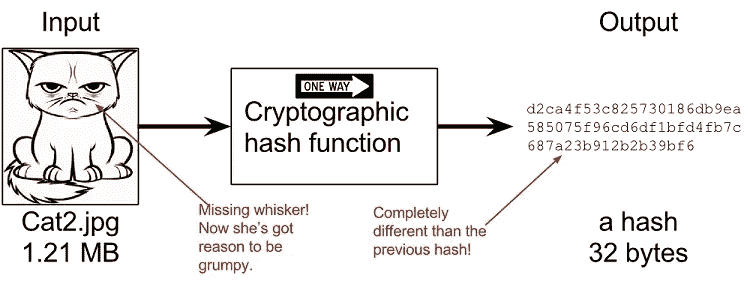

# 工作证明——用简单的话来说比特币机制

> 原文：<https://medium.com/coinmonks/proof-of-work-the-bitcoin-mechanism-in-simple-words-2e7a0fd9f8a7?source=collection_archive---------3----------------------->

## 了解工作证明(PoW)，区块链网络中的原始共识算法，特别是在比特币区块链网络中。

# 比特币

[**比特币**](https://blog.coincodecap.com/a-candid-explanation-of-bitcoin/) 是一个**基于区块链的**系统，由分散的节点集体工作来维持。这些节点中的一些被称为矿工，负责向区块链中添加新块。
比特币是最受欢迎、最成熟的可开采加密货币。

像中国和俄罗斯这样的国家很有可能在几年内发射第一个。
德意志银行最近发布了一份[报告](https://www.dbresearch.com/PROD/RPS_EN-PROD/PROD0000000000503196/Imagine_2030.pdf)暗示加密货币可能在十年内取代国家法定货币，并设想这些国家支持的版本将引领潮流。

> 此外，最高法院最近取消了印度对加密货币和比特币交易的限制。

[*阅读更多*](https://economictimes.indiatimes.com/markets/stocks/news/sc-allows-trade-in-cryptocurrency-quashes-rbi-curb-on-use/articleshow/74470078.cms?utm_source=contentofinterest&utm_medium=text&utm_campaign=cppst)*……*

# 比特币协议的机制与银行系统有何不同？

像任何其他数字支付一样，有许多用户友好的应用程序，让我们可以非常容易地发送和接收货币。不同之处在于他们网络的主干网，这不是一个银行验证交易，而是一个聪明的分散式无信任验证系统，基于密码学中的一些数学知识。

***注:*** *请容忍我所做的任何简化。这些算法背后有很多复杂的研究。随着我们的进展，我将为感兴趣的读者做进一步的研究提供链接。*

在区块链业界，我们听到很多关于共识算法的说法，在网络上达成共识的比特币使用的是**工作证明(PoW)** 。

在继续之前，对于非技术读者:

散列函数是可用于将任意大小的数据映射到固定大小的数据的任何函数。

*示例*:

如果一个散列函数是安全的，它的输出和随机的是无法区分的，当你稍微改变输入，也许只是编辑一个字符，产生的散列会完全改变，并且在相反的方向上**不可行**计算。

令人惊讶的是，如果你深入研究这个函数如何工作的细节，你可以对输入进行逆向工程，但是没有人想出这样做的方法。

假设你有一个区块链，在目前的区块链网络环境下，这种情况肯定会发生。
你将有多个节点，所有这些节点将有相同股份的区块链。
现在出现的普遍问题是，当遇到新的区块时会发生什么。一个聪明的人会回答说，你在你的区块链中灌输了这个区块。
那么，谁负责在已经存在且运行良好的系统中添加这一块呢？

这就是*共识算法*发挥作用的地方。

名为“**工作证明**”的共识算法与区块链中的交易列表有着内在的联系。像**比特币**和**以太坊**这样的货币使用这种算法，每一种都有其不同之处。

挖掘器是网络中的一个节点，它收集事务并将它们组织成块。

# 工作证明是干什么用的？

[*工作证明*](https://en.wikipedia.org/wiki/Proof_of_work#Bitcoin-type_proof_of_work) 是一种就有效区块链达成全球共识的机制:由于所有节点都有一份区块链的副本，每个节点必须就证明一个节点在验证事务上花费了多少努力的条件达成一致。
每次必须在区块链中添加块时，他都必须进行工作验证，这将花费一些时间和计算能力，但是当某个矿工这样做时，会生成一些其他节点或其他块，这些节点或块将被添加到区块链中，使他的攻击无效。

换句话说:如果区块链的内容很容易改变，那么每个人都可以篡改它；相反，如果每个块都是用复杂的数学函数计算的，那么要篡改区块链就要花很大的力气。

比特币矿工获得比特币，作为完成“块”验证交易的奖励，这些交易被添加到区块链中。

# 矿工要做什么样的工作？

对于被网络接受的区块，矿工必须完成工作证明以验证该区块中的所有交易。这项工作的难度并不总是相同的，它会不断调整，以便每 10 分钟就可以生成新的块。成功生成的概率非常低，因此无法预测网络中的哪个工人将生成下一个块。

矿工必须利用计算能力，通过暴力方法解决一些不同的数学计算。因此，如果一个人拥有强大的计算能力，他可能能够解决这个问题，也可能会失去它，这是不可预测的。

因此，随着网络中矿工人数的增加，挑战变得越来越难，以至于每 10 分钟就有一名矿工获胜。比特币在创建交易区块链的背景下利用了这种工作证明方案。
如果有人改变其中一个交易，它将完全改变**散列**，所以他将不得不通过另一个*十亿次猜测*来找到一个新的 PoW。

如果链条中的每个人都同意优先选择区块链作品最多的那一个，我们就有办法达成一个分散的共识，而不是一个中央权威。这个基于工作证明的系统或多或少是比特币协议的工作方式。

传统的区块链公司基于单一共识机制，而一些创新的公司则采用多种共识协议。

例如，Opet foundation 正在构建一个独特的区块链，通过应用权威证明和工作证明协议来存储在其教学伙伴聊天机器人应用程序上收集的数据。
Opet 基金会的区块链解决方案确保了学生数据的隐私，同时激励教育机构和学生为 Opet 平台做出贡献。

# 工作证明并不完美，但它的工作

-我们已经知道，每个区块链块都需要大量的计算能力，因此最长的链具有最高的累计工作量。
- 51%攻击:如果超过 50%的验证者有不良意图。有人可能会将错误的交易放在区块上，其他人的资金就会被盗。社区将不再相信网络，但这种情况不太可能发生。

# 结论

在本文中，我们讨论了工作证明，这是目前在比特币中实际使用的共识算法。工作证明是一个低效率的系统，保持网络存活的成本很高。[还有更好的解决方案，比如股权证明和其他一些共识算法。](https://ieeexplore.ieee.org/abstract/document/8400278/)

**参考以下内容以获得见解:**

*   [***比特币*** *白* ***纸*** *: 4。* ***工作证明***](https://hackernoon.com/bitcoin-white-paper-4-proof-of-work-k029k2b6i) ***。***
*   与区块链相关的学术论文精选列表。

> [直接在您的收件箱中获得最佳软件交易](https://coincodecap.com/?utm_source=coinmonks)

