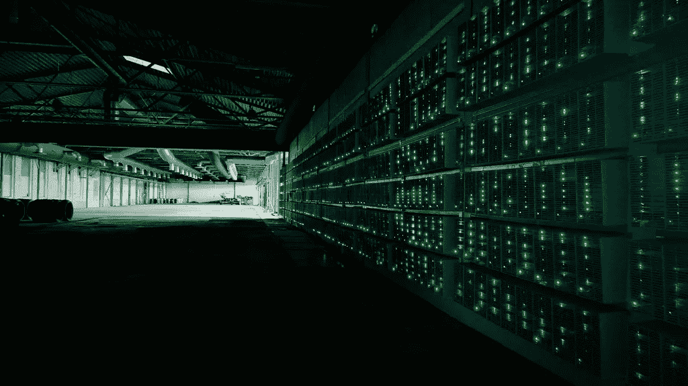

# 工作证明和赌注硬币分配和集中证明

> 原文：<https://medium.com/coinmonks/proof-of-work-v-proof-of-stake-centralization-9790740fd730?source=collection_archive---------7----------------------->

## 让我们来看看工作证明硬币和股份证明硬币可能如何发挥作用的一些博弈理论。

[“Bitcoin mining”](https://www.flickr.com/photos/35468147969@N01/14266642578) by [Marko](https://www.flickr.com/photos/35468147969@N01) is licensed under [CC BY 2.0](https://creativecommons.org/licenses/by/2.0/?ref=ccsearch&atype=rich)

## 放弃

本文并不试图对 PoW(工作证明)和 PoS(利害关系证明)进行全面比较。相反，它更集中于我注意到的 PoS 中的一些问题，以及它与 PoW 的比较。因此，不要在阅读本文时认为我已经涵盖了所有内容，我没有！

## 介绍

一般来说，加密货币的目的是维护或增强我们已经拥有的技术，但以分散的方式进行。这意味着我们必须详细检查区块链技术的每个方面。我们必须评估它的博弈论，以判断它是否能够以分散的方式维持自身…因为如果它不能，它的存在可能首先就没有意义。它可能只是另一个基于 AWS 服务器的应用程序。

## 先验知识

如果你不相信或者好奇为什么去中心化很重要，这篇文章会有所帮助:

 [## 3 权力下放的重要优势

### 权力下放似乎是这十年的流行语。从根本上说，这是一种自下而上的方法来运行…

www.inc.com](https://www.inc.com/kenny-kline/3-important-advantages-of-decentralization.html) 

本文假设您了解关于区块链的共识以及 PoW 和 PoS 如何工作的基础知识。如果您不熟悉这些概念，请阅读这些文章:

 [## 利益一致的证明

### 利害关系证明是如何工作的？为什么现在这么流行？

medium.com](/comprehend/proof-of-stake-consensus-e494bc989039)  [## 比特币挖矿为什么存在？它是如何工作的？

### 什么是随机数，SHA-256 算法是如何与之关联的？

medium.com](/comprehend/why-bitcoin-mining-exist-how-it-works-eb95e1985370) 

> 订阅 [**Coinmonks Youtube 频道**](https://www.youtube.com/c/coinmonks/videos) 获取每日加密新闻。

# 工作证明

工作证明不是免费的，它需要能量，因为物理计算机正在做真正的工作，每秒生成和测试数十或数百个 terra-hash，直到有人找到有效的 hash。这种能量的消耗意味着金钱的消耗，不仅是在能量上，而且是在消耗能量的设备上。但是开采这些硬币当然是可以赚钱的。一个行业诞生了。

一个资本家(从有资本寻求投资的人的意义上来说)可能会看到他们可以以 10，000 美元的成本(虚构的数字)开采一个比特币，但却赚了 50，000 美元。一笔大买卖，他们应该投资的买卖。在几年的时间里，成千上万的资本家都在进行同样的计算和投资。即使开采一枚比特币的成本为 4 万美元，它仍然有一个积极的前景(特别是如果你预计比特币的价格会上涨)。

## 竞争，与利润相对立

随着时间的推移，比特币网络的 hashrate 增加，这增加了竞争力，从而增加了挖掘比特币的成本。最终，一个自由、开放和固有的全球市场的残酷竞争将主要消除利润。如果 A 国有试图扼杀竞争的法律(可能是监管捕获或只是直接禁止)，那么 z 国将出现更具竞争性的采矿作业。A 国将受到损害，但没有任何好处(收入损失)，理论上这没有意义，但当然没有意义的法律会不时通过。

假设最终以 5 万美元的价格开采一个比特币需要 4 万美元。平均而言，假设没有杠杆或贷款，矿工将不得不出售 80%的新铸造的比特币，以保持采矿设施的照明。请记住，他们必须支付他们使用的电力，并支付维护他们正在运作的设施。这有什么作用？它允许新的比特币在人群中分配，而不是简单地积累在投资者手中。分散的力量。

# 利害关系证明

股权证明是一种更清洁的方法，它不需要任何大量的工作来运行，不需要为其安全模型制造 ASICs，不需要大量的能源。它旨在模拟没有任何行李的工作证明。

在 PoS 中，有人可以下注硬币并赚取利息。这个想法是，赌注硬币可以从坏演员身上拿走，这样就有了变得不坏的动机。只要大部分被下注的硬币属于优秀的演员，那么生产出来的积木就应该是完好的。支付利息是为了激励人们投入资金，以提高网络的安全性。

## 激励

问题是，在这个时候，人们没有动力出售他们的赌注硬币。当然，他们可能想获得一些短期利润，但一些看好加密的人的长期前景是，时间是市场的出路。因此，他们只是不断积累免费硬币，没有相关的成本。这意味着，新硬币只会让那些已经拥有硬币的人获得，而不是增加试图获得合理份额的新来者的流动性。

在以太坊的情况下，这个问题变得更加复杂，因为在撰写本文时，最少的 ETH 为 32 ETH，价值约为 115，000 美元！这意味着你必须有 115，000 美元可用于投资，才能从以太坊的货币扩张和交易费用中受益。你可能会说，开始从比特币中获利是不自由的，但这又回到了一点，即新的硬币将被分配得更多，随着时间的推移，利润率将会缩小。

# 附加比较

## Premines

还有一个首要问题。premine 是指在公众被允许加入网络之前，一群人获得一份硬币。取决于有多大的溢价和有多少硬币出售给公众，这可能导致一个非常不平衡的硬币分配。在 PoW 中，硬币如何分配并不重要，因为它关系到共识和网络的完整性。在 PoS 中就不是这样了，在 PoS 中，硬币分配就是一切。提醒一下，51%的币控制着网络的共识。控制硬币的人就控制了网络。因此，一个大型实体控制着大量的硬币供应，由于他们在网络中的影响力，这是一个相当大的集中化风险。

## 改变的能力

这是从另一个角度来看我到目前为止所展示的内容。例如，如果我们拿一个有 100 亿供应上限的 PoS 硬币来说，但是一个实体有 30 亿这样的硬币，那么这个实体之外的任何人都无法驱逐这 30%。他们永远有很大的影响力，除非他们决定套现。即使对于没有供应上限的硬币，新硬币也会发放给那些已经有硬币的人，因此不会自动分配给新来的人。相比之下，在 PoW，一个拥有 30% hashrate 的矿工实际上可以在几年内成为 hashrate 的一小部分，因为成百上千的其他矿工会加入战斗。

# 结论

我想让你从这里学到的主要东西不是我认为利害关系证明完全是浪费时间而且很糟糕，或者工作证明没有任何缺点。我只是想说明存在权衡取舍，至关重要的是，我们要诚实地评估这些权衡取舍，而不是武断地宣称，有一种“创新”解决了以前系统的所有问题，而且自身没有任何缺点。谈到扩展，我们已经多次看到这种情况。一个新的项目将会提出，他们已经找到了一些突破性的方法，可以在不牺牲安全性或分散性的情况下扩展一个链，而在基本链上从来没有这样的情况，L2 似乎是一个不同的故事。

> 加入 Coinmonks [电报频道](https://t.me/coincodecap)和 [Youtube 频道](https://www.youtube.com/c/coinmonks/videos)了解加密交易和投资

## 另外，阅读

*   [尤霍德勒 vs 科恩洛安 vs 霍德诺特](/coinmonks/youhodler-vs-coinloan-vs-hodlnaut-b1050acde55a) | [Cryptohopper vs 哈斯博特](https://blog.coincodecap.com/cryptohopper-vs-haasbot)
*   [如何匿名购买比特币](https://blog.coincodecap.com/buy-bitcoin-anonymously) | [比特币现金钱包](https://blog.coincodecap.com/bitcoin-cash-wallets)
*   [币安 vs FTX](https://blog.coincodecap.com/binance-vs-ftx) | [最佳(SOL)索拉纳钱包](https://blog.coincodecap.com/solana-wallets)
*   [如何在 Uniswap 上交换加密？](https://blog.coincodecap.com/swap-crypto-on-uniswap)
*   [3 commas vs . Pionex vs . crypto hopper](https://blog.coincodecap.com/3commas-vs-pionex-vs-cryptohopper)
*   [币安 vs 北海巨妖](https://blog.coincodecap.com/binance-vs-kraken) | [美元成本平均交易机器人](https://blog.coincodecap.com/pionex-dca-bot)
*   [新加坡十大最佳加密交易所](https://blog.coincodecap.com/crypto-exchange-in-singapore) | [购买 AXS](https://blog.coincodecap.com/buy-axs-token)
*   [投资印度的最佳密码](https://blog.coincodecap.com/best-crypto-to-invest-in-india-in-2021) | [HitBTC 评论](/coinmonks/hitbtc-review-c5143c5d53c2)
*   [加拿大最好的加密交易机器人](https://blog.coincodecap.com/5-best-crypto-trading-bots-in-canada) | [赌注加密](https://blog.coincodecap.com/staking-crypto)
*   [如何在印度购买比特币？](/coinmonks/buy-bitcoin-in-india-feb50ddfef94) | [瓦济克斯评论](/coinmonks/wazirx-review-5c811b074f5b)
*   [比特币主根](https://blog.coincodecap.com/bitcoin-taproot) | [Bitso 评论](https://blog.coincodecap.com/bitso-review) | [排名前 6 的比特币信用卡](/coinmonks/bitcoin-credit-card-bc8ab6f377c6)
*   [最佳免费加密信号](https://blog.coincodecap.com/free-crypto-signals) | [YoBit 评论](/coinmonks/yobit-review-175464162c62) | [Bitbns 评论](/coinmonks/bitbns-review-38256a07e161)
*   [火币的加密交易信号](https://blog.coincodecap.com/huobi-crypto-trading-signals) | [BitMEX 评论](https://blog.coincodecap.com/bitmex-review)
*   [7 大最佳零费用密码交易平台](https://blog.coincodecap.com/zero-fee-crypto-exchanges) | [硬件钱包](/coinmonks/hardware-wallets-dfa1211730c6)
*   [分散交易所](https://blog.coincodecap.com/what-are-decentralized-exchanges) | [比特 FIP](https://blog.coincodecap.com/bitbns-fip) | [Pionex 评论](https://blog.coincodecap.com/pionex-review-exchange-with-crypto-trading-bot)
*   [用信用卡购买密码的 10 个最佳地点](https://blog.coincodecap.com/buy-crypto-with-credit-card)
*   [OKEx 评论](/coinmonks/okex-review-6b369304110f) | [Kucoin 交易机器人](/coinmonks/kucoin-trading-bot-automate-your-trades-8cf0ca2138e0) | [期货交易机器人](/coinmonks/futures-trading-bots-5a282ccee3f5)
*   [AscendEx Staking](https://blog.coincodecap.com/ascendex-staking)|[Bot Ocean Review](https://blog.coincodecap.com/bot-ocean-review)|[最佳比特币钱包](https://blog.coincodecap.com/bitcoin-wallets-india)