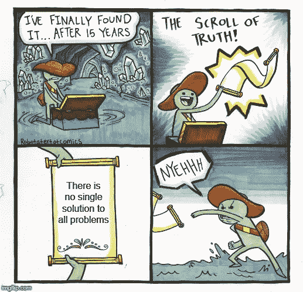

# 对真正的白痴来说，工作证明与利益证明

> 原文：<https://medium.com/coinmonks/proof-of-work-vs-proof-of-stake-for-real-idiots-a23ac4565649?source=collection_archive---------0----------------------->

Image taken from [https://de.wikipedia.org/wiki/Goldstandard#/media/Datei:McKinley_Prosperity.jpg](https://de.wikipedia.org/wiki/Goldstandard#/media/Datei:McKinley_Prosperity.jpg)

到目前为止，我只写过关于特定硬币的文章，但如果我写的是一般的技术，可能有人会感兴趣。唯一能找到答案的就是这篇文章。像往常一样，我会试着像一个真正的白痴一样为真正的白痴写作。所以让我们记住我们在看什么:

区块链、加密货币、分散分类账等。是没有权威的网络。当我们读到它时，我们经常会碰到工作证明(PoW)和利益证明(PoS)。还有其他东西吗？是的，授权证明(PoA)也存在，还有一些衍生工具，如情报证明或任务证明。但是这些与其他的非常相似——所以我们将比较前两个。有时这些东西被称为共识算法，但由于 Emin Gün Sirer，我们知道这是非常错误的。

不幸的是，作为真正的白痴，我们不理解这种吹毛求疵。因此，让我们试着在这里了解更多，但保持简单，也看看经济学。

Emin Gün Sirer jizzing out a tiny fraction of his infinite knowledge. After reading this article, I promise, you will understand at least 2 technical terms he used in these tweets more than now.

事先简短说明:这篇文章没有我的其他文章好笑。对不起我已经包括了“有趣”的图片来补偿这一点。我希望这种廉价的伎俩至少能骗过你们中的一些人，让他们继续阅读，因为有一些好的迷因正在逼近。

对于比特币，中本聪没有发明工作证明，而是他(或她，或他们)发明了中本聪共识——多么令人惊讶。中本共识是 PoW、最长链规则和 blocks 的组合。更准确地说，这是一些必须支付的任意成本(PoW)的组合，一种确保燃烧价值(支付任意成本)以及同步无组织网络有意义的机制，以及将异步事务绑定到同步块中的某种东西。这最后一件事已经解决了。

实质上，纽约时报早在 1995 年就开始印刷散列签名了。这些签名的目的是签署所有发送给担保人的数字文件(此处阅读)。原则上，这是第一个区块链。它允许某人证明数字文档未被更改。因此，它被发送到担保，一个公司，为这个文件创建了一个散列，你可以使用这个散列来证明你的文件是未经更改的。此外，您还可以证明您的文档是在某个时间点发布的。

这些时间点是带有散列签名的纽约时报的发布时间。这个哈希对集合进行签名，集合中包含了您的特定文档的签名。这些集合是块，纽约时报上新发布的每个散列都验证了以前的块。尽管它不叫这个名字，但它是区块链的作品。

Haber 和 Stornetta 发表的论文可以追溯到 1991 年，而担保是在 1995 年提供服务的。那么，当时比特币可能已经实现了吗？不。这种方法对于签署数字文档很有效，因为信任保证对于这些签名与对于加密货币是不同的水平。保证人提供的服务不是分散的。所以你必须相信担保人，他们不会篡改你的文件。

幸运的是，没有真正的动机让担保人这么做。在这个时间点上，当您将您的文档转移给担保人进行签名时，操作您的文档并没有真正的好处。您将立即意识到您的文档被更改，并且您不会使用收到的签名，因为它指向一个被更改的文档。对于比特币来说，情况有所不同。如果单个实体发行了大宗商品，那么如果该实体改变交易，肯定会有所收获，例如，在市场意识到系统不再值得信任之前，将所有 BTC 转移到他们自己的地址并出售这些资产。

Another invention that was already available before Bitcoin existed.

那么 PoW 呢？是的，这已经出现了，特别是以 hashcash 的形式，这是一种让发送电子邮件的成本更高以减少垃圾邮件的方式。为了发送一封电子邮件，你必须找到一个散列值，这个操作很费时间，因此使得发送垃圾邮件的费用很高。这个想法很好，但没有实现。Satoshi 没有考虑如何将这个 hashcash 包含到签名块中，而是考虑任何人如何成为发布签名集合的唯一实体。如果每个人都可以发布集合，如何确保网络不会被淹没，他们如何就冲突达成一致？

第一个问题显然是通过 hashcash 或者说工作证明解决的。第二个问题要复杂得多，这也是区块链革命的根本原因。这是一个分散的共识。独立行动者如何就一个单一的真理达成一致，即使这个真理的某些部分对某些参与者是无益的？

对于 Nakamoto Consensus 来说，最后一项是最长链规则。这是一个完美契合的典型拼图。例如，在对算法或物理系统进行建模时，您经常会遇到这样的情况:主要部分都在，但整体不稳定。有时候你找到一个解决了一些遗留问题的片段，但是它产生了一些新的问题，然后你找到下一个片段，它再次解决了一个问题，但是产生了一个新的问题，直到你最终接受这条路不会导致一个一致的理论。

许多途径导致产生新问题的解决方案，但然后重新开始，你最终会找到一次性解决所有剩余问题的方法。它解决了你目前面临的问题，也解决了积压问题中的其他一些问题，你会发现，这个拼图就是缺失的神奇酱。最长链式法则就是这样一个棋子。它解决了网络如何就单一事实达成一致的问题。同时解决了为什么有人要干多少活的问题。它甚至解决了攻击成本如何随着网络价值的增加而增加的问题。

A typical reaction when a crucial puzzle piece is found

它还有一个非常好的特点，即网络参与者不必与每个人通信。这听起来没什么大不了的，但是想象一下，你必须和所有和你住在同一条街上的邻居交谈。是的，烦人的和超级无聊的。你必须每天都这样做。否则，你的街道就封闭了，任何人都不能进出。一旦每个人都与每个邻居交谈过，你就可以在早上打开人行道，晚上也会发生同样的事情，一旦你同意，你就可以折叠人行道。或者，你的街道同意了一个特殊的规则，谁先醒来，就打开人行道，一旦天黑，你回家，就收起人行道。那就没人需要交流了。不管街上住了多少人，它都是有效的。这不是天生的，尤其是在网络中。

那么对于比特币来说意味着什么呢？任何人都可以通过查看前一个块来检查这个块是否有效。对于冲突的块或块链(分支),任何人都可以检查哪个链更长，并且有更多的工作放在其中。并且这些检查可以在不与整个网络通话的情况下完成。因此，共识机制与 O(1)成比例，其中这个 O 是朗道-O，代表复杂性。O(n)意味着算法的复杂度与 n 成线性比例，在这种情况下，n 是网络参与者的数量。在一个网络中，每个参与者都必须相互交谈，参与者的规模为 O(n ),这意味着数量翻倍意味着沟通工作翻两番。线性意味着双重参与者付出双倍的努力。好的，很好，但是 O(1)意味着加倍参与者不会带来额外的努力？是的。

请记住，这只是算法，真正的网络需要更多，因为您必须发送新的数据块，但这可以通过一种方式完成，即一个节点向 1000 个其他节点发送数据，这种方式可以很好地扩展。并且只有那些发现新块的人才需要做那种广播。但是等一下，这意味着无限缩放，对吗？是的。但所有人都知道比特币没有规模。没错，但当人们这么说时，他们不是在谈论网络中的参与者(矿工)，而是交易的数量。因此，读取区块链的用户数量可以很好地扩展，但是这些用户在单位时间内可以发送的事务数量根本无法扩展。

A funny image. Not related to my sex life.

有意思，但这不是很蠢吗？这听起来像是一家拥有无限桌子的餐厅，但只能处理固定数量的食物或饮料订单。是的，我们也会讨论这一点，但是我们可以看到，主动用户扩展和被动用户扩展之间的不匹配是有问题的。有一些解决方案，比如闪电网络，你开了很多其他餐馆，每个餐馆都派一个人去最初的比特币餐馆，在那里他点了他餐馆里的人想吃的所有东西。他的餐馆中的顾客也可以点虚拟饮料，一旦他们喝完所有的虚拟饮料，服务员去原来的餐馆将虚拟饮料变成真实饮料，虚拟饮料就变成了真实饮料。

Me doing research for this article. In the background are all kinds of analogies I have thought out. Like the one you just read above this image.

但是让我们回到复杂性。也可以应用到其他事情上，一定不能联网，典型的例子就是排序。如果你是一名计算机科学家，这篇文章的这一部分可能会非常无聊，但是因为这篇文章是为真正的白痴写的，所以我必须详细介绍一下。这项任务非常简单，按字母顺序或按值对任何单词列表进行排序——原则上这并不重要，只要有一个存在传递顺序的属性，对任何列表的排序都是一样的。然而，我们现在正在离开真正的白痴领域，所以让我们坚持按值对数字进行排序。这项任务很简单，但有无数种方法，有些比其他方法更快。例如，Bogosort 随机打乱数字，然后检查顺序是否正确。另一个例子是冒泡排序。这是一个典型的例子，因为它很简单，也是我们人类通常的排序方式，即交换相邻元素，直到集合被排序。

Bubblesort animated — not that this is important to understand the article, but let’s just rest a while and warm our hearts by seeing algorithms at work. Image taken from Wikipedia.

第三个例子是 Quicksort，它是分治排序算法的原型。在这个例子中，列表被分成两个列表，一个列表包含小于最初选择的元素的所有元素，另一个列表包含其余的元素。然后，再次以相同的方式划分得到的 2 个列表，直到只剩下具有单个元素的列表。在这一点上，找到了顺序，列表只需要合并到一起，反映出哪一个是包含每一层上的较大元素的子列表。所以这个算法要复杂得多，我们很快就会看到它的复杂性，以理解为什么这种额外的努力是值得的。

Quicksort animated — With higher complexity comes better heart warming. Image taken from Wikipedia.

最后一个例子是 Sleepsort，它为每个数字生成一个子进程，等待(休眠)的时间与数字的值一样多，然后将数字添加到最终列表中。这是一个笑话算法，但在这里将是一个非常有趣的例子。所以让我们看看复杂度来比较这些算法。首先，我们需要知道检查列表顺序的复杂度是 O(n)。在最好的情况下，Bogosort 在第一次洗牌后被排序，这给出了检查的 O(n)。在最坏的情况下，复杂性是无限的，因为洗牌在最坏的情况下可以永远进行下去。但是平均值是多少呢？众所周知 n 和无穷大之间的平均值是 n n！(教员)。不，我只是在开玩笑，我们可以计算这个。我将试着演示这是如何容易地推导出来的:有 n 个！排列 n 个元素的可能性。这是因为对于第一个元素，有 n 个点，对于第二个元素(n-1)，对于第三个元素(n-3)，等等。所有这些可能性结合起来给出了
n(n-1 )( n-2 )( n-3)…..= n！

所以平均一次需要洗牌 n 次！/2 次，并在每次洗牌后进行检查。对于复杂度我们省略了因子，所以复杂度是 nn！。Bubblesort 有一个平均值 n，因为本质上你要把每个元素互相比较，就是 n n，实际上你只需要做一半就可以了，只是我们又省略了 1/2 这个因子。这比博戈索特快多了。在这样一个系统中，n 的复杂性是一个重要的知识，我们在第一部分已经看到了网络通信。快速排序引入了层次结构，效率更高一些，因为系统地避免了大量冗余。这会产生一个复杂度为 nlog(n)的更好的结果，因为 n 的对数总是小于 n，特别是对于 n 的大数。

Quicksort 的优化有很多，在最坏或者最好的情况下更好或者需要的内存更少。但是我们不会在这里讨论，因为这对于这种类型的排序算法来说是非常特殊的。让我们来看看最有趣的算法。所有排序算法中最好的是 Sleepsort，因为它的复杂度总是 O(n)。因此，它比所有这些非常复杂的算法要简单得多。你不需要检查，对于每个元素，你只需要产生一个单一的进程，它有固定的计算量。

这一切听起来好得令人难以置信？没错。你仍然需要等待很长时间，直到解决方案准备好。对于每个数字，你必须用一个系数乘以它，然后得出睡眠的持续时间。在你检查列表之前，你不知道什么是合适的因素，但是我们可以这样做，复杂性不会增加。但是对于这个因素，我们不能从几秒钟切换到几毫秒或几纳秒，因为这个时间肯定比一个子进程需要产生的时间长得多。

排序所花费的时间等于最大数乘以因子。所以复杂度是所有排序算法中最低的，但事实上这并没有反映出它所花费的时间。这还只是计算复杂度。大量的计算工作被隐藏在子进程中，并且不能自由选择因子，如果排序的数字很小，因子需要足够高以将子进程彼此分开，如果有很多数字，因子需要足够高，以便计算机能够在比两个接近的数字之间的时间间隔更短的时间内产生所有子进程。

现在，我们已经谈论了很多关于这些算法，有人可能会问这与区块链有什么关系。我们已经看到，中本聪共识与 O(1)成比例，这不是巧合。Sleepsort 中的无限伸缩性来自于可以产生无限个子进程的假设，并且在 Nakamoto consensus 中，无限矿工可以并行搜索新块。但这并不意味着可以处理无限的事务。

事实上，交易数量不可能真的增加很多。最后，您必须等待，直到找到一个块，并且这个块时间不能减少，就像 Sleepsort 一样。如果你减少太多的时间，子过程产卵时间占主导地位，没有排序。同理，如果 blocktime 太低，计算速度太快，网络通信占主导地位，一个块的发现者找到下一个块的几率最高。

对于对上一个块的发现者具有低延迟(ping)的网络参与者也是如此，他们发现下一个块的机会比其他人高得多。在这种情况下，共识实际上不起作用。所以我们已经看到了睡眠排序和中本聪共识之间的相似之处。

理解了为什么 Sleepsort 在排序方面不是很高效，就意味着理解了为什么 Nakamoto Consensus 在处理事务方面不是很高效。另一个相似之处存在于 BFT(拜占庭容错，这里我们指的是具有 dPoS 的 BFT)共识和 Bubblesort 之间，其中每个项目必须相互比较，或者每个参与者必须相互同意，从而给出 n 个缩放行为。听起来很低人一等？其实不是。

因为我们已经看到，无限缩放对于中本聪而言，只是针对被动用户(读者/矿工)。对于活跃用户，BFT 可以提供更多的伸缩性，因为你不需要提供足够长的阻塞时间来给每个人一个公平的机会。在 BFT，限制是同步所有参与者所需的时间。每当你找到增加这个瓶颈的方法时，你就可以处理更多的事务。你也可以把一些监督者从实际的生产中分离出来。Cosmos 这样做是为了保持实际的块生产者(称为验证者)的数量较低。有 100 个，但是所有其他的利益相关者都可以作为监督者参与进来，在验证者之间分配赌注权力。他们被称为授权者。使用这种方法，您不必排除前 100 名之外的所有人，但仍然拥有小型验证器集的事务吞吐量。太好了。所以 BFT 只是优于中本聪？嗯，没那么容易。BFT 不一定和 PoS 一起出现。

这里我就不详细介绍 but 波斯了，不过[我还有一篇关于那个](/coinmonks/cosmos-tendermint-explained-for-real-idiots-ab4305cbb41)的文章。不使用 PoS，BFT 网络也可以用一组固定的公钥运行，只允许相应私钥的所有者成为验证者。这通常被称为授权证明(PoA ),它有一个明显的缺点，即它是允许的。如果得到许可，比特币永远不会在任何地方引人注目。

所以比特币和中本聪共识的不许可性非常重要。我还想说的是，购买或开采比特币的选择对于早期采用也很重要。但是我们想将中本聪共识与 BFT PoS 进行比较，并与 PoA PoS 进行对比。然而，一个有趣的问题是:它是否像中本聪与战俘的共识一样没有权限？我会说不。在 PoS 中，你可能无法进入系统，因为已经在系统中的每个人都决定不出售任何股份(硬币)。在这种情况下，技术是没有许可的，但是真实的网络不允许你进入。在 PoW 中，这不可能发生，因为你不需要任何人从内部构建新的芯片来解决这个难题，例如我的 BTC。然而，这一特性也意味着 PoS 不存在的攻击媒介，如果您获得足够的计算能力，就可以攻击网络。在 PoS 中要做到这一点，你需要从网络内部人员那里购买硬币。你不能从外面得到它们。这些内部人士不希望他们的网络受到攻击，或者只有在他们可以出售所有股份的情况下。然而，在达到 67%份额的过程中，价格可能会呈天文数字上升，而硅芯片的产量几乎可以呈线性增长。

Two crypto experts discussing peculiarities of different rate limiting approaches. The bearded man is also an expert in quantum computing.

这里介绍一下 CAP 定理是有意义的，我已经在[另一篇文章](/coinmonks/iota-experienced-as-a-real-idiot-ec72e872f753)中提到过。CAP 定理基本上是说，我们不能在分布式系统中拥有美好的事物。一致性(C)、可用性(A)或分区容差(P)非常有限，或者它们中的两个受到限制，而牺牲了一个非常强大的功能。

我们谈了很多关于可以处理多少事务，这个特性就是可用性(A)。可以处理的参与者越多，可用性越高。PoS 赢 vs. PoW。无权限与分区容忍度有很大关系。如果一半的网络消失了，还有可能填补空白吗？如果太多的参与者脱离，这个网络还能继续吗？力量胜于位置。准确地说，这是中本聪共识的杀手锏。如果除了一个节点之外的所有节点都脱机，它也可以工作。如果有核弹产生电磁脉冲波，电子关闭半个地球，它就会起作用。节点恢复在线后，它们可以加入网络，看看其他节点是否找到了一些块。

即使海洋中的所有线路都被切断，大陆可以继续生产区块，比较哪一个发现了最长的链，一旦连接被重新建立或每个单独继续，就将不同的实相融合在一起。这个具体的例子，中本聪可能不是融合不同现实的最佳方式，但这是另一个故事了。唯一有更好的分区容忍度的是 hydras，你甚至可以把一个节点切成两半，它们仍然工作。

Hydras are very partition tolerant. Image taken from [www.dndbeyond.com/monsters/hydra](https://www.dndbeyond.com/monsters/hydra)

好，那么 PoW 在分区容差方面胜出，PoS 在可用性方面胜出，那么一致性呢？这个特征基本上意味着存在一个大家都知道并认同的单一现实。所以比特币有同步块，这些同步块包含异步交易。听起来相当一致，似乎对 PoS 也是如此。但是有分叉，所以有时会有并发的块，一个链会被省略，以支持在添加更多块后变得更长的链。在 PoS 中，这不一定是一个问题，快速终结是可能的，这意味着一旦 2/3 的验证者同意，块就是最终的，并且每个人都知道这是最终的。在这种情况下，一致性是非常高的，因为有一个大家都同意的单一事实，你不必等待一些区块，直到它几乎肯定成为最终结果。

为了更好地理解这一点，让我们将其与 IOTA 进行比较，在 IOTA 中，这样一个单一的真理从来不存在。可以有在网络的一部分中已知的交易，而在另一部分中未知的交易，反之亦然。一段时间后，双方开始了解另一方的事务，但在此之前，还会有新的事务被创建，但并不是每个人都知道。这是因为没有同步块，只有异步事务。一致性低，但可用性高。这非常有趣，因为 IOTA 使用 PoW 来限制交易，就像 Nakamoto Consensus 一样。

相比之下，它没有最长链规则，因此以牺牲一致性为代价提高了可用性。因此，在这里我们可以看到，有不同的方式来使用这些共识机制的建筑块。这种积木有特定的属性，但最终如何工作，取决于整个机制的组合。

回到具有快速终结的 PoS，我们已经看到它具有非常高的一致性，但缺点是什么？我们已经看到，如果某些期望的特征被强烈地偏爱，则经常会有相关的缺点。这就是为什么 CAP 定理说你不能在最大值时拥有所有的性质。因此，非常高的一致性的代价是活跃度的损失，这意味着如果没有足够多的参与者在线，链条就会停止。脆弱活性本质上是低分区容忍度。

现在我们已经看到 Nakamoto Consensus 在分区容差(P)方面很强，在一致性(C)方面很好，在可用性(A)方面很差，与此相反，具有快速终结性的 PoS 在 P 方面很差，在 C 方面很强，在 A 方面很好。就像没有最好的车一样。如果你想把木材运出森林，法拉利可能不是最好的选择，尽管对于比赛来说它很棒。这同样适用于这里。所以我们必须定义用例，决定什么可能是合适的。

如果你打开 bitcoin.org 网站，你会看到它说“比特币是一种创新的支付网络和一种新的货币。”，这很好。用例是付款。支付最重要的特征是什么？可用性。如果你因为网络拥挤而无法支付，那么这不是一个好的支付网络。有趣的是，中本聪共识在这方面并不好，因此比特币在这方面也不好。一致性也很重要，因为你想确保付款是最终的，你的贸易伙伴知道这一点。

由此看来，很明显，快速终结的 PoS 更适合于支付交易。但是等等，这不是被证明是错的吗，因为比特币是所有加密货币中估值最高的？首先，市场不会告诉你某样东西是否擅长它想擅长的领域，它只会告诉你人们是否会购买它。第二，除了支付之外，还有其他可以使用金钱的东西，这就是价值储存。

高市值也意味着某种东西是很好的价值储存手段，或者人们认为它是。当你储存价值时，你不支付。要存储价值，您不需要高可用性。你需要的是分区容忍度和高安全性。一致性也不是绝对重要，因为如果需要一些时间直到整个网络都知道你有储值，或者直到你可以访问你的值，这也没关系。那么有没有类似于旧资产的东西呢？没错，是黄金。

黄金在很长一段时间内都是一种价值储存手段，而且是一种分散的资产。没有中央权力机构发行它，也没有人可以标记你的黄金储蓄无效。例如，与钞票相比，黄金非常重，不容易携带。所以如果我们把 gold 看做一个分布式应用，这有点可笑，但是我们这么做是为了看类比和教育，那么它就是极度分区宽容的。可用性不是很好。一致性不好。大自然非常准确地记录了黄金是如何在其价值持有者之间分配的，但我们无法访问大自然的这个数据库，我们需要逐个检查一堆黄金是否是真金，而不是铅。

这些在 C 点和 A 点的不良标记是大多数人不持有黄金，而是在第二层购买黄金的原因，在第二层你持有一定数量的黄金。这让你可以出售索赔，对于买方来说，没有必要称量任何数量的黄金，并检查其中是否有铅。

黄金交易的第二层解决方案极大地增加了 C 和 A，减少了 p。后者是因为第二层解决方案比真金更容易被破坏。这与比特币的第二层解决方案非常相似。这里我们可以看到，数字黄金这个术语是对比特币的一个很好的描述。为了让比特币更容易获得，第二层解决方案是必要的。黄金也是如此。在这两种情况下，第二层都用 P(分区容差)换取了 C 和 a。因此，我们现在已经看到，比特币的内在属性，或者说中本聪共识，使其成为一个良好的价值储存手段和一个糟糕的支付处理器。

McAfee doing prank calls impersonating himself as “future”

PoS 怎么样？它似乎天生适合支付网络，因为它的可用性很强。有了快速终结，它在一致性方面也很棒。这是否意味着，电力有利于价值储存，而邮政有利于价值交易？不要陷入给予力量的陷阱，一般来说，只有中本聪才具有的属性。以 IOTA 为例，它有能力但没有区块链，更确切地说是 tangle，它提供了高可用性、弱一致性但良好分区容差。

然而，这是一种理论。在实践中，有一个协调器，这并没有真正使它去中心化，限制了事务，当然也没有给出分区容差。但理论上 IOTA 是 PoW 擅长做交易的一个例子。直接比较 PoS 和 PoW 的最大问题是这两个系统不能直接互换。如果我们拿中本聪共识，只是插上 PoS，那么最长链法则根本没有意义。反之亦然，将密码 PoW 难题插入 BFT 共识，并不真正有意义。因此，我们纠正自己，BFT PoS 快速终结有利于支付网络，而中本聪共识(包括 PoW)有利于价值储存。

但是支付处理器和价值储存真的可以分离吗？可以看做截然不同的东西吗？用于支付的东西保持价值，以及存储价值的东西可以转移，这不是最基本的需要吗？是的，但只是在静态图片中。如果我们看看时间的演变，就清楚了。同样，我们可以与现实世界中的事物进行比较。我们已经介绍了黄金，现在让我们介绍一下法定货币，例如美元。美元和黄金都是价值储存手段，也是可以用来支付的东西。这两个特性的实现程度相同吗？当然不是。美元是更糟糕的价值储存手段，因为它取决于美国的存在，而黄金只取决于不变的物理定律。对于付款来说，情况正好相反。黄金很重，分割起来很复杂，不容易检查其有效性，也更难计数。

这里我们有两个真实世界的例子，它们都被使用，都有意义，但仍有不同的特征。如果我们看看时间尺度，我们会发现，与黄金相比，法定货币的支付处理速度非常快。如果我们问这样一个问题，在哪个时间尺度上两者都起到价值储存的作用，那么很明显黄金在 1000 年的时间尺度上表现良好，但是有许多只有 100 年历史的法定货币的例子，它们在今天已经没有价值了。PoS 系统类似于法定货币的特征，而 BTC 类似于黄金的特征，这并非巧合。两个系统都有意义吗？是的，绝对的。拿出一大块黄金，切下一小块来支付早上的火车票，就好比用蓝宝从森林中搬运木材。

可能会有很多人认为，金本位制不应该被放弃，但不会有很多人会说黄金不受其物理属性的限制。与黄金等实物资产相比，基于硬币和纸币的货币体系拥有更广阔的设计空间。因此，任何认为金本位制不应该被放弃的人都没有考虑到货币政策的重要性。另一方面，能够快速处理日常付款。此外，我们的法定货币系统不再真正基于硬币和纸币，而是一个电子信用货币系统，它具有更广阔的设计空间，允许更快的交易。那么，区块链是否有更广阔的设计空间，并允许新的属性？部分地。说到去中心化，是的，但是由于加密和它的需求，有一些限制。

Nakamoto Consensus 在这些限制上比 PoS 系统要重得多。这又一次类似于黄金对菲亚特。如果我们看看不同系统的经济保护方式，我们会发现另一个相似之处。在 PoS 中，经济安全来自惩罚，而在 Nakamoto consensus 中，经济安全来自内在机制。后者不存在无利害关系的问题。对于那些不知道的人来说，这个问题描述了在简单的 PoS 系统中没有理由选择区块链的特定分叉的情况。追踪链条的每一个分支都是有经济意义的。由于这对于用户来说是非常成问题的，并且使网络变得毫无意义，这种行为必须通过协议定义的惩罚来抑制。我们从现在开始将这些惩罚称为惩罚。

对于 Nakamoto Consensus——在这种情况下，说 PoW 就足够了——这个问题不存在，因为工作只能花费一次，因此只能在链的单个分支上花费。这不是协议设计的属性，而是来自物理世界的暗示。回到黄金和法定货币，我们可以看到黄金的安全性来自于物理属性，法定货币的安全性来自于对不当行为的惩罚。印刷自己的钞票或者入侵银行系统来偷钱是有经济意义的。但是我们惩罚任何这样做的人，从而使系统在经济上安全。更重要的是 51%(BFT 为 67%)的攻击，这肯定没有经济意义。如果在一个给定的网络中形成卡特尔甚至购买 51%是有意义的，并且在攻击后你获得了净利润，那么这个网络就注定要失败。

对于比特币来说，这意味着购买大量矿工或租赁采矿力量，然后将所有比特币转移到你自己的地址，以便出售给互联网上的所有未平仓订单。目标是赚的钱比你花在矿业上的钱多。在这样的攻击之后，聪明的钱会离开比特币，只有最大化主义者会留下来告诉你一切都好。这就是为什么在所有人意识到比特币现在一文不值之前，快速套现非常重要。然而，攻击者可以计算出这一数量的采矿电力的成本和收益，如果这个等式总是产生净损失，则没有人会进行攻击。当然还有更多问题——在现金支出方面，在攻击公开之前从交易所获得所有资金可能会有问题，在准备方面，有许多 ASICs 需要购买，这可能会引起很多关注。

但是这并不重要，因为这些机制不应该是这种攻击的最终屏障。不管这样的外部问题，攻击必须是不可行的。那么这是如何实现的呢？比特币有一个网络价值，即市值，目前为 1400 亿美元。然后是所有矿工的价值。如果我们假设这个价值也是 1400 亿美元，那么你需要额外花费 1410 亿美元来获得 51%的开采权，并窃取所有价值 1400 亿美元的比特币。由于没有足够的公开购买订单，在比特币因为这次攻击而变得一文不值之前，不可能出售比特币。但随着比特币市值的增长，是什么确保了矿能越来越值钱呢？

这就是为什么会有困难，为什么会随着越来越多的矿工被连接而增加。采矿给块奖励和费用。因此，如果比特币的价值增加，那么挖掘奖励也会以同样的方式增加。这意味着所有矿商现在都赚了更多的利润。现在，购买更多的矿商并提供更多的矿业电力是有意义的。这反过来增加了难度，降低了采矿的利润。但是，如何确保采矿设备的价值与比特币的价格同步上涨呢？如果所有其他参数保持不变，那么这是所有相关方程线性的结果。如果价格翻倍，那么来自一个矿工的回报也会翻倍，会有更多的矿工，直到增加一个矿工的边际回报超过采矿的边际成本。我有点担心我们又要离开真正白痴的领域了。关键是，当价格翻倍时，矿工的数量也会翻倍。只要没有其他影响，如电价变化、新技术等。

This plot shows the bitcoin difficulty and the bitcoin price over time. In green is the difficulty with scale indicated on the right and in orange is the price with scale indicated on the left. (Plot created on data.bitcoinity.org)

当然这是一张很简单的图。实际上，不同类型的采矿者和不同的采矿地点会有不同的边际成本。边际回报不会与边际成本完全匹配，因为一定会有利差，这主要取决于矿业投资者能够接受的时间价值。对于 AAA 评级的第一世界国家的房地产投资，投资者可以接受 30 年的时间价值，但对经济学有一些基本了解的人不会开始 30 年时间价值的比特币采矿业务。如果我们看上面的图，我们可以看到价格和难度曲线是匹配的，但仔细观察我们会发现，价格每增加 10 年，难度就会增加 20 年。

这意味着难度从 100 上升到 10.000.000.000.000，或 10 到 10，而价格只从 0.1 上升到 10⁵.因此，这里有两个教训要吸取:1)总是看一个情节的比例。你总是可以让两条曲线匹配。问题是，这种缩放有意义吗？而第二课)有一种东西，让难度增加的速度比价格快得多。答案是技术进步。最初有 CPU 挖掘，随着时间的推移，它的源代码得到了改进，直到有了第一个用于 GPU 挖掘的代码，这大大增加了每$的 hashrate。这种代码也得到了改进，当然硅芯片技术本身也有所改进，但速度没有加密社区改进采矿硬件的速度快。ASICs 问世了，芯片尺寸从 120 纳米到最后的 16 纳米，将来甚至可能更小。

所以在这方面发生了很多。仍然值得注意的是，你在难度曲线上看不到这些里程碑的峰值。这同样适用于减半事件(“减半”)。每当比特币的区块奖励减半时，许多人都变得疯狂，认为事情会很难发生，但看着剧情，如果不知道它们在哪里，你就无法识别这些事件(黄线)。原因是矿工分布不均。如果新的矿工(效率更高)投入使用，那么难度会增加，但许多人关闭了他们现在效率低下的旧矿工，难度不再增加。这就是曲线如此平滑的原因。当然，由于这些事件，难度增加了，但这需要时间，直到足够多的老矿工被赶出去，新的边际成本与边际回报建立了新的平衡。对于比特币的代币经济学来说，将奖励减半仍然很重要。这使得比特币的供应最终受到限制。没有它，比特币不一定会通缩。

Not only is he in for the technology but also to learn about token economics and unforgeable costliness.

也许你现在在问，为什么关于采矿的故事这么长？原因是，为了理解中本聪共识的经济含义，没有办法绕过这些事情。我们现在知道的是矿工、安全和网络吞吐量之间的关系。在第一部分中，我们了解到，如果有更多的矿工，吞吐量不会增加；在最后一部分中，我们了解到，当网络价值增加时，有更多的矿工会受到激励。在这种情况下，也有必要增加矿工的价值。

为了证明利害关系，这些事情根本不重要。这些经济关系没有给出。在 PoS 中，硬币是(虚拟)矿工，因此两者的价值不能分离。然而，有必要防止非常类似的攻击，在这种攻击中，赌注者加倍花费，然后立即卖掉他们的股份。这很容易解决冻结一段时间的硬币是“虚拟矿工”。如果赌注者造成伤害，冻结的硬币将被销毁以惩罚不良行为。同样的道理也适用于用不同的方法来解决无关紧要的问题。我主要是介绍 Cosmos 开发者选择的解决方案。这是因为在我看来，Cosmos 是所有 PoS 网络中最分散、最不容易受到攻击的。然而，这不是重要的部分，也许有比宇宙更好的东西，请在评论中说服我。

重要的是菲亚特与黄金以及 PoS 与 PoW 的相似性。对于黄金和权力来说，如果出现不良行为，实物资源就会贬值，而在法定货币和邮政货币中，惩罚主要是通过贬值/移除虚拟资产来实施。但是有实物资产做抵押不是更好吗？不是更安全吗？看你怎么定义“安全”了。虚拟资产不会被洪水冲走，比特币矿工已经发生了这种情况。虚拟资产不会在飓风中被摧毁。但是，如果以不安全的方式储存，虚拟资产可能会遭到黑客攻击。带走实物资产总是更难。没有人会怀疑，21 世纪最大的抢劫案都将通过虚拟资产来完成。

但这只是安全的一个方面。另一个是当局的腐败。黄金是无可争议的王者。没人能破坏物理学。在 PoS 系统中改变共识参数比在 PoW 中容易得多。另一方面，哈希算法可能会被量子计算机破解。对于 PoS 来说，只有私钥可能被量子计算破解。但这也可能发生在电力系统中。不过，增加密钥长度比改变哈希算法要容易得多。但我们也从(物理)安全转向了(IT)安全。关于所有这些事情，只有一件事可以肯定:无论谁说 PoS 或 PoW 更安全，都是错的。极端主义者倾向于走极端，事情比他们愿意相信的要困难得多。决定哪个系统更安全主要是决定在您看来哪个场景更相关。

但是有人说 PoS 根本不管用？他们为什么这么说？好吧，我举两个例子:

 [## 扎克-比特币/amoveo

### 版本 2:本文的目标是证明利害关系区块链共识是行不通的。我们采取非常…

github.com](https://github.com/zack-bitcoin/amoveo/blob/master/docs/other_blockchains/proof_of_stake.md) 

这里提出的观点如下:如果有人贿赂验证者(利益相关者)来摧毁区块链，那么他们接受贿赂并摧毁区块链是最有经济意义的，即使用于贿赂的金额很小。作者主要描述了一个囚徒困境。如果区块链被摧毁，那么如果你接受了贿赂，你失去了所有的股份，但得到了贿赂。如果你没有接受贿赂，那你就一无所有。所以在这种情况下，最好接受贿赂。在另一种情况下，区块链没有被摧毁，在这两种情况下，你都有你的股份，但如果你接受了贿赂，你也有贿赂。因此，在这两种情况下，最好接受贿赂以最大化你的结果。但是在毁灭的情况下，与非毁灭的情况相比，你可能会损失一大笔钱。

因此，作者考虑到了你的行为可能会使场景发生逆转的可能性。这个概率允许计算网络估价与贿赂金额的比率。在这个例子中，只需要网络估价的 0.45%就可以贿赂 100 个验证者，他们持有 90%的股份。这里构建的是一个纳什均衡，就像囚徒困境一样，背叛另一个囚徒以最大化你的结果是有意义的。即使双方都有缺点，也没有办法通过改变单个决策(帕累托最优)来改善个人结果，双方需要同时改变，并合作以获得更好的结果。这正是验证器一直在做的事情。他们一起工作。他们互相帮助，努力保持链条在线。我在这里主要讨论为什么 PoS 区块链可以工作，即使扎克-比特币的假设是正确的。事实上它们不是，但是让我们稍后再来讨论这一点。

Accepting the bribe vs. rejecting it.

所以验证者一直在一起工作并合作。在贿赂的情况下，验证者彼此认识有一段时间了，并且已经交流了很多。现在，行贿者希望通过共识或治理来摧毁区块链。对于治理来说，这很容易，因为每个人都可以看到投票是如何进行的，肯定会有人是倾斜选民，谁对区块链的毁灭负责。对于这个选民来说，他们 0.45%股份的贿赂永远不足以给小费投票。如果这一票不给，那么对于下一个倾斜的投票人来说，0.45%不够等等。接受贿赂只有在投票失败时才有意义。只有贿赂高于赌注，才是凑足法定人数的那个才有意义。

另一种情况是共识。因此，摧毁区块链的不是治理，而是创造新街区的共识。在这里，验证者会被贿赂，当然会互相交谈，当然，他们会告诉对方，他们不会接受贿赂。然后是街区，为此行贿，多数人同意摧毁区块链。然后，他们背叛了其他人，但事实上他们已经这样做了，因为他们不想成为那些甚至没有得到贿赂的冤大头。基本上，这种情况更像是敲诈，而不是贿赂。因为事实上演员是赔钱的，只是如果他们屈服于勒索，他们并没有失去一切。

所以让我们假设最坏的情况已经成为现实。大多数人对其余的人撒谎，说他们不会接受贿赂，但他们接受了，并摧毁了区块链。接下来会发生什么？诚实的验证者会非常生气，他们会在没有不诚实的验证者的情况下重启网络。用户现在可能会选择使用只剩下不到 1/3 验证器的 fork，或者选择销毁的 fork，这实际上不是一个选项。破坏了网络的大多数人(2/3)可能会重新启动一个未被破坏的版本，但现在我们到达了一个场景，其中两个网络竞争，一个网络中验证者已经证明他们是诚实的，另一个网络中验证者已经证明他们是不诚实的。这实际上是一个好消息，因为这是一个过滤机制，可以筛选出卡特尔形成不诚实的验证者。

当然，对于投资者来说，这可能不是最好的消息，因为该网络将失去大量的估值，可能需要很长时间才能回到旧的估值。但这是最重要的部分:攻击失败了。攻击只是移除了不诚实的验证者，并带走了他们 99.55%的投资。然而这个网络被高估了，因为超过 2/3 的验证者倾向于不诚实的行为。很好，但是为什么囚徒困境不能解释这一点？

囚徒困境是一个简单而静态的场景，而这恰恰是一个与之等价的场景。时间的演变又一次造成了不同，我们很快就会知道为什么。作者 zack-bitcoin 还指出了“公地悲剧”，这是为什么在共用公寓里盘子从来不会被洗的理论。但事实上，很少有共用公寓洗碗的例子。这是因为室友们一直在合作，如果有大多数人从来不洗碗，那么就会出现叉子，其他室友给他们的盘子贴上标签，自己洗碗，并把公共区域分开，这样悲剧就结束了。

如果不能区分公地，那么公地的悲剧才是真正的悲剧。例如，气候危机就是这样一个例子，二氧化碳排放是不可区分的。不可能给二氧化碳贴上标签，然后把它造成的自然灾害按比例转移到排放者身上。然而，随着时间的推移和参与者在多个决策案例上的合作，情况看起来有所不同。如果你查阅关于囚徒困境的研究，在这个博弈中有很多例子，不同的策略相互竞争，惩罚他人不合作行为并与他人合作的策略是成功的策略。

When one meme is not enough to illustrate accepting bribe vs. rejecting it.

好极了，那么 PoS 有希望了？嗯，甚至有更多的希望，因为有一个非常重要的假设，这是错误的。事实上，试图打破共识是要受到惩罚的。Zack-bitcoin 假设没有惩罚，只对老旧幼稚的 PoS 系统合适。但是在 Cosmos 中，股份被削减，验证者被监禁。有了这种惩罚，给定的 0.45%就不存在了。如果试图破坏区块链的惩罚足够高，那么风险就太高，缺陷行为就不存在纳什均衡。更多地使用这些沉重的经济术语，我们可以说存在一个炮轰点，验证者在这个点上合作，不会接受贿赂。如果你想了解更多，读读炮击点，纳什均衡，囚徒困境，公地悲剧，当然还有迈达斯国王，他把一切都变成黄金，或者现代版的比特币，而不做 PoW。

[http://truthcoin.info/blog/pow-cheapest](http://www.truthcoin.info/blog/pow-cheapest/)

这是另一篇描述 PoS 问题的文章。但并没有说 PoS 不工作。它说它不可能比 PoW 更有效率。虽然很长，但这是一本很好的读物。和下面这篇文章一起，它可能是关于战俘问题的最佳文章之一:https://nakamotoinstitute.org/shelling-out/
我强烈推荐阅读这些文章。

最重要的一点是，PoS 的“成本”是一样的。纸上的花费是一样的。在 PoW 烧电的地方，PoS 锁住了资本，阻止了对其他富有成效的事业的投资。这有什么区别吗？确实如此。想象一下这样一个例子，在这个世界上，气候危机将几乎所有国家聚集在一起，禁止排放太多二氧化碳(CO2)的事物。化石燃料可能被禁止，区块链电力公司也可能被禁止。在这种情况下，没有必要禁止 PoS，因为 PoS 只会将资本锁定在二氧化碳生产投资上，相反，PoS 会破坏电能来保护其分类账。当然，比特币最大主义者不想听到这种说法。这在这里并不重要。

最重要的是要理解，即使某些东西在纸面上的成本是相同的，但对于现实世界的影响，成本的类型可能是非常重要的。让我们进一步调查一下。锁定资本还有另一个有趣的特性。想象一下，一个 PoS 区块链最初的估值是 1000 万美元，随着时间的推移，用户来了，做了交易，买了令牌，估值上升到 1000 万美元。现在被冻结的股份的价值增加了，更多的资本被锁定，但是没有真实世界的资源被烧掉。

在一个电力区块链，这是不可能的，因为真正的矿工必须被购买，真正的电力必须被使用。矿工的价值与区块链的估价是不相关的。许多 PoS 的反对者会在这一点上告诉你，因此只有 PoS 真正致力于未来，对于 PoS 来说，没有什么是真正致力于未来的。这里的另一个论点是，PoW 将燃烧的电力作为价值存储在分类账中。老实说，这是一个错误的信念。如果人们不愿意购买比特币，价格就会下跌。

没有理由会有人说“这个区块链已经投入了这么多电力，我愿意为比特币支付更多的钱，它被低估了。对于购买股票来说，这是一种常见的行为，也是沃伦·巴菲特经常做的事情。他意识到公司的市值低于股票公司中的有价物。然后他购买。这些有价值的物品大多是不动产、知识产权和长期合同。这些东西你可以从公司里拿出来，单独出售。燃烧的电力不能从比特币网络中取出。如果人们减少对比特币的需求，没有人会愿意支付更多，仅仅因为里面有那么多电。

人们会购买硬币，因为它比开采同等数量的硬币更快，或者因为它更便宜。在后一种情况下，采矿业正在衰退。支撑价格上涨的是对未来的预期。和矿工一样，木桩也能收获大量奖励。不过，出售股权可能与出售矿商不同。如果你有专用集成电路，而且这些专用集成电路被用于最大的战俘链，就像比特币的情况一样，那么，如果人们对区块链的兴趣正在下降，就真的很难卖掉矿商。这同样适用于 PoS 股份。相比之下，如果有其他区块链，也许是更大的，使用相同的哈希算法，那么就很容易出售矿工。因为没有另一个区块链会接受你的股份。因此，在这一点上，我们看到，对于一个投资者来说，过去有多少电力投入区块链或有多少股份被绑定并不重要。重要的是未来。对于未来，PoS 更加依赖于市场的信念。此外，它的价值可以扩展到 10 倍或 100 倍，而无需花费大量物理资源。

Stages of crypto anarchist’s enlightenment

促使人们行为事情是邮政中的惩罚，而不是像在电力中那样害怕采矿设备贬值。这就是无利害关系和远程攻击是如何解决的。惩罚很容易随着价值的增加而增加。投资采矿设备会让矿商为生产一个区块付出一定的成本。下注时，你不需要承诺一定的价格来获得更多的赌注。如果价格不变，你希望批量生产的回报是值得的。在区块链增长的情况下，现在许多人都在使用它，没有必要燃烧更多的电力。也许一些验证者会想，哇，我的股份现在值那么多了，我需要在 IT 安全上投入更多。但是这个很容易扩展。

因此，PoS 链可以很容易地适应更多的需求，这是我们在文章前面讨论的结果，即交易吞吐量可以扩展，但这也是虚拟惩罚与物理矿工绑定的结果。因此，就技术网络属性和令牌经济性而言，PoS 的可扩展性要好得多。锁定的资本可以来自内在的价值增加，但人们仍然害怕失去价值，不会行为不端。为了使采矿作业有利可图，有必要支付电费。区块链的使用者必须为此付出代价——要么是交易费，要么是通货膨胀。

相比之下，PoS 的处罚不得由用户支付。等一下。许多人会反对。我们已经了解到，在 Paul Sztorc 的文章中 MR=MC 和惩罚的风险将在投资赌注硬币时考虑在内。无论是谁运行验证操作，都必须考虑到这种风险，并像矿工一样将成本交给用户。这是我们学过的论点，深深浓缩在 MR=MC 里。这是有缺陷的，如果在这样一个简化的版本。为了理解更多，我们需要区分两种不同来源的惩罚。第一个来源是远程攻击，其次是分叉攻击(无关紧要的问题)，短程攻击(相当于 51%的 PoW 攻击)和类似的攻击，贿赂的例子也属于这一类。

第二个来源是被惩罚离线，服务器故障等。如果你运行一个诚实的服务器，只有后者是相关的，只有这种风险，你需要把成本推给用户。如果你是诚实的，你已经知道第一个惩罚来源不会影响到你。这种惩罚是针对那些想从不当行为中获利的验证者的。如果你不属于这种类型，就没有风险。既然你自己知道，如果你属于这种，那么你就不用把这个成本算进去。但是，如果区块链代码的一个故障版本被上传到 github，而我作为一个验证者运行它，我被砍了(惩罚)怎么办？

嗯，在这种情况下，许多其他验证器也会行为不当，因为它们下载相同的软件。如果超过 33%的节点发生故障，那么网络将会停止运行，在验证器被削减之前，将会有一个软件补丁并回滚到该块。没有理由适用这种惩罚。你看以太坊的刀叉，PoW 里甚至有个例子，严重程度小很多，仍然是网络决定回滚。所以，不要以为权力不会倒退。这两个来源的分离就是为什么在宇宙区块链中，双倍花费(对短程攻击有利)和节点下线的惩罚的严重程度是有区别的。对前者的惩罚要比后者严厉得多。

既然我们已经理解了这一点，我们终于可以再次与菲亚特进行比较了。法定货币也是通过惩罚不当行为来保证的。因此，不需要购买大量有价值的黄金并将其存放在掩体中，就可以印刷法定货币。如果你伪造法定货币，你会被罚款和坐牢。这就是为什么菲亚特比黄金的伸缩性好得多。PoS 是否有效的问题，不是一个弱主观性的问题，不是一个没有利害关系或不可伪造的代价的问题，而是一个你是否相信可以通过引入惩罚来克服金本位的问题。

> [在您的收件箱中直接获得最佳软件交易](https://coincodecap.com/?utm_source=coinmonks)

