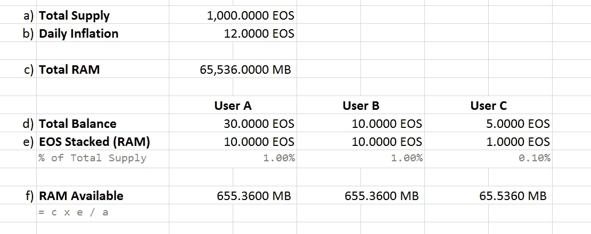
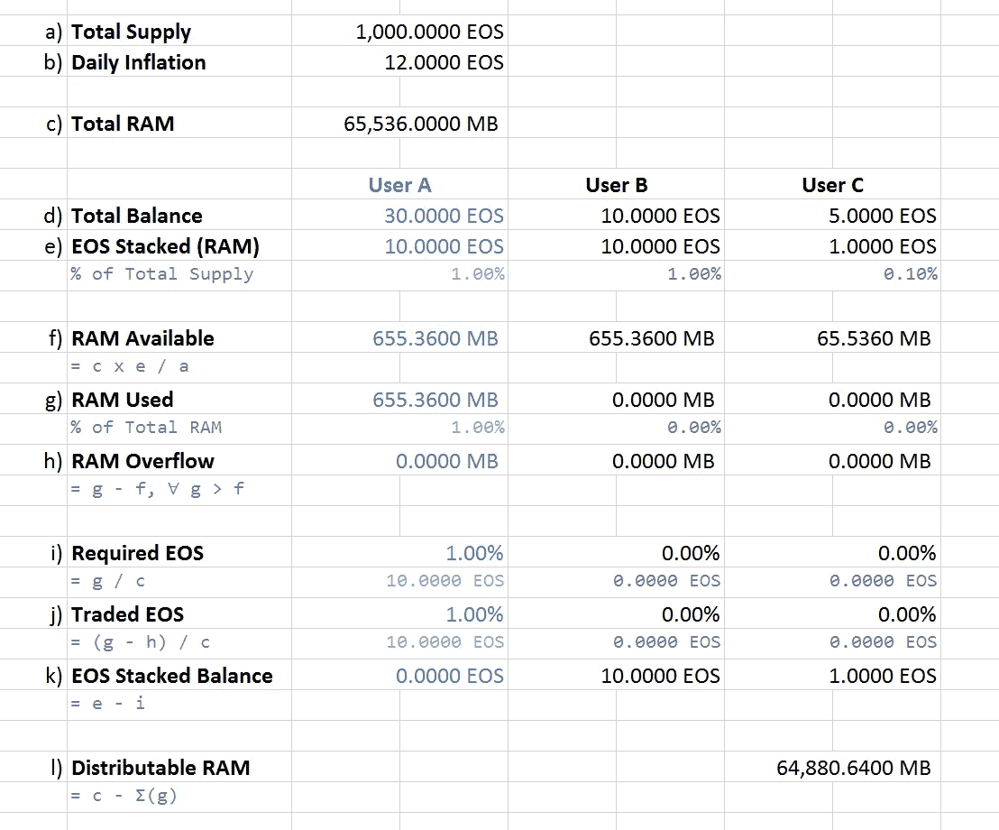
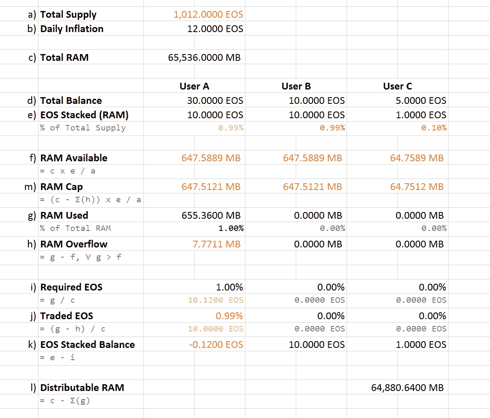
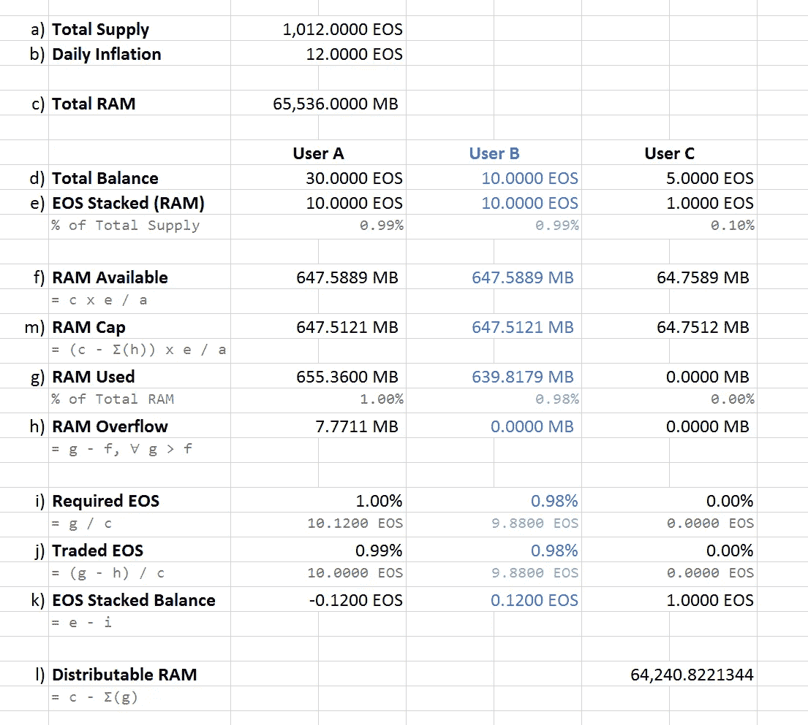
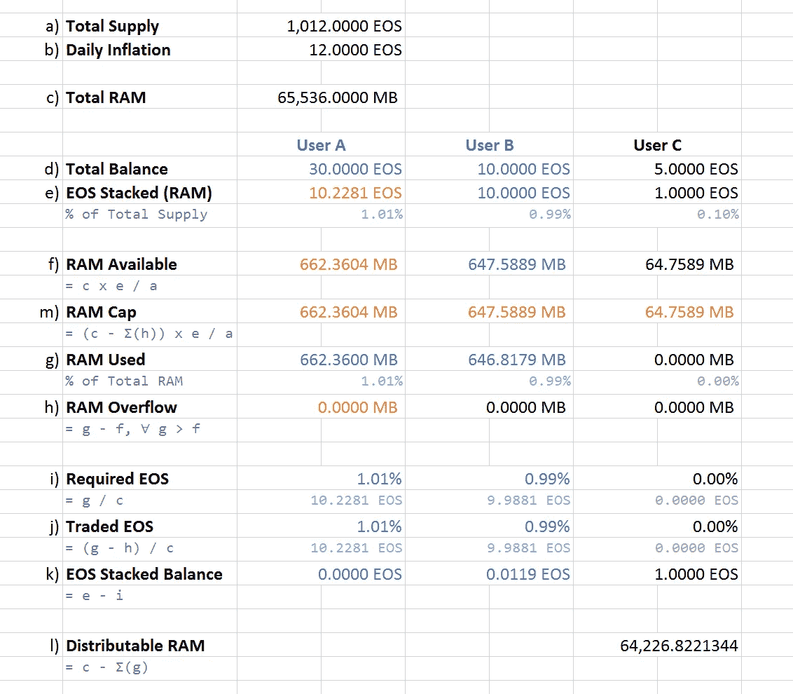
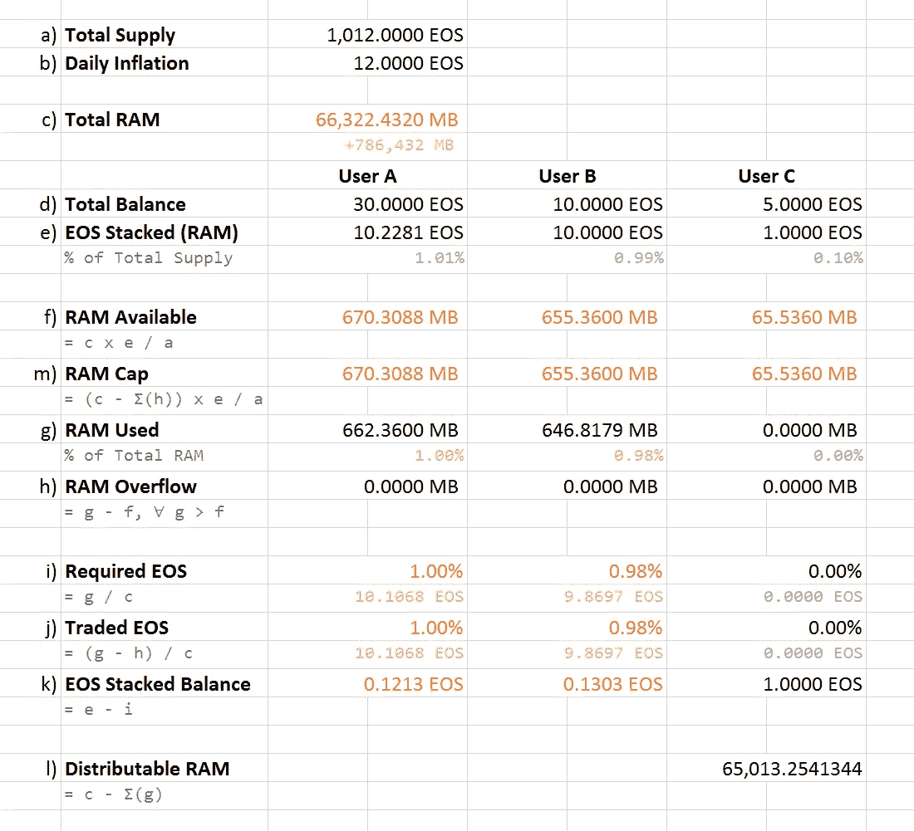

# 建议书—第 1 部分:不同的 EOS RAM 市场模型

> 原文：<https://medium.com/coinmonks/proposal-a-different-eos-ram-market-model-5b70dfca56ce?source=collection_archive---------4----------------------->

任何关于更好的解决方案的提议都应该从在当前现实的基础上建立有效的基础开始，这使我们能够过渡到一个新的模型，但是在客观地提出我们自己的观点的附加值和对给定主题的不同看法之前，质疑或反驳它的主导假设。此外，即使你对如何改进某件事有一个更广泛的了解，它也不应该与当前的现实相差太远，否则将旧事物与新事物联系起来的成本会非常高。但是你可以随时取笑。

因此，我将以此作为这一提案的开始，并请其他所有人跟随我的步伐，要么支持这一提案，要么以类似的方式积极质疑或在此基础上再接再厉。作为前奏，我将引用下面这段话:

> 因为单台计算机可用的 RAM 数量受到摩尔定律和其他技术进步的限制，所以 RAM 从根本上说是稀缺的。
> - [丹尼尔·拉里默](/@bytemaster/eosio-ram-market-bancor-algorithm-b8e8d4e20c73)

为了增加戏剧效果，试着用摩根·弗里曼口音在脑子里读上面的句子。现在，严肃地说:这是一个干净而聪明的介绍，传达了丹尼尔·拉里默在他的文章 [EOSIO RAM 市场& Bancor 算法](/@bytemaster/eosio-ram-market-bancor-algorithm-b8e8d4e20c73)中提到的 RAM 的价值和局限性。

# 神话

上面引用的问题是，它为文章的其余部分奠定了基调，就像丹尼尔提出并证明 RAM 管理和经济学模型的基础，但在我个人看来，这一点都不好。我说不好，不是因为我认为他提出的解决方案是无效的，而是因为**它限制了他和我们对这个资源**的看法。

**RAM 根本不稀缺**。它非常丰富，非常容易购买，非常容易升级，而且相对便宜，如果你考虑到第 58 位的 BP (block producer ),在撰写本文时，仅仅因为有足够的票数和处于待机状态，每天就可以赚到 118 EOS。顶级 BP 每天赚 965 EOS。而如今 1 EOS 的价值在 8 美元左右；想象一下，如果在不远的将来，EOS 的价格为 20、40 或 80 美元，那么添加物理 RAM 将是多么实惠。在丹尼尔的话中，我生动地强调了一点，即没有什么是免费的。

因此，在试图分配有限的网络资源时，Daniel 提出了不同的 CPU 和带宽管理及可用性解决方案，在我看来，这些方案都很巧妙。然而，由于 RAM 永久使用的要求，与 CPU 和带宽临时使用不同，它以不同的方式处理这种资源是有意义的，因为稀缺性可能会造成问题。我相信，我们都同意**稀缺性与资源成本**建立了，也应该建立一种直接的增长关系。

这里的谬误和食物短缺的论点是一样的。不可否认，食物仍然是第三世界国家的一个问题，尽管第一世界文明每天都扔掉成吨成吨的好的和未经加工的食物。食物真的稀缺吗？还是更多的是获取、生产和分配的问题？正如我们在比较不同国家时所承认的，相对而言，食物实际上既可以是稀缺的，也可以是不稀缺的，但从更绝对的角度来看，当等式中考虑到全球可获得性和浪费时，食物实际上一点也不稀缺。

所以，既然我们处在一个全球分散的网络中，让我们来权衡可用性和浪费。在一个 64GB 的网络中，其中 52GB 的内存已经被预留，但在撰写本文时，只有 1GB 的内存被实际使用，**是内存真的稀缺，还是其背后的经济模型推动了成本并助长了稀缺的谬论？**我的意思是可用内存是存在的:无论是否被实际使用，无论是否有人利用它们，64GB 对 BPs 来说都是一样的成本……那么，为保留而付费与为使用 RAM 而付费的真正价值在哪里呢？这与向系统添加 RAM 的实际成本有什么关系？

# 市场

与 Daniel 试图通过实施市场模型来定量分配内存资源和避免稀缺性相反，**稀缺性实际上是由市场本身创造的**，在这里内存被视为一种资产，而不是一种技术资源。

许多个人和“公司”最终在 RAM 上进行交易，最终不仅浪费了 51GB，而且实际消耗这种资源的成本以一种*愚蠢的曲线形状*增长，除了金钱以外，对任何人都没有实际好处。当只有 1.9%的保留 RAM(总 RAM 的 1.56%)被实际使用时，很明显**这种 RAM 管理模式是多么低效**。不是因为货币驱动是一个无效的前提，而是因为**资源未能实现其目的**。一个有 98%的资源仍然可用的世界看起来一点也不稀缺，不像一个有 81%的资源已经不可用而不管其使用情况的世界——然而我们在这里谈论的是同一个世界。

因此，在一个 RAM 是一种基本资源，其消耗可能会导致稀缺的世界中，如何管理这种资源呢？

自由市场模式显然不适合这里，因为这里没有竞争，供应是“政府发行”的。这相当于一个国家垄断者，他规定了 RAM 的可用时间和数量，没有给良性竞争留下空间。因此，一个没有竞争的自由市场不是一个自由市场，因为人们没有办法“去商店”购买 RAM 来运行自己的 dapps，我们可以将当前的解决方案更多地视为极权资本主义模式。这是整个事情崩溃并陷入投机领域的地方。

**荒谬的是确定食物是用来卖的而不是用来吃的**这和当前的 RAM 模型给 EOS 网络带来的结果是一样的:纯粹的经济价值。这并不是说食物没有成本，因此应该收费，但如果最终没有人吃它:为什么是食物？你也可以称 RAM 为其他东西，比如钻石、红宝石或宝石，因为 **RAM 作为一种资源显然不是作为系统增长的技术要求而服务于其根本目的**。

# 建议

对我来说，很明显，更好的选择是按使用量支付 RAM，不再有投机，RAM 的成本直接随着网络的内存需求而变化。这是一种公平的网络资源供应，谁先生产内容/价值，谁就为谁提供 RAM，并由通货膨胀、稀缺性和供应率自动调节。

过去的几十年为我们提供了许多关于有效替代资源管理模式的答案，从基于资源的经济学到基于使用的定价策略。尽管如此，我已经目睹了越来越多的针对 RAM 问题的复杂解决方案被讨论和提出，但仍然无法解决这样一个事实，即 **RAM 不应该是一种资产，而是一种技术资源**。

我想提出的基本建议非常简单明了:

*   **作为自然资源的 RAM** 作为自然资源的 RAM 应始终可用且可持续:过多的 RAM 对 BPs 来说不具成本效益；太少会损害系统。因此，应当以一致和可持续的方式生产/添加记录和档案管理及其分发。
*   **RAM 使用推动成本和供应** RAM 按使用量付费:使用越多，付费越多，而不是以投机市场价格付费保留 RAM。此外，使用的 RAM 越多，应该供应的 BPs 就越多，当需求增长超过供应速率时，成本就会上升，当供应增长超过使用率时，成本就会相应下降。

## 履行

临时 CPU/带宽使用和永久 RAM 需求之间的差异导致 Daniel 在这个资源方面追求一个全新的方向，实际上不需要以这样一种完全不同的方式来处理。

与用户为 CPU 和带宽使用情况设定 EOS 相同，用户也可以为内存使用情况设定 EOS，不同之处在于它们不会随时间恢复，而是以更持久的方式进行交易和锁定。

用户可以只为内存使用支付 EOS，而不是像目前的解决方案那样预留内存并为其付费。然后，当用户需要存储数据时，系统会根据可用内存所需的空间大小，自动将这些堆叠的 EOS 换成 RAM。如果用户想要删除或更改这些记录，可以用内存换回 EOS。如果用户用完了用于 RAM 的堆栈 EO，那么任何在系统中存储更多数据的尝试都将失败并抛出错误，迫使用户购买和/或堆栈更多 EO 来使用 RAM。

为了防止在任何给定时刻出现资源短缺，除了他持有和持有的 EOS 的同等比例或其他用户可能最终委托给他的份额之外，用户不应该能够为自己要求更多的 RAM*——这也是一个需要实现的补充解决方案。*默认情况下，将 EOS 总供应量的 1%用于 RAM 的用户不能获得超过 1%的 RAM 总量。如果一个用户由于通货膨胀而超出了他的 RAM 权限，那么为该用户获取更多 RAM 的成本就成比例地高于其他用户。这项措施创建了一个使用上限，允许每个人在需要时申请内存，并控制使用溢出的成本。

随着 RAM 添加到系统中，可用性增加，保存数据的成本下降，用户可以在 RAM staked EOS 中获得退款。为了保持一个健康的系统，增加内存的速度和频率不应该低于通货膨胀的速度和频率，这也允许一些可预测性。BP 只需要**跟上使用需求和通货膨胀，以减少债务/溢出，并允许网络的有机增长**。

如果这一切听起来有点难以理解，让我在下面为你画出来。

## 例子

**初始设置** 

**第 1 天**
用户 A 使用 10 EOS 的 RAM = 655.36MB。

**第 2 天—第 1/4 步** 总 EOS 供应量增加，每个用户的可用 RAM 下降，RAM 溢出限制总可用 RAM。

**第 2 天—第 2/4 步**
用户 B 使用 9.88 EOS 的 RAM = 639.8179MB。

**第 2 天—第 3/4 步**
用户 A 和 B 各需要 7MB 以上的 RAM，用户 A 的 RAM 比用户 B 的更贵，用户 A 需要为 RAM 投入更多 EOS，RAM 上限随后取消。

用户 B 只为+7MB 的内存支付了 0.1081 EOS，而用户 A 为同样的+7MB 的内存支付了 0.2281 EOS，因为他负债累累。通过这种方式，如果用户 A 占用了更多的 RAM，而这些 RAM 本来是其他用户可以使用的，但却没有为之付出代价，那么用户 A 增加更多 RAM 的成本就会增加。

**第 2 天—第 4/4 步**
更多的 RAM 被释放到系统中，用户有权使用更多的 RAM，并在 RAM staked EOS 中按比例获得退款，因为将数据保存在内存中的成本下降了—更多的供应。

在某种程度上，你可以说 RAM 资源不是像 CPU 和带宽那样随着时间释放的，而是随着系统可用性释放的。

所有这些**保证了总有空闲内存可用，消除了从 RAM 本身到 EOS 令牌的推测(这很好！)并且 RAM 价格和可用性在常规基础上保持稳定。**

继续阅读:[提案—第 2 部分:EOS RAM 市场动态](/@filipe.alonso/proposal-part-2-eos-ram-market-dynamics-4a16ca13844e)。

*版权和归属是隐含的。*