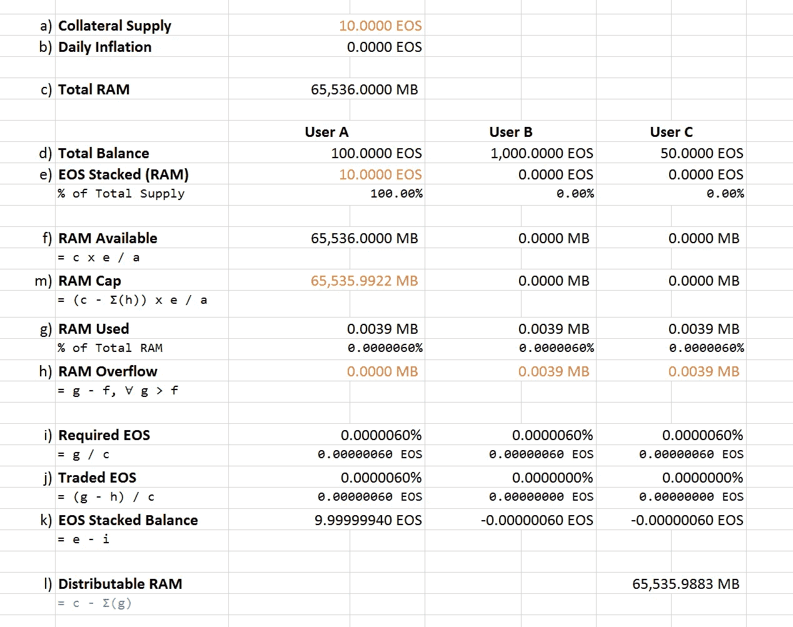
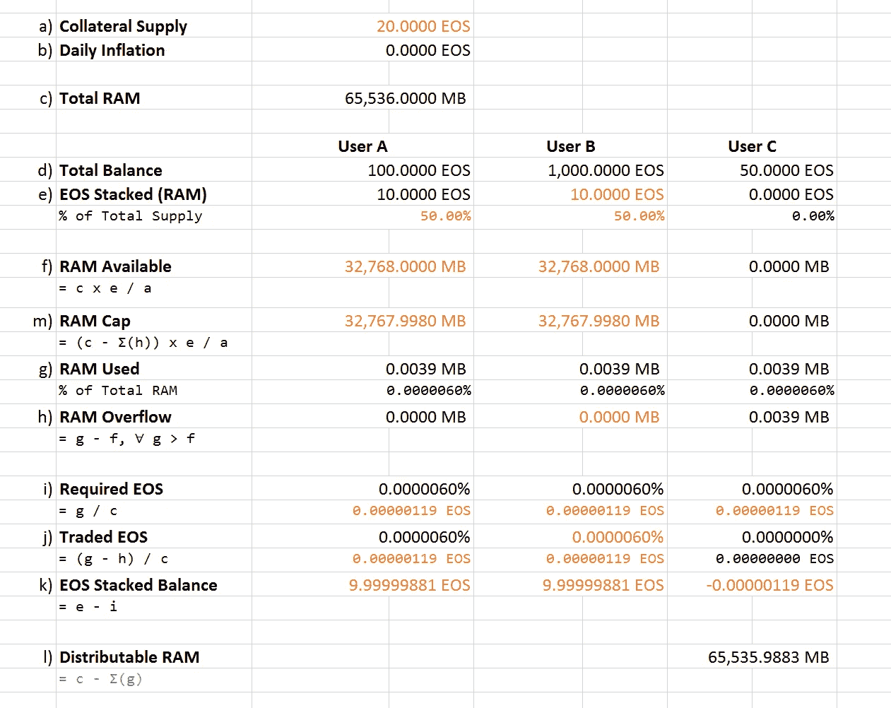
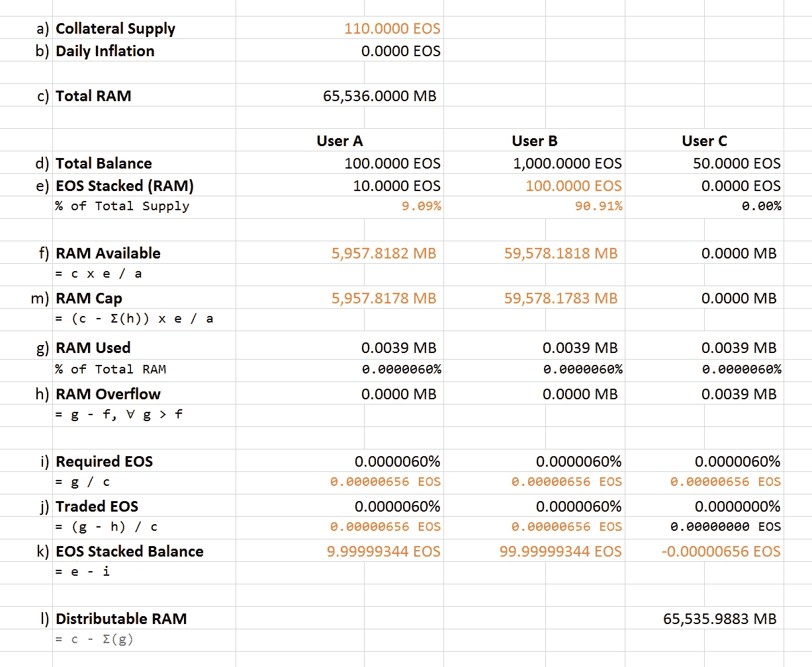
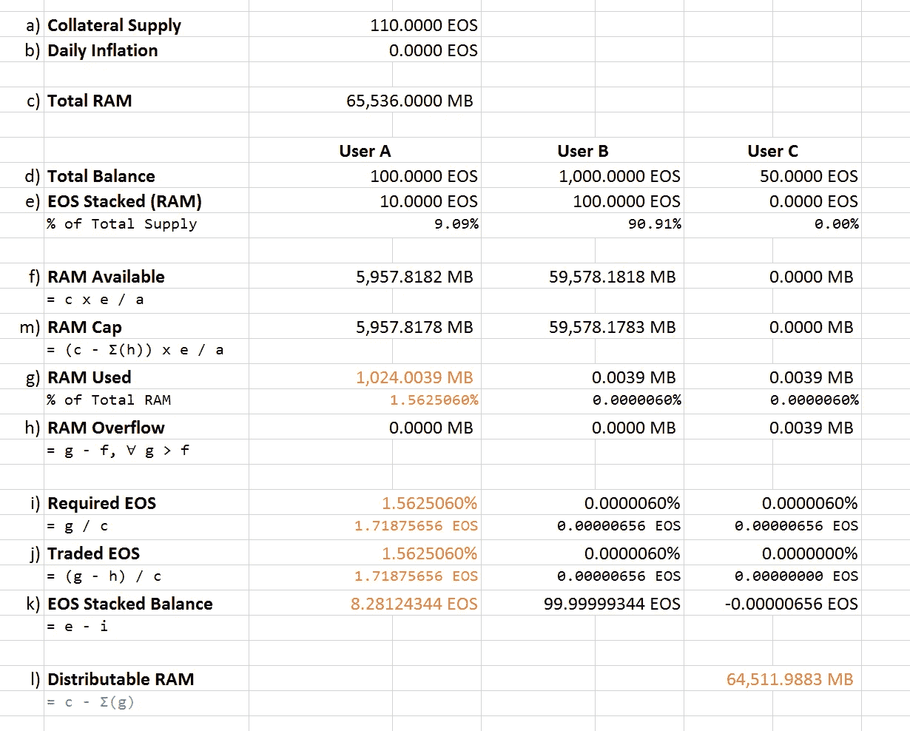
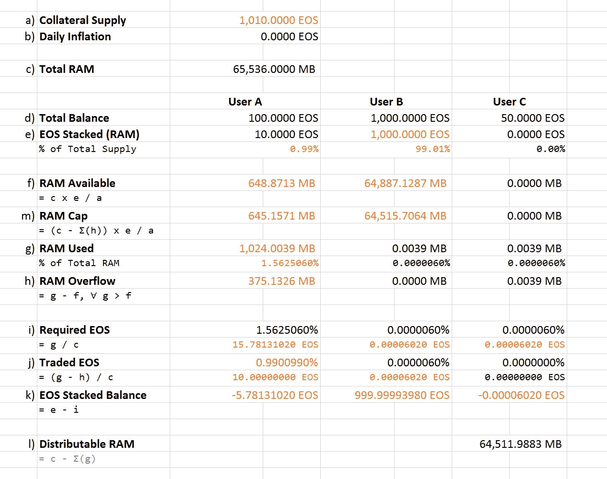
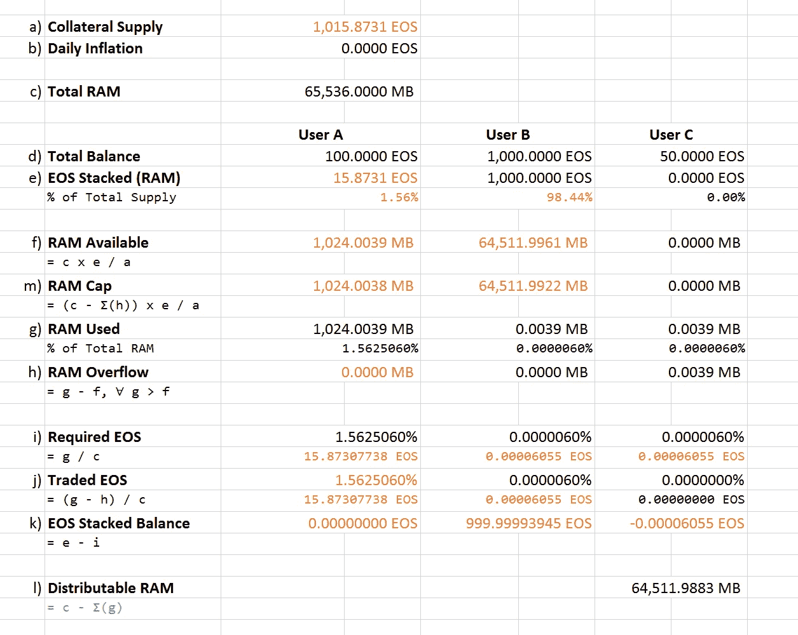

# 建议书—第 2 部分:EOS RAM 市场动态

> 原文：<https://medium.com/coinmonks/proposal-part-2-eos-ram-market-dynamics-4a16ca13844e?source=collection_archive---------12----------------------->

如果你还没有阅读我的提案的第一部分，标题是 [*《提案——第一部分:一个不同的 EOS RAM 市场模型*](/@filipe.alonso/proposal-a-different-eos-ram-market-model-5b70dfca56ce) ，请先阅读它，这样你就可以理解了。

当我在之前的帖子(上面的链接)中介绍一个提议时，我说我会戏弄。我还说，即使一个人对如何改进某件事情有更广泛的了解，也不应该延伸得太远，以免冒把新旧桥梁连接起来的成本推得太高的风险。这是第二步。

在第一部分中，我向您介绍了 EOS RAM 管理的一个不同的工作市场模型，它大致向您展示了如何根据供应和份额(staked EOS)生成和分配 RAM 可用性，通货膨胀和通货紧缩如何工作并为模型带来一些可持续性和可预测性，它们如何影响成本和溢出(债务的另一种说法)，以及它如何仍然保证自由内存，消除 RAM 中的投机并帮助稳定市场。

现在让我们再接再厉，好吗？

# 假设

假设我们以 1 0 亿台 EO 的总供应量开始我们的 mainnet。用 64GB 引导系统意味着可用性设置为每 1 EOS 0.067108864 KB。但是每个帐户至少需要 4KB，这意味着任何帐户至少需要持有 59.60 EOS 才能在这些前提下生存。这也意味着 3.73 TB 应该是最小的系统 RAM，这样每个帐户开始时只需要保存 1 个 EOS，不能再多了。但是 1 EOS 实际上不是一个人可以持有的最小单位或数量，0.0001 EOS 是:所以 36.38 PB 实际上是一个用户和每个可能的用户需要的最小系统 RAM，以便能够用可能的最小 EOS 量创建一个帐户。哇！

显然，这些初始内存要求似乎没有得到很好的考虑，即使是新提出的模型，乍一看，当考虑最低网络要求和 EOS 供应之间的比例作为 RAM 的可分配抵押品时，也不会立即满足。

无论如何，RAM 的当前市场模型对于可以创建的帐户数量是有限的:16 777 216 是我们可以用 64GB 内存(每个 4KB)创建的最大帐户数量，并且这是假设所有内存都被分配用于帐户创建。这意味着，无论流通中有多少 EOS，最大供应量不一定直接由 EOS 本身决定，而是由账号和规模决定，因此会影响我们对 RAM 分销的附属参与。

让我解释一下。

如果我们最大化 64GB 并创建 16 777 216 个账户，每个账户 4KB，因为这是每个账户所需的最低内存(从我提出的模型中我们知道 RAM 交易与总供应量相关的特定抵押的百分比),每个账户将以-59.6 EOS 债务开始 RAM 抵押余额(使用 4KB 的成本),而不管每个用户持有多少 EOS 未抵押。

想象一下，就像每个可能的用户在开始时仅仅因为拥有一个帐户而溢出 RAM，剩余的可用 RAM 被限制在 0MB，直到人们开始实际使用/购买 RAM。这又是一个最大的容量。系统会完全崩溃。

因此，每个人都有一个帐户，但被限制在他们可以声称使用多少 RAM 更不用说所有额外的 EOS 仍然需要 CPU 和带宽。如果用户需要更多内存来运行 dapp，那么首先必须偿还债务，这将向系统释放上限内存，然后根据自己的需求和系统可用性支付使用更多内存的费用——当没有剩余内存时。

现在让事情变得更有趣:由于我们在当前系统中仍有大量(98%)可用的 RAM，我们不应该需要升级到 36.38PB 的 RAM 来将帐户创建成本降低到 0.0001 EOS(那会有多少未使用的空间！)，鉴于 EOS 并不直接转化为 RAM 可用性，并且由于帐号和大小实际上决定/限制了 RAM 的使用…为什么要预先保留系统中所有可用的 RAM，并按比例分配给每个已发布的 EOS？

对于许多人来说，这就是问题的开始，他们不自觉地在假设 RAM 必须作为所有流通 EOS 供应的函数来分配的情况下考虑问题。RAM 将从一开始就被保留，并直接嵌入到现有的每一个 EOS 单元中。从几乎每一个流通的 EOS 中提取 RAM 的**成本显然是巨大的，如果一个人不得不从他拥有的所有东西中吸取 RAM，甚至更多，仅仅是为了满足高内存需求，例如空投。**

> 与 eos Dublin 提案相同的问题:对于 64gb ram，我需要 575，000 美元来为一次简单的空投保留内存。太贵了

如果你坚持认为抵押品必须来自网络中发行和流通的 10 多亿份 EOS 中的每一份，那么你是对的:我画的市场模型似乎不再可行。但是没有一个功能模型能做到。

在我在建议书第一部分写的示例中，我使用了 1000 个 EOS 作为 RAM 抵押品的总初始供应量，这证明了该示例的要点。然而实际上，EOS mainnet 的初始供应量更像是 10 亿；这改变了一切，是吗？

好吧，让我们回顾一下:提出的模型要求我们使用总供应量的*某物*作为 RAM 交易的抵押品，并且用户能够通过下注他能够负担得起并且想要的抵押品来要求他的权利，但是其限制是由他实际持有的与相同的*某物*的总供应量相关的多少抵押品来定义的。它还引入了膨胀和收缩作为内存使用和可用性的控制机制。

# 隧道

但是，如果我们不考虑将 EOS 的总发行量作为 RAM 发行的抵押品，情况会怎样呢？如果通货膨胀不随今天作为奖励发行的新 EO 的数量而变化，如果 BP 不需要“一直”购买/释放内存来紧缩市场(正如一些人担心的那样)，会怎么样？

让我们从 EOS network 的 genesis 创建的 163 930 个帐户开始考虑。以 4KB 的成本，我们总共需要发行 640.3515625 MB 的债务来启动系统。当系统从一开始就有 64GB 的可用内存时，这大约是总负债的 0.9771%。

抵押品呢？好吧，让我们从没有抵押品开始。如果担保品的总供应量为 0，那么该担保品的 0，9771%债务也为 0。这是否意味着创建 163 930 个帐户的成本为 0？不，这意味着在引导时发布 RAM 来创建那些初始账户**的成本是 0，因为还没有人在交易 RAM **和**。一旦系统启动，人们想要创建更多的账户，那么必须有人开始购买 RAM 来这样做，从而定义一些抵押品来交易和偿还债务。**

通货膨胀和通货紧缩呢？很明显这些也是从 0 开始的。此外，此时向系统添加 RAM 只会改变总负债占可用 RAM 的百分比，甚至不会改变已用空间本身，这显然是相同的。不管怎样，64GB 实际上并不算多，但无论如何…

好的，那么为了开始购买或交易 RAM，我们应该如何定义抵押品呢？

# 光线

## 抵押品

假设您想开始购买 RAM 来使用，并决定为此目的投资 10 台 EOS。因为你是第一个这样做的人，所以到目前为止，你是唯一一个为你想使用的 RAM 提供抵押品的人。这 10 个 EO 将定义您在总供应量中的实际份额，并且碰巧与目前的总供应量相同——我们不知道是否还有人想要购买 RAM，对吗？

Due to the small quantities being considered for this example I increased the number of decimal places, so that the values are a bit clearer. I also renamed Total Supply to Collateral Supply in order to avoid misinterpretations.

等等！RAM 上限值是否正确？我(用户 A)能够购买 10 个完整的 EOS，只剩下所有可用的 RAM 吗？从某种意义上来说，是的，但是赌注意味着你声明打算让 RAM 可供你使用(你不赌注 EOS 直接购买 RAM，记得吗？)到目前为止，您是唯一一个对使用 RAM 感兴趣并通过引入 EOS 作为抵押品来声明它的人。

好吧，那么如果用户 B 看到了这一点，他也想下注 10 EOS，以便有 RAM 可供他使用呢？

现在，整个可用 RAM 在用户 A 和 B 之间平均分配，因为他们都支付了相同的抵押品，并持有该抵押品的 50%股份。突然间，拥有一个账户的成本或债务增加了一倍——现在人们对 RAM 的兴趣增加了一倍。用户 A 的赌注余额减少了，但是用户 B 也必须支付相同的金额来获得他的公平份额。

如果用户 B 突然决定提供更多的抵押品，因为他认为他将需要使用 50%以上的可用内存，或者只是因为他是个混蛋，希望用户 A 有权获得更少的内存，该怎么办？

我们可以再次看到，持有账户的成本变高了，不仅是用户 A，用户 B 也是如此。一方面，用户 B 决定将更多 EOS 作为抵押品，但另一方面，如果他不使用空间，他只是提高了 RAM 的相对成本，包括他自己。

好的一面是，成本是以抵押品供应的百分比来衡量的，因此，如果后来用户 B 决定不再提供这么多 EOS 作为抵押品，成本实际上会更低，每个人都无需做任何事情就可以自动获得补偿。这样，直接推测内存价格是没有意义的，因为价格不是固定的，而是可变的/相对的。

只是出于好奇:如果创建的每个 genesis 帐户(163 930)只持有 1 个 EOS 作为 RAM 的抵押品，假设他们都实际上拥有它——他们没有——持有一个帐户的初始成本不会高于 0.0098 EOS，每个人都有权从一开始就获得 0.3998 MB 的可用 RAM，而系统中没有任何债务。

但是，如果我们将 307，000，000 份 EO 视为抵押品供应总量(大约与撰写本文时投票中使用的 EO 数量相同)，则一个账户将花费 18 份 EO。等等，什么？？是的，只有 64GB，而整个 EOS 世界有 30%的人想要使用 RAM，这将暗示您，也许如此高的需求需要 64GB 以上才能正常工作，不是吗？仅仅通过将系统内存增加到 2TB——对于如此高的网络内存需求来说，这仍然不算多——一个账户的成本将下降到 0.57 EOS。乌夫！！在这种情况下，如果每个人都至少持有 1 份 EOS 作为抵押品，每个人都会得到 7KB，这比大多数人当前使用或需要的要多，而且系统中也不会有债务。

## 使用和债务

继续:假设用户 A 最终需要使用一些 RAM，因此他变得贪婪，从系统中可用的 64GB 中拿走 1GB，尽管他实际上总共有权使用大约 5.82GB 毕竟还没有多少人对 RAM 感兴趣并为其提供抵押品。在目前的情况下，这应该会使他的抵押品成本增加约 1.5625%，在这种情况下，这相当于从他的持仓余额中交易了 1.71875 份 EOS。

突然，大坏蛋用户 B 决定押上他的所有余额(1 000 EOS ),由于他是为 RAM 提供最多抵押品的人，他现在有权获得 RAM 的 99%,包括用户 A 在贪婪情绪期间决定使用的部分。

由于这个原因，用户 A 现在负债了，因为，他拿走了太多宝贵的可用系统资源 RAM，而最终却没有拿出足够的抵押品来要求这么多，相比之下，其他用户很快就准备好这么做了。

虽然用户 A 没有丢失他已经使用的 RAM，但是如果他想要购买更多的 RAM，那么与其他人相比，他现在的成本会高得多，因为他必须首先偿还债务，然后再加上他想要使用的 RAM 的成本。他也可以选择通过删除一些记录，将一些内存释放回系统，这样他就不再负债了。

假设用户 A 实际上想要支付额外的内存，他不仅要下注并支付大约 5.7813 EOS 的债务，而且因为下注更多 EOS 会增加 RAM 的成本，最终他将不得不花费比这多一点的钱，准确地说是 5.8731 EOS，以便完全摆脱他的债务。

因此，我们看到，要求或押注过多或过少的抵押品可能有点像是一场游戏，但当使用推动供应时，所有力量最终都会相互平衡。因为在投机中根本没有利润，所以 RAM 成本总是相对的:没有人会从使用(购买)或“不使用”(出售)RAM 中获得任何好处，除非他们确实需要。

## 通货膨胀和通货紧缩

通货膨胀呢？这是为了什么？我们真的需要它吗？如前所述，这些是内存使用和可用性的控制机制，以及 RAM 生产，我将解释如何和为什么。

在上一篇文章中，我给了你一个每日通货膨胀总是正的和恒定的例子:每天有 12 个 EOS 加入抵押品供应。现在想象一下，与你可能假设的相反，通货膨胀不是来自 BP 声称的回报，而是来自网络对内存使用的兴趣/需求的波动，通过增加/减少抵押品。

为什么

在我去之前:想象一下，用户 A 和用户 B 是 163 930 个用户中第一个在启动时访问网络的，尽管后来当每个其他用户也想提供抵押品并要求使用内存时，他们冒着陷入债务的风险，但他们继续并下注他们的 EOS，并立即使用尽可能多的系统可用内存，因为在其他用户出现在聚会之前，他们实际上有权使用全部内存。

你会问，如何防止这种情况发生？这就是通货膨胀/通货紧缩机制发挥作用的地方。

与 CPU 和带宽在 3 天后恢复的方式类似，RAM 的附加和取消附加也需要 3 天后才可用，用户可以做任何其他事情。

你可以把它想象成限制用户一次可以买入/卖出多少，以避免价格泵和价格转储，它们除了迅速过度买入和收缩系统之外什么也不做——因为价格总是相对的。还可以认为，公开宣布对 RAM 的兴趣(将 EOS 作为抵押品),并允许其他人在任何人争相要求过多 RAM 之前也宣布他们的兴趣，就像上面贪婪的用户 A 一样，而不给其他人这样做的机会。

它到底是如何工作的？

所以，用户 A 想用内存，押 10 EOS。这 10 个 EO 将不会立即可供他使用(使 RAM 可用需要时间)，而是在 3 天后。与此同时，这 10 个 EOS 通过通货膨胀以每秒约 0.00003858 EOS(10/259 200 秒)或每天约 3，3333 EOS(10/3)的速度添加到抵押品供应中。换句话说，尽管用户还无法获得押记的 EOS，但总抵押品供应仍以该速率增加。

现在用户 B 看到通货膨胀不再为 0，这意味着有人对使用 RAM 感兴趣，并愿意为此提供抵押品。由于用户 B 也对使用 RAM 感兴趣，他决定下注 100 EOS。同样，这 100 个 EOS 只能在 3 天后他的抵押余额中使用，但现在通货膨胀增长到每天约 36，6666 EOS 或每秒约 0.00042438 EOS。

> σ(过去 3 天的抵押)/ 259 200 秒

3 天后，用户 A 和用户 B 都获得了各自的押记 EOS 作为抵押余额，并且可以开始使用向他们提供的内存。此外，由于没有其他人在此期间将更多的 EOS 作为抵押品，通胀率现在再次为 0，抵押品总供应量为 110 EOS。

通缩(或负通胀)怎么办？

嗯，用户 B 实际上认为 100 EOS 是太多的抵押品，并决定撤回/取消 60 EOS，只留下 40 EOS。因此，这 60 EOS 立即从他的赌注余额中删除，但他还不能使用，因为还需要 3 天才能将它们恢复到他的钱包中。

然而，当用户 B 取消这 60 个 EOS 时，通货膨胀率变为每秒-0.00023148 EOS 或每天-20 EOS。3 天后，用户 B 将 60 EOS 贷记回他的钱包，通货膨胀率再次为 0，前提是在此期间没有人对抵押品进行抵押或未抵押，RAM 的总抵押品供应为 50 EOS (10 来自用户 A，40 来自用户 B)。

因此，通货膨胀总是通过在过去 3 天里有多少 EOS 作为 RAM 的抵押品被持有和未持有来衡量。

> σ(**最近 3 天有押**抵押品— **最近 3 天无押**抵押品)/ 259 200 秒

如前所述，这种机制为 RAM 市场提供了一定的可预测性和稳定性，也给了 BP 一些时间来作出反应和调整，如果需要的话，以适应为了保持健康的网络需求而增加更多 RAM 的情况。

此外，至少有 6 天(3 天下注，3 天解套)不能从钱包中获得 EOS，这应该会阻止人们玩游戏，并坚持根据他们的内存需求管理抵押品，以应对网络对 RAM 使用的全球兴趣。

## 委派内存

我在上一篇文章中暗示的另一个选择是用户之间互相委托 RAM 的可能性。这是互补的，不一定是模型的一部分，虽然可以给它带来一些好处。

考虑到膨胀/收缩的控制机制所强加的时间，以及最终突然需要访问内存和 fast，允许用户委托 RAM，为游戏带来了 RAM 的流动性。用户可以临时从另一个帐户请求或转移已经可用的 RAM 给自己，直到他作为抵押品的新 EOS 可以使用他需要的额外 RAM。

此外，例如空投的费用不一定完全由代币发行者承担。出于令牌分发的目的，发行者也可以在合同中要求用户将内存委托给他们。它仍将被视为空投，而不是 ICO，类似于让用户不为令牌本身付费，而是为 ETH 中的汽油付费，以支付接收令牌的交易成本。

## 公羊生产

RAM 生产是指在系统中添加/释放内存的行为。这可以通过直接向网络提供系统中所有可用的物理 RAM 来一次完成，也可以通过以一种可预测且大多数 BPs 同意的方式逐步释放 RAM 来分批完成。

由于这种市场模式中的成本总是相对的，生产 RAM 会使系统看起来像突然放气，尽管它最终并不真正重要，因为它不会直接影响 RAM 的使用，而且成本也不会受到间接投机的影响——是使用推动了供应。

因此，RAM 生产的功能仅仅是为网络提供足够的资源，使其以可持续的方式发展。

与可以通过膨胀和收缩根据存储器需求增加和减少的附属供应不同，RAM 生产可以而且应该仅仅因为与空间使用相关的明显原因而增加。

# 窗帘

理解提出的模型和机制是两回事。在我看来，重要的是让假设发展，以便质疑和讨论它们，将不同的观点带入场景，然后为新的解决方案铺平道路。这是我想带给社区的一个新的解决方案。

尽管读了很长时间，如果没有其他原因，我希望它让你质疑我们有时想当然的东西，那只不过是建立在其他有效但不同基础之上的假设。

该提案旨在**给予 RAM 作为技术资源**而非经济资源/资产应有的考虑。我们就这样对待它吧。谢谢你的时间。加油 EOS！

*版权和归属是隐含的。*