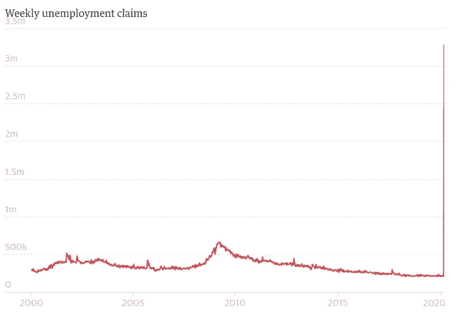

# 在 Uniswap 上提供流动性

> 原文：<https://medium.com/coinmonks/providing-liquidity-to-plutus-on-uniswap-8a318963d59c?source=collection_archive---------1----------------------->

随着冠状病毒肆虐全球经济，美国的失业率达到历史最高水平。这让大萧条时期的数据相形见绌。

Guardian graphic | Source: US Department of Labor

越来越明显的是，世界各国的央行正打算通过印钞票来摆脱这场迫在眉睫的危机。

因此，它也变得越来越重要的个人控制自己的财务未来…