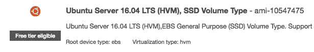
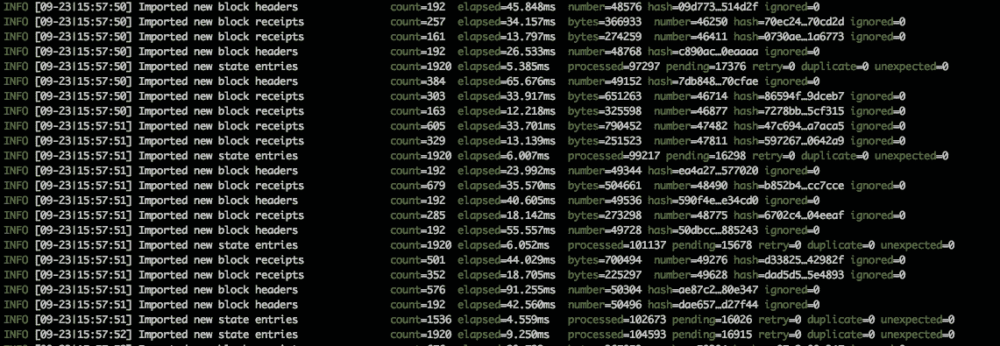
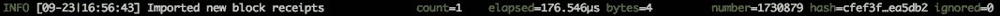

# 为 Geth 设置 AWS EC2 实例

> 原文：<https://medium.com/coinmonks/provisioning-an-aws-ec2-instance-for-geth-730c23767a4e?source=collection_archive---------0----------------------->

当您准备开始编写智能合同时，您需要做的第一件事是设置您与以太坊的网络连接。这通常就像安装和运行 Geth 一样简单。在这次探索中，我将在 AWS 中构建一个默认的 Ubuntu 实例。



接下来，我们将登录并运行任何需要的更新:

```
sudo apt-get update 
sudo apt-get dist-upgrade -y 
sudo apt-get upgrade -y
```

我们可能还需要安装一些构建工具:

```
sudo apt-get install build-essential -y
sudo apt-get install python -y
```

接下来，我们安装 Geth:

```
sudo apt-get install software-properties-common 
sudo add-apt-repository -y ppa:ethereum/ethereum 
sudo apt-get update 
sudo apt-get install ethereum -y
```

然后，我们在测试网上启动 Geth:

```
geth --testnet \
 --syncmode=fast \
 --rpc--rpcapi="db,eth,net,web3,personal"
```

(确保端口 8545 没有在您的安全组中打开，因为这会暴露 RPC 接口。)

Geth 将开始与区块链同步:



最后，在下载区块链几个小时后，您的 Geth 客户端将开始一次同步一个块:



要了解如何连接 Geth、创建帐户和发送以太坊，请继续阅读[以太坊网络互动](https://concurrence.io/exploration/ethereuminteraction/)部分。

> [在您的收件箱中直接获得最佳软件交易](https://coincodecap.com/?utm_source=coinmonks)

[](https://coincodecap.com/?utm_source=coinmonks)

这篇文章摘自[的](https://concurrence.io/exploration/provisioning/)条款。

要了解更多关于并发 Oracle 网络的信息[，请点击此处](https://concurrence.io)。