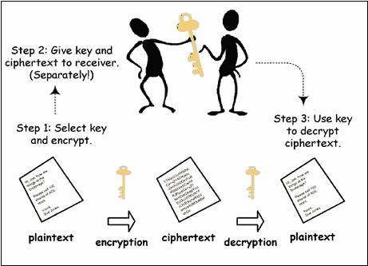
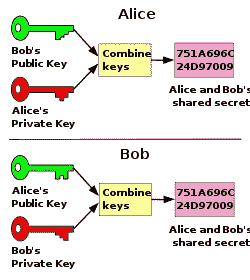

# 公钥加密和数字签名。

> 原文：<https://medium.com/coinmonks/public-key-cryptography-and-digital-signatures-6d81a06c15c4?source=collection_archive---------0----------------------->

在最后一个帖子里， [Merkle Tree 101！](/@srivastava.arpan2411/merkle-tree-101-a3ca025dc318)我们讨论了区块链如何处理数据的不变性。在这篇文章中，我们将进一步讨论它是如何处理信息交换的。但是为了达到这一点，我们需要先吃青蛙。所以，我们会从底层开始，努力达到顶峰。那么，我们先来说说公钥密码学。

**对称密钥加密:**

*   在对称密钥加密中，我们使用相同的密钥加密明文和解密密文。
*   下图说明了对称密钥加密的过程。



Symmetric key encryption

*   **那么，有什么问题呢？嗯，问题是要么你把钥匙写在纸上，然后寄给其他人。但是，这显然不是一个有效的方法。因此，您通过网络共享密钥，但问题是，任何不想要的身份都可以侵入网络，并使用您的密钥来解密消息。**

# **公钥加密拯救世界:**

*   在公钥密码学中，我们生成一对密钥，即私钥和公钥。
*   公钥和私钥在数学上是相关联的，但不能相互推导。
*   公钥就像分配给你的一个伪名，你与每个人共享它，而私钥“代表你”。
*   所以，它是这样工作的。你接收一条信息，用你的私钥加密，然后发送给接收者。现在，接收者可以使用您的公钥解密它，并验证消息是否来自合法的发送者。
*   所以，你一定在想，如果每个人都有我的公钥，任何人都可以看到消息。所以解决方法是这样的。



Public key Cryptography

*   现在假设爱丽丝和鲍勃想在互联网上分享一些信息。因此，它们生成自己的一组公钥和私钥。
*   他们都互相交换他们的公钥，并且自己保存他们的私钥。Alice 使用 Bob 的公钥和 Alice 的私钥向 Bob 发送加密的消息。
*   现在，当 Bob 接收到消息时，他使用 Alice 的公钥来确保消息来自 Alice(只有 Alice 的公钥可以解密使用 Alice 的私钥加密的消息),并使用他的私钥来确保消息是为他发送的。

# **我们来讨论一下数字签名**

*   签过支票吗？所以，你必须意识到签名的概念。它们充当您同意您签署的文档的证明，并且它与该特定文档相关联，不能复制粘贴到其他文档。

> *根据维基百科:*
> 
> 数字签名是一种表示数字消息或文档真实性的数学方案。有效的数字签名使收件人有理由相信消息是由已知的发件人创建的(身份验证)，发件人不能否认已经发送了消息(不可否认)，并且消息在传输过程中没有被更改(完整性)。

因此，数字签名包含三个步骤:

*   **GenerateKeys** :首先我们生成一对公开密钥(pk)和秘密密钥(sk)。SecretKey 用于签名，public key 用于验证签名者。

```
(sk,pk):=generateKeys(keysize in bits)
```

*   **签署消息:**然后我们使用秘密密钥签署消息。

```
sig:=sign(sk,message)
```

*   **验证:**我们现在可以验证发送者了。

```
isValid:=verify(pk,message,sig)==true 
```

**数字签名的优势:**

*   签名不能被伪造和用于其他消息。
*   密钥不能从公钥派生。
*   我们可以很容易地验证消息在传输过程中是否被修改过。

# 区块链的东西

所以，现在我们终于到达了顶峰，有了足够的知识来理解区块链是如何把这些碎片拼在一起的。

**公钥加密和区块链**

*   钱包创建和交易签名是任何区块链系统的核心组件，在很大程度上依赖于公钥加密。
*   公钥与哈希函数一起用于创建区块链用户用来接收和发送消息的公共地址。
*   私钥是保密的，用于签署数字交易，以确保交易的来源是合法的。

**数字签名和区块链**

*   每笔交易都有不同的数字签名，这取决于用户的私钥。
*   给定消息、公钥和用户的签名，很容易验证用户的真实性。
*   一旦用户签署了交易，交易就在存储器池中等待，在存储器池中，矿工挑选交易并使用用户的公钥来验证交易上的数字签名，使得黑客无法对所进行的交易进行更改。如果它是有效的，数字签名被验证，钱被从一个钱包发送到另一个钱包，并且交易被添加到块中。

> [直接在您的收件箱中获得最佳软件交易](https://coincodecap.com/?utm_source=coinmonks)

[](https://coincodecap.com/?utm_source=coinmonks)