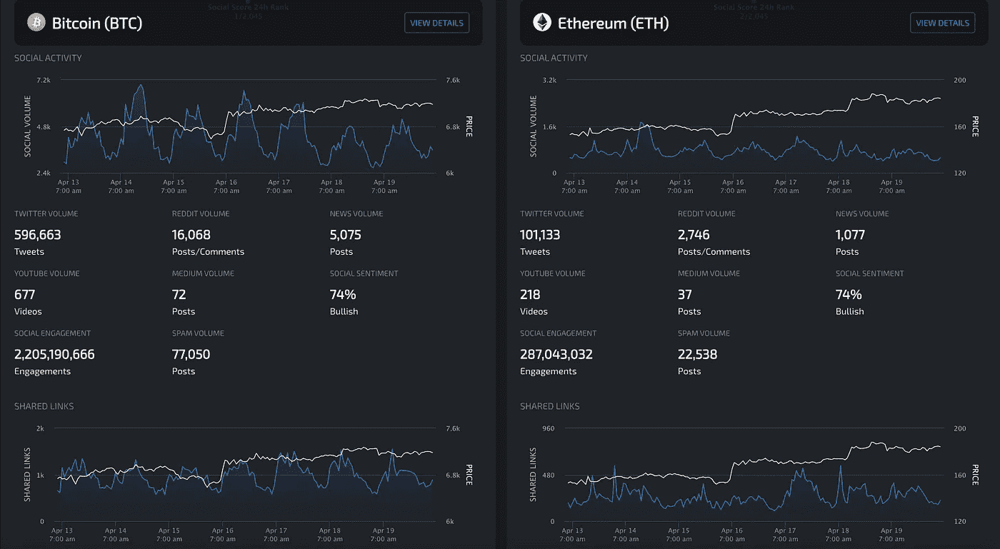
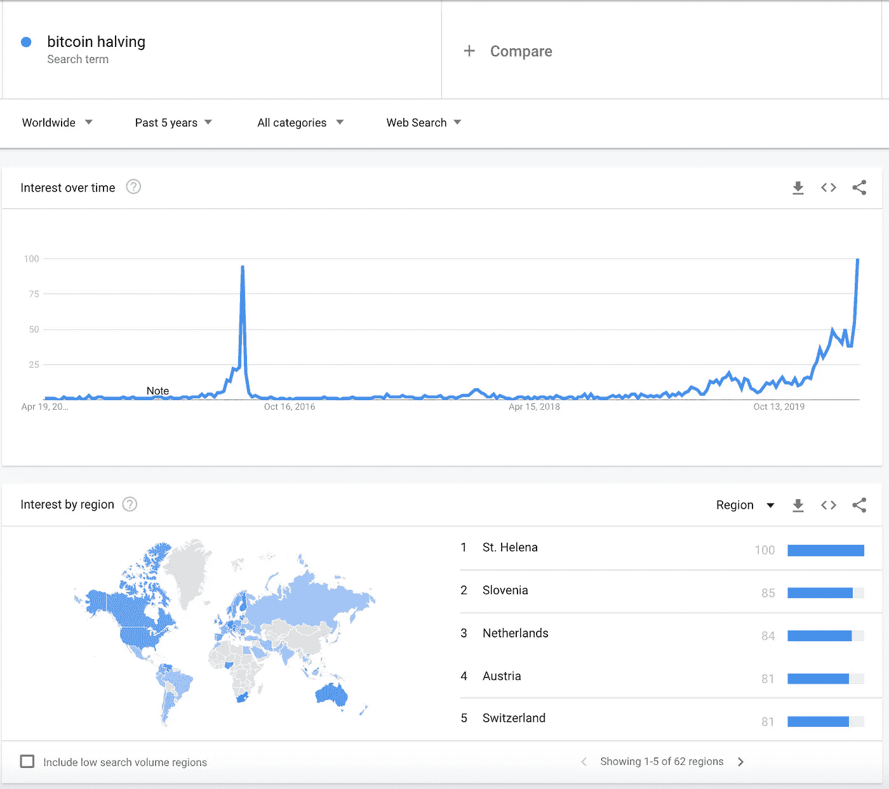
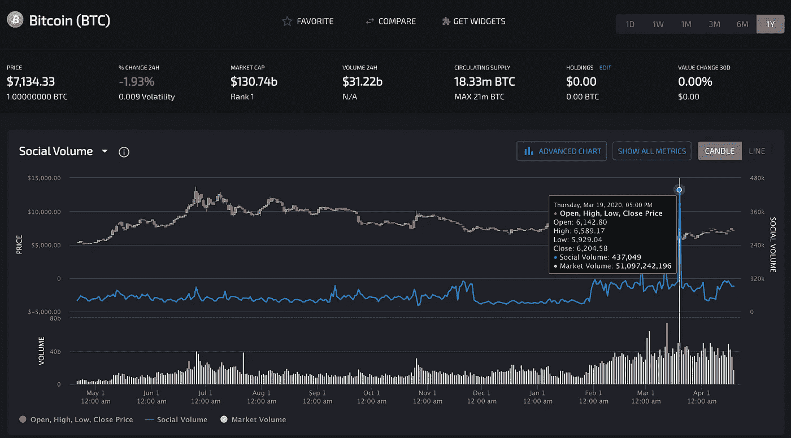
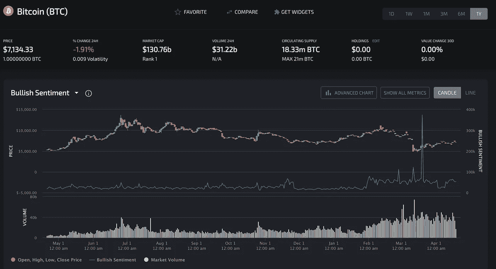
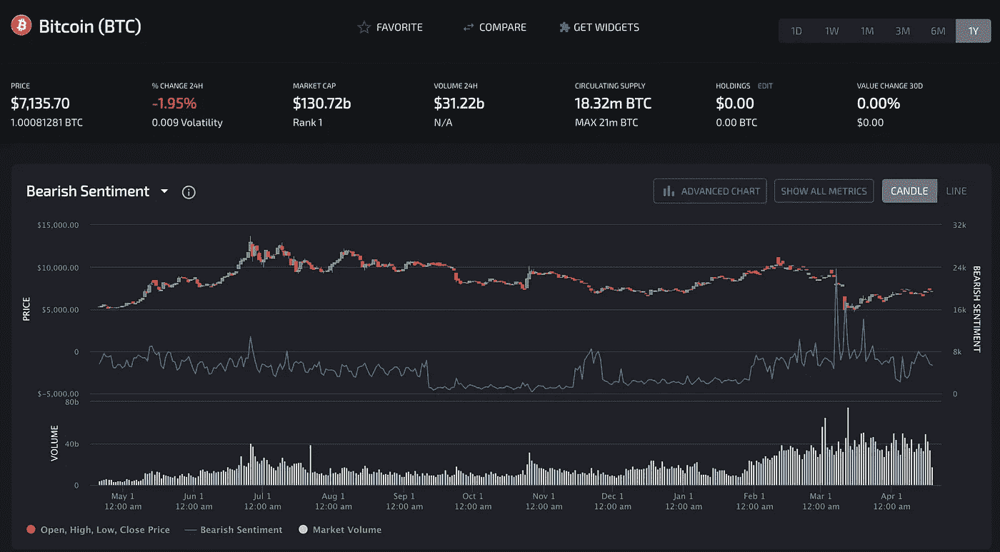
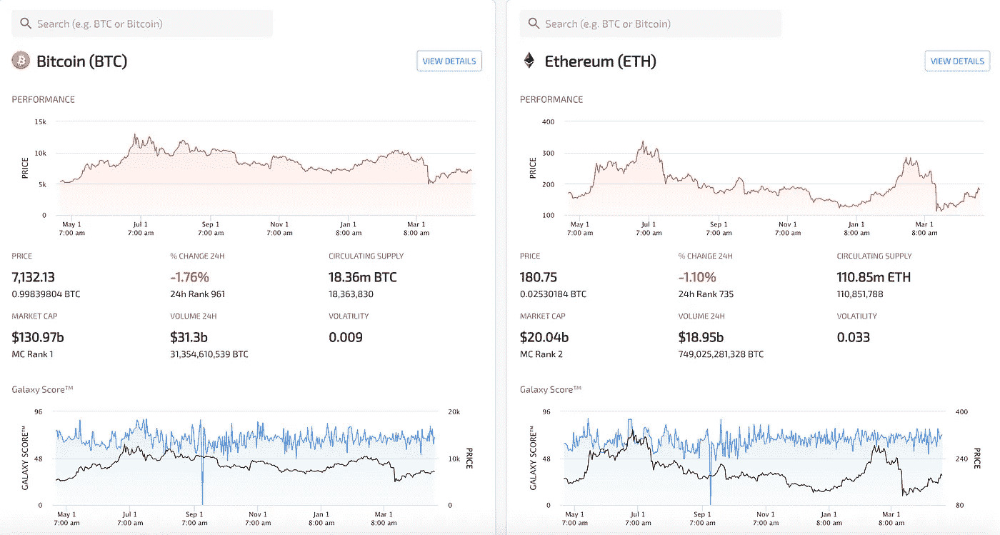
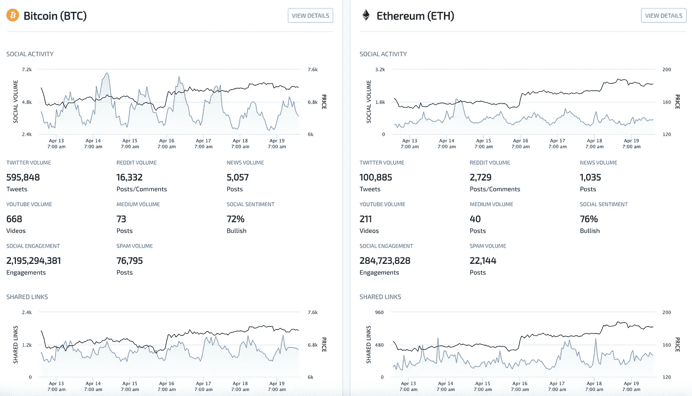

# 公众对 2020 年比特币减半的看法:加密货币社会情绪波动性增加

> 原文：<https://medium.com/coinmonks/public-perception-of-coming-bitcoin-halving-increased-cryptocurrency-social-sentiment-volatility-c5a21c0327aa?source=collection_archive---------2----------------------->

## 危机时期的加密货币市场讨论

Bitcoin vs. Ethereum on [LunarCRUSH — Social Listening For Crypto Compare App](https://lunarcrush.com/)

在经历了新冠肺炎金融动荡之后，加密货币市场正在缓慢而稳定地复苏。在周四繁忙的交易日，比特币重新回到 7000 美元水平。根据比特币区块奖励减半倒计时，比特币减半预计在 2019 年 5 月 12 日[左右完成。据推测，这一事件已经反映在价格中；然而，将未来建立在加密货币市场的过去表现之上，永远无法描绘出一幅清晰的画面。](https://www.bitcoinblockhalf.com/)[2020 年比特币减半意味着什么？](https://www.coindesk.com/bitcoin-halving-explainer)

[谷歌趋势](http://trends.google.como)报道称，2016 年比特币的搜索量已经超过之前的一半。

Google Trends: Worldwide Interest in Bitcoin Halving over the past 5 years.

Twitter 的加密货币社区一直对比特币减半充满兴趣。面对价格投机的冲击，人们在讨论投入市场的比特币供应减少是否意味着对比特币的需求增加。LunarFeed 在 Twitter 上详细描述了这些年来比特币减半对价格的影响。

2012 年减半使新供应量每周减少 302，400 美元，每天减少 43，200 美元。2016 年减半使新增供应量每周减少 819 万美元，每天减少 117 万美元。2020 年减半将减少每周 63，000，000 美元或每天 9，000，000 美元的新供应。关于比特币减半影响比特币的[价格，社交媒体情绪怎么说？](https://lunarcrush.com/coins/btc/bitcoin)

## 比特币价格与比特币社交量

根据[lunar crush——用于加密的社交监听](http://lunarcrush.com)的数据，比特币的社交量在过去一年保持稳定，直到最近我们看到[比特币的社交量](https://lunarcrush.com/coins/btc/bitcoin?interval=1%20Year)有所增加。很明显，比特币社交量在 2020 年 3 月 19 日大幅增长。

Bitcoin Price vs. Bitcoin Social Volume on LunarCRUSH

## 比特币价格与看涨情绪

随着社交媒体上围绕比特币的讨论越来越多，确定大多数提到的比特币是看涨还是看跌很重要。[比特币在 LunarCRUSH 上的看涨情绪图](https://lunarcrush.com/coins/btc/bitcoin?metric=bullish_sentiment)显示了与社交交易量峰值类似的峰值。看跌情绪呢，我们看到看跌帖子增加了吗？

Bitcoin Price vs. Bitcoin Bullish Sentiment

## 比特币价格与看跌情绪

[围绕比特币的看跌情绪](https://lunarcrush.com/coins/btc/bitcoin?metric=bearish_sentiment)似乎是零星的，比特币的看涨情绪没有那么大。社交量是衡量社区实力的一个重要指标，关注这些社区的发展以及围绕比特币和区块链技术的技术非常重要。

Bitcoin Price vs. Bitcoin Bearish Sentiment

## [比较比特币与以太坊](https://lunarcrush.com/compare/btc-eth)

在过去的 24 小时里，比特币价格上涨了 10%左右，保持了 4 月 3 日的水平。比特币从“黑色星期四”的金融崩溃中略有复苏。比特币(BTC)的走势一直在 6600 美元至 7300 美元之间，尚未显示出将向哪个方向移动的明确迹象。

[以太坊](https://lunarcrush.com/coins/eth/ethereum)当日下跌 2.79%，截至本文撰写之时，其交易价格为 182 美元。另一方面，176 美元恰好是第一个支撑位，也是前一周的高点。以太坊触及 190 美元，100%恢复了“黑色星期四”的崩溃。

Bitcoin Social Analytics vs. Ethereum Social Analytics

知识就是力量！加密货币的去中心化特性使得访问网络的方式更加自由和民主。分享你的知识，开源你的项目，加入一个社区(任何社区！)，也许只是发表一篇关于它的博文。

**这些都不应被视为投资建议。无论你从事哪种投资，都完全由你自己决定。**

## 感谢阅读

欢迎建设性的批评和反馈。可以在 Instagram [@nirholas](http://instagram.com/nirholas) ，在 [**Medium**](http://medium.com/nirholas) **，**和**Twitter[@罗嗦](http://twitter.com/bothersome)上联系到 Nicholas Resendez，了解新文章的更新。**

***此处表达的观点和意见仅代表作者，并不代表出版物的观点。每一项投资和交易都有风险，你应该在做决定时进行自己的研究。***

# **建议阅读**

**[构建一个 Twitter 机器人，用 Python 自动发布加密货币新闻](https://hackernoon.com/building-a-twitter-bot-to-automate-posting-cryptocurrency-news-with-python-a-step-by-step-guide-iv77327t)**

> **[在您的收件箱中直接获得最佳软件交易](https://coincodecap.com/?utm_source=coinmonks)**

****