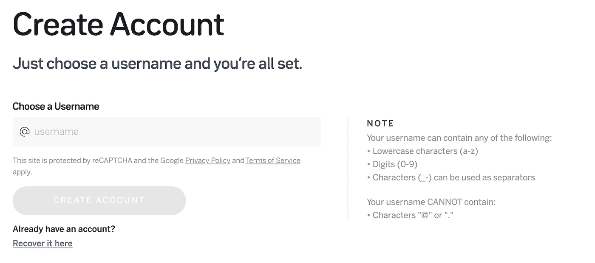
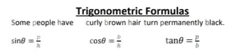

# 公钥-私钥对及其在区块链领域中的工作方式

> 原文：<https://medium.com/coinmonks/public-private-key-pairs-and-how-they-work-in-the-blockchain-realm-780f86328af8?source=collection_archive---------0----------------------->

如果您是加密的新手，您一定想知道什么是公钥和私钥。

NEAR protocol 和所有其他主要的加密货币都是建立在公钥加密基础上的，公钥加密是一种使用成对密钥(公钥和私钥)来验证区块链上的交易(发送或接收资金)的加密系统。

公钥可以描述为电子邮件地址。您公开分享您的电子邮件地址，以便您的朋友或家人可以向您发送电子邮件(或消息)。同样，公钥可以与所有人共享。因此，要发送交易(或资金)，首先应该知道另一个用户的公钥。

每个公钥都与唯一的私钥成对出现。私钥给用户一个“写访问权”，意味着对给定地址的资金的所有权，并且必须只为用户(或所有者)所知。私钥类似于你的电子邮件帐户的密码，只有你有一个副本(或知识)。任何知道相关密码的人都可以访问该帐户，并可能滥用它。因此，这些信息不应与任何人共享，也不应秘密存储。

# **公私钥的使用:**

如上所述，这些密钥对最常见的用途是安全地发送或接收资金。除此之外，它允许用户访问分散的应用程序。像在现实世界的应用程序(web2)中一样，我们使用 Gmail 自动登录到 Web2 应用程序，同样，这些密钥对有助于与分散应用程序的智能合同进行交互。

**其他提前使用** [**公私钥**](https://cryptopurview.com/public-private-keys-and-how-they-work-in-the-blockchain-realm/) **:**

*   用于[数据加密](https://cryptopurview.com/what-is-data-encryption-cryptographic/)目的。使用这些密钥，用户可以相互共享加密消息。假设 Bob 想给 Alice 发送一封加密的电子邮件。为此，Bob 用 Alice 的公钥加密他的消息。然后，当 Alice 收到消息时，她使用只有她自己知道的私钥来解密来自 Bob 的消息。
*   用作[数字签名](https://cryptopurview.com/how-digital-signature-work-and-use-in-blockchain/)将个人绑定到数字数据。即提供消息是由已知的人创建的并且消息是完整的并且在传输中没有被更改的验证。在 NEAR 协议中，验证者用他们的密钥签名，以显示真实性或他们对产生的块的同意。

# **近距离钱包的可定制体验:**

公钥和私钥由一串随机数组成。看起来大概是这样的:ed 255192 O4 a5 yaoxg 1 zvpgcrh 9 laeufvtzcht 1 psxnacymbot 7 I。

不像记住您的 Gmail 帐户 ID 和安全密码那么简单。鉴于记住加密密钥对的复杂性，用户需要将它存储在安全的地方。如果用户丢失了它们，尤其是私钥，他们将无法访问帐户中的资金。这可能是用户采用的一个障碍，尤其是对于不懂技术的个人。

[近](https://near.org/)钱包允许用户创建可定制的体验。通过 NEAR Wallet 创建帐户时，用户可以像创建电子邮件帐户一样定义帐户名称。这些人类可读的账户以'结尾。“近”。例如 ashkharoo.near

**为了使私钥对用户友好**，与其他区块链类似， [NEAR 协议](https://near.org/)使用助记键。助记键是私钥的可读版本。

记忆术是再现难以记忆的东西的一种方法。对于像私钥这样的一系列数据，随机的单词被关联起来，这样用户就可以记住最初的形式。记住你学生时代的一句话——“有些人的棕色卷发会永久变黑”。这是一种记忆正弦、余弦和正切三角公式的记忆形式。

近钱包使用 12 个单词的助记符种子，这些种子与给定的私钥相关联。这种转换是通过称为 BIP 39 的方法完成的。BIP 39 是一个包含 2048 个单词的[英语单词表](https://github.com/bitcoin/bips/blob/master/bip-0039/english.txt)。

# **收尾思路:**

入职流程是用户对应用程序的第一印象。用户不了解你的 app，就不会用。研究表明，60%的用户表示，在发现该应用程序需要大量信息后，他们选择不使用该应用程序。区块链应用程序有一个复杂的入职流程。人们必须努力知道钱包、公钥/私钥等。

通过 NEAR wallet，用户可以无缝地登录基于 NEAR 的分散式应用程序。来自近距离钱包的可定制体验增加了应用可用性的机会和用户成功采用的可能性。

## 另外，阅读

*   最好的比特币[硬件钱包](/coinmonks/the-best-cryptocurrency-hardware-wallets-of-2020-e28b1c124069?source=friends_link&sk=324dd9ff8556ab578d71e7ad7658ad7c)
*   [开发人员的最佳加密 API](/coinmonks/best-crypto-apis-for-developers-5efe3a597a9f)

