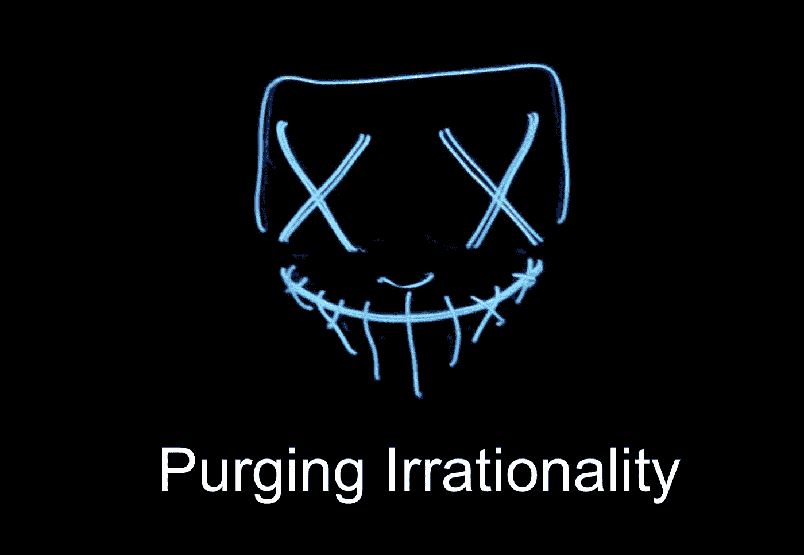
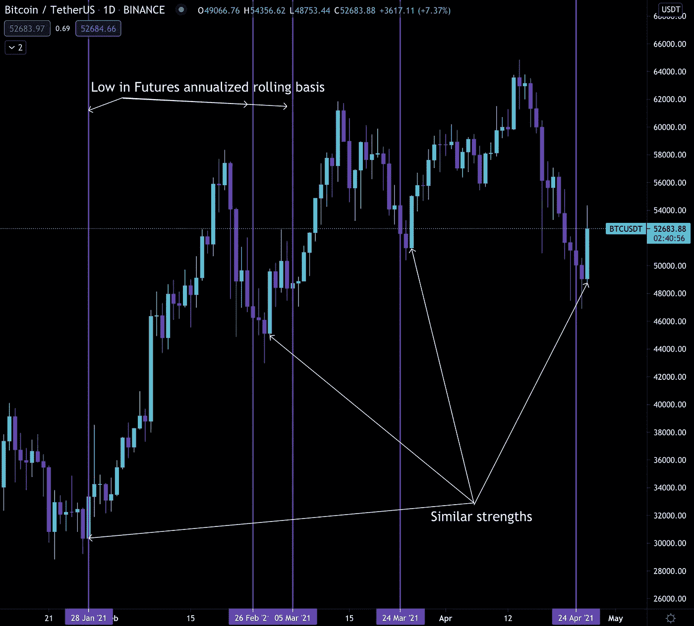
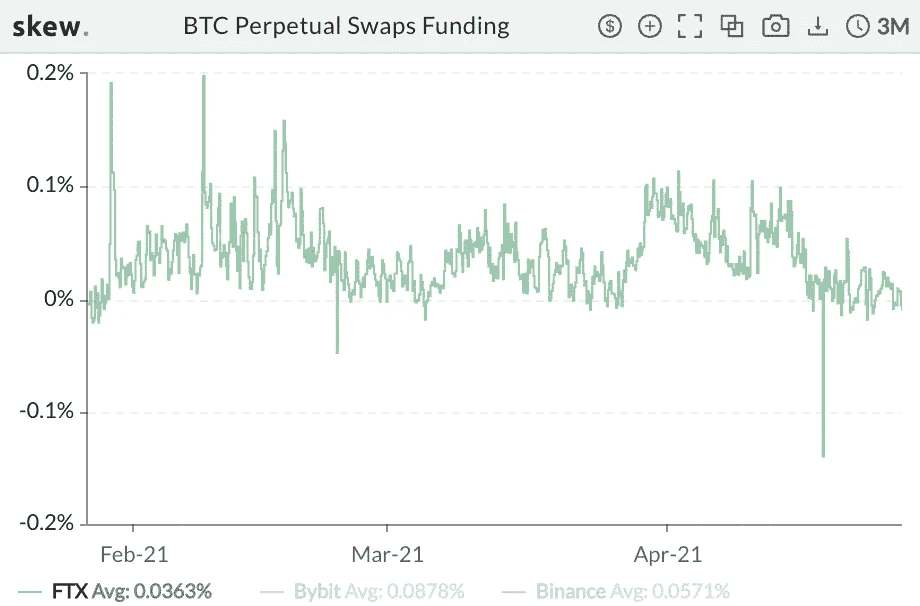
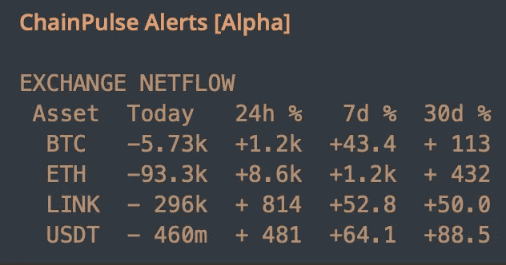
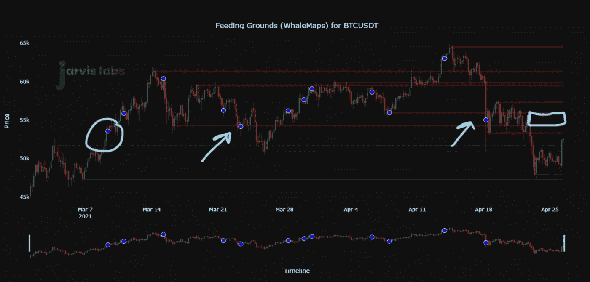

# 清除加密中的非理性

> 原文：<https://medium.com/coinmonks/purging-irrationality-in-crypto-78ace5b84eff?source=collection_archive---------3----------------------->

## 周二技术面

我们有一些活动。

周一开盘带来了比特币的强劲反弹。其价格当日涨幅高达 11.5%。

我们以前目睹过这种价格波动。

这往往发生在最近的底部。在下面的图表中，我用白色箭头指出了那些先前的实例。

有趣的是底部在这次反弹中的走势。每次在价格反转之前，一个月后的期货溢价都比现货价格高出约 6-7%。

这就是紫色垂直线所代表的——比特币期货一个月滚动基础上的年化低点。我知道这有点拗口。

但我提出这一指标的原因是，它表明了市场对一个月后比特币价格的预期。基差越低，定价越看跌。

我喜欢把它看作是衡量 FOMO 在市场中的份额的一种方式。这里有一条来自周末的推文，显示了市场低点和基差是如何匹配的。

[https://twitter.com/MrBenLilly/status/1385609918699479040?s=20](https://twitter.com/MrBenLilly/status/1385609918699479040?s=20)

你看待它的方式很简单。当所有人都认为比特币会一蹶不振时，它就逆转了。

昨天就是这种逆转的例子。

更好的是，资金利率是中性的。事实上，我仍然看到一些负资金利率偶尔出现。这是 FTX 过去几个月的照片。

如果你看一下图表，你会发现上次我们处于类似低点是在 3 月 26 日。

看一下价格图表，你会意识到这个日期是我们最后一次看到比特币在本地底部强势反转。

很多相似之处。我们喜欢这种熟悉的感觉。

这是因为为了让比特币产生足够的动力来摆脱这些低点，我们需要低融资利率。我们不希望非理性迅速恢复，就好像一滴没发生过一样。谢天谢地，在我写这期 Espresso 的时候，没有一个 altcoin 的融资率超过 0.051%。

这是重置。繁荣和非理性暂时被清除了。

为了决定比特币是否正在积聚势头，让我们来看看链上的活动…

两天前的净流量促成了昨日的强劲价格走势。比特币和以太坊都出现了负流量。这意味着离开交易所的 BTC 和瑞士联邦交易所的数量多于进入交易所的数量。这是一个乐观的情景。

USDT 也很乐观。我们已经有一段时间没有看到这个了。

除了 USDT，昨日的资金流也差不多。你可以在下面看到它们。

强劲的价格行动是一个良好的开端。融资利率有望上涨。网络流量开始看涨。

这是一个好的开始。我仍然希望看到更好的交易、交换流程和市场推动者。我们需要这些来穿越目前 55k 美元的熊市/牛市分界线。

你可以在下面的图表中看到，本杰明昨天在网上花了大约 20 分钟向客户提供最新信息。

蓝点是鲸鱼交易。红色和绿色的水平线以及阻力和支撑位。这个被围起来的区域是鲸鱼曾经多次保卫过的觅食地。

作为支持的防守区域现在是抵抗。这是比特币面临的最直接的障碍。

这就是你今天的最新消息。

明天我们将看看期权市场上的 Gamma。每周期权在每周五 8:00 UTC 到期。在之前的 24-36 小时内，价格会受到即将到来的成交的影响。

幸运的是，我们可以根据伽马模型的样子来确定波动性是变高还是变低。

如果我们把 Gamma 模型和 netflows 结合起来，我们在市场上就有优势。

你的脉搏在加密，

B

附:埃隆？

[https://twitter.com/MrBenLilly/status/1386870818077085696?s=20](https://twitter.com/MrBenLilly/status/1386870818077085696?s=20)

> 加入 Coinmonks [电报集团](https://t.me/joinchat/uiLERCQL1fQ5ZjA1)，了解加密交易和投资

## 另外，阅读

*   最好的[加密交易机器人](/coinmonks/crypto-trading-bot-c2ffce8acb2a) | [网格交易机器人](https://blog.coincodecap.com/grid-trading)
*   [加密副本交易平台](/coinmonks/top-10-crypto-copy-trading-platforms-for-beginners-d0c37c7d698c) | [五大 BlockFi 替代方案](https://blog.coincodecap.com/blockfi-alternatives)
*   [CoinLoan 审核](/coinmonks/coinloan-review-18128b9badc4)|[Crypto.com 审核](/coinmonks/crypto-com-review-f143dca1f74c) | [火币保证金交易](/coinmonks/huobi-margin-trading-b3b06cdc1519)
*   [尤霍德勒 vs 考尼洛 vs 霍德诺特](/coinmonks/youhodler-vs-coinloan-vs-hodlnaut-b1050acde55a) | [Cryptohopper vs 哈斯博特](https://blog.coincodecap.com/cryptohopper-vs-haasbot)
*   [杠杆代币](/coinmonks/leveraged-token-3f5257808b22) | [最佳密码交易所](/coinmonks/crypto-exchange-dd2f9d6f3769) | [Paxful 点评](/coinmonks/paxful-review-4daf2354ab70)
*   [如何在印度购买比特币？](/coinmonks/buy-bitcoin-in-india-feb50ddfef94) | [WazirX 评论](/coinmonks/wazirx-review-5c811b074f5b) | [BitMEX 评论](https://blog.coincodecap.com/bitmex-review)
*   [双子座 vs 比特币基地](https://blog.coincodecap.com/gemini-vs-coinbase) | [比特币基地 vs 北海巨妖](https://blog.coincodecap.com/kraken-vs-coinbase) | [CoinJar vs CoinSpot](https://blog.coincodecap.com/coinspot-vs-coinjar)
*   [币安 vs 北海巨妖](https://blog.coincodecap.com/binance-vs-kraken) | [美元成本平均交易机器人](https://blog.coincodecap.com/pionex-dca-bot)
*   [印度比特币交易所](/coinmonks/bitcoin-exchange-in-india-7f1fe79715c9) | [比特币储蓄账户](/coinmonks/bitcoin-savings-account-e65b13f92451)
*   [币安费](/coinmonks/binance-fees-8588ec17965) | [Botcrypto 评论](/coinmonks/botcrypto-review-2021-build-your-own-trading-bot-coincodecap-6b8332d736c7) | [Hotbit 评论](/coinmonks/hotbit-review-cd5bec41dafb) | [KuCoin 评论](https://blog.coincodecap.com/kucoin-review)
*   [我的密码副本交易经验](/coinmonks/my-experience-with-crypto-copy-trading-d6feb2ce3ac5) | [购买硬币评论](https://blog.coincodecap.com/buycoins-review)
*   [加密货币储蓄账户](/coinmonks/cryptocurrency-savings-accounts-be3bc0feffbf) | [YoBit 审核](/coinmonks/yobit-review-175464162c62) | [Bitbns 审核](/coinmonks/bitbns-review-38256a07e161)
*   [最佳比特币保证金交易](/coinmonks/bitcoin-margin-trading-exchange-bcbfcbf7b8e3) | [比特币保证金交易](https://blog.coincodecap.com/bityard-margin-trading)
*   [加密保证金交易交易所](/coinmonks/crypto-margin-trading-exchanges-428b1f7ad108) | [赚取比特币](/coinmonks/earn-bitcoin-6e8bd3c592d9) | [Mudrex 投资](https://blog.coincodecap.com/mudrex-invest-review-the-best-way-to-invest-in-crypto)
*   [BlockFi 信用卡](https://blog.coincodecap.com/blockfi-credit-card) | [如何在币安购买比特币](https://blog.coincodecap.com/buy-bitcoin-binance)
*   [顶级付费加密货币和区块链课程](https://blog.coincodecap.com/blockchain-courses) | [币安评论](/coinmonks/binance-review-ee10d3bf3b6e)
*   [MXC 交易所评论](/coinmonks/mxc-exchange-review-3af0ec1cba8c) | [Pionex vs 币安](https://blog.coincodecap.com/pionex-vs-binance) | [Pionex 套利机器人](https://blog.coincodecap.com/pionex-arbitrage-bot)
*   [在美国如何使用 BitMEX？](https://blog.coincodecap.com/use-bitmex-in-usa) | [BitMEX 回顾](https://blog.coincodecap.com/bitmex-review) | [币安 vs Bittrex](https://blog.coincodecap.com/binance-vs-bittrex)