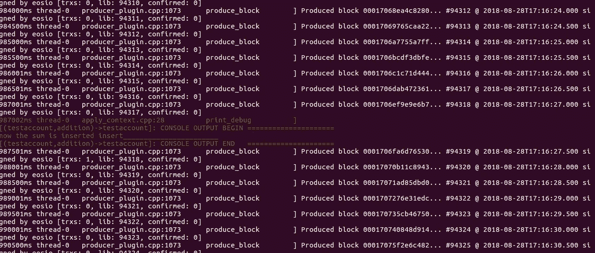
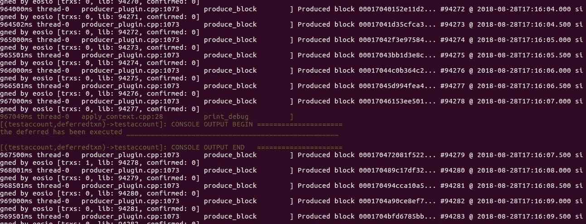

# 在 EOS 区块链上推送延迟交易

> 原文：<https://medium.com/coinmonks/push-a-transaction-with-delay-on-eos-blockchain-11be0d0cffb5?source=collection_archive---------1----------------------->


source : eosio

区块链技术有一个交易的概念来存储数据，并使其不可改变。EOS 还处理区块链上的数据，但 EOS 中有两种类型的交易，在线交易和延迟交易。内联事务是那些当您将它们推入区块链并由生产者验证它们时被执行的事务，而具有延迟的事务可以被安排在特定的延迟之后被执行，之后生产者验证它并将它们添加到块中。

在本文中，我们将学习如何在 EOS 区块链上创建延迟交易。

## 智能合同

我们将编写一个智能契约，其中包含一个表来存储帐户持有人的姓名和给定数字的总和，我们在这里的重点是不要编写复杂的动作，所以我选择简单的加法动作，以便我们可以更专注于交易。

我假设你知道公钥和私钥的概念，如果你不知道，请参考这里的[和这里的](https://www.blockchain-council.org/blockchain/how-does-blockchain-use-public-key-cryptography/)。

在这个契约中，我们有两个动作，一个是 **transfertxn** ，它在给定的延迟后调用主**加法**函数。我们的加法操作看起来像:

```
//this action add two number a and b, save the sum in a table ttabs
//@param user account_name of person who sets the contract
//@param memo sender_id of transaction which will not be greater than 14 chars 
//@param delay number of seconds by which you want to delay you transaction
//@param a integer number
//@param b integer numbervoid addition(account_name user,std::string memo,uint64_t a  , uint64_t b)
  {
    _table ttabs(_self,_self);
    uint64_t sum = a+b;
    auto iter=ttabs.find(user);
    if(iter==ttabs.end()){
    print("now the sum is inserted _________________\t"); 
    ttabs.emplace(_self,[&](auto& sumtable){
          sumtable.account = user;
          sumtable.additionsum = sum;
            });
    }
    else
    {  ttabs.erase(iter);
       print("\n");
     }
  }
```

现在，我们需要创建一个表结构来存储数据。表格结构看起来像:

```
//this is a table structure that have two fields ,account and additionsumstruct sumtable
  {
     account_name account;
     uint64_t additionsum;
     uint64_t primary_key() const {return account;} EOSLIB_SERIALIZE(sumtable,(account)(additionsum))
   };
```

上表存储帐户和两个数字的相加，主键为“帐户”。现在我们的 **transfertxn** 动作看起来像:

```
//transfertxn executes the transaction after the given delay
//@param from account_name of the person who set the contract //@param a integer number
//@param b integer number
//@param memo string sender_id what will you in future to cancel the transaction before given delay time
//@param delay, number of seconds(integer)void transfertxn(account_name from, uint64_t a, uint64_t b ,string memo, uint64_t delay)
    {   
        eosio::transaction txn{};
        txn.actions.emplace_back(
            eosio::permission_level(from, N(active)),
            N(testaccount),
            N(addition),
            std::make_tuple(from,memo,delay,a,b));
        txn.delay_sec = delay;
        txn.send(eosio::string_to_name(memo.c_str()), from);
        print("the transfertxn has been executed ___________\n");
    }
```

那么我们来了解一下 transfertxn 动作。

## 交易结构

现在，我们需要为 eosiolib/transaction.hpp 中定义的**事务**创建一个 **txn** 对象，在这个对象中，我们添加了带有适当参数的操作，并设置了延迟，如您在上面的代码中所见。现在，让我们一个一个地了解动作参数。

1.  eosio::permission_level(from，N(active)):我们设置你要通过其推送该交易的账户的权限。这是`中的`
2.  *N(testaccount):用于部署合同的帐户*
3.  *n(添加):要调用的操作*
4.  *std::make_tuple(from，memo，delay，a，b)):将参数传递给加法操作*

*最后，我们的 **tbsample.cpp** 文件看起来像这样:*

```
*#include <eosiolib/eosio.hpp>
#include <eosiolib/print.hpp>
#include <eosiolib/transaction.hpp
#include <eosiolib/print.hpp
#include <string>using namespace std;
using namespace eosio;class benjamin: public eosio::contract
{
public:
  using contract::contract;
 /// @abi table sumtable i64
struct sumtable
{
  account_name account;
  uint64_t additionsum;
  uint64_t primary_key() const { return account;
  }
  EOSLIB_SERIALIZE(sumtable, (account)(additionsum))
};typedef multi_index<N(sumtable), sumtable> _table;/// @abi action
void addition(account_name user, std::string memo, uint64_t delay, uint64_t a, uint64_t b)
{
   _table ttabs(_self, _self);
    uint64_t sum = a + b;
    auto iter = ttabs.find(user);
    if (iter == ttabs.end())
     {
       print("now the sum is inserted _________\t");                                           ttabs.emplace(_self, [&](auto &sumtable) {
      sumtable.account = user;
      sumtable.additionsum = sum;
});
}else
 {
    ttabs.erase(iter);
    print("\n");
 }
}/// @abi action
void transfertxn(account_name from, uint64_t a, uint64_t b, string memo, uint64_t delay)
{
    eosio::transaction txn{};
    txn.actions.emplace_back(
      eosio::permission_level(from, N(active)),
      N(testaccount),
      N(addition),
    std::make_tuple(from, memo, delay, a, b));
    txn.delay_sec = delay;
    txn.send(eosio::string_to_name(memo.c_str()), from); print("the transaction has been executed _________________\n");}
};
EOSIO_ABI(benjamin, (addition)(transfertxn))*
```

*您可以在单独的。hpp 文件(头文件)也是。现在，让我们部署并测试它。*

*首先，运行 nodeos，下面是启动 nodeos 的命令*

```
*# nodeos -e -p eosio --plugin eosio::wallet_api_plugin --plugin eosio::chain_api_plugin contracts-console*
```

*现在，为这个契约编译 wast 和 abi 文件。*

```
*# eosiocpp -o tbsample.wast tbsample.cpp
# eosiocpp -g tbsample.abi tbsample.cpp*
```

*使用 account_name testaccount(我的帐户名称)设置合同，在设置我们的合同之前，我们的钱包必须解锁。所以我们来定合同吧。*

```
*# cleos set contract testaccount  tbsample ./tbsample/tbsample.wast ./tbsample/tbsample.abi*
```

*订立合同后，现在是时候将我们的行动推进到区块链节点了。为了测试，我通过了 20 秒的延迟。*

```
*# cleos push action testaccount transfertxn '["testaccount",10,20,"himessage",20]' -p testaccount*
```

*执行该命令后，您会收到类似如下的消息。*

```
*executed transaction: 44203ea245cc95ffdb74e96643588b93c4df9b2a3ac08e222e5d38edb85d01df  184 bytes  1553 us
#   testaccount <= testaccount::transfertxn     {"from":"testaccount","a":10,"b":20,"memo":"himessage","delay":20}
>> the transfer has been executed ____________________________________________________
warning: transaction executed locally, but may not be confirmed by the network yet*
```

*忽略警告(如果有),现在让我们回到我们的合同，我们已经将我们的操作推入本地区块链，如果您转到 nodeos 终端，您可以看到您的事务是这样运行的。*

**

*因为我们在 transfertxn 操作中给出了 20 秒的延迟，所以 20 秒后我们将这两个数字相加并放入表中。因此，20 秒钟后，您的 ***添加操作*** 将会触发，如果工作正常，我们的 nodeos 窗口看起来就像这样。*

**

*为了获得表格数据，*

```
*# cleos get table testaccount testaccount sumtable*
```

*这就是交易的运作方式。我们还有一个取消延迟交易的功能，详情请参考这个[网址](https://eosio.stackexchange.com/questions/1800/how-can-i-cancel-the-deferred-transaction-in-eos-after-we-push-the-deferred-tran)。*

*如果您在让应用程序工作时遇到任何问题，请随时在这个[库](https://github.com/nirdesh27/Sample_EOS_code)上发表评论或提出问题。你可以在这里获得**完整代码** [。](https://github.com/nirdesh27/Sample_EOS_code)*

*资源和参考资料*

1.  *EOS [开发者](https://developers.eos.io/)*
2.  *EOS [堆栈交换](https://eosio.stackexchange.com/questions/)*

***原文发表于** [**此处**](https://www.innoplexus.com/blog/push-a-transaction-with-delay-on-eos-blockchain/) **。Innoplexus AG 保留所有权利。***

> *[直接在您的收件箱中获得最佳软件交易](https://coincodecap.com/?utm_source=coinmonks)*

*[](https://coincodecap.com/?utm_source=coinmonks)*