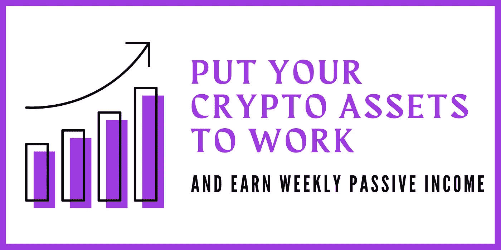
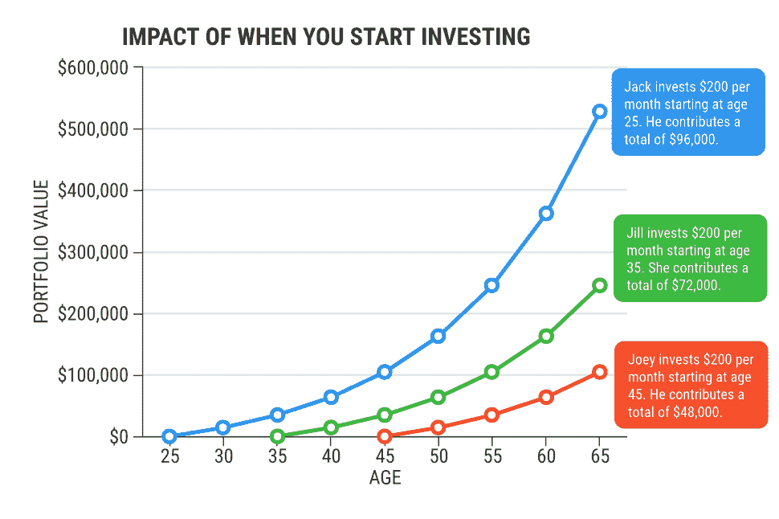
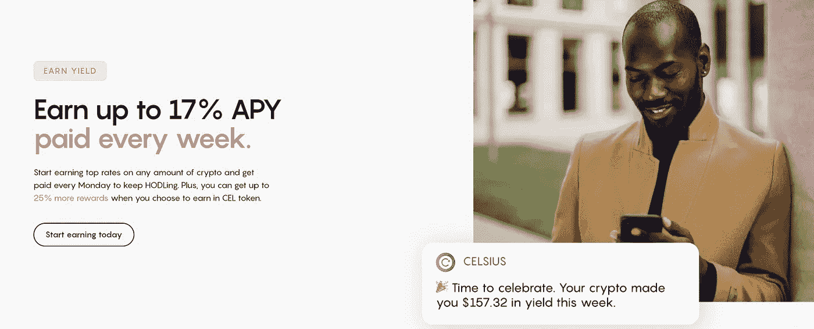
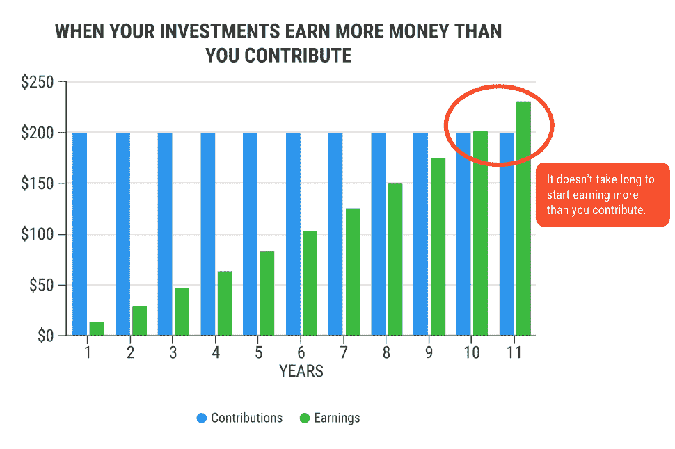

# 让您的加密资产发挥作用

> 原文：<https://medium.com/coinmonks/putting-your-crypto-assets-to-work-b6089d72be32?source=collection_archive---------2----------------------->

## 秘密投资

## 这就是我如何从我的加密资产中获得每周被动收入的方法

首先，让我们听听这位以有史以来最伟大的投资者而闻名的人的智慧之言。

> “如果你不打算在 10 年内持有一只股票，那就别想在 10 分钟内持有它。”
> 
> *—* [*巴菲特*](https://www.forbes.com/profile/warren-buffett/?sh=6f05c3946398) *【奥马哈先知】*

沃伦·巴菲特已经成为一名成功的投资者，因为他发现了区分赢家和输家的艺术，他着眼于一家公司未来的长期价值，以及选择将进行再投资并经历复利过程的派息股票。

如果你正在读这封信。拿着任何一种饮料——让我问你，“我从来没有投资过加密资产。”

如果你为这个问题干杯，太好了！；如果你没有，那么不要担心，因为我们将讨论如何安全地开始你的加密投资之旅。对于那些对这一切感到困惑的人，在谷歌上做一个简单的搜索，你就会找到答案。

# 我的故事

当我意识到如果我要在这个行业呆很长时间，希望代币增值 1000(x)倍不是一个可持续的投资策略时，我开始让我的加密资产发挥作用。一个可持续的投资策略应该允许你在一段时间内持续拥有该资产，直到你不再需要它，并且不去投机(就像你交易时那样)。此外，请记住，这里的“可持续投资战略”是指“这项投资是否能够将其业绩保持在一定水平”。

当我开始我的加密货币投资之旅时，我不知道我在做什么(真的，阅读我的简历)，但我花时间学习和研究了当时可供我使用的不同类型的加密货币。我今天仍然这样做，你知道他们说“追求知识永远不会太迟”，我不确定是谁说的，但我肯定这句话来自比我聪明的人。

在某种程度上，投资加密市场类似于投资传统市场——做你的研究，买一只股票，希望它升值；购买一只股票，从分红股票中赚取每月股息。但是你可能会问自己“密码市场的红利？”。在 cryptoverse 中，它们被称为支出，这些支出因平台而异；你的收入取决于平台支付的年收益率(APY)。APY 是在考虑复利的影响后你的投资回报率。在加密中，这些数字高达 15%(被认为是保守的，但是安全的！).

# 投资加密货币市场是最好的主意吗？

如果你不怕从 DeFi 和 exchange hacks 中损失一些你的血汗钱；还有丢失硬件钱包或忘记密码的可能性——你是一个冒险家。这个行业的人执着，脸皮厚。密码行业仍处于其生命周期的早期阶段，在此期间承担一些风险是不可避免的。然而，该行业目前正在建设基础设施，以改善安全性、监管和投资于该行业的用户的可访问性。

那么，这个市场是投资你血汗钱的最好方式吗？

直截了当的回答是——是的。如果你做得对，并采取一切预防措施来最大限度地降低风险，你的投资将会非常成功。与传统投资类似，风险总是存在的——记住这一点。

投资加密货币市场将使你能够将传统投资多样化(如果你已经有这些投资的话)，进入数字世界。你将要在隐世探索的一切都是数字化的。

那么，你相信吗？

你是那种能够相信无形事物的人吗？

大部分人做不到。

# 你还在这里，认真地让你的加密资产发挥作用

我花了一些时间来确保你有什么需要开始你的加密投资之旅在前面的段落。现在，让我们直接进入它。

如果你真的想投资加密并让你的资产发挥作用，问问你自己这个问题:

"我持有一项资产的时间范围是多长？"

如果你回答了 1 到 2 年，你可能应该重新考虑你的“投资”的想法。

同样，如果你真的想让你的加密资产发挥作用，你应该至少持有你的资产 10 到 20 年。我听到的每一条投资建议都是，如果你有能力，就应该尽早开始投资。下面的图表解释了与他的姐姐吉尔相比，杰克如何遵循每月 200 美元的投资和复利概念；和爷爷乔伊在不同的年龄，假设年回报率为 7%。

Image by [Coryanne Hicks](https://money.usnews.com/investing/investing-101/articles/2018-07-23/9-charts-showing-why-you-should-invest-today) (U.S News Money)

启动您的加密投资之旅将为您提供储蓄和收获高收益回报的机会(有时高达 15%) ****wink**** 。你在投资工具/平台上持有资产的时间越长，你在整个投资期间从复合效应中获得的回报就越多(如上所示)。

许多进入 crypto 的人期望快速获利，尽管在许多情况下这可能是真的；事情会很快转向另一个方向。这就是为什么作为一个加密投资者，你应该准备好这个行业的知识，并像我们亲爱的老朋友沃伦巴菲特一样，学会如何从输家中挑选赢家。当然，在 crypto 中，你将无法找到像这些原生令牌的公司的资产负债表和现金流量表这样的信息。你需要做的不止这些。

# 挑选精英中的精英

为您的加密投资组合挑选资产绝非易事。你很幸运，我在这里分享一些我在建立我的加密组合的过程中所学到的建议。在我投资加密的早期，我认为你拥有的资产越多，回报就越好。虽然分散你的资产是一个很好的做法，但过于分散不是一个好主意。你需要确保你在好的工作项目中有一个好的百分比来证明概念。做好自己的尽职调查。Crypto 是一个社区和网络效应的世界。一个好的投资项目应该有一个很好的社区、网络效应和一个可行的概念证明。

我经常有几个准备探索加密的朋友寻求我的建议，告诉他们应该先投资什么。我总是告诉他们，投资比特币和以太坊永远不会错。

# 哪里投资你的加密资产？

所以，你已经准备好投资，现在是时候决定你应该投资你的加密资产。我将分享一些我过去使用过的平台和我继续使用的平台。

***免责声明:*** *我将用我的* [*促销代码*](https://celsiusnetwork.app.link/1902154e2d) 先令我使用的平台

最开始，我用一个交换机来运行我的密码。太神奇了，和我想象的完全不同。当时我很容易受骗，因为我对加密一窍不通。交易所有借贷功能，所以我把我的密码借给了其他需要保证金的人。这是一个好的几个月，但我不太满意我得到的回报和安全方面，我不会说这是最好的。

随着我的投资越来越成熟，我做了一些关于加密投资和获得加密资产回报的研究。偶然发现[摄氏度网](https://celsius.network/about-us):

*“一个被大银行抛弃的策划服务平台——比如公平利息、零费用和闪电般的交易。我们的目标是颠覆金融行业，一次一个快乐的用户，并通过加密引入金融自由。”*

Image: [Celsius Network](https://celsius.network/) Homepage

这是他们的描述。我对他们做了自己的尽职调查，并最终尝试了他们的服务大约 3 个月，发现他们没有撒谎说每周向用户支付费用。他们为大部分上市资产提供高收益 APY 的能力。有的高达 15%的 APY。我就迷上了，再也没有回头。所以现在，我继续用我在 Celsius 平台上的资产赚取每周的“闲钱”。我每周收到的利息，我让它在我的账户里复利，让它随着时间慢慢增长。

如果你投资你的加密资产和 HODL(珍惜生命),以获得长期收益，你的收益总有一天会超过你的贡献。当这种情况发生时，你会感到一阵兴奋，并持续兴奋；总有一天会财务自由。

记住，杰克每个月投资 200 美元；在第 11 年末，他的收入超过了每月的贡献。做杰克。

Image by [Coryanne Hicks](https://money.usnews.com/investing/investing-101/articles/2018-07-23/9-charts-showing-why-you-should-invest-today) (U.S News Money)

***免责声明:*** *感谢收听，任何观点的表达(如有变更，恕不另行通知)都是我(作者)个人的，我(作者)不保证所提供的任何信息或分析的准确性或完整性。*

**在 Twitter 上关注我:** [@0x_idkcrypto](https://twitter.com/0x_idkcrypto)

**摄氏网络推广码 Get $ 50**:[1902154 e2d](https://celsiusnetwork.app.link/1902154e2d)

***包含附属链接**

> 加入 [Coinmonks 电报频道](https://t.me/coincodecap)，了解加密交易和投资

## 也阅读

 [## 最佳加密交易所| 2021 年十大加密货币交易所

### 加密货币交易所的加密交易需要了解市场，这可以帮助你获得利润…

blog.coincodecap.com](https://blog.coincodecap.com/crypto-exchange)  [## 2021 年 9 大最佳加密借贷平台

### 当谈到加密货币贷款时，大量因素等同于良好的收入状况。此外，借款的一部分…

blog.coincodecap.com](https://blog.coincodecap.com/crypto-lending)  [## 2021 年最佳加密交易机器人(免费和付费)

### 2021 年币安、比特币基地、库币和其他密码交易所的最佳密码交易机器人。四进制，位间隙…

medium.com](/coinmonks/crypto-trading-bot-c2ffce8acb2a)  [## 最佳 4 个加密交易信号电报通道

### 这是乏味的找到正确的加密交易信号提供商。因此，在本文中，我们将讨论最好的…

medium.com](/coinmonks/best-crypto-signals-telegram-5785cdbc4b2b)  [## BlockFi 评论 2021:利弊和利率

### 今天，我们提出了一个全面的 BlockFi 评论，这是一个成立于 2017 年的加密贷款平台，拥有其…

blog.coincodecap.com](https://blog.coincodecap.com/blockfi-review)  [## 如何在印度购买比特币？2021 年购买比特币的 7 款最佳应用[手机版]

### 如何使用移动应用程序购买比特币印度

medium.com](/coinmonks/buy-bitcoin-in-india-feb50ddfef94)  [## 加密税务软件——五大最佳比特币税务计算器[2021]

### 不管你是刚接触加密还是已经在这个领域呆了一段时间，你都需要交税。

medium.com](/coinmonks/best-crypto-tax-tool-for-my-money-72d4b430816b)  [## Pionex 评论 2021 |免费加密交易机器人和交换

### Pionex 是为交易自动化提供工具的后起之秀。Pionex 上提供了 9 个加密交易机器人…

medium.com](/coinmonks/pionex-review-exchange-with-crypto-trading-bot-1e459d0191ea)  [## 存储比特币的最佳加密硬件钱包[2021]

### 保管您的数字资产很容易，但找到正确的存储方式却是一项繁琐的任务。在线钱包有一个风险…

blog.coincodecap.com](https://blog.coincodecap.com/best-hardware-wallet-bitcoin)