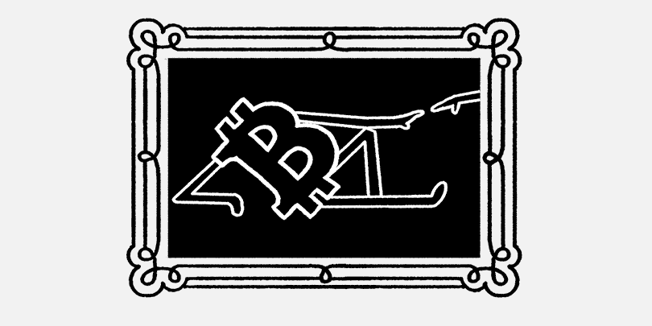
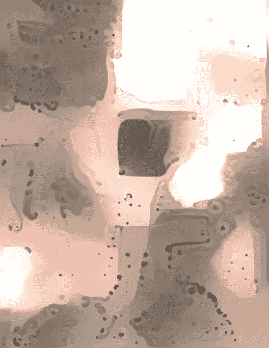
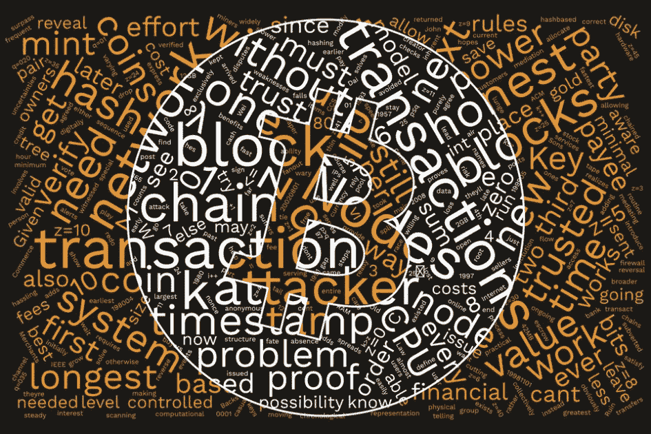

# 谜题、纪念碑和艺术家:区块链中的杰出艺术

> 原文：<https://medium.com/coinmonks/puzzles-monuments-and-artists-outstanding-art-in-blockchain-21be15c1fa06?source=collection_archive---------4----------------------->

当听到区块链这个时髦词时，首先想到的是 IT、去中心化和加密货币。然而，这项新技术还有其他不太传统的应用领域。

根据艺术市场的数据，2017 年艺术品销售额[总计 637 亿美元，其中包括 50 亿美元的在线购买。Art Collecting 分析了 500 笔使用加密作为记账货币的交易，发现其中 95%是以比特币结算的。其他 5%使用的是替代加密货币，顶部是以太坊。](https://www.artsy.net/article/artsy-editorial-art-market-hit-637-billion-2017-key-takeaways-art-basel-report)

艺术品真伪的鉴定是这个领域的关键问题之一，可以用区块链来解决。分布式分类帐概念允许数字化起源过程(创建和存储所有权记录)。

美国初创公司德勤卢森堡、Verisart、ArteQuest platform 等公司已经开发了画作的在线认证和分散存储解决方案。每件艺术品都有一个独特的数字标识，可以很容易地实时验证。

## **艺术分权**

艺术分散化的一个突出例子是圣甲虫。核心思想是分配创作过程:最终作品是由神经网络从一千多名艺术家的画作中汇编而成的。社区通过投票决定哪些作品将用于汇编。

第一个这样的作品现在正在创作，看起来像这样。你可以在这里看到过程。

通过智能合同出售画作，各方可以实现税收透明，同时艺术家可以保证收到全部款项。除了分散创造，当投资者拥有一个价格的独立份额时，智能合约允许分布式所有权。

## **密码艺术家**

比特币和区块链的炒作鼓舞了艺术家。最受欢迎的加密艺术家之一 Nanu Berks 正在诠释艺术中分布式账本技术的发展。她的大部分作品都是由回收材料制成的，如木材、喷雾垫和计算机硬件。纳努的作品已经在区块链的一次会议上展出出售。百分之六十的收益将捐赠给慈善机构和环境保护项目。

Tilcoin 公司已经建立了一个艺术收藏，包括苏联和俄罗斯艺术家的绘画，来自不同国家的上世纪海报，以及 20 世纪后期的邮票收藏。Tilcoin 使用区块链将所有这些碎片数字化，并将其放入虚拟存储器中。这个系列后来就支离破碎了，就像一个拼图。这些碎片现在被用来换取该公司自己的代币 TLC。

区块链是一种数字日志，数据存储安全，不会被伪造、修改和删除，这使得该技术对行业来说非常宝贵。使用区块链可以帮助各种艺术永存。自今年 3 月以来，Tilcoin 已售出约 15 万幅绘画片段，尽管总体呈下降趋势，但其人气仍然很高。这些碎片通常作为投资或礼物购买。

## **区块链拼图**

区块链文化的另一个有趣现象是谜题。一个常见的例子是一张照片，照片上有一把来自私人钱包的加密钥匙，里面有一些密码作为奖励。今年 2 月，最受欢迎的一系列此类谜题，被称为中本聪传奇，被一位 30 岁的程序员解开了。获胜者获得了 4.87 BTC 的奖金，相当于 5 万美元。

如果你曾经想过尝试破解加密难题，你还有机会。在过去的三个月里，Reddit 用户一直在为另一个类似的难题绞尽脑汁。作者承诺会提供一些提示，以防问题太难解决。他还指出，该奖项并不仅限于 1 BTC，但他补充说，他建议将注意力集中在拼图上，而不是奖励上。你可以在这里加入[的讨论。](https://www.reddit.com/r/Bitcoin/comments/8kk0pa/1_btc_is_hidden_in_this_puzzle_good_luck/)

## **比特币纪念碑**

尽管一些国家正在禁止加密事件，SEC 也一再拒绝比特币 ETF，但其他国家愿意展示它们对数字货币的开放态度。今年，一座比特币纪念碑在斯洛文尼亚城市克拉尼落成。这个想法是由市政府提出的，纪念碑的建设由总部位于克拉尼的交易所 Bitstamp 和区块链软件开发商 3fs 赞助。这座纪念碑矗立在靠近市中心的一个环形交叉路口的中间。

我们最近看到了区块链艺术黑客马拉松，以及分散的博物馆和画廊概念。一位苏格兰加密爱好者甚至开发了一款 AR 应用，可以将苏格兰国家肖像画廊中苏格兰历史上的杰出人物的肖像转换为最受关注的加密影响者。

> [直接在您的收件箱中获得最佳软件交易](https://coincodecap.com/?utm_source=coinmonks)

