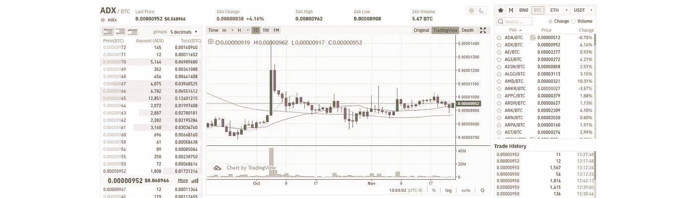
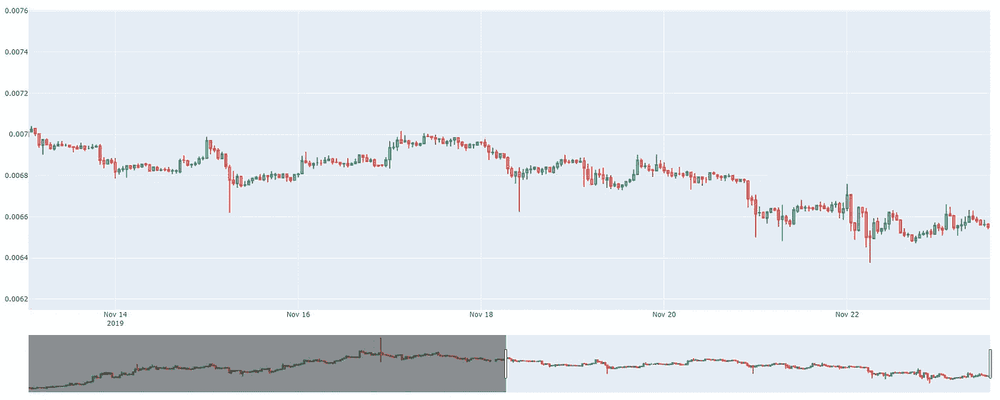
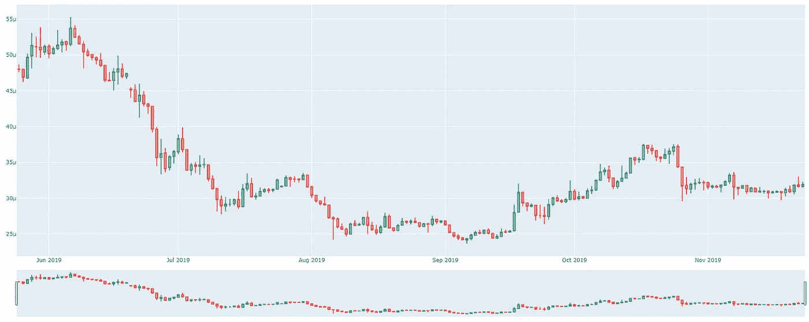

# 用于 CCXT 加密烛台(OHLCV)图表数据的 Python 脚本

> 原文：<https://medium.com/coinmonks/python-scripts-for-ccxt-crypto-candlestick-ohlcv-charting-data-83926fa16a13?source=collection_archive---------0----------------------->



加密货币交易员痴迷于数据。逐笔交易分析，找到最佳的进场点或出场点。寻找下一个大突破。每个数据点都很重要。

这就是为什么本教程将重点关注大多数开发人员在制作图表时需要的数据交换[图表数据](https://en.wikipedia.org/wiki/Candlestick_chart)。

实时[烛台数据](https://www.investopedia.com/trading/candlestick-charting-what-is-it/)对于准确制图、快速决策和计算完美交易至关重要。

让我们深入了解访问烛台数据的不同方式，以及如何使用这些数据生成[历史价格图表](https://blog.shrimpy.io/blog/free-historical-ohlcv-trade-charting-data-for-crypto-exchanges)。

[](https://blog.shrimpy.io/blog/ccxt-live-crypto-exchange-price-ticker) [## CCXT 实时加密交易所报价器[示例教程] | Shrimpy

### 我们将介绍两种不同的方法来生成实时价格行情。第一个策略是访问数据…

blog.shrimpy.io](https://blog.shrimpy.io/blog/ccxt-live-crypto-exchange-price-ticker) [](https://blog.shrimpy.io/blog/ccxt-crypto-exchange-order-book-snapshot) [## CCXT 加密交换订单簿数据[示例教程] | Shrimpy

### 订单簿指定了交易所中当前开放的所有可用订单。每个订单代表一个…

blog.shrimpy.io](https://blog.shrimpy.io/blog/ccxt-crypto-exchange-order-book-snapshot) 

## 安装库

在我们开始之前，让我们继续为下面的例子安装必要的库。Pandas 和 Plotly 将帮助我们绘制从 [CCXT](https://github.com/ccxt/ccxt) 和 [Shrimpy](https://developers.shrimpy.io/) 收集的数据。

```
pip install ccxt
pip install shrimpy-python
pip install pandas
pip install plotly==4.1.0
```

# CCXT 示例

直接跳到第一个例子，我们将采用 LTC/BTC 交易对，从币安收集 OHLCV 蜡烛。

一旦我们收集了必要的数据，我们将使用绘图库来绘制烛台。本示例的结果将包含在教程的末尾。

## 进口

为此示例导入必要的库。除了 CCXT 库之外，我们将使用 Plotly 库来绘制数据图表，并使用 *datetime* 来将烛台数据转换成我们想要的时间格式。

```
import ccxt
from datetime import datetime
import plotly.graph_objects as go
```

## 创建 Exchange 对象

在这个例子中，我们将从币安交易所访问烛台数据。在请求烛台数据之前，我们必须首先创建币安对象，帮助我们管理对交易所的请求。

```
binance = ccxt.binance()
trading_pair = 'LTC/BTC'
```

## 检索数据

通过从交易所请求 OHLCV 烛台数据来访问数据。这将根据第二个参数中指定的间隔返回烛台。在本例中，我们将收集 1 小时的蜡烛图。

```
candles = binance.fetch_ohlcv(trading_pair, '1h')
```

## 格式化数据

为了绘制来自交换的数据，我们将使用 Plotly 库。这个库要求我们的数据与从币安返回的数据格式不同。因此，我们需要重新格式化这些数据，以匹配 Plotly 库的预期数据格式。

```
dates = []
open_data = []
high_data = []
low_data = []
close_data = []for candle in candles:
    dates.append(datetime.fromtimestamp(candle[0] / 1000.0).strftime('%Y-%m-%d %H:%M:%S.%f'))
    open_data.append(candle[1])
    high_data.append(candle[2])
    low_data.append(candle[3])
    close_data.append(candle[4])
```

## 绘图烛台

使用绘图库在图表上显示烛台。该图表将在一个新的浏览器窗口中生成，您可以在图表上单击并修改一些数据。

```
fig = go.Figure(data=[go.Candlestick(x=dates,
                      open=open_data, high=high_data,
                      low=low_data, close=close_data)])fig.show()
```

> 最终的图表将类似于下图。



## 完整脚本

将我们讨论的所有内容放在一起，我们发现完整的最终版本的脚本看起来像下面这样。

```
import ccxt
from datetime import datetime
import plotly.graph_objects as go# collect the candlestick data from Binance
binance = ccxt.binance()
trading_pair = 'LTC/BTC'
candles = binance.fetch_ohlcv(trading_pair, '1h') dates = []
open_data = []
high_data = []
low_data = []
close_data = []# format the data to match the charting library
for candle in candles:
    dates.append(datetime.fromtimestamp(candle[0] / 1000.0).strftime('%Y-%m-%d %H:%M:%S.%f'))
    open_data.append(candle[1])
    high_data.append(candle[2])
    low_data.append(candle[3])
    close_data.append(candle[4])# plot the candlesticks
fig = go.Figure(data=[go.Candlestick(x=dates,
                       open=open_data, high=high_data,
                       low=low_data, close=close_data)])fig.show()
```

通过更改交易对和收集 OHLCV 数据的交易所，您可以绘制每个主要交易所的不同资产的图表。

# 微不足道的例子

除了 CCXT，还有其他库可以帮助您管理来自交易所的实时和历史数据。其中一个库是 Shrimpy 通用加密交易 API。这些 API 提供了从 2011 年开始的每个主要交易所的烛台数据。

在开始这个脚本之前，你需要注册一个免费的 [**Shrimpy 通用加密交易 API**](https://developers.shrimpy.io/)账户。

注册后，选择“创建 API 密钥”按钮来生成免费的主 Api 密钥。一旦你生成了你的密匙，确保你已经在 API 密匙上启用了“**数据**”权限，并把它们保存在一个安全的地方。

## 进口

我们将从导入 [Shrimpy](https://github.com/shrimpy-dev/shrimpy-python) 和 Plotly 库开始。这些将是本示例教程唯一需要的库。

```
import shrimpy
import plotly.graph_objects as go
```

## 创建客户端

使用您的 Shrimpy 公钥和私钥创建 Shrimpy 客户端。这将允许您通过同一个客户端访问每个 exchange。

```
public_key = '...'
secret_key = '...'client = shrimpy.ShrimpyApiClient(public_key, secret_key)
```

> 注意:Shrimpy 既有 rest API 客户端，也有 websocket 客户端。在本教程中，我们将使用 rest API 客户端。

## 检索数据

向交易所请求数据。欢迎您选择任何交换或对，但我们将在 Bittrex 上使用 XRP/BTC 对。

```
candles = client.get_candles(
    'bittrex', # exchange
    'XRP',     # base_trading_symbol
    'BTC',     # quote_trading_symbol
    '1d'       # interval
)
```

我们在上面的代码片段中使用的“Get Candles”端点将允许我们免费获得最新的 1000 个烛台。如果您的服务需要额外的历史数据，Shrimpy APIs 通过“获取历史蜡烛”端点支持从 2011 年开始的烛台数据。历史数据端点需要数据订阅。

使用历史数据端点类似于下面的例子。

```
candles = client.get_historical_candles(
    'bittrex',                 # exchange
    'XRP',                     # base_trading_symbol
    'BTC',                     # quote_trading_symbol
    '2017-02-11T00:00:00.000Z',# start_time
    '2019-10-20T00:00:00.000Z',# end_time
    1000,                      # limit
    '1d'                       # interval
)
```

> 请注意请求是如何要求开始日期、结束日期和最大烛台限额(最大 1000)的。因为这个端点是为收集历史数据而设计的，所以根据您想要收集的内容，您可以一次迭代 1000 个烛台。

无论您决定访问哪个端点，示例的其余部分都是相同的。为了简洁起见，我们将假设您决定在示例代码的其余部分使用“Get Candles”端点。

## 格式化数据

与前面的 CCXT 示例类似，我们需要格式化 [**Shrimpy**](https://shrimpy.io/referral?r=I6VFZ7d2E) 蜡烛，以匹配绘图库所需的格式。

```
dates = []
open_data = []
high_data = []
low_data = []
close_data = []for candle in candles:
    dates.append(candle['time'])
    open_data.append(candle['open'])
    high_data.append(candle['high'])
    low_data.append(candle['low'])
    close_data.append(candle['close'])
```

## 绘图烛台

最后一步，我们将使用 Plotly 库绘制蜡烛。

```
fig = go.Figure(data=[go.Candlestick(x=dates,
                       open=open_data, high=high_data,
                       low=low_data, close=close_data)])fig.show()
```

运行所有这些代码片段的结果将类似于下图。



## 完整脚本

结合上面的每个代码片段，我们可以构建最终的脚本，我们可以使用它来运行并获得我们需要的烛台数据。随意调整交易所、交易对和时间间隔，以获取对你重要的数据。

```
import shrimpy
import plotly.graph_objects as go# sign up for the Shrimpy Developer APIs for your free API keys
public_key = '...'
secret_key = '...'# collect the historical candlestick data
client = shrimpy.ShrimpyApiClient(public_key, secret_key)
candles = client.get_candles(
    'bittrex', # exchange
    'XRP',     # base_trading_symbol
    'BTC',     # quote_trading_symbol
    '1d'       # interval
)dates = []
open_data = []
high_data = []
low_data = []
close_data = []# format the data to match the plotting library
for candle in candles:
    dates.append(candle['time'])
    open_data.append(candle['open'])
    high_data.append(candle['high'])
    low_data.append(candle['low'])
    close_data.append(candle['close'])# plot the candlesticks
fig = go.Figure(data=[go.Candlestick(x=dates,
                       open=open_data, high=high_data,
                       low=low_data, close=close_data)])fig.show()
```

这就是我们在这个例子中的所有内容，所以让我们总结一下，然后送您上路。 ***一个数据的世界在等着你！***

# 结论

[**Shrimpy 通用加密交易 API**](https://developers.shrimpy.io/)**提供了连接各大交易所的最简单方法。Shrimpy 可以取代您的基础设施来简化您的开发周期，而不是为每个交换编写定制代码、维护连接、存储数据和管理用户。**

**收集**历史市场数据**，访问**实时 websockets** ，执行**高级交易策略**，**管理无限数量的用户**。**

*   **[Shrimpy Python 库](https://github.com/shrimpy-dev/shrimpy-python)**
*   **[Shrimpy Node.js 库](https://github.com/shrimpy-dev/shrimpy-node)**

**不要忘记在[推特](https://twitter.com/ShrimpyApp)和[脸书](https://www.facebook.com/ShrimpyApp)上关注我们的更新，并通过[电报](https://t.me/ShrimpyGroup)向我们令人惊叹的活跃社区提问。**

***虾队***

**[](https://blog.shrimpy.io/blog/arbitrage-scripts-for-crypto-trading-bots) [## 加密交易机器人的套利脚本

### 加密货币市场的波动性使其成为一个有吸引力的套利交易场所。然而，困难…

blog.shrimpy.io](https://blog.shrimpy.io/blog/arbitrage-scripts-for-crypto-trading-bots) [](https://blog.shrimpy.io/blog/automating-crypto-portfolios-with-trading-scripts) [## 使用交易脚本自动化加密投资组合[币安、Bittrex、KuCoin] | Shrimpy

### 如果您尝试实施来自以下领域的管理逻辑，加密货币投资组合的自动化可能是一个复杂的过程…

blog.shrimpy.io](https://blog.shrimpy.io/blog/automating-crypto-portfolios-with-trading-scripts) [](https://blog.shrimpy.io/blog/a-script-for-bitcoin-price-live-ticker) [## 比特币价格实时报价器的脚本(使用加密交换 Websockets) | Shrimpy

### 看看时间，我有 5 分钟时间让你连接到加密货币交易所的网络插座。这是一个大胆的…

blog.shrimpy.io](https://blog.shrimpy.io/blog/a-script-for-bitcoin-price-live-ticker) [](/@ShrimpyApp/crypto-exchange-websocket-examples-using-ccxws-d49450bc6295) [## 使用 CCXWS 的加密交换 Websocket 示例

### 连接到各大交易所的教程。

medium.com](/@ShrimpyApp/crypto-exchange-websocket-examples-using-ccxws-d49450bc6295) 

## 另外，阅读

*   最好的比特币[硬件钱包](/coinmonks/the-best-cryptocurrency-hardware-wallets-of-2020-e28b1c124069?source=friends_link&sk=324dd9ff8556ab578d71e7ad7658ad7c)
*   最好的[加密税务软件](/coinmonks/best-crypto-tax-tool-for-my-money-72d4b430816b)
*   [最佳加密交易平台](/coinmonks/the-best-crypto-trading-platforms-in-2020-the-definitive-guide-updated-c72f8b874555)
*   [unis WAP 最佳钱包](/coinmonks/best-wallets-to-use-uniswap-e91a6385d9e8)
*   最佳[加密贷款平台](/coinmonks/top-5-crypto-lending-platforms-in-2020-that-you-need-to-know-a1b675cec3fa)
*   [顶级 DeFi 项目](/coinmonks/defi-future-10-promising-projects-in-the-defi-world-ff2b697ab006)
*   [3 commas vs Cryptohopper vs Shrimpy](/coinmonks/cryptohopper-vs-3commas-vs-shrimpy-a2c16095b8fe)
*   Bitmex 上的[保证金交易的白痴指南](/coinmonks/the-idiots-guide-to-margin-trading-on-bitmex-dbbd7742c6fc?source=friends_link&sk=7bfa99d2a181142510c8442c8ddb0786)
*   加密摇摆交易的权威指南
*   [Bitmex 高级保证金交易指南](/coinmonks/bitmex-advanced-margin-trading-guide-2270c195ce25?source=friends_link&sk=1d986cca731f5084b9a2db4a4bc4a7ad)
*   开发人员的最佳加密 API
*   [加密套利](/coinmonks/crypto-arbitrage-guide-how-to-make-money-as-a-beginner-62bfe5c868f6)指南:新手如何赚钱
*   顶级[比特币节点](https://blog.coincodecap.com/bitcoin-node-solutions)提供商
*   最佳[加密制图工具](/coinmonks/what-are-the-best-charting-platforms-for-cryptocurrency-trading-85aade584d80)

> [直接在您的收件箱中获得最佳软件交易](https://coincodecap.com?utm_source=coinmonks)

[](https://coincodecap.com?utm_source=coinmonks)**