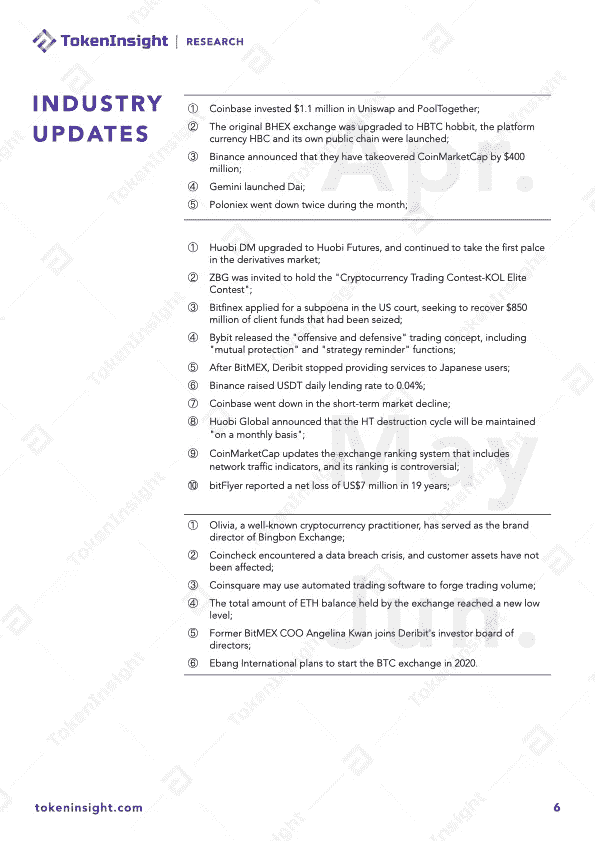

# Q2 2020 年加密货币衍生品交易所行业报告

> 原文：<https://medium.com/coinmonks/q2-2020-cryptocurrency-derivatives-exchange-industry-report-bb3f441a8a54?source=collection_archive---------2----------------------->

# 概观

总体来看，第二季度加密货币交易市场的表现不如第一季度。主要原因是市场在整个 6 月份波动很小，并在很长一段时间内保持横向。比特币减半带来的市场人气已经消耗殆尽，赚钱效应低的时候，整个市场相对安静。

根据我们的研究，相信在不久的将来，衍生产品市场，尤其是合约交易的竞争将会加剧。造成这种情况的核心原因是因为现阶段不同交易所的产品形态不完整。当类似产品(远期永续、反向永续、交割、期权)完成后，竞争格局将再次被打破。

通过我们的研究和判断，从长远来看，USDT 合约将占据主流市场。因此，现阶段，在远期合约中处于领先地位的交易所将具有更大的优势。反向合约市场将继续存在。现阶段，大仓位在反向合约中仍然占比较高的比例，特别是在 BitMEX 交易所。

今年第一季度可交割合约的交易量迅速上升，其中最具吸引力的是火币。最近，币安也推出了可交割合约。我们判断，更多的交易所也将在不久的将来推出可交割合约。未来，Huobi 和 OKEx 的交割合约的市场份额很可能会下降；币安的可交割合约也将占据部分市场，而 Bybit 如果推出可交割合约，也将获得一定的市场份额。

对于用户来说，总体合约市场的杠杆率应该在 20-50 倍之间。高杠杆率的使用会缩短普通用户的生命周期。在这个阶段，合约用户的生命周期大约是两个月。需要注意的一点是，很多平台采取的是“客户流失”模式。用户在行业内亏损后，交易所赚的资金，其实有很大一部分是转出行业的。所以衍生品领域的高风险、高杠杆等不规范行为，其实是在消耗行业和用户的活力。交易所不得不面对高客户获取成本和高留存成本的问题。

专业化是衍生品交易的未来。合约基金交易将占更多交易量；但现阶段加密货币托管基础设施不完善会限制 GP 和 LP 的发展；而 LP 面临的“交易对手风险”也是一个重要因素。

不同交易所之间的价格战是要开始了，但还没有正式开始；相对于传统市场，交易费用仍然处于相对昂贵的阶段，遗憾的是，大多数普通用户对此并不关心。此外，不同交易所在 API、文档规范、质量等方面存在较大差距，基础设施不完善也是阻碍众多专业投资者或基金进入市场的关键因素。一些交易所的 API 和文档缺乏适当的标准和维护。

# 关于 TokenInsight

**token insight 成立于 2017 年，是一家领先的数据&技术驱动的区块链金融机构。** TokenInsight 首创完整的区块链行业分类体系，覆盖超过**1600 个项目，**发布超过 **300 份评级报告，**深入研究 **10 大行业。**

TokenInsight 的数据、评级和研究报告可以访问全球 70 多个数据平台，包括 **Messari、Delta、币安信息、AICoin、火币信息、**等。，月 PV 超过 3000 万。TokenInsight 已正式加入由加密货币排名网站 CoinMarketCap 发起的数据问责与透明联盟(Data)。

> [*在您的收件箱中直接获得最佳软件交易*](https://coincodecap.com/?utm_source=coinmonks)

# 如果您喜欢我们的研究，请关注我们:

💡官方网站:[https://www.tokeninsight.com](https://www.tokeninsight.com/)

📌领英官方页面:[https://www.linkedin.com/company/tokeninsight/](https://www.linkedin.com/company/tokeninsight/)

🔎电报:[https://t.me/TokenInsightOfficial](https://t.me/TokenInsightOfficial)

🗺推特:[https://www.twitter.com/tokenInsight](https://www.twitter.com/tokenInsight)

📕https://www.reddit.com/r/TokenInsight/