# Q2 2020 年 DeFi 行业研究报告第 1 部分:dex

> 原文：<https://medium.com/coinmonks/q2-2020-defi-industry-research-report-part-1-dexs-ab7c558a6470?source=collection_archive---------0----------------------->

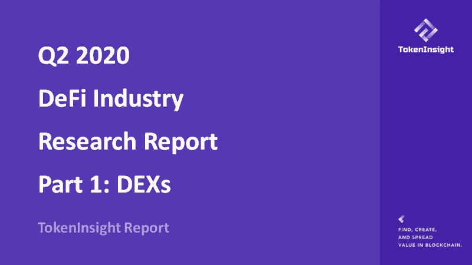

# 新冠肺炎和 DeFi 概述

2020 年上半年，全球新冠肺炎疫情已经破灭，这将成为一个重大的经济冲击，在全球范围内产生连锁反应。分散金融是加密货币行业令人兴奋的一个方面，尽管全球经济低迷，加密货币行业仍在以显著的速度继续创新和增长。

分散式金融生态系统在 2019 年下半年加速增长，我们在 2019 年 DeFi 年度行业报告中报道了这一增长，MakerDao、Uniswap 和 Compound Finance 等领先项目在 DeFi 生态系统中占据了稳固的地位。

2020 年上半年最令人沮丧的时刻是全球金融市场动荡也蔓延到加密货币行业的日期，即 2020 年 3 月 12 日的黑色星期四，当时该行业出现了全市场恐慌，市场流动性枯竭，导致全市场清算，并为加密货币市场，特别是 DeFi 生态系统中出现的全系统结构性风险打开了大门。

当许多业内人士一厢情愿地认为这个行业会在全球经济危机中大放异彩，就像我们现在正在经历的一样。不幸的是，黑色星期四市场的崩溃向许多人证明了加密货币金融市场与传统领域相互关联，产生了级联效应，影响了加密货币市场的每个方面。

我们仍在这个早期生态系统中快速增长，需要一个稳健、结构化的分散金融系统来向世界交付下一代金融系统。黑色星期四事件是对 DeFi 金融系统的早期压力测试，该行业团结一致，成功通过了早期压力测试。

全球零约束利率可能会将资金从传统市场重新导向 DeFi 生态系统，该生态系统的利率明显高于传统系统的利率，尽管与传统制度相比会吸引更高的风险。

《Q2 2020 年 DeFi 行业报告》的目的是揭示这个快速发展的 DeFi 生态系统，并作为一个组织在区块链空间寻找、创造和传播价值。《Q2 2020 年 DeFi 行业报告》分为多个部分，包括交易(dex、衍生品和预测市场)、发行(稳定账户、借贷、不可替代代币)、资产管理、DeFi 基础设施和其他、投资和评级，我们与基础实验室合作完成这一部分。

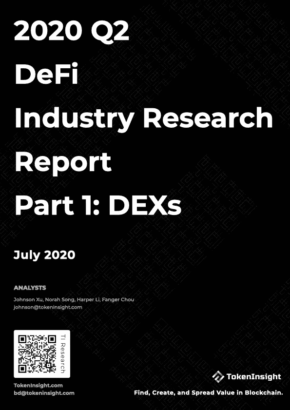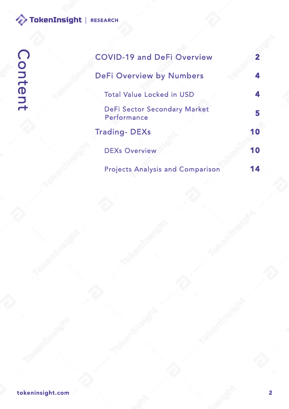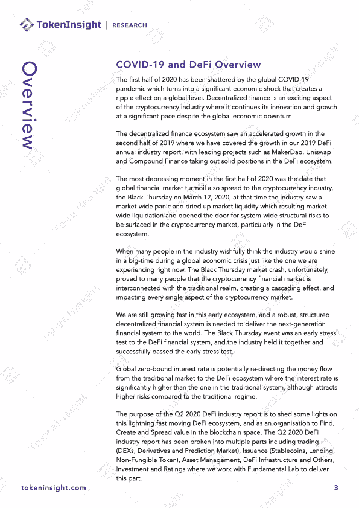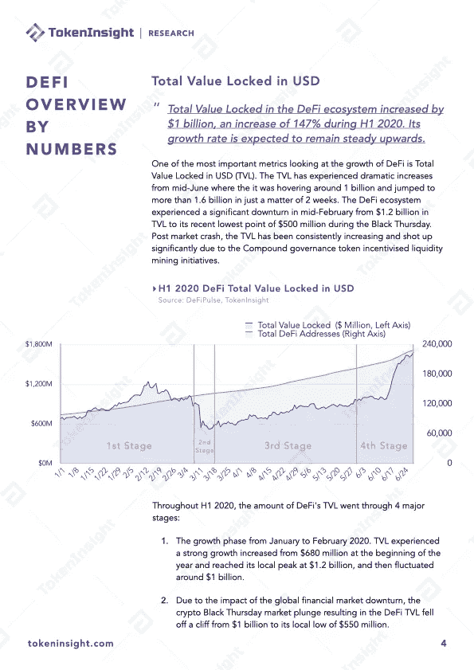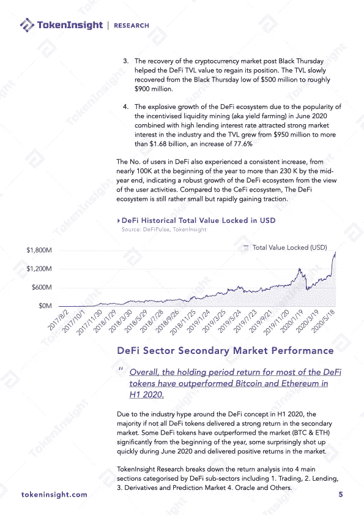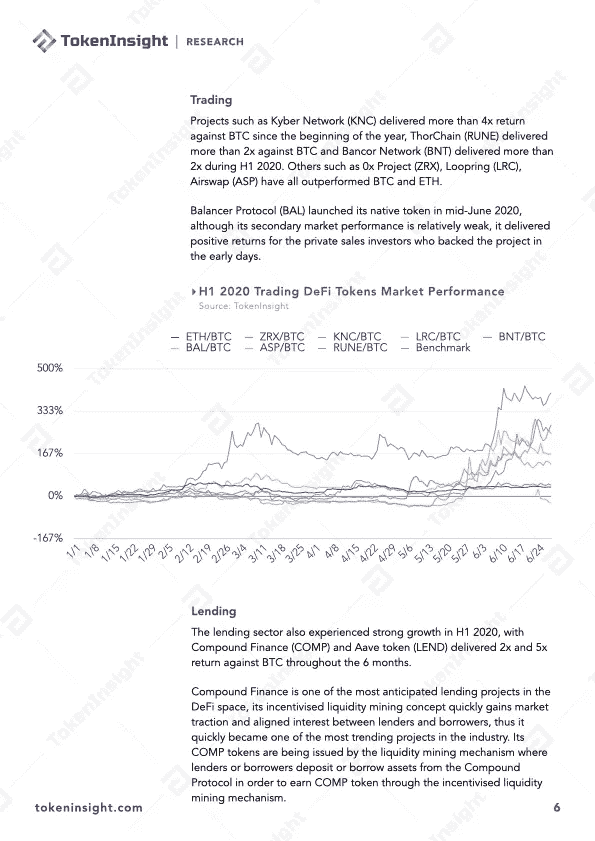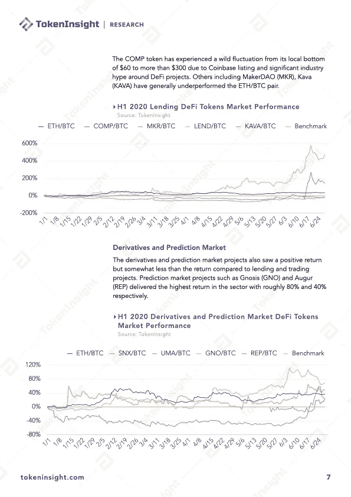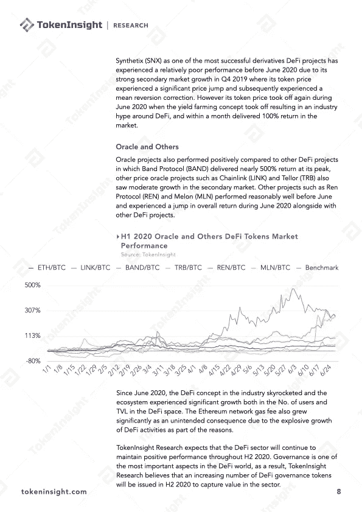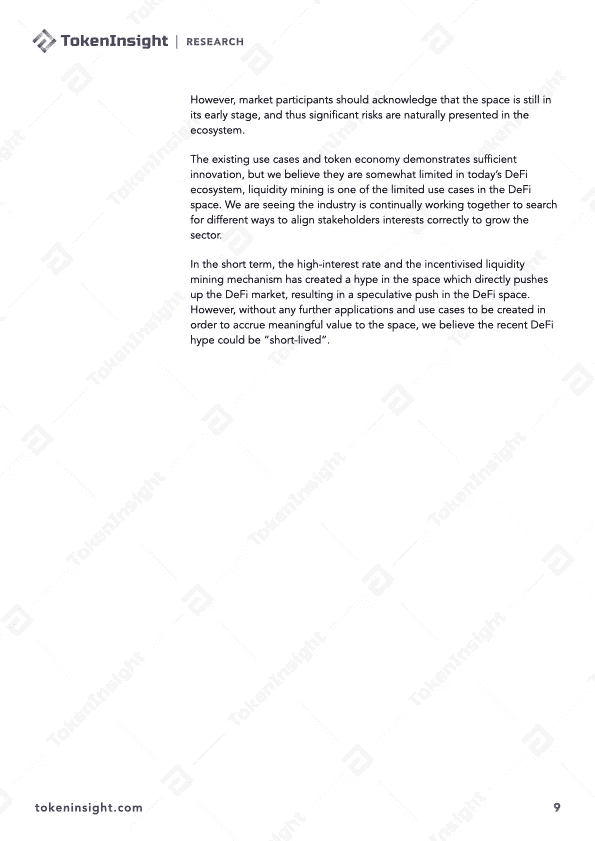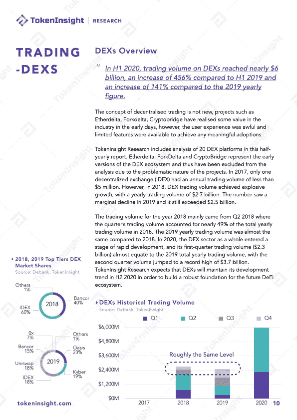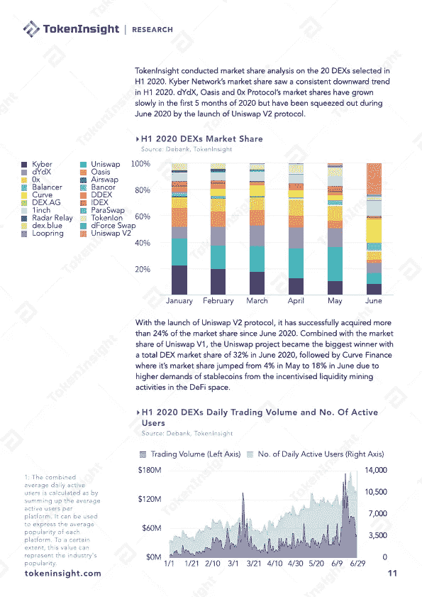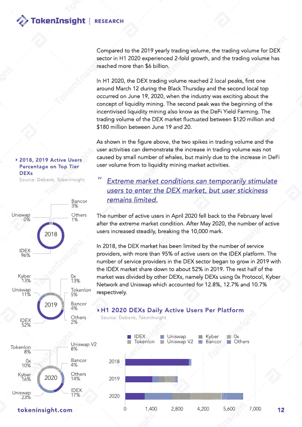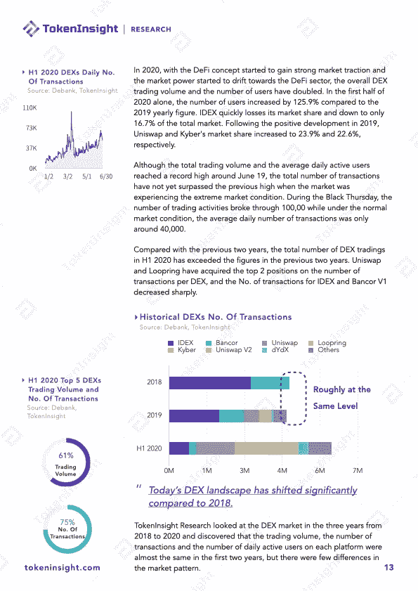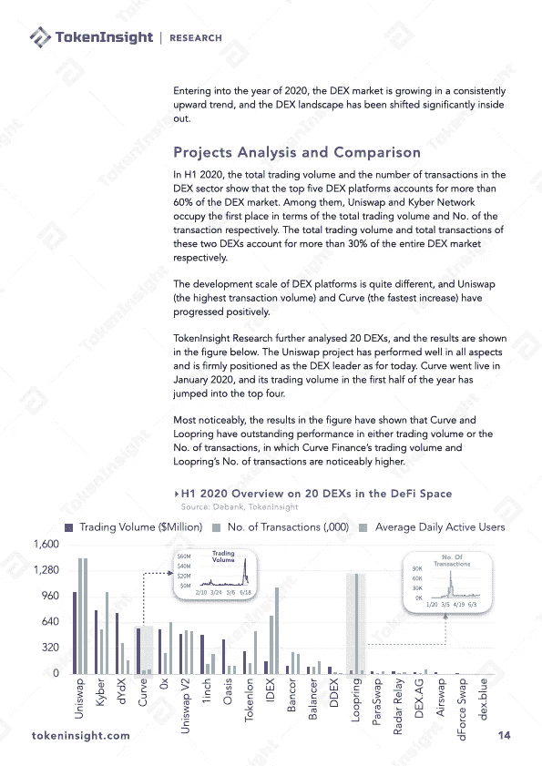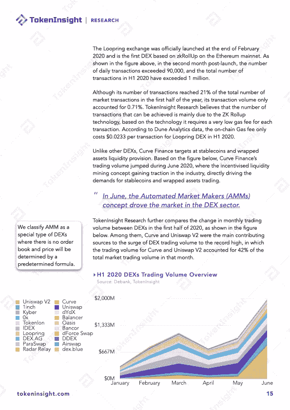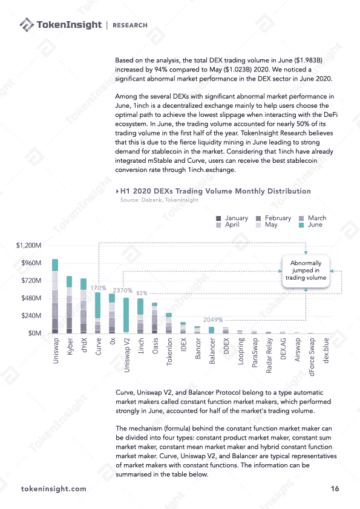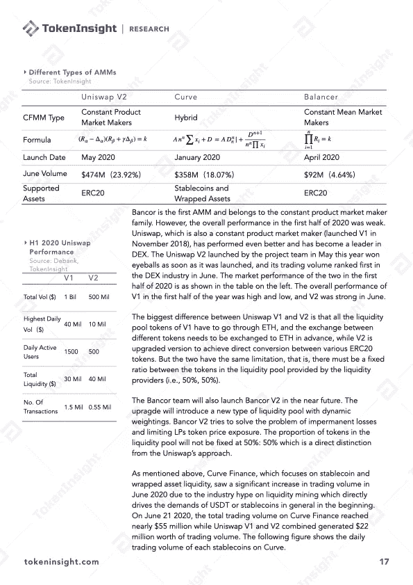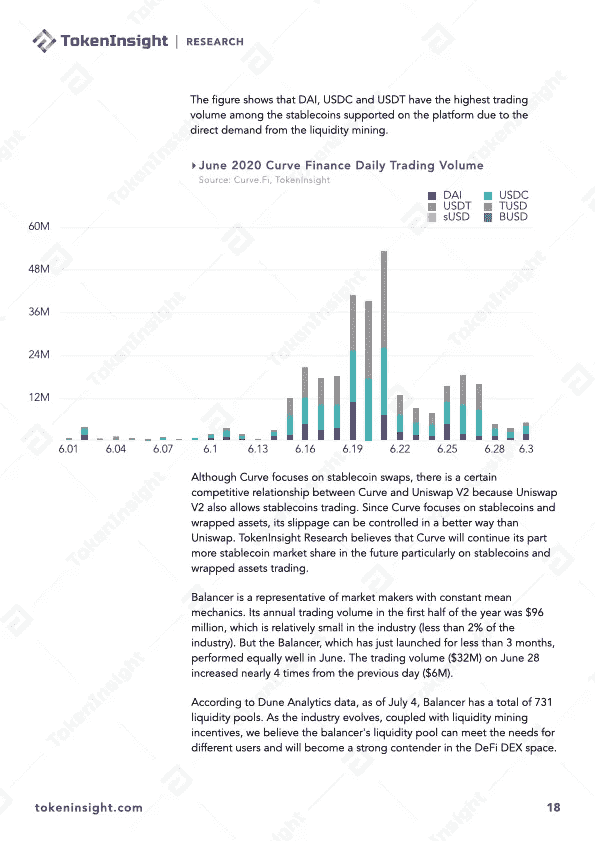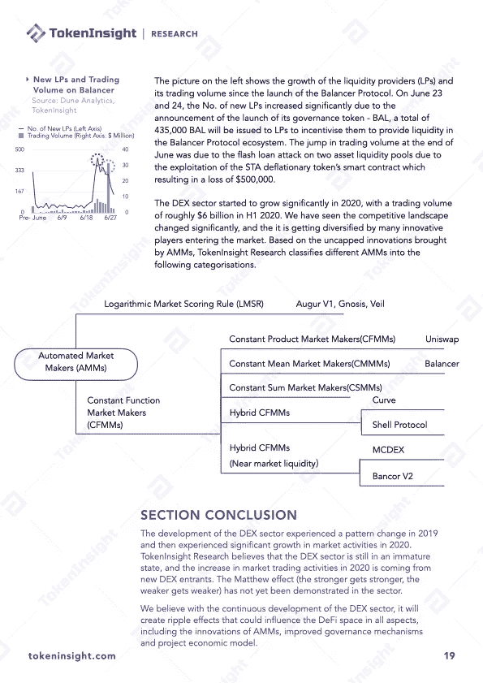

# 关于 TokenInsight

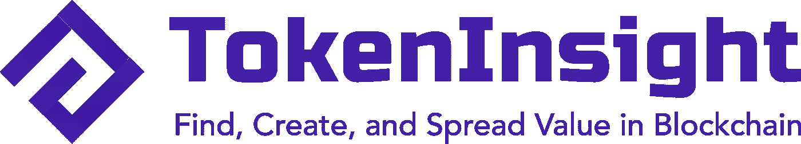

**token insight 成立于 2017 年，是一家领先的数据&技术驱动的区块链金融机构。** TokenInsight 首创完整的区块链行业分类体系，覆盖超过**1600 个项目，**发布超过 **300 份评级报告，**深入研究 **10 大行业。**

TokenInsight 的数据、评级和研究报告可以访问全球 70 多个数据平台，包括 **Messari、Delta、币安信息、AICoin、火币信息、**等。，月 PV 超过 3000 万。TokenInsight 已正式加入由加密货币排名网站 CoinMarketCap 发起的数据问责与透明联盟(Data)。

> 直接在您的收件箱中获得最佳软件交易

# 如果您喜欢我们的评论，请关注我们:

💡官方网站:[https://www.tokeninsight.com](https://www.tokeninsight.com/)

📌领英官方页面:[https://www.linkedin.com/company/tokeninsight/](https://www.linkedin.com/company/tokeninsight/)

🔎电报:

🗺https://www.twitter.com/tokenInsight

📕https://www.reddit.com/r/TokenInsight/