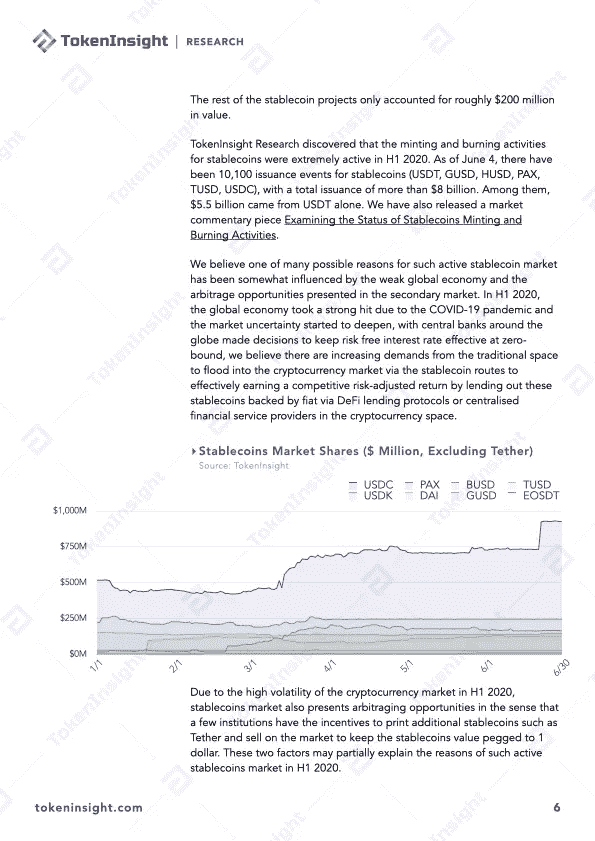

# Q2 2020 年 DeFi 行业研究报告第 2 部分:发行(稳定债券、贷款、不可替代代币)

> 原文：<https://medium.com/coinmonks/q2-2020-defi-industry-research-report-part-2-issuance-stablecoins-lending-non-fungible-token-e169b5f1b3a5?source=collection_archive---------2----------------------->

# 发行概述

[DeFi](https://blog.coincodecap.com/the-ultimate-guide-to-defi-decentralized-finance)2020 年不仅仅是一个概念，根据 DeFiMarketCap 的数据，DeFi 板块的总市值在 H1 2020 年继续创新高。截至 2020 年 7 月 13 日，DeFi 板块总市值已超过 80 亿美元。

在 H1 2020 年，稳定的硬币市场在市场活动方面整体经历了强劲的增长。Tether (USDT)仍然占据市场主导地位，但其他稳定的城市如、、、sUSD 和戴也在不同方面取得了正增长。作为 DeFi 行业的主要应用之一，借贷市场在 2020 年 H1 经历了一个与更广泛的加密货币市场一起波动的时期，锁定的美元总价值增加了 176%，同时不可替代令牌(NFT)行业正在积极发展，但仍然缺乏一些关键的市场要素来加快 DeFi 行业的强劲增长趋势。

# 关于 TokenInsight

**token insight 成立于 2017 年，是一家领先的数据&技术驱动的区块链金融机构。** TokenInsight 首创完整的区块链行业分类体系，覆盖超过**1600 个项目，**发布超过 **300 份评级报告，**对 **10 大行业进行深入研究。**

TokenInsight 的数据、评级和研究报告可以访问全球 70 多个数据平台，包括 **Messari、Delta、币安信息、AICoin、火币信息、**等。，月 PV 超过 3000 万。TokenInsight 已正式加入由加密货币排名网站 CoinMarketCap 发起的数据问责与透明联盟(Data)。

> 直接在您的收件箱中获得最佳软件交易

