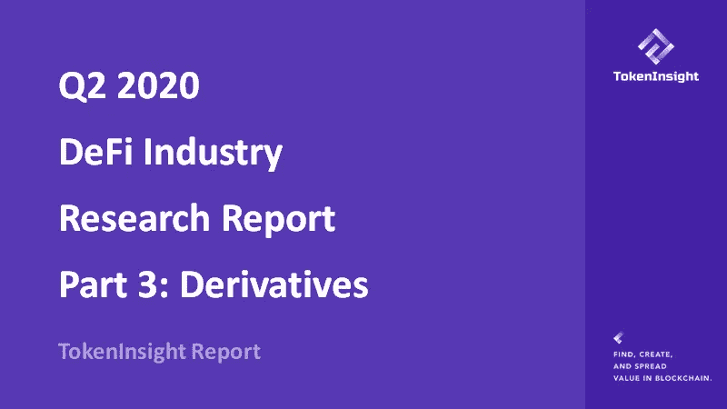
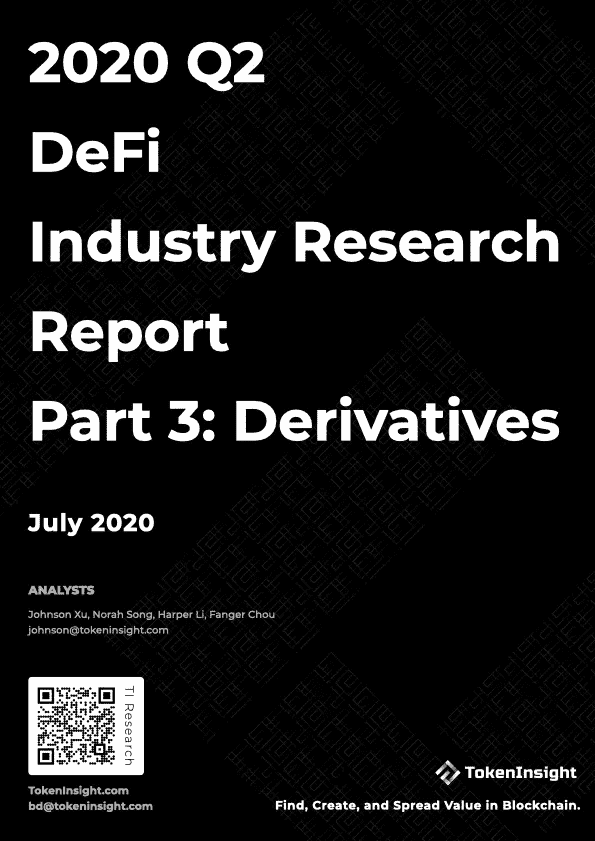
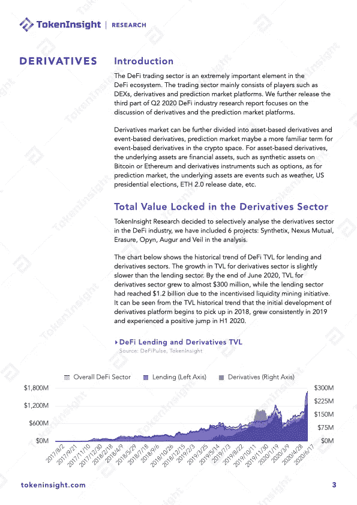
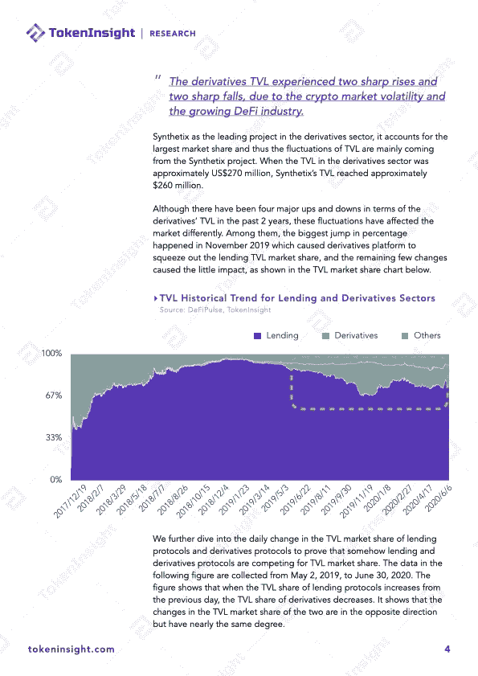
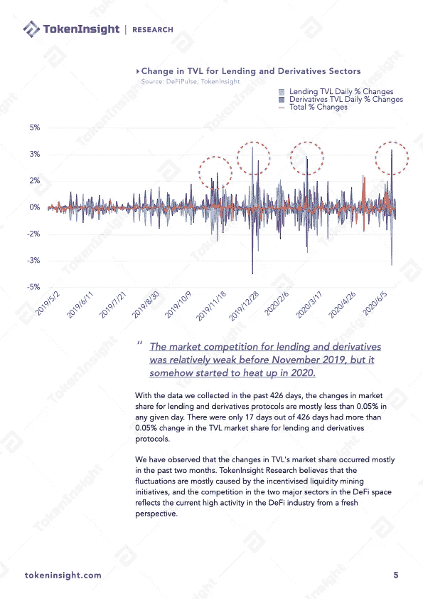
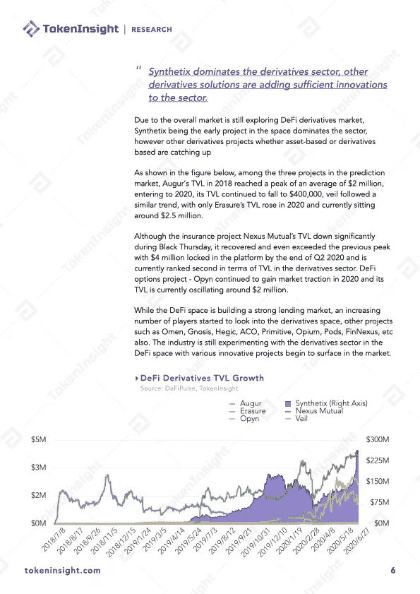
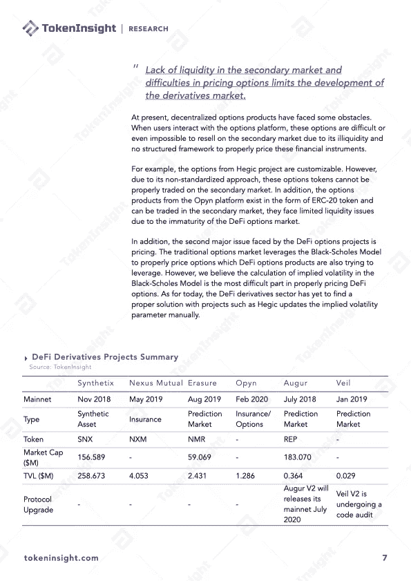
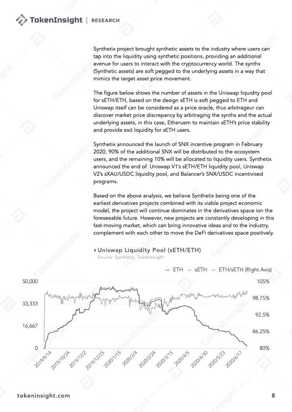

# Q2 2020 DeFi 行业研究报告第 3 部分:衍生品

> 原文：<https://medium.com/coinmonks/q2-2020-defi-industry-research-report-part-3-derivatives-ddd45df046b7?source=collection_archive---------3----------------------->

# DeFi 衍生品概述

DeFi 交易部门是 DeFi 生态系统中极其重要的一环。交易板块主要由 dex、衍生品、预测市场平台等玩家组成。我们进一步发布《Q2 2020 DeFi 行业研究报告》第三部分，重点讨论衍生品和预测市场平台。

衍生产品市场可以进一步分为基于资产的衍生产品和基于事件的衍生产品，预测市场可能是密码领域中基于事件的衍生产品的一个更熟悉的术语。对于基于资产的衍生品，底层资产是金融资产，如比特币或以太坊上的合成资产和期权等衍生工具，至于预测市场，底层资产是天气、美国总统选举、ETH 2.0 发布日期等事件。

# 关于 TokenInsight

**token insight 成立于 2017 年，是一家领先的数据&技术驱动的区块链金融机构。** TokenInsight 首创完整的区块链行业分类体系，覆盖超过**1600 个项目，**发布超过 **300 份评级报告，**对 **10 大行业进行深入研究。**

TokenInsight 的数据、评级和研究报告可以访问全球 70 多个数据平台，包括 **Messari、Delta、币安信息、AICoin、火币信息、**等。，月 PV 超过 3000 万。TokenInsight 已正式加入由加密货币排名网站 CoinMarketCap 发起的数据问责与透明联盟(Data)。

# 如果您喜欢我们的研究，请关注我们:

💡官方网站:[https://www.tokeninsight.com](https://www.tokeninsight.com/)

📌领英官方页面:[https://www.linkedin.com/company/tokeninsight/](https://www.linkedin.com/company/tokeninsight/)

🔎电报:[https://t.me/TokenInsightOfficial](https://t.me/TokenInsightOfficial)

🗺https://www.twitter.com/tokenInsight

📕https://www.reddit.com/r/TokenInsight/

> [*在您的收件箱中直接获得最佳软件交易*](https://coincodecap.com/?utm_source=coinmonks)

