# Q2 2020 年 DeFi 行业研究报告第 4 部分:资产管理、基础设施及其他

> 原文：<https://medium.com/coinmonks/q2-2020-defi-industry-research-report-part-4-asset-management-infrastructure-and-others-ceef015ad57e?source=collection_archive---------4----------------------->

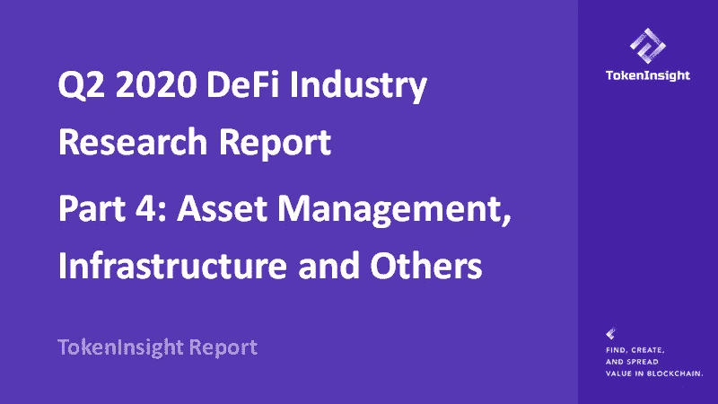

# DeFi 资产管理概述

DeFi 行业的强劲增长刺激了 DeFi 资产管理项目的发展，其中一些项目旨在使用户与 DeFi 世界的互动更加轻松。

由于 DeFi 空间的碎片化，允许用户与多个 DeFi 平台交互的一站式资产管理解决方案有限。钱包和资产管理工具有能力连接和整合不同的借贷和交易平台。随着 DeFi 行业的发展，此类项目的必要性变得更加明显。与此同时，资本涌入 DeFi 领域，催生了对 DeFi 基金管理和资产管理门户解决方案的市场需求。

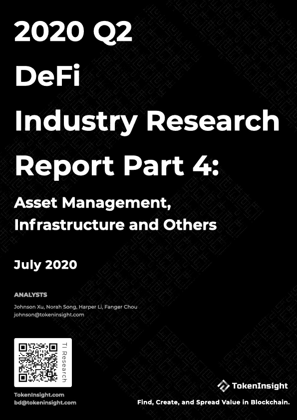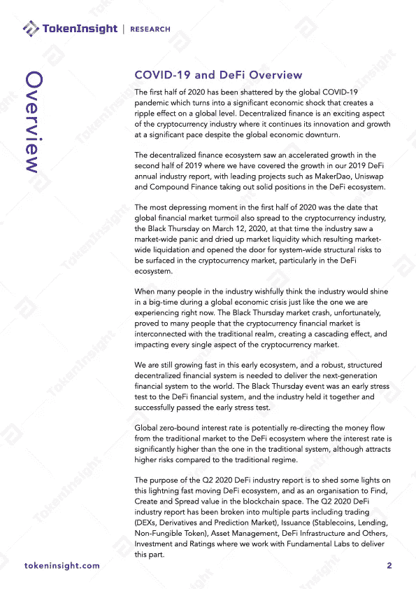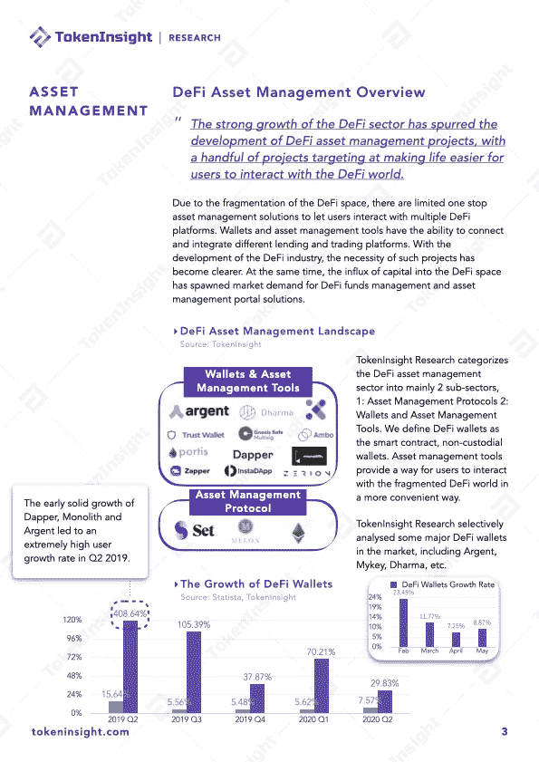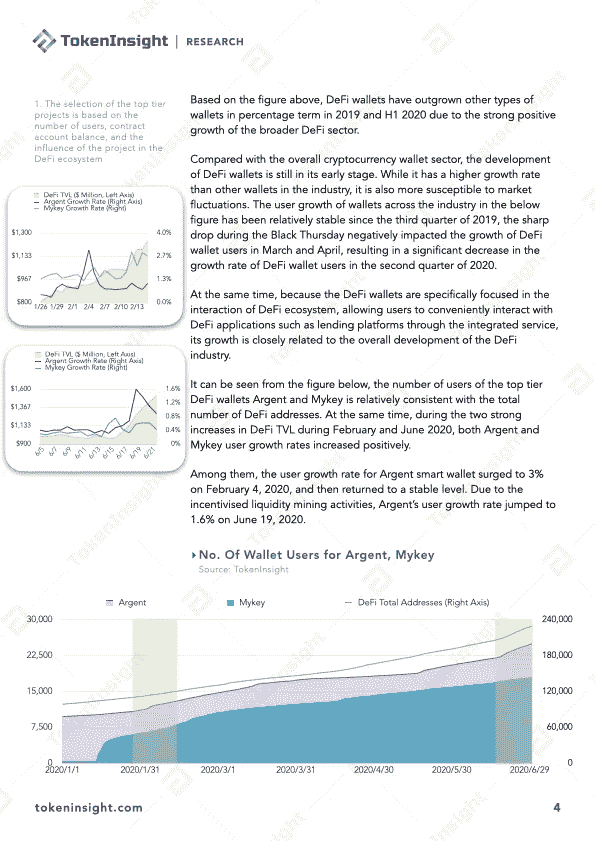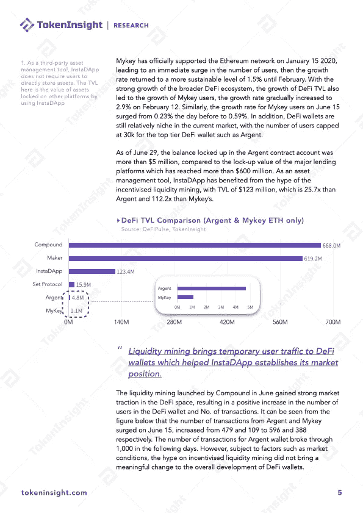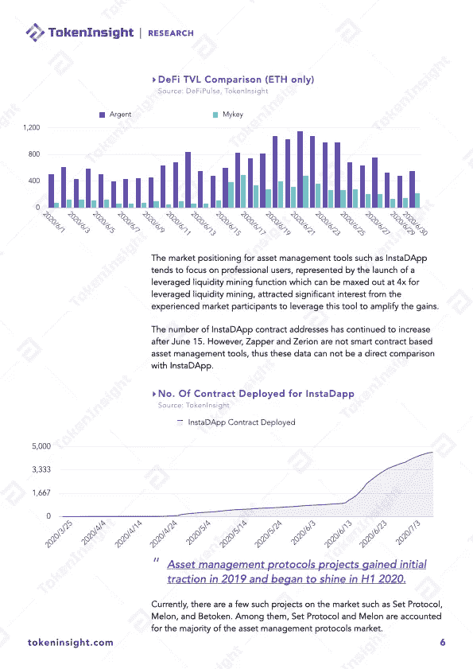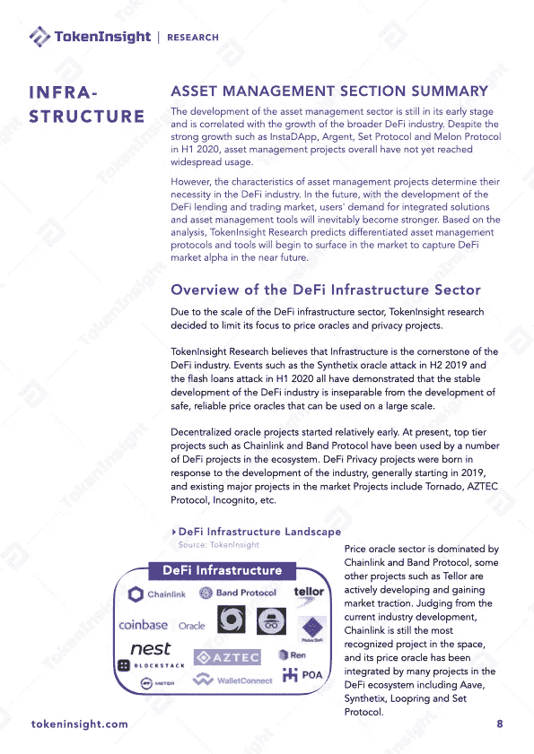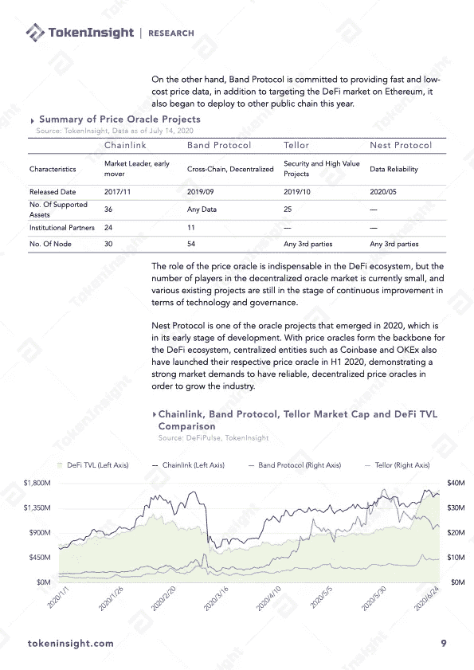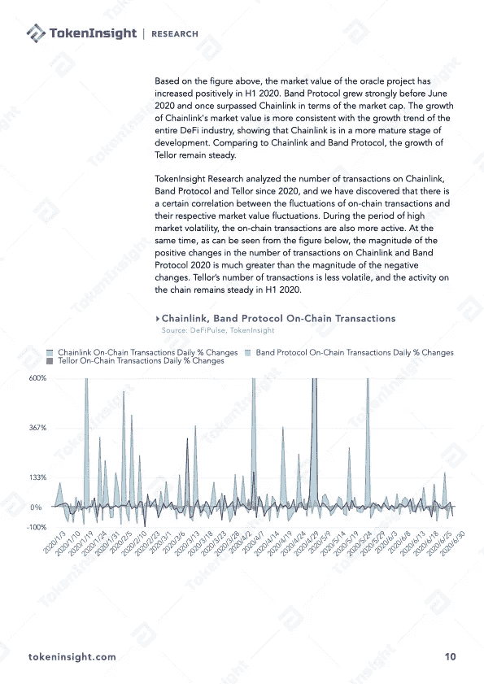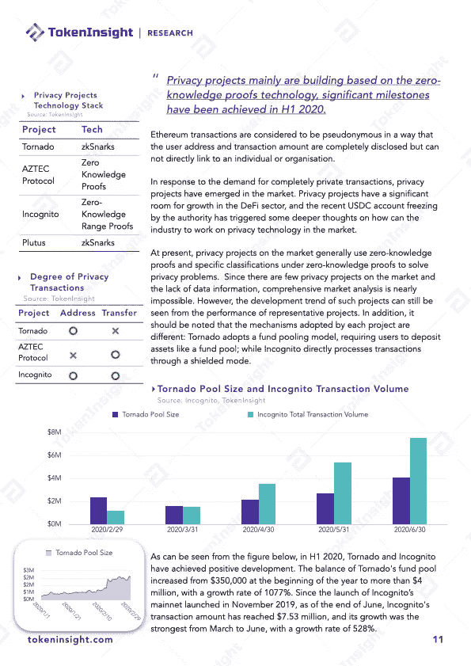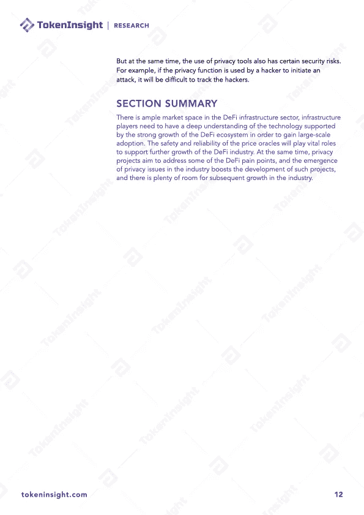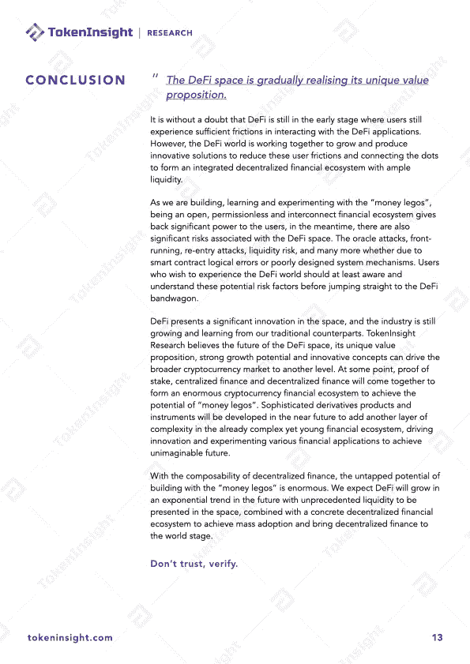

# 关于 TokenInsight

**token insight 成立于 2017 年，是一家领先的数据&技术驱动的区块链金融机构。** TokenInsight 首创完整的区块链行业分类体系，覆盖超过**1600 个项目，**发布超过 **300 份评级报告，**深入研究 **10 大行业。**

TokenInsight 的数据、评级和研究报告可以访问全球 70 多个数据平台，包括 **Messari、Delta、币安信息、AICoin、火币信息、**等。，月 PV 超过 3000 万。TokenInsight 已正式加入由加密货币排名网站 CoinMarketCap 发起的数据问责与透明联盟(Data)。

> [*在您的收件箱中直接获得最佳软件交易*](https://coincodecap.com/?utm_source=coinmonks)

# 如果您喜欢我们的研究，请关注我们:

💡官方网站:[https://www.tokeninsight.com](https://www.tokeninsight.com/)

📌领英官方页面:[https://www.linkedin.com/company/tokeninsight/](https://www.linkedin.com/company/tokeninsight/)

🔎电报:[https://t.me/TokenInsightOfficial](https://t.me/TokenInsightOfficial)

🗺推特:[https://www.twitter.com/tokenInsight](https://www.twitter.com/tokenInsight)

📕https://www.reddit.com/r/TokenInsight/