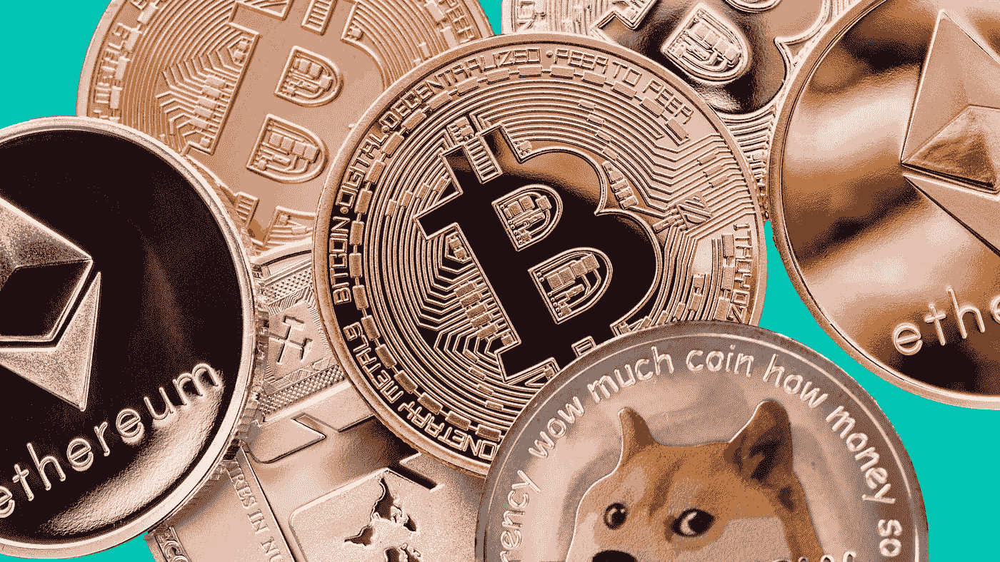
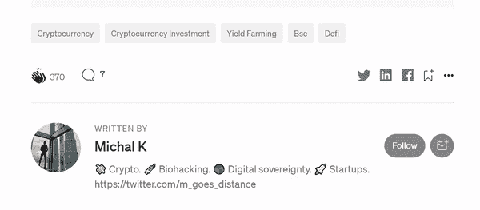

# 2021 年第 3 季度的加密—私人投资者的观点

> 原文：<https://medium.com/coinmonks/q3-2021-in-crypto-a-private-investors-take-62f060de3776?source=collection_archive---------6----------------------->

我们在 crypto 度过了有趣的 3 个月。从 7 月份每比特币 29k 美元的低点，到本月早些时候 53k 美元的高点，然后再次回落到 43k 美元，部分原因是宏观经济的不确定性以及对美国和中国加密法规的恐慌。到目前为止，虽然这些消息似乎都没有真正改变游戏规则，但如果我们缩小范围，我们仍然明显高于今年年初，尽管有所降温。希望这种上升趋势继续下去，尽管上述发展需要密切关注。

总的来说，与 3 个月前相比，我的投资组合以美元计算上涨了 32.7%。这比这一时期比特币价格的涨幅高出 14.6%，这意味着有选择地投资各种加密令牌一直在获得回报。我目前持有的最大投资组合是以太坊，其次是比特币(合计占投资组合的 60%)。其余的在 NFTs、DeFi 和社交令牌之间划分(按数量级降序排列)。

不可替代代币(NFT)是本季度最热门的趋势，我的投资组合将继续利用这一趋势，包括游戏 NFT，这可能是目前资金最充足的行业。

与今年早些时候相比，去中心化金融(DeFi)令牌没有看到太大的增长，但 DeFi 仍然是目前最强的加密用例之一，所以我仍然有选择地投资于我认为有前途和目前被低估的 DeFi 产品。(有几个)。

社交代币是另一个最近才出现的类别，但显示出很大的前景——由代币激励的人们共同努力构建、推广和消费各种产品的社区——可能成为加密内外的主要力量。对于我持有的两个最大的社交令牌——班克莱斯和珍妮·元宇宙——我现在既是它们各自的分散自治组织(Dao)的持有人，也是它们的积极贡献者——两者都密切关注并帮助塑造社区的发展。

> 订阅 [**Coinmonks Youtube 频道**](https://www.youtube.com/c/coinmonks/videos) 获取每日加密新闻。-

## **下一季度展望(推测)**

展望未来，最好的情况是，自去年以来我们一直处于的上升趋势(或牛市)在加密领域继续发展，比特币达到新的历史高点，这通常会带动加密市场的其余部分随之上涨。当这种情况发生时，这基本上是容易的钱，因为无论你持有什么都有利润可赚。牛市里很容易成为天才！

中间情况是，在过去几个月之后，比特币继续在有限的范围内横向移动(尽管波动性可能仍然相对较高)。这意味着利润要少得多(如果有的话)，但它有利于留出时间对新项目进行更彻底的研究，并着眼于建立一个长期的生态系统，为未来的进一步增长奠定基础。

糟糕的情况是，自去年以来我们一直处于的上行周期以一个戏剧性的下行螺旋结束-类似于我们在 2018 年初看到的情况。在中短期内，这可能意味着以美元计算的重大损失。然而，我的绝大多数头寸都是我认为具有长期潜力的项目，即使在可能的熊市中，我也愿意长期持有。与 2018 年类似，尽管比特币的价值大幅下跌，但在 BTC 再次反弹至历史高点并超越历史高点后，持有比特币但没有出售的人最终获得了利润。

因此，我相信我的投资组合无论在何种情况下都处于有利位置。也就是说，所有这些都只是我的个人观点，关于我个人的私人基金管理策略。本声明中的任何内容都不应被视为财务建议。星期五快乐！

-

要了解更多关于我的加密之旅，请点击这里或➡️查看我的其他文章[在 twitter 上关注我](https://twitter.com/m_goes_distance)🐦。如果你喜欢这篇文章，请鼓掌-

> 加入 Coinmonks [电报频道](https://t.me/coincodecap)和 [Youtube 频道](https://www.youtube.com/c/coinmonks/videos)了解加密交易和投资

## 另外，阅读

*   [尤霍德勒 vs 科恩洛 vs 霍德诺特](/coinmonks/youhodler-vs-coinloan-vs-hodlnaut-b1050acde55a) | [Cryptohopper vs 哈斯博特](https://blog.coincodecap.com/cryptohopper-vs-haasbot)
*   [币安 vs 北海巨妖](https://blog.coincodecap.com/binance-vs-kraken) | [美元成本平均交易机器人](https://blog.coincodecap.com/pionex-dca-bot)
*   [新加坡十大最佳加密交易所](https://blog.coincodecap.com/crypto-exchange-in-singapore) | [购买 AXS](https://blog.coincodecap.com/buy-axs-token)
*   [投资印度的最佳密码](https://blog.coincodecap.com/best-crypto-to-invest-in-india-in-2021) | [HitBTC 评论](/coinmonks/hitbtc-review-c5143c5d53c2)
*   [加拿大最好的加密交易机器人](https://blog.coincodecap.com/5-best-crypto-trading-bots-in-canada) | [赌注加密](https://blog.coincodecap.com/staking-crypto)
*   [如何在印度购买比特币？](/coinmonks/buy-bitcoin-in-india-feb50ddfef94) | [WazirX 评论](/coinmonks/wazirx-review-5c811b074f5b)
*   [比特币主根](https://blog.coincodecap.com/bitcoin-taproot) | [Bitso 评论](https://blog.coincodecap.com/bitso-review) | [排名前 6 的比特币信用卡](/coinmonks/bitcoin-credit-card-bc8ab6f377c6)
*   [最佳免费加密信号](https://blog.coincodecap.com/free-crypto-signals) | [YoBit 评论](/coinmonks/yobit-review-175464162c62) | [Bitbns 评论](/coinmonks/bitbns-review-38256a07e161)
*   [huo bi 的加密交易信号](https://blog.coincodecap.com/huobi-crypto-trading-signals) | [BitMEX 评论](https://blog.coincodecap.com/bitmex-review)
*   [7 个最佳零费用加密交易平台](https://blog.coincodecap.com/zero-fee-crypto-exchanges)
*   [分散交易所](https://blog.coincodecap.com/what-are-decentralized-exchanges) | [比特 FIP](https://blog.coincodecap.com/bitbns-fip) | [Pionex 审查](https://blog.coincodecap.com/pionex-review-exchange-with-crypto-trading-bot)
*   [用信用卡购买密码的 10 个最佳地点](https://blog.coincodecap.com/buy-crypto-with-credit-card)
*   [OKEx 评论](/coinmonks/okex-review-6b369304110f) | [Kucoin 交易机器人](/coinmonks/kucoin-trading-bot-automate-your-trades-8cf0ca2138e0) | [期货交易机器人](/coinmonks/futures-trading-bots-5a282ccee3f5)
*   [AscendEx Staking](https://blog.coincodecap.com/ascendex-staking)|[Bot Ocean Review](https://blog.coincodecap.com/bot-ocean-review)|[最佳比特币钱包](https://blog.coincodecap.com/bitcoin-wallets-india)
*   [霍比审核](https://blog.coincodecap.com/huobi-review) | [OKEx 保证金交易](https://blog.coincodecap.com/okex-margin-trading) | [期货交易](https://blog.coincodecap.com/futures-trading)