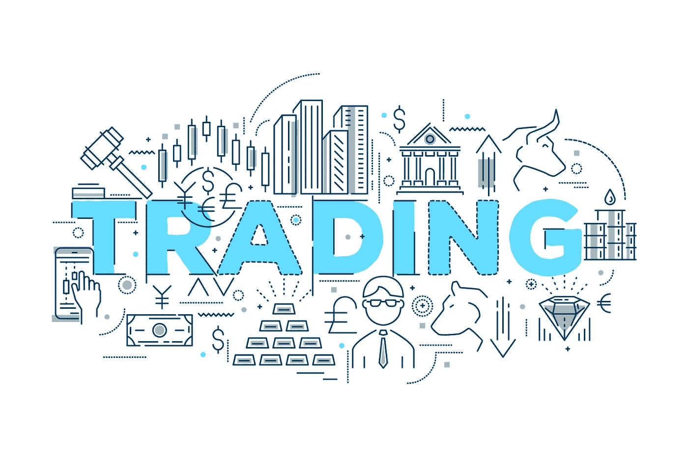

# QFL 密码交易策略

> 原文：<https://medium.com/coinmonks/qfl-strategy-for-trading-crypto-50d2e69b4491?source=collection_archive---------4----------------------->

QFL Strategy for Trading Crypto

如果你已经从事加密买卖有一段时间了，你不应该感到震惊，除了策略，赚钱的可能性微乎其微，因为这将成为一场赌博，而不是交易。尤其是被视为过度波动的加密市场，需要一种严肃的态度。所以在你开始交易之前，理解你将如何做是很重要的。哪种方法最适合你。交易趋势和目标？密码买卖的一个著名技巧是 QFL。让我们更深入地了解一下它所代表的意义，以及它能如何帮助你。

# 什么是 QFL 交易策略？

你可能已经读过了:“[什么是上升三角形模式交易分析](https://cryptoworldfinace.blogspot.com/2021/12/what-is-ascending-triangle-patterns.html)”、“[使用支持和阻力进行交易加密](https://cryptoworldfinace.blogspot.com/2021/12/uses-support-and-resistance-for-trading.html)、“[加密泵和转储方案。](https://cryptoworldfinace.blogspot.com/2021/11/crypto-pump-and-dump-schemes.html) QFL 代表 Quickfingersluc，有时也被称为基本策略。它的基本思想是搞清楚第二种恐慌促进和购买的基础水平。如果你能意识到 QFL 策略，你就能在寻找硬币的图表时获得没有经验的人和粉红色蜡烛的经验。认识到图表的行为将使你更容易计算推广或购买你着迷的加密货币的适当时间。为了更好地理解，最重要的是密切关注与烛台图上的费用运动相关的基本原则。

# [支持](https://cryptoworldfinace.blogspot.com/2021/12/uses-support-and-resistance-for-trading.html)级别

指的是以前达到的最低充电阶段，比速率再次开始增长的第二阶段要早。在这个水平上，你可以意识到一些加密货币的购买者做出了坚定的反应。

# 反转阶段

可以发现当硬币的价格开始上升时，当它达到了基本水平后，就可以很容易地向上转移。你可以见证消费者强烈反应后的逆转影响，这种反应再次推高了利率。

# [阻力](https://cryptoworldfinace.blogspot.com/2021/12/uses-support-and-resistance-for-trading.html)等级

指的是在放大停止之前的完全硬币费，并且比率再次开始下降。阻力阶段是你在恐慌性抛售之前看到的阶段，这个系统会拉低硬币的价格。

# 裂缝

指的是在从基础阶段到随后的反弹水平的一段距离处，跑马灯有一个坚固的脉冲运动的第二个时间。裂缝有助于形成保护区。

> 阅读:[加密货币交易的成交量是多少？](https://cryptoworldfinace.blogspot.com/2021/12/what-is-volume-in-cryptocurrency-trade.html)
> 
> [在业务中长期使用加密货币的好处](https://cryptoworldfinace.blogspot.com/2021/11/benefits-of-using-cryptocurrency-in.html)

# 如何在密码交易中使用 QFL 方法？

在我们保护了基本术语之后，我们现在可以过渡到合理使用 QFL 了。让我们来看看这个基地战略**所关注的动向。**

# 选择要交易的货币对

这是从交易平台获取收入的一个关键动议。快速图表技巧:由于硬币费经常上下波动，电荷波动类似于鞭子。考虑到他们有几个进入点，不像稳定的市场，这些不稳定市场的现金允许商人赚取收入。正如我们所知，密码市场上的大多数现金都符合这一要求，因为它的波动性是公认的。

# 找到有更大反弹的坚实基础(逆转)

高反弹的特点是费用从基础水平大幅增加。所以首先你应该学习图表，主要是基于历史统计数据，遇到一个坚实的基础阶段，从这个阶段开始反弹，并分析其强度。当利率低于前一个基准水平时，就可以确定一个坚实的基础。更高的反弹意味着市场有一个强大的反应，这可以使你的 QFL 交易运动有利可图。

# 寻找恐慌收入可能发生的时间

找出恐慌收入出现的频率，市场回到之前的基础水平。当你理解了基础阶段和恐慌收益频率，你就可以在未来新的裂缝出现时进行投资。当一个破解发生时，那个能力你在保护区，是时候购买你参与的硬币了。

既然您已经学习了图表并理解了基础水平，您应该为自己准备一个合适且可靠的加密软件程序来监控加密货币的电荷移动。这一步是至关重要的，考虑到你现在可能不会显示硬币的图表

# 当利率低于基本水平时买入

当加密货币降到剩余的基础等级以下时，购买加密货币。这通常发生在商家由于恐惧的事实而开始恐慌促销时，或者由于“鲸鱼”决定操纵图表并通过促销他们的大部分投资在不同的买家中展开恐慌。在那之后，你可以指望这些“鲸鱼”在利率大幅下降时购买更多。正确的做法是，当图表中有一根长长的粉红色蜡烛线时，抓住这一秒，并在此时买入。

# 设定一个目标，并在反弹时提升(逆转)

老实说，在硬币电荷增加或何时开始再次脱落之前，没有百分之百的危险可以预测其程度。因此，如果你不再选择忽略可行的利润，设定你倾向于出售的目标费用是至关重要的。当加密货币低于基本水平时，购买加密货币是必不可少的。目的是当它开始反弹时，你将有一个值得的优势。所以，当你看到一个强劲的买家的反应，费用开始再次向上转移，这是获利的适当时机。

# 分散你的买卖订单，以最大化最终结果和管理风险

用你的设备设定几笔购买和促销订单，以扩大你获利的可能性。在这种情况下，你可以将你的投资分散在几个订单中，而不是一次性全押。如果你遵循增量购物策略，这将为你提供一个机会，在价格出现额外下降的情况下，你可以进行多次购物。同样的道理也适用于销售:如果你增加促销，如果你的加密货币价格增加，你将能够获得额外的收入。这种阶梯订单可以通过以非常高的费用点购买/销售或推广您的硬币或爱好的方式再次为您提供服务。[阅读更多](https://cryptoworldfinace.blogspot.com/2021/12/qfl-strategy-for-trading-crypto.html)。

> 加入 Coinmonks [电报频道](https://t.me/coincodecap)和 [Youtube 频道](https://www.youtube.com/c/coinmonks/videos)了解加密交易和投资

## 也阅读

 [## 杠杆代币[多头代币]终极指南

### 杠杆化令牌是具有杠杆化风险敞口的 ERC20 令牌，不考虑保证金、要求、管理…

medium.com](/coinmonks/leveraged-token-3f5257808b22)  [## 最佳加密交易所| 2021 年十大加密货币交易所

### 编辑描述

blog.coincodecap.com](https://blog.coincodecap.com/crypto-exchange)  [## 2021 年最佳加密交换平台| CoinCodeCap

### 编辑描述

blog.coincodecap.com](https://blog.coincodecap.com/best-swap-platforms)  [## 2021 年最佳加密借贷平台| 6 大比特币借贷平台

### 获得比特币和其他加密货币的最佳贷款利率

medium.com](/coinmonks/top-5-crypto-lending-platforms-in-2020-that-you-need-to-know-a1b675cec3fa)  [## 2021 年 6 大最佳硬件钱包|顶级加密硬件钱包[更新]

### 最好的加密货币硬件钱包是绝对必要的。我们将在 NGRAVE、Ledger Nano X 和…

medium.com](/coinmonks/the-best-cryptocurrency-hardware-wallets-of-2020-e28b1c124069)  [## 2021 年最佳免费加密交易机器人

### 2021 年币安、比特币基地、库币和其他密码交易所的最佳密码交易机器人。四进制，位间隙…

medium.com](/coinmonks/crypto-trading-bot-c2ffce8acb2a)  [## 最佳 4 个加密交易信号电报通道

### 这是乏味的找到正确的加密交易信号提供商。因此，在本文中，我们将讨论最好的…

medium.com](/coinmonks/best-crypto-signals-telegram-5785cdbc4b2b)  [## 获取信号、交易机器人和套利

### 编辑描述

blog.coincodecap.com](https://blog.coincodecap.com/bitsgap-review)