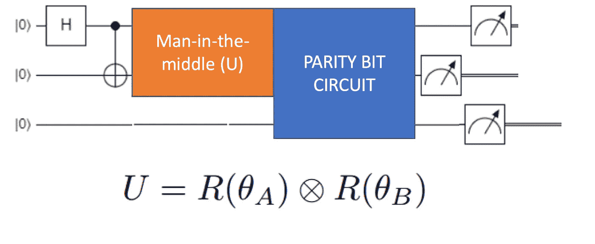
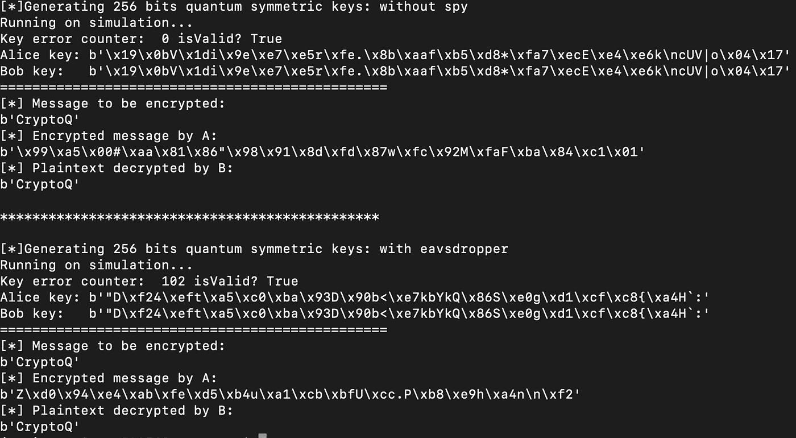

# Qiskit Hackathon Madrid 2019 —第 1 部分

> 原文：<https://medium.com/coinmonks/qiskit-hackathon-madrid-2019-part-1-9a6139419ad8?source=collection_archive---------0----------------------->

## 开发量子密钥分发和理解 Qiskit。

Photo by [david latorre romero](https://unsplash.com/@latorware?utm_source=medium&utm_medium=referral) on [Unsplash](https://unsplash.com?utm_source=medium&utm_medium=referral)

我在 Qiskit 在欧洲举办的第一次黑客马拉松中度过了一段美好的时光，我学到了很多东西，因此我决定应该有一组专门的帖子来分享我的经验，并希望能教给你一些我对量子计算的有限知识。

**在这次黑客马拉松之前，我对量子计算几乎一无所知**(完全公平地说，我读过一些关于这个主题的书，但如果你想知道的话，我没有物理学博士学位)。除此之外，我还知道一点密码学和计算机科学，仅此而已。

首先，对于世俗的事物，什么是？Qiskit 是一个开源的量子计算框架。简而言之，借助 Qiskit，我们能够在本地机器上轻松构建、测试和模拟量子计算电路和算法。为了给这个库增加一些刺激， **Qiskit 还允许你在 IBM 的量子计算机**中运行你的量子电路和算法(你可以在 5 量子位或 16 量子位的量子计算机中运行你的程序。足以让你一窥量子在现实生活中的表现。小小的建议？当心噪音:)。

黑客马拉松的目的是使用 Qiskit 构建一个项目。**由于我在密码学方面的背景(和热爱)，我决定在黑客马拉松中使用量子计算来构建某种密码系统。**我思考了密码学中的开放性问题，并意识到使用量子计算来尝试和优化经典的对称密钥交换算法(如 Diffie-Hellman)将会非常酷。我想消除各方之间的一些交互，以及基于素数的密钥生成(你知道，由于 [Shor 算法](https://en.wikipedia.org/wiki/Shor's_algorithm)和其他东西)。

我们在开始我们的项目时考虑了以下系统模型:Alice 和 Bob(当然)希望使用经典通道和经典加密算法来交换加密数据，但他们希望使用独立于他们的数据通道的量子(安全)通道来生成和共享用于加密的对称密钥。**为此，Alice 和 Bob 使用了一个量子随机数生成器和一组纠缠比特来进行密钥的生成和交换。**

Key Exchange System Model (by: [Alfonso de la Rocha](https://medium.com/u/68450c6af241?source=post_page-----9a6139419ad8--------------------------------))

一旦理解了要解决的问题和编程框架，在 Qiskit 中构建它就非常简单了(每一方一个量子位，其中一方有一个哈玛德门，两者之间有一个 CNOT 来完成这项工作)。那时**我们决定在我们的系统模型中加入一个新的团体，Eve，一个恶意的代理人，试图扰乱、窃听或破坏我们的量子链路，**，从而破坏我们的密钥交换协议。

**我们用一组旋转矩阵模拟了 Eve 的影响。在我们的量子链路中有一个外部观察者会增加我们信道中的噪声。我们想要模拟的是在 B 测量之前 Eve 的观察或干扰的效果。考虑到这些假设，通过一组应用于被中间人操纵的特定量子位的旋转矩阵来为我们的中间人建模是很有意义的。甚至，通过旋转矩阵的角度，我们可以模拟 Eve 对海峡的干扰强度。**

Basic circuit for our quantum key distribution. (by: [Alfonso de la Rocha](https://medium.com/u/68450c6af241?source=post_page-----9a6139419ad8--------------------------------))

使用 Qiskit 编程是一项更有趣、更具挑战性的工作，但对于 24 小时的黑客马拉松来说仍然不够。**然后，我们决定使用奇偶量子位作为工具来检测密钥分发渠道上的潜在噪声或恶意影响。**我们的 A 和 B 的量子位都是纠缠的，因此在测量它们时，它们必须坍缩到相同的值。如果不是这样，说明渠道出了问题。因此，我们开发了一种量子电路，如果两个量子位的值相同，它的宇称量子位就会被设定为 1，否则就会被设定为 0。我们将这个同位量子位元与金钥的每个独立量子位元一起传送，让接收者可以侦测出是否有东西干扰了金钥交换。

因此，密钥一次生成并共享一个量子位，每一位都发送一个额外的奇偶校验量子位。该算法的实现使得**如果发送者和接收者在奇偶量子位中测量到一个零，该位密钥将被丢弃，因为很可能在交换过程中发生了一些事情。**

**在我们的算法中，我们还实现了我们所谓的“安全阈值”，**，这意味着发送方和接收方可以提前商定在量子信道中接受的干扰的最大数量**，因此，如果在密钥分发中丢弃了数量大于安全阈值的比特，**密钥将被标记为无效**，并且将触发新的密钥生成。根据我们的量子设备的噪声，该安全阈值可以被设置为基线水平，因为信道中的部分干扰可能不是由于中间人，而是由于设备的噪声。**

Example execution of our quantum key distribution. (by: [Alfonso de la Rocha](https://medium.com/u/68450c6af241?source=post_page-----9a6139419ad8--------------------------------))

通过我们的量子通道生成和共享我们的密钥，**我们可以无缝地使用我们的经典算法来加密和解密我们的数据**(如上面描述的样本执行所示)。检查[我们项目的 github repo](https://github.com/adlrocha/cryptoq) 以防你想尝试我们的算法。

我想这对于这个系列的第一篇文章来说已经足够了。这个量子密钥分发只是我们项目的第一阶段。实际上，**这个阶段只是学习 Qiskit 和玩量子计算概念的一个借口，这样我们就可以转移到更有趣的事情上，比如区块链量子共识的发展。在下一篇文章中，我们将谈论我们全新的 **QRP 共识**，但是你必须等到下周。请随时与我联系，获取关于该项目的反馈或进一步信息的请求。**

> [直接在您的收件箱中获得最佳软件交易](https://coincodecap.com/?utm_source=coinmonks)

