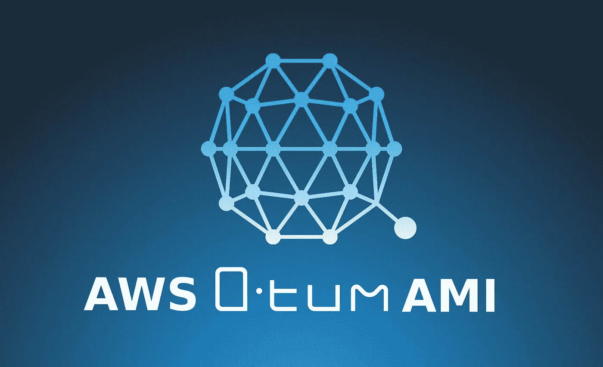

# Qtum Dapp 开发人员—在 AWS EC2 实例上运行 QTUM AMI

> 原文：<https://medium.com/coinmonks/qtum-set-up-a-node-with-aws-b76b6b56ec71?source=collection_archive---------6----------------------->

AWS — QTUM AMI

2018 年 7 月，AWS 在其市场上发布了 QTUM 亚马逊机器图像(AMI)。它包括:

**Qtum 核心**、 **Qmix web IDE** 、**坚固度**。

当我第一次想尝试这个 QTUM AMI 时，我没有找到任何关于如何设置它的分步教程。我最终自己搜索了如何做，并认为 ATUM 开发者社区可以从这样的教程中获益。

# 先决条件:

*   一个 AWS 账户。*如果您还没有，您可以享受 12 个月的免费等级，这将使您每月无需支付长达 750 小时的 EC2 使用费用。*
*   【Linux 基础知识

# 步骤 1:让我们创建一个 AWS 密钥对

*注意:如果您已经设置了想要使用或重用的密钥对，则不需要执行第 1 步，这也不特定于 QTUM AMI 的使用。这是所有 AWS EC2 实例的要求。*

你有两个选择:

遵循官方 [AWS 文档创建密钥对](https://docs.aws.amazon.com/AWSEC2/latest/UserGuide/ec2-key-pairs.html#having-ec2-create-your-key-pair):

**或**

遵循以下步骤:

1/首先转到[服务> EC2](https://console.aws.amazon.com/ec2)

2/转到*网络&安全* > *密钥对*(在左侧菜单中)

3/点击*创建密钥对*按钮

4/选择一个名称(本例中我们将使用 **QTUM** )并点击*创建*按钮

5/ [T](https://docs.aws.amazon.com/AWSEC2/latest/UserGuide/ec2-key-pairs.html#having-ec2-create-your-key-pair) 私钥是一个文件——在我们的例子中命名为**qtum . PEM**——它将在此时自动下载。这是你唯一可以保存它的时间。你以后会需要它，所以把它保存在安全的地方。例如在目录中:

**~/。宋承宪**

要移动它，您可以使用以下命令(如果 QTUM.pem 位于~/Downloads 目录中):

**mv ~/Downloads/QTUM.pem ~/。宋承宪/**

6/使用命令为此文件设置正确的权限:

**chmod 400 ~/。ssh/QTUM.pem**

*请注意，在本教程的后面部分，设置这些权限是连接到实例的必要步骤。如果我们跳过它，您将收到一条警告消息。*

祝贺你！**您已经成功创建了与 AWS EC2 实例**一起使用的密钥对。

# 步骤 2:让我们在 EC2 实例上启动 QTUM AM

1/回到 [*服务* > *EC2*](https://console.aws.amazon.com/ec2/)

2/点击*启动实例*

3/在左侧菜单中，点击 *AWS 市场*

4/搜索“QTUM”

5/当在标记位置找到 **QTUM AMI** 时，点击*选择*按钮

6/出现一个模态，显示 QTUM AMI 信息。如果你想读，点击*继续*

7/选择一个实例类型。对于本教程，我使用了相对较小的 **t2.small** ，这不是太贵。*如果您符合 Free Tier 资格，并希望利用每月 750 小时的免费时间，您应该使用****T2 . micro***

8/点击*查看并启动*

9/显示审查页面。在实际启动实例之前，您可以在这里检查所有细节。准备好后点击右下角的*发射*按钮。

10/会出现一个模式，让您选择所需的密钥对来关联到您的 EC2 实例。选择*选择一个现有的密钥对*，然后选择*QTUM**(*除非您给密钥对起了不同的名字*)。滴答确认消息。点击*启动实例*按钮完成*

*祝贺你！您的 QTUM AMI 实例现在正在启动！您可以在显示的页面上点击*查看实例*进入您的实例。*

**注意:您的实例准备就绪需要一些时间，但是几秒钟后，您应该会看到您的实例的状态为正在运行，状态检查正在完成。**

# *步骤 3:连接到正在运行的 Qtum 实例*

*1/转到*服务*>*EC2*>*运行实例**

*2/找到您的 **QTUM 实例**(如果您从未使用过 AWS EC2，您将只有一个)，选择它(通过点击它)，并点击*动作>连接*按钮。*

*3/出现一个带有连接信息的模式，复制示例，看起来应该是这样的(当然地址不会相同):*

***ssh-I " qtum . PEM " root@ec2–xx–xxx–xx–xxx.eu-west-2.compute.amazonaws.com***

*4/打开您的终端，粘贴命令。然后将其修改为如下所示:*

***ssh -i ~/。ssh/qtum . PEM ubuntu@ec2–xx–xxx–xx–xxx.eu-west-2.compute.amazonaws.com***

*注:我们只是将**根**替换为 **ubuntu** — *这是针对我们安装的 QTUM AMI—*和**【QTUM . PEM】**替换为 **~/。ssh/QTUM.pem，**我们之前放下载的私钥文件的位置。*

*祝贺你！**您现在使用 SSH 登录到运行在 AWS ECS2** 上的 QTUM AMI 实例。*

# *第四步:下一步是什么？*

*首先阅读 AMI 内部的 QTUM AMI 文档。
用 ssh 连接到您的实例(上一步)后，只需运行:*

***男人。/README.man***

*现在，如果您想学习在 EC2 实例上运行的全新 QTUM AMI 的基本用法，请查看本教程中专门针对 QTUM AMI 的以下部分:*

*第 2 部分: [Qtum Dapp 开发者 QTUM AMI 在 AWS EC2 实例上的基本用法](/@clement0bresson/qtum-dapp-developper-basic-usage-of-qtum-ami-on-aws-ec2-c9c234d578ce)*

***快乐文档阅读&编码！***

*如果您有任何想法/建议，发现了错误，和/或希望我更详细地描述某些部分，请不要犹豫评论这篇文章，这样我可以改进本教程。*

*你喜欢你读到的东西吗？帮我投入更多的时间在 QTUM 上写作。
QTUM 地址:***qyc 3 ftqyvstyucrrvrvfv 4 qkhk 5 GQ 4 wkie****

> *[直接在您的收件箱中获得最佳软件交易](https://coincodecap.com/?utm_source=coinmonks)*

**