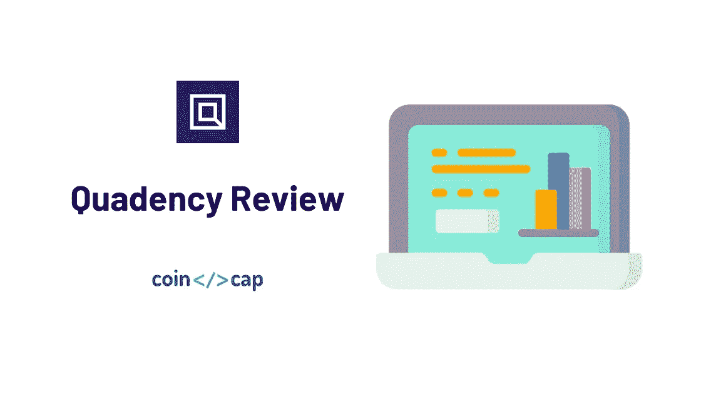
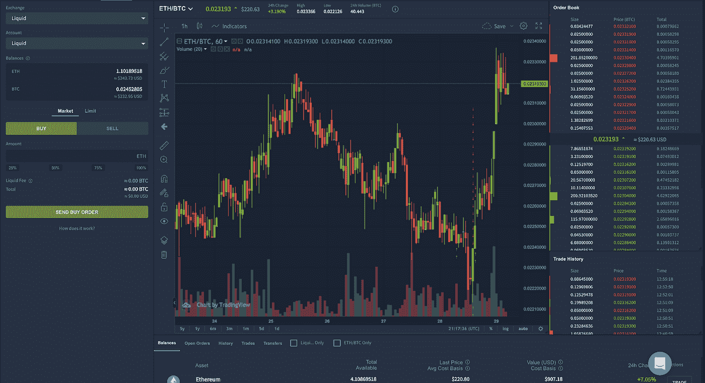
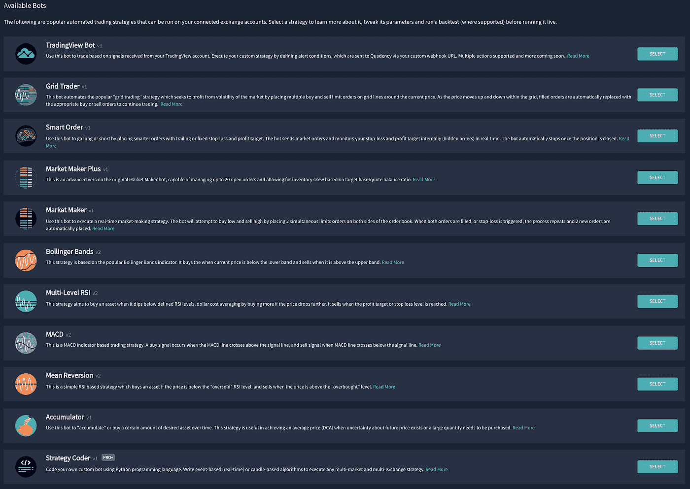
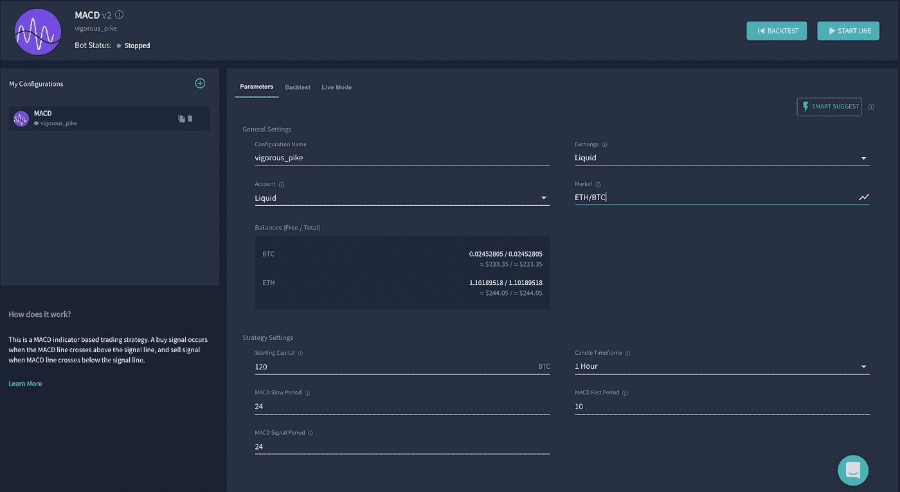
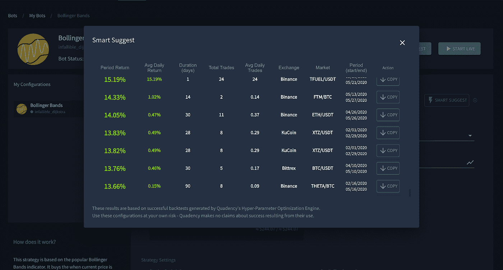
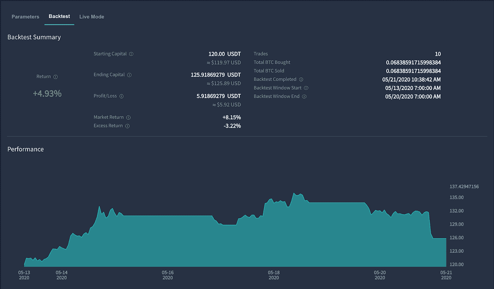
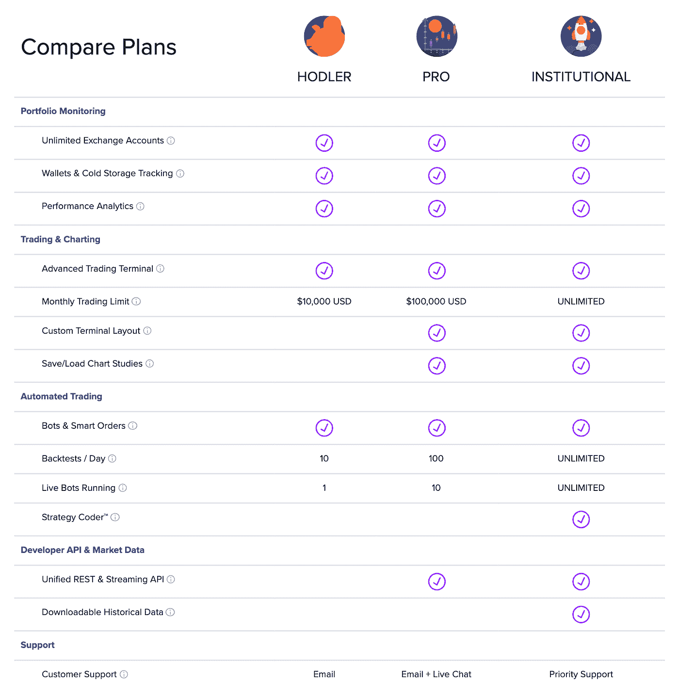

# Quadency Review 2021 |一个面向所有人的加密交易平台

> 原文：<https://medium.com/coinmonks/quadency-review-a-crypto-trading-automation-platform-3068eaa374e1?source=collection_archive---------0----------------------->

## 使用此[链接](https://blog.coincodecap.com/go/quadency)进行注册，然后使用此代码 QPARTNER50 获得任何计划的 50%折扣。

在本文中，我们将回顾 2018 年推出的[密码交易自动化平台](https://coincodecap.com/category/trading-automation)[Quadency](https://quadency.com?r=ea20aa360c45d1f5ad47a19a)。它为您带来了一个更智能的方式来交易，自动化，和管理您的密码。

> 使用此[链接](https://blog.coincodecap.com/go/quadency)进行注册，然后使用代码 QPARTNER50 获得任何计划的 50%折扣。

# 摘要

*   是一个多交易所加密交易和自动化平台。
*   它支持顶级交易所:币安，库币，OKEx，北海巨妖，或液体。
*   你可以在 3 个计划中选择:HODL，专业和机构。
*   这个平台对于初学者和专业人士来说都非常好用。
*   为初学者提供预构建的简单交易机器人
*   允许你用 python 编写自己的交易策略

# 特征

我们可以将所有功能分为 3 个部分:管理、交易和自动化(交易机器人)。

# 管理

[Quadency](https://quadency.com?r=ea20aa360c45d1f5ad47a19a) 拥有一个用于投资组合跟踪的一体化仪表盘。在这个仪表板上，您可以跟踪您在所有关联交易所的整体投资组合表现和配置。用户还可以添加他们的离线钱包来跟踪他们的整个投资组合。

“投资组合”选项卡允许您获得关于每个加密资产的投资组合的更多信息:未结订单、交易、历史和转让。

# 贸易

“交易”标签无缝工作，并将 TradingView 的[高级图表](/coinmonks/what-are-the-best-charting-platforms-for-cryptocurrency-trading-85aade584d80)与 100 多种技术指标和绘图工具集成在一起。它提供了在交易所和账户之间轻松切换的可能性。您可以创建市价单和限价单，并在市场对之间切换。在图表下方，balance 选项卡让您可以快速访问您拥有的所有资产。

Quadency Trading Terminal Review

# 自动化(交易机器人)

目前有 11 个交易机器人可供 Pro plan 用户使用。他们的一些机器人是基于像 MACD 这样的流行指标。还有一些是基于交易策略的，比如 RSI 和网格交易者。TradingView bot 为您提供了将交易视图警报自动转换为交易的可能性。同时，如果你需要更具体的东西，战略编码器是给你的。用户可以使用 Python 编写他们的策略。

**也读:** [**最佳加密交易机器人**](/coinmonks/whats-the-best-crypto-trading-bot-in-2020-top-8-bitcoin-trading-bot-c16adeb13317)

# Quadency 上可用的交易机器人

让我们看看 [Quadency](https://quadency.com?r=ea20aa360c45d1f5ad47a19a) 上的一些交易机器人和自动化策略。

## 投资组合再平衡者

这个投资组合有助于你的投资组合多样化。你可以选择任何资产，并将它们的份额分配到你的投资组合中。因此，每当价格变动时，机器人将根据你的投资组合配置自动清算和购买资产。这个 bot 还可以帮助你将多项资产出售成一项资产，比如[比特币](https://blog.coincodecap.com/a-candid-explanation-of-bitcoin) (BTC)。阅读更多关于[投资组合再平衡](https://blog.coincodecap.com/crypto-portfolio-rebalancing)的信息。

## 网格交易机器人

这个交易机器人自动化了流行的“网格交易”策略，该策略试图通过在当前价格附近的网格线上设置多个买入和卖出限价单来从市场的波动中获利。当价格在网格中上下波动时，已执行的订单会自动被相应的买入或卖出订单替换，以便继续交易。

## 做市商 Bot

这个交易机器人将通过在订单簿的两侧同时下达两个限价订单来帮助您低买高卖，从而实现盈利。当两个订单都被执行，或者止损被触发，这个过程重复，两个新订单被自动下。这种策略也被称为做市。

## 智能订单

使用这个交易机器人，你可以通过设置跟踪或固定止损和利润目标来做多或做空。该机器人发送市场订单，并使用隐藏订单实时监控您的止损和利润目标。一旦平仓，机器人会自动停止。

## 交易视图机器人

您也可以使用 Webhooks 将您的 TradingView 帐户与 [Quadency](https://quadency.com?r=ea20aa360c45d1f5ad47a19a) 整合。因此，您可以根据您的交易视图帐户的信号定义警报条件来执行您的定制策略。该团队还计划通过支持多种操作来扩展这个交易机器人的功能。

## 多级 RSI

这种交易帮助你在资产跌破定义的 [RSI 水平](https://en.wikipedia.org/wiki/Relative_strength_index)时积累资产，并通过在价格进一步下跌时买入更多来帮助你实现[平均成本](https://blog.coincodecap.com/roundlyx-review-bitcoin-dollar-cost-averaging)。当达到利润目标或止损水平时，它就会卖出。

## MACD

这个机器人是基于 [MACD 交易指标](https://en.wikipedia.org/wiki/MACD)。当 MACD 线穿过信号线上方时买入资产，当 MACD 线穿过信号线下方时卖出。

## 平均值回复

这是一个简单的基于 RSI 的策略，如果价格低于“超卖”RSI 水平，买入资产，当价格高于“超买”水平时卖出。

## 蓄电池

这个交易机器人帮助你以特定的价格积累或购买资产。当购买大量资产或实施成本平均法(DCA)时，这是很方便的。

## 创建自己的交易机器人策略

如果以上策略都不适合你， [Quadency](https://quadency.com?r=ea20aa360c45d1f5ad47a19a) 允许你用 Python 编程语言编写自己的交易机器人。您可以编写基于事件(实时)或基于蜡烛线的算法来执行任何多市场和多交易所策略。

Quadency Trading Strategies Review

# 它是如何工作的

开始使用 [Quadency](https://quadency.com?r=ea20aa360c45d1f5ad47a19a) 真的很简单，几分钟就能完成。

*   首先，在 Quadency 上创建您的帐户。
*   第二，用你的 API 密匙把你的账户和一个支持的交易所联系起来。
*   第三:开始交易。

## 6 个月免费专业计划

如果您将您的 Quadency 帐户与他们的官方合作伙伴之一关联，您可以自动申请最长 6 个月的**免费 Pro 计划升级**。所以一定要查看他们的[合作伙伴列表](https://quadency.com/a/onboarding/select-exchange)。要获得升级，只需通过 [Quadency](https://quadency.com?r=ea20aa360c45d1f5ad47a19a) 在所选的交易所*下订单或启动机器人。*

# 四项审查:用户体验

用户界面时尚且易于使用。交易机器人的配置过程很容易，因为每个设置都有一个小工具提示来帮助。所有常规设置都相同，但策略设置不同。您可以直接查看您的余额，并在配置您的机器人时检查市场。

最酷的功能之一可能是智能建议。 [Quadency](https://quadency.com?r=ea20aa360c45d1f5ad47a19a) 提供了数百种有利可图的回溯测试配置，用户可以根据自己的需要进行复制和编辑。

# 回溯测试

回溯测试功能允许您使用历史数据测试您的配置。在回溯测试选项卡中，您将看到回溯测试配置的摘要，以及 ROI 和利润/损失。

支持网站提供文章，帮助用户配置他们的交易机器人或回答他们的任何问题。如果有任何支持问题，可以通过实时聊天直接联系团队。

# 性能和安全性

Quadency 并没有承诺给他们的机器人 X%的利润。性能取决于市场和你的 bot 配置。您的帐户通过 2FA 得到保护。

# 四元定价

[Quadency](https://quadency.com?r=ea20aa360c45d1f5ad47a19a) 提供 3 个方案:HODL，Pro &机构。

**1。HODL** 计划是免费的。

**2。Pro Plan** 起价为每年 39 美元或每月 49 美元。

*   访问智能建议等有限的专业功能。
*   一次运行多达 10 个交易机器人，每天回溯测试多达 100 个配置，享受**无限交易量**。

**3。机构**售价 199 美元。

> 使用此[链接](https://blog.coincodecap.com/go/quadency)进行注册，然后使用此代码 QPARTNER50 获得任何计划的 50%折扣。

# 四项审查:利弊

## 赞成的意见

*   专业级交易工具
*   易于配置
*   直观的界面
*   丰富的交易策略库

## 缺点:

*   保证金交易不可用
*   没有移动应用程序

# 结论

总之，Quadency 是一个统一的平台，在一个全面的界面中提供高级图表、自动化交易和投资组合分析。不管你是新手还是专业交易者，Quadency 绝对适合你！

# 常见问题

q . quad ency 如何帮助新手交易者？

**A.** 可以使用 Quadency 积累资产，使用 Grid trading bot 简单买卖特定范围内的资产。或者只使用一个 Quadency 界面在多个交易所进行交易。

q . quad ency 合法还是安全？

是的，Quadency 是安全合法的。我知道 2018 年的 Quadency 团队，他们正在努力提供加密领域最好的交易机器人软件。

**问:Quadency 有手机 app 吗？**

**答:**目前，Quadency 还没有一款适用于 iOS 或 Android 设备的移动应用。但是，Quadency 有一个完全响应的网站，你可以在手机浏览器上查看。

**问:交易费用是多少？**

A. Quadency 不像比特币基地或币安那样是一个加密交易所。它连接到 crypto exchange，提供强大的交易工具，并根据每月订阅计划收费。

**Q. Quadency 有 API？**

**答:**是的，Quadency 提供了快速、可靠、统一的 API，用于访问加密货币市场数据并在所有主要交易所执行订单。

# 四种选择

1.  [**Bitsgap**](https://blog.coincodecap.com/go/bitsgap) ，满足您所有交易需求的一站式加密交易平台。它允许用户将他们所有的密码交易账户放在同一个屋檐下，通过一个集成的界面进行交易。另外，请阅读我们完整的 [Bitsgap 评论](/coinmonks/bitsgap-review-a-crypto-trading-bot-that-makes-easy-money-a5d88a336df2)。
2.  [**哈森在线**](https://blog.coincodecap.com/go/haasonline) 是加密领域历史最悠久、最负盛名的自动化交易公司之一。他们的卓越声誉来自于他们的交易自动化软件，该软件自 2014 年以来一直为加密交易员执行交易策略。另外，请阅读我们完整的[哈森在线评论](https://blog.coincodecap.com/haasonline-review)。
3.  [**3Commas**](https://blog.coincodecap.com/go/3commas) 是一个在线平台，面向对使用自动化机器人交易加密货币感兴趣的人。对于没有金融技术背景或没有丰富股市经验的人来说，这尤其具有吸引力。另外，请阅读我们完整的[3 商业评论](https://blog.coincodecap.com/3commas-review-an-excellent-crypto-trading-bot)。

**你可能也会感兴趣:**

*   [最佳加密交易机器人](/coinmonks/whats-the-best-crypto-trading-bot-in-2020-top-8-bitcoin-trading-bot-c16adeb13317)
*   最好的比特币[硬件钱包](/coinmonks/the-best-cryptocurrency-hardware-wallets-of-2020-e28b1c124069?source=friends_link&sk=324dd9ff8556ab578d71e7ad7658ad7c)
*   最好的[加密税务软件](/coinmonks/best-crypto-tax-tool-for-my-money-72d4b430816b)
*   [最佳加密交易平台](/coinmonks/the-best-crypto-trading-platforms-in-2020-the-definitive-guide-updated-c72f8b874555)
*   [unis WAP 最佳钱包](/coinmonks/best-wallets-to-use-uniswap-e91a6385d9e8)
*   最佳[密码借贷平台](/coinmonks/top-5-crypto-lending-platforms-in-2020-that-you-need-to-know-a1b675cec3fa)
*   [3Commas vs Cryptohopper](/coinmonks/cryptohopper-vs-3commas-vs-shrimpy-a2c16095b8fe)
*   Bitmex 上的[保证金交易指南](/coinmonks/the-idiots-guide-to-margin-trading-on-bitmex-dbbd7742c6fc?source=friends_link&sk=7bfa99d2a181142510c8442c8ddb0786)
*   [加密摇摆交易权威指南](/coinmonks/the-definitive-guide-to-crypto-swing-trading-7e4af6496d4d?source=friends_link&sk=70448050bd9323b42f63bfc0bb1e60d1)
*   [Bitmex 高级保证金交易指南](/coinmonks/bitmex-advanced-margin-trading-guide-2270c195ce25?source=friends_link&sk=1d986cca731f5084b9a2db4a4bc4a7ad)
*   [开发人员的最佳加密 API](/coinmonks/best-crypto-apis-for-developers-5efe3a597a9f)
*   [加密套利](/coinmonks/crypto-arbitrage-guide-how-to-make-money-as-a-beginner-62bfe5c868f6)指南:新手如何赚钱
*   顶级[比特币节点](https://blog.coincodecap.com/bitcoin-node-solutions)提供商
*   最佳加密制图工具

*包括附属链接

> [直接在您的收件箱中获得最佳软件交易](https://coincodecap.com?utm_source=coinmonks)

*原载于 2020 年 5 月 30 日 https://blog.coincodecap.com***。**