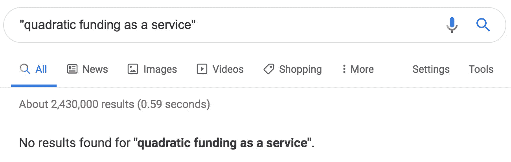

# 二次投资将会激增

> 原文：<https://medium.com/coinmonks/quadratic-funding-will-proliferate-a9197dfacca1?source=collection_archive---------0----------------------->

看到[二次基金](https://papers.ssrn.com/sol3/papers.cfm?abstract_id=3243656)应用于黑客马拉松奖金池将会很酷。它可能的工作方式是，所有参与者通过给他们一些戴来评判顶级黑客马拉松项目。奖池根据参与者的贡献与项目相匹配。它也可以用燃烧令牌代替戴。

二次融资似乎是一种灵活的抽象，在未来几十年的许多用例中，它将找到适合产品市场的方式。

二次资助是灵活的，至少因为给定的用例可以决定其贡献者的性质、贡献者身份验证、贡献、匹配奖金池、筹款轮次等等。例如，贡献者可以是开源开发者、学校董事会的家长、国家、兄弟会成员、城市顾问或影响者粉丝。贡献者认证可能是通过 github 账户、驾照、twitter oauth、学生证、在同一个局域网上、在同一个房间里或者生物特征。贡献可以是代币、一次性代币、法定货币、公司股票、在一个项目上花费的时间或网站访问量。匹配奖金池可以由少数亿万富翁、行业协会成员、研究贿赂基金或数百万政治支持者捐赠。学生社团可以一学期进行一次融资，记者新闻报道报酬可以一天一次，或者每周一次，通过滚动前几周的捐款来表示对创业公司的持续支持。

Gitcoin quadratic funding 的[崛起](https://vitalik.ca/general/2019/10/24/gitcoin.html) [成功](https://vitalik.ca/general/2020/01/28/round4.html)表明，现在可能是创建将 quadratic funding 应用于其他领域的创业公司的好时机。

或许可以将 quadratic funding 作为一种服务出售，这种服务可以充分配置，以便在许多领域中使用。