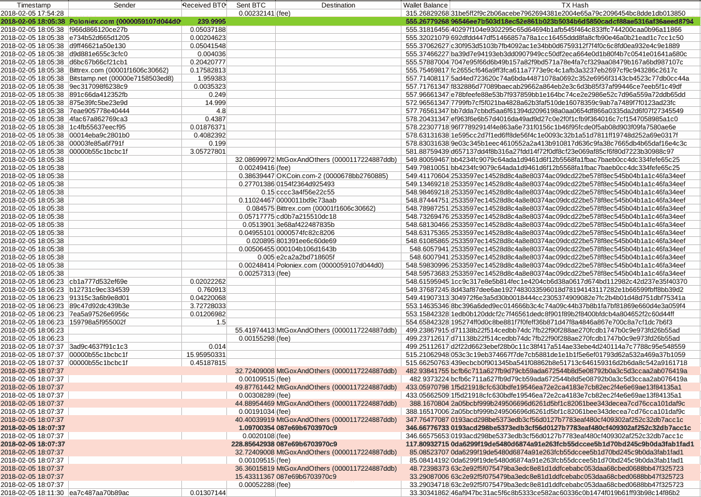
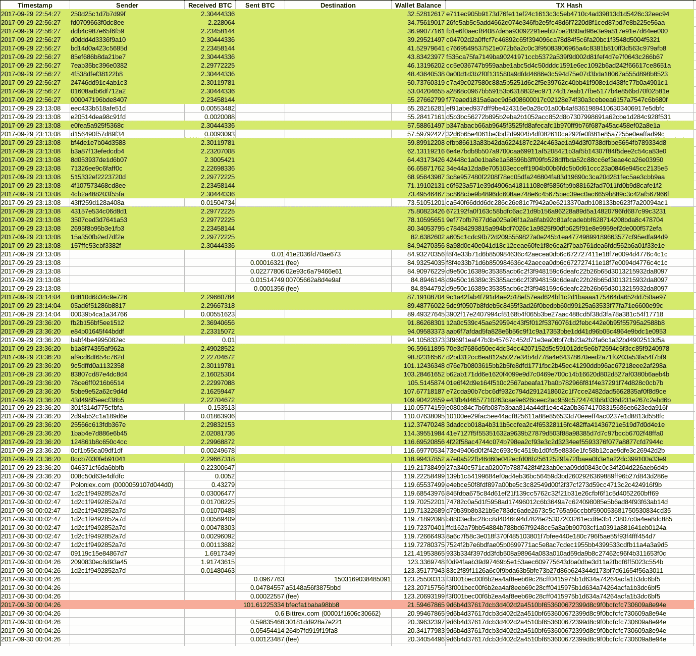
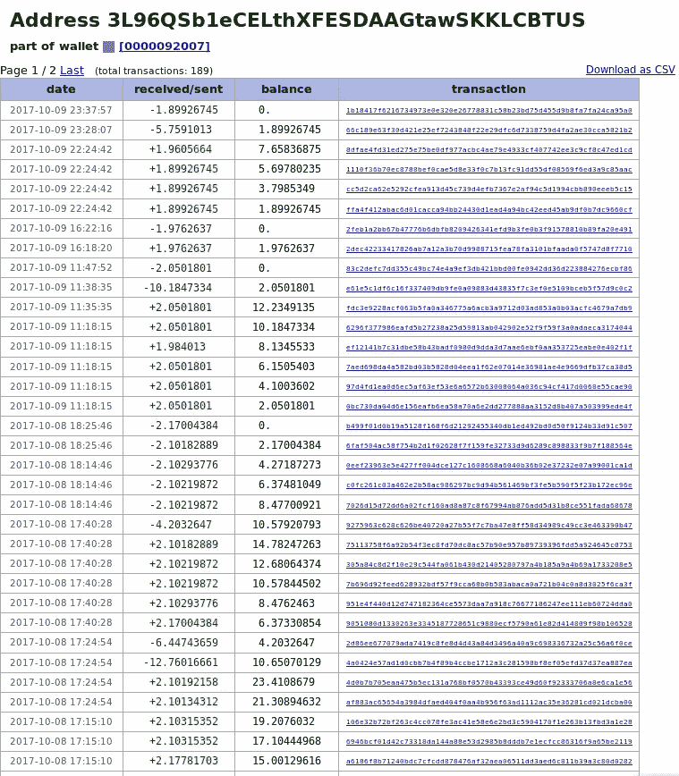
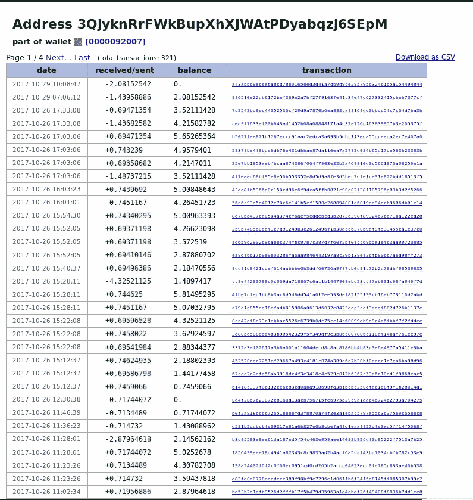
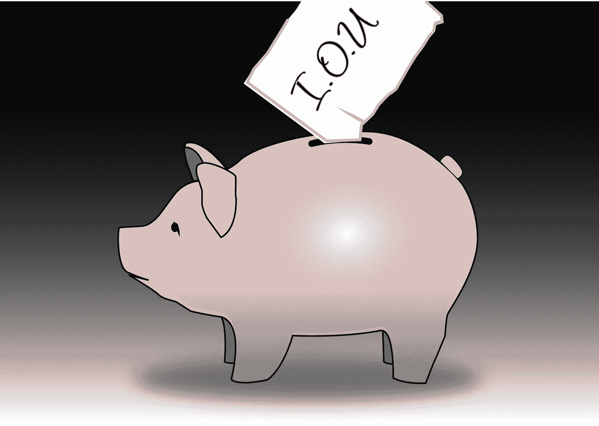
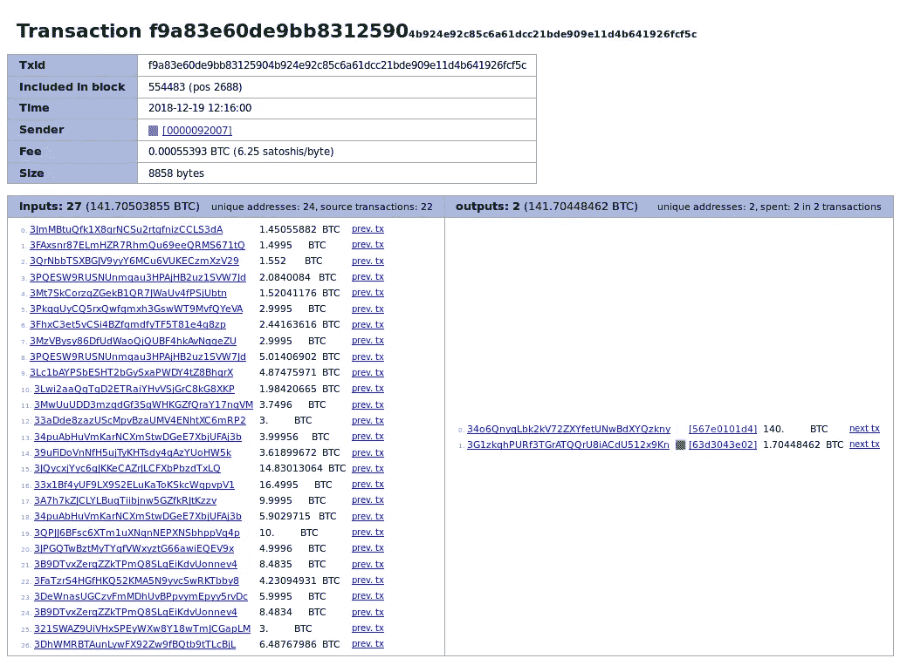
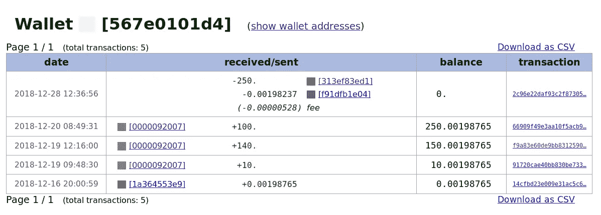

# QuadrigaCX 从来就不合法

> 原文：<https://medium.com/coinmonks/quadrigacx-was-never-legitimate-e17c98d6c46f?source=collection_archive---------1----------------------->

## QuadrigaCX 的高管们谎称无法动用他们的储备。区块链证据证明了这一点。

在我对 QuadrigaCX Ethereum 钱包的分析中，我声称他们的钱包不够冷。当他们火热的钱包不够用时，他们求助于外部交易所，有时甚至是变形，来筹集资金和完成客户提款。我们在区块链看到了这一点，记录了以太坊自诞生以来的所有活动。下一步是调查比特币区块链的行为模式。

## 确认 QuadrigaCX 的钱包地址

我最初打算通过将 QuadrigaCX 的以太坊转账与 ShapeShift 和比特币区块链活动相关联，来确定 QuadrigaCX 的比特币钱包地址集群。事实证明，这是不必要的。查询 ShapeShift 的 API 就足够了，从前面的分析中知道他们的存款地址。

$ curl[https://shapeshift . io/txstat/0x 10 D6 d 7 e 5 f 04 c 27244951 deb 44333087d 344 b 66 a 7](https://shapeshift.io/txstat/0x10d6d7e5f04c27244951deb44333087d344b66a7)；回声

> {"status":"complete "，" address ":" 0x 10 d6d 7 e 5 f 04 c 27244951 deb 44333087d 344 b 66 a 7 "，" withdraw ":**3 dszgfkceqo 3 qkrm 6 thwxucb 9 vnxhcwnh**，" incomingCoin":33，" incomingType":"ETH "，" outgoingCoin":"2.29772225 "，" outgoingType":"BTC "，" transaction":"a605c1cdc9fb7

这为我们提供了以下 ShapeShift 存款/收据对:

0x 75 FD 454 c 8118d 9598 ee 588 E6 ff 52 B1 bb 6d 08 aa 74→**32k 2 vsbwqwx 2 puilcbkecerjo 1 ha 42 uwpf**

0 x8e AFC 0 e 93 a 10 CBC 30 aa 7 FCE 47 B4 b 5 CBE DC 53 a 41a→**33 fzhrvvbltgau 2 tbkyyy 3 eekruzruhmg**

0xa 9237 c 8117 DCA 43 e 8179666 e 7928 b 37d 8d 5 A8 f 96→**3 qjykrrfwkbupxhjwatpdyabqzj 6 sepm**

0 xf 8d 8 a 55 e 230d 795996d 46 d3b 70151 CBE 45 e 12 DC 2→**32 zv2 osdjhx 9 vkitdduycm 3 rhl 73hg 9 SZ**

0x faff 49 c 620 cf 34 da 4 beea 650 e 70 cfdb 44d 4 e 5665→**3 l96 qsb 1 ecelthxfesdaagtawskklcbtus**

WalletExplorer 将所有这些目的地地址视为[0000092007]群集的一部分，与[prooforesearch 的分析](https://blog.zerononcense.com/2019/02/04/quadrigacx-chain-analysis-report-pt-1-bitcoin-wallets/)一致。

## 看着比特币热钱包里的余额

Wallet Explorer 方便地提供了 CSV 导出功能，其中包括累计集群 Wallet 余额。根据这些导出的文件，我同意 ProofOfResearch 的说法，QuadrigaCX 通常不会在他们的热钱包里保存超过 100 BTC。

我们可以观察 QuadrigaCX 如何在关键的撤资时刻使用相同的外部外汇融资模式。在 QuadrigaCX 的现金余额最高的时候，他们手头有将近 600 BTC，从 Poloniex 那里收到大约 240 BTC 的提款。它在 20 分钟内被压缩到不到 40 BTC。

An inadequate hot wallet backed by Poloniex?

虽然 QuadrigaCX 只在那一次使用 ShapeShift 为他们的以太坊热钱包提供资金，但他们广泛使用这项服务从 ETH 向外提供 BTC 取款服务。以上面列出的 BTC 地址*3 dszgfkceqo 3 qkrm 6 thwxucb 9 vnxhcwnh*和*32 zv2 osdjhx 9 vkitdduycm3 rhl 73hg 9 SZ*为例。第一个地址在来自 ShapeShift 的 20 次交易中收到大约 45 BTC，而后者大约在同一时间收到大约 42 BTC。地址群从手头的 BTC 30 号变成了 BTC 120 号，结果又跌回了 BTC 20 号。

ShapeShift rescues QuadrigaCX. Again.

其他地址显示了类似的模式；将资金存入热门钱包，并在数小时内花掉。不是几分钟，因为以太坊有更快的封锁时间，但仍然非常快。

A clear pattern of inbound bursts, followed by a total spend out.

A little less apparent because there were many withdrawals to fulfill this round.

## QuadrigaCX 的作案手法

QuadrigaCX 热门钱包的运营模式现在已经很清楚了。将客户的加密存款存入热门钱包。当它装满时，把一部分送到一个冰冷的钱包里，一部分送到交易所进行交易和清算。当热钱包变空时，从热钱包中回调资金，从外部交易所交易资金，或者在绝望时使用 ShapeShift。

我必须承认，老实说，回想起来，这种模式相当透明。QuadrigaCX 没有真正试图混淆其资产流动。他们根本没有使用以太坊搅拌机，而是直接从各大交易所获得离合器资金。他们使用可重复使用的变形地址，而不是一次性地址。他们允许自己的冷钱包提取到 ShapeShift，而不是通过他们的热钱包与其他客户存款混合在一起。追踪这个过程很麻烦，但我不会把它描述为技术上的挑战。众所周知，杰拉尔德是一个非常注重安全的人；为什么他会如此不小心的掩盖自己的行踪？

## 夸德里加银行

这种行为的一个慈善可能性是，他设计了 QuadrigaCX 来将加密资产存储在外部交易所的钱包中，由账户持有。这意味着一些资产可能会被收回。这也解释了解密 Gerald Cotten 笔记本电脑的紧迫性:他们想要的不是冰冷的钱包密码，而是**加密货币交易所**的账户和密码。尽管如此，我认为这是一个非常不可能的场景；我相信所有使用前面提到的取款地址的相关账户都快被清空了。

再说一次，“不是你的钥匙，不是你的硬币。”一家银行可以无限期地存在下去，只要它的储备能够承受足够长时间的客户提款，并从存款和其他流入资金中得到补充。毕竟，这就是银行赚钱的方式:它们吸收你的存款，然后把你的钱送出门外，还给借款人。与庞氏骗局不同，QuadrigaCX 从未承诺任何荒谬的加密货币高回报，这需要建立越来越大的客户群来维持运营。Cotten 可能偷了一半的储备，你不会知道的。到最后可能都不重要。

That’s all Cotten left for your account at QuadrigaCX.

那么是什么促成了 QuadrigaCX 的崩溃呢？对他们来说，2018 年的主要事件是他们对客户提款的无能管理。2018 年 1 月，一笔 2800 万加元的巨额资金被一家银行冻结，严重减缓了取款速度。再加上持续一年多的加密熊市，这将抑制菲亚特流入，自然的结果是 QuadrigaCX 将开始面临其加密储备的压力。

而这正是 2018 年 10 月发生的事情。由于菲亚特的提款需要几个月而不是几天才能结清，客户有了选择。尽管 QuadrigaCX 市场溢价，他们可以继续等待几个月的法定现金，或购买 crypto 并将其取出。不足为奇的是，加密提款就像菲亚特一样慢如蜗牛。银行依靠信心运行；如果一个人失去了储户的信心和信任，那么整个银行体系的崩溃将不可避免。

## QCX 的高管们谎称无法动用他们的储备

比特币和以太坊区块链都显示 QuadrigaCX 内部人士从其交易所撤资，甚至直到 1 月中旬。在 BTC 这边， [WalletExplorer 的数据显示，在 Gerald Cotten 死后，12 月 19 日](https://www.walletexplorer.com/txid/f9a83e60de9bb83125904b924e92c85c6a61dcc21bde909e11d4b641926fcf5c)，有人从 QuadrigaCX 的热门钱包中取出 140 BTC。

When you see a burning building, run in and steal everything!

这种撤退是非常可疑的，因为:

*   [QuadrigaCX 自 2018 年 8 月](http://web.archive.org/web/20180814234427/https://www.quadrigacx.com/account-funding-withdrawal)起实行每日 100 BTC 的取款限额。
*   在此之前，前一天有一笔 300 多美元的 BTC 买入，价格比市场价格高出一大截。
*   目的地地址簇[在 24 小时内收到 250 个 BTC](https://www.walletexplorer.com/wallet/567e0101d4fffde0)，尽管[交换人员否认其发生](http://archive.is/dvJ47)。

流入比特币热门钱包的 BTC 也异常活跃；19 日早上钱包几乎空了，装满了 220 多 BTC，到 16:00 又回到个位数。同样的模式发生在 20 日的 100 BTC 大撤退。

> 有人在 Gerald Cotten 死后进入了 BTC 保护区外的 QuadrigaCX 餐厅。

以太坊这边，地址[0x57b 727 DC 48 b5 d 9261958 E0 FB 9 f 94 fa 02 DC 328 BF 6](https://etherscan.io/address/0x57b727dc48b5d9261958e0fb9f94fa02dc328bf6)地址保持活动状态，甚至持续到 2019 年 1 月中旬。这是一个 Poloniex 存款地址，但我们知道这是一个 QuadrigaCX 地址，因为 QuadrigaCX 的“旧钱包”在 2016 年 3 月 10 日[向其转移了资金，在以太网融资和交易在交易所上线](https://etherscan.io/tx/0x941e18bbf7bc7b8f16803505341f36a1751c2e5a25e74d5f9b214522262fe0be)之前[。(再次向](http://web.archive.org/web/20160503095830/https://www.quadrigacx.com/)[泰勒·莫纳汉](/@tayvano)脱帽致敬，因为[突出了详细审查](https://old.reddit.com/r/CryptoCurrency/comments/amryvo/quadrigacx_chain_analysis_report_pt_1_bitcoin/efovqnu/?context=0)的地址。)

## QuadrigaCX 从一开始就是分数。变形证明了这一点。

不要误会我的意思，我认为所有的交易所，特别是那些明确指出的交易所，应该冻结所有撤回到前面提到的 QuadrigaCX 的入站资金地址的账户，至少在他们完成自己的独立调查之前。但我认为不太可能结出多少果实；证据在区块链。

确凿的证据，再一次，是变形。正如我之前所言，只要银行有足够的准备金来满足所有的提款要求，它就可以无限期地存在下去。它不需要满足所有的平衡。QuadrigaCX 本可以将交易所作为一个“酷”钱包。毕竟，在 2017 年和 2018 年的大部分时间里，客户的加密取款都得到了满足。但是，ShapeShift 用法讲述的故事是，他们无法满足 BTC 从他们的储备中提款，无论是在冷钱包里还是在交易所里。他们需要交易乙醚，并承担所有与转换相关的费用，以完成 BTC 提款。这是在 2017 年白热化的加密市场，而不是 2018 年和 2019 年的加密冬天。

至于以后如何防范类似 QuadrigaCX 的诈骗？除了不到必要的时候不要把你的资金放在交易所，我认为钥匙证明是个好主意。强制所有交易所定期证明其储备。而不是律师和会计师的一面之词，他们可以得到报酬去粉碎证据。因为最终的账簿在区块链；所以我们现在知道 QuadrigaCX 从一开始就是个骗局。

> [在您的收件箱中直接获得最佳软件交易](https://coincodecap.com/?utm_source=coinmonks)

