# QuadrigaCX 的倒闭是内鬼干的

> 原文：<https://medium.com/coinmonks/quadrigacxs-collapse-was-an-inside-job-a61dc4b3dd78?source=collection_archive---------1----------------------->

## 与普遍看法相反，QuadrigaCX 确实有冰冷的钱包。唉，它们是空的。

当 QuadrigaCX 加密货币交易所在 2019 年初向其债权人寻求保护时，它声称无法实现持续运营的流动性，包括客户提款。要做到这一点，他们需要获得中央储备，他们声称这些储备“存放在冷钱包中，以满足客户的加密货币余额。”虽然对于外行人来说，丢失加密货币密钥并不罕见，但对于一家业务是为客户保护加密货币的公司来说，这是不可思议的！

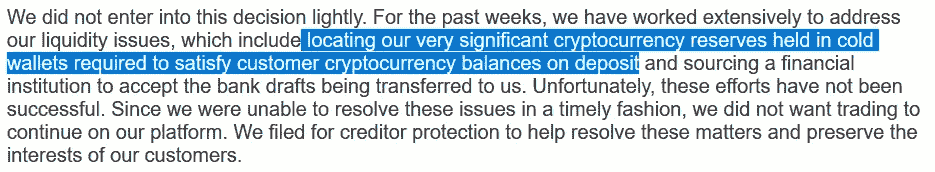

So they say.

雪上加霜的是，他们甚至不能公布冰冷钱包的公开地址。如果 QuadrigaCX 的首席执行官过早去世后，他们声称 QuadrigaCX 的高管无法获得访问权，如果他们能够提出“钱在这里，我们只是不知道如何得到它”，这将使他们的说法变得可信。但是这些是公开的区块链，完全可以被公众审计和核实。有办法找到它。

所以我们在这里，不知道去哪里找丢失的钱。但是我们有一个起点。从 Reddit 用户的众多报告中，QuadrigaCX 的主要热门钱包地址，也就是他们的“流动资金”，可以说是“[0x b 6 AAC 3 b 56 ff 818496 b 747 ea 57 fcbe 42 a 9 aae 6218](https://etherscan.io/address/0xb6aac3b56ff818496b747ea57fcbe42a9aae6218)”，我将把它称为“热门钱包#1”。我以此作为调查的起点。感谢[泰勒·莫纳汉](https://twitter.com/tayvano_)，我还得知了额外的地址“0x 027 beef cbad 782 faf 69 fad 12 dee 97 ed 894 c 68549”(热钱包#2)和“0x 0 ee 4 e 2d 09 AEC 35 BDF 08083 b 649033 AC 0a 41 aa 75 e”(旧钱包)。她还从以太坊区块链为第一个地址发布了一个完整的事务转储。我的分析基于第一个地址，因为它应该是与冷钱包交互的最新地址。

我的目标是:找到詹妮弗·罗伯逊宣誓书中宣称的失踪的近 43 万 ETH。

# 冷钱包入门

加密货币冷钱包被定义为完全离线的钱包，仅用于签署交易。它本身不能向加密网络发送交易。由于与互联网完全断开，它无法被远程黑客攻击。然而，它的接收地址仍然可用，因此货币可以自由地流入该地址，但是如果没有明确且相当麻烦的步骤就不能取出。

这与热门钱包形成了鲜明对比，后者保持在线，以满足交易所的定期提现要求。虽然一个交易所可能拥有数千个比特币，甚至可能数百万个以太币，但热门钱包可能拥有 50-100 个 BTC 和 1000-5000 个以太币。尽管从法定货币的角度来看，这仍是一笔可观的金额，但这只是该交易所总敞口的一小部分。因此，交易所应该遵循的基本公式是(热钱包)+(冷钱包)=(客户总余额)+(净交易和转账费用)。

使用高安全性的不方便的后果是冷钱包资金通常不会直接传送到终端接收者；相反，它专门对热钱包进行补充，然后允许热钱包正常完成支付。热钱包/冷钱包设置的第二个结果是，除了来自热钱包之外，冷钱包不应该接收任何资金。

# 要是我们能看到那堆衣服就好了

当寻找大量 ETH 库存时，显而易见的第一步行动是寻找热门钱包#1 发送资金的地址，这些地址也有大量剩余余额。

浏览所有地址，与 QuadrigaCX 的热钱包直接交互的余额最高的五个地址，以及它们在 Ether 中的余额:

[0x 8453584 a 31246 b 9 a 7776 BF 181544d 180 e 05 a 210 c](https://etherscan.io/address/0x8453584a31246b9a7776bf181544d180e05a210c):17129.82394[0x 0d 681 a7 b 6584 f 978 f 63 c 81 CFD 847064 ce 19 a 080](https://etherscan.io/address/0x00d681a7b6584f978f63c81cfd847064ce19a080):10000.3035[0x d 9518342 a 44 e 7 DFD CD 363 f 28 f1 ad 19 e 56](https://etherscan.io/address/0xd9518342a44e7dfdcd363f28f1ad19e568e2eb85)

这些地址都不像是冰冷的钱包。他们与太多的外部钱包进行交易，他们从太多的来源获得资金，最重要的是，他们根本没有接近 430，000 以太，即使加在一起。

# 拆东墙补西墙

在穷尽了大量 ETH 金块的可能性之后，下一个自然倾向是寻找热门钱包#1 经常交易的地址，特别是在热门钱包短缺的时候。当火热的钱包快用完的时候，谁来资助它？

这又回到了旧的钱包地址“[0x 0 ee 4 e 2d 09 AEC 35 BDF 08083 b 649033 AC 0 a 41 aa 75 e](https://etherscan.io/address/0x0ee4e2d09aec35bdf08083b649033ac0a41aa75e)”。在热钱包#1 初始化后的几个月中，旧钱包弥补了不足，并且当热钱包开始容纳超过 10，000 ETH 时收到大量退款。似乎 QuadrigaCX 在启动 Hot wallet #1 后将此地址委派给了一个“较冷”的 Wallet。

这一部分的一个主题是，许多拯救热门钱包#1 的地址也通过 ShapeShift 发送了许多资金。在 0x0ee4 地址的情况下，它对“[0x 5a 9 b 6 c 756 BF 11 b 60 E1 ce 81737648 f 9 f 87 eeb 58 ea](https://etherscan.io/address/0x5a9b6c756bf11b60e1ce81737648f9f87eeb58ea)”一个 ShapeShift 存放地址进行突发事务处理。金额约为 20 ETH，相当于当时 ShapeShift 的最大交易量。

地址“[0 x7e a5 e 875 a 386 b 66d 11 A0 ad 1866 ca 7 b 5 f 2745 f 049](https://etherscan.io/address/0x7ea5e875a386b66d11a0ad1866ca7b5f2745f049)”的行为与此类似。与旧钱包一样，它资助了热门钱包#1，并通过 ShapeShift 突发发送了约 20 笔 ETH 交易。关键的是，它在 2017 年 7 月 25 日向热钱包提供了 666 ETH 的资金，仅够支付当天的 666 ETH 提款。它还在获得了大量的资金，当时火热的钱包里有超过 20，000 ETH。我把这个冷钱包叫做#2。

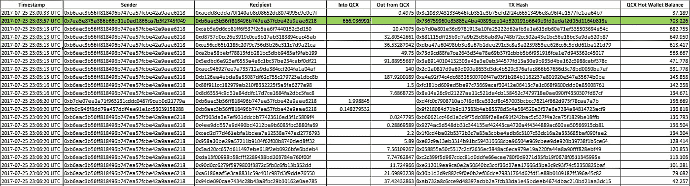

[0x7ea5e875a386b66d11a0ad1866ca7b5f2745f049](https://etherscan.io/address/0x7ea5e875a386b66d11a0ad1866ca7b5f2745f049) precisely covering for a spate of withdrawals

地址"[0x a9 f 43 f 5582 f 14 e 95 c 61967741 c 4292621 e 512 BDF](https://etherscan.io/address/0xa9f43f5582f14e95c61967741c4292621e512bdf)"，如上所述，在取款处理批次之前六分钟，用 340 ETH 为热钱包提供关键资金以支付取款。然而，这个地址是通过北海巨妖和 Bittrex 提款，而不是从托管的客户资产。

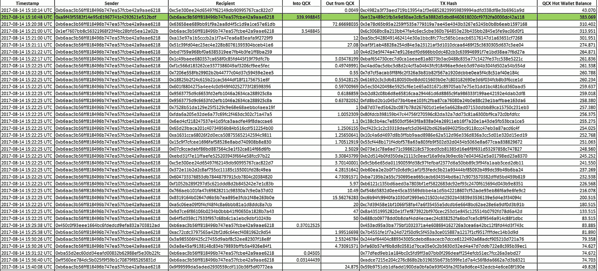

Another bailout of the QuadrigaCX cold wallet, this time from an outside exchange withdrawal

地址"[0x fad 8137 b 79 cc 8059 fc 4c 9 e 7 B3 ad 035 EC 612642 b 7](https://etherscan.io/address/0xfad8137b79cc8059fc4c9e7b3ad035ec612642b7)"在 2017-08-18 用 82 ETH 为热钱包提供了关键资金，以支付四分钟后的 80 ETH 提款。这个地址的资金主要来自 Poloniex。

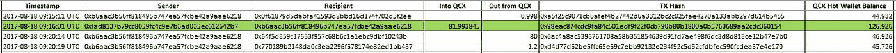

82 ETH in, 82 ETH out

地址"[0x 3b 63 eab FBC 0d 219 F4 b 416663d 54 CCD 18 d0f 1983 e 1](https://etherscan.io/address/0x3b63eabfc0d219f4b416663d54ccd18d0f1983e1)"临界资助热钱包 2017–08–18 用 300 ETH 覆盖 322 ETH 提现批次。这个地址也是在交易所之外资助的，来自 Poloniex 和 YoBit，以及其他未命名的地址。

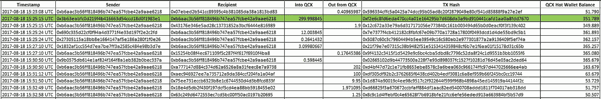

QuadrigaCX uses a *lot of exchanges!*

address "[0x 5512852 a 317 c 63 f 71 F2 b 81 f 95 cf 2 bbee 1c 239 A8 e](https://etherscan.io/address/0x5512852a317c63f71f2b81f95cf2bbee1c239a8e)"于 2017 年 8 月 21 日两次向热钱包提供约 150 和约 125 ETH 的临界资金，以支付几分钟后的提款。该地址由多个交易所提供资金。

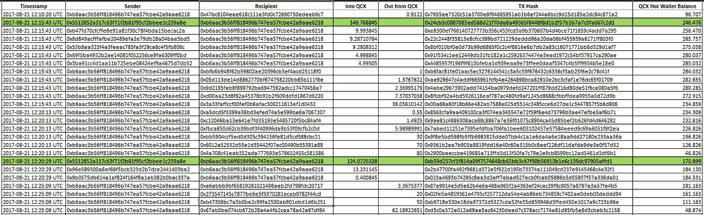

Very well timed deposits. Much coincidence!

地址“[0x 0b 9 defea 64d 1808 BC dec 76d 532984 DD 24 FB 8 bcff](https://etherscan.io/address/0x0b9defea64d1808bcdec76d532984dd24fb8bcff)”最早于 2017 年 9 月从热钱包初始化，是我在 QuadrigaCX 的交易账本中见过的最接近冷钱包的东西。它从热钱包接收总计 69750.02 ETH，并发回 51432.6300226 ETH，主要是在热钱包电量不足时。然而，它也让爆裂技转移到变形术上，这次是 30 ETH 的增量。**我会把这个冷钱包命名为#3** 。它在 2018 年 4 月耗尽了资金。

继续沿着外部交换地址，"[0x d 17d 4 ACD 309 b 377 EC 022942 a 62 c 752 cc 82d 979 c8](https://etherscan.io/address/0xd17d4acd309b377ec022942a62c752cc82d979c8)"在接下来的四分钟内，对 QuadrigaCX 的取款进行了严格而精确的覆盖。

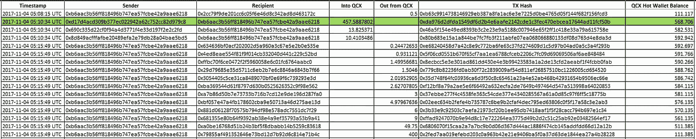

I think we are starting to see the pattern by now.

地址"[0xb 1d 85314 a 5 c 6 cdbfaa 42 a9 FD 955 a 88335 DC 41911](https://etherscan.io/address/0xb1d85314a5c6cdbfaa42a9fd955a88335dc41911)" 2017–11–04 两次保释热钱包，2017–11–06 再次保释热钱包。由币安和波洛涅克斯公司资助。

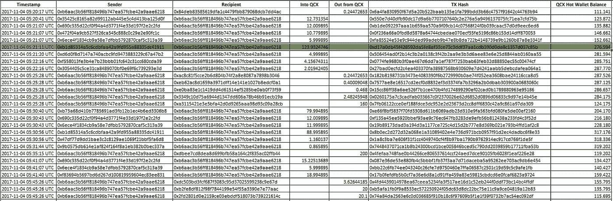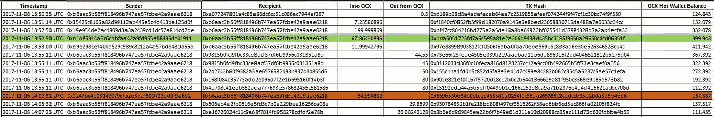

There’s an address in orange. I’ll get to that one.

地址"[0x4a 21057d 80 cf 2c 208068 de 099 ed 829 f 7 e 3 b 5d 3 FB](https://etherscan.io/address/0x4a21057d80cf2c208068de099ed829f7e3b5d3fb)"保释热钱包 2017–11–06。它是由 Bittrex 资助的。还有地址“[0x 0247 BC 4 e 03142079 CFA 2 E3 daf 500722 ed 0f 9 a6b 2](https://etherscan.io/address/0x0247bc4e03142079cfa2e3daf500722ed0f9a6b2)”多次资助热钱包，比如下面这种情况。它的资金来自波兰和北海巨妖。

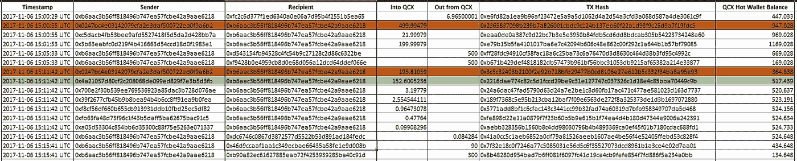

And there’s the orange address again. And again.

至于需要其他交易所来支撑冷钱包，与使用 QuadrigaCX 自己的冷钱包相比，这是非常糟糕的。令人不安的部分，也是本文中提出的*部分准备金*论点的核心，是 QuadrigaCX 的冷热钱包都直接与 ShapeShift 交易，这表明 QuadrigaCX 正在使用其客户的乙醚余额来弥补其比特币或莱特币准备金的不足。这些地址包括:

0x 10d 6d 7 e 5 f 04 c 27244951 deb 44333087d 344 b 66 a 7
0x 614 cc 3033 DDB CDB 0 de 90 a 08723772d 6d 90 a 816 ee
0x 708523 a9 e5d 288606 a 5691 FCA 4a 4 e 76 CB 22 e 3f 56
0x 75 FD 454 c 8118d 9598 e 588 e 6 ff 52 B1 bb

# 有时彼得要求付款

2017 年 11 月 4 日，我们观察到第一笔大规模资金从 ShapeShift 转入热门钱包。此时，Cold Wallet #2 和#3 的资金不足 1 ETH，因此 QuadrigaCX 必须迅速在其他地方找到资金。正如 QuadrigaCX 使用其客户的以太网支付比特币和莱特币提款一样，该交易所也必须为其他人的提款补充以太网。

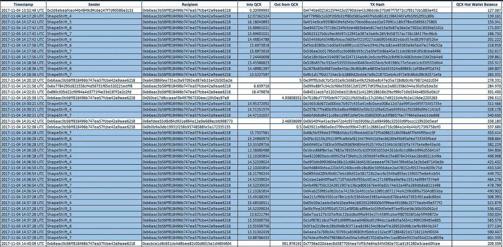

When all you’ve got left is funny Internet money, run to your local Cash4BTC and get top dollar!

# 如果你是交换者，为什么要用变形？

完全保留的交换没有理由以 QuadrigaCX 演示的方式使用 ShapeShift。根据上述基本公式的定义，冷热钱包中总会有足够的资金覆盖所有客户资金。因此，这是 QuadrigaCX 实际上是部分储备操作的确凿证据。但与 2009 年的银行不同，QuadrigaCX 不会得到救助。

此外，QuadrigaCX 为什么要使用 ShapeShift 进行交易，因为就其本质而言，它可以通过成为自己的客户来轻松地将 ETH 变成 BTC、长期贷款公司或菲亚特现金。或者，如果他们对自己市场的流动性不满意，直接将基金转移到任何其他主要交易所，如北海巨妖或比特币基地，并提供适当的文件和 KYC。至少在当时，使用变形的主要吸引力在于它们的速度和完全没有 KYC。也就是说，ShapeShift 并不是不受跨链分析的影响，所以在我的下一篇文章中，我可能会尝试将 ShapeShift 的时间戳交易与比特币和莱特币相关联。

对于上面列出的由其他交易所资助的其他地址，虽然我不是执法人员，因此不能强制回应，但为了整个加密市场，请说明这些地址的帐户所有者是如何使用您的平台的。

# 微弱的希望

一些指示 QuadrigaCX 控制的地址仍然有资产！例如，在 2017 年 11 月 12 日资助热门钱包#1 的地址“[0xa 07 e 6 D6 CDA 957 ef 25 f 73 ee 784 a 784909 a 9 AFE 10d](https://etherscan.io/address/0xa07e6d6cda957ef25f73ee784a784909a9afe10d)”虽然其本身没有资产，但几乎完全由另外两个地址资助，“[0x3d 3 ee 894144933894 a 231 F3 d 1608453 f 46d 876 cf](https://etherscan.io/address/0x3d3ee894144933894a231f3d1608453f46d876cf)”收到了大约 650 ETH 还有“[0x2b 7882 DDB 9 a 242609588 FBE 9 ba 1 fb6b 455 e 88 c6c](https://etherscan.io/address/0x2b7882ddb9a242609588fbe9ba1fb6b455e88c6c)”有 16000 个 ETH 重金资助了上面的 0x3d3 地址、[以及 0xa07 地址](http://0xe93f37a0a0c3a0dc6a7b81fad87b40b14c953de1d7e4073fe239fd77a2e1bf35)。

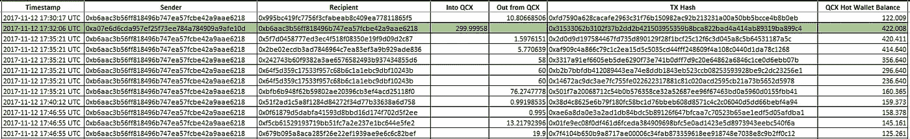

It’s no 430,000 ETH, but it’s a start. Maybe.

# 重复加密的咒语

“不是你的钥匙，也不是你的硬币。”如果你把硬币放在自己的钱包里，有自己的私人钥匙和自己的 12 字助记符，你就不会被 QuadrigaCX 这样的内部人员偷走。是的，安全地保存你的话是令人恼火的，如果真的到了那一步，向你爱的人解释如何找回你的硬币可能会令人困惑，但正如这个故事所表明的那样，依赖交易所作为托管人本身就充满了风险。特别是在交易所之间转移硬币的交易费用如此之低的情况下，只有当你需要兑换硬币时，才在交易所部署硬币应该是显而易见的。

至于交易所经营者本身，我相信他们会帮客户一个大忙，并获得极大的信任，以证明他们的充分储备，方法是:

在他们自己的网站上公布他们钱包的公开地址，不管是热的还是冷的

对于类似比特币的 UTXO 网络，定期将资产扫入热门钱包

定期将资产从热钱包转移到冷钱包。可能是像每日转账这样简单的事情，目标是 30 天净提款移动平均线的 200%到 500%

不要从冷钱包转移到除了交易所的另一个钱包之外的任何钱包，无论是热的还是冷的

QuadrigaCX 只是全球加密货币交易所格局中的一个小角色，与当时的 MtGox 或 QuadrigaCX 自己使用的许多交易所相比不值一提，但即使是这次小规模内爆，QuadrigaCX 的前客户也已经损失了 1.9 亿美元的加密和法定存款。

但是这些存款并没有丢失，而是从内部被盗。

> [直接在您的收件箱中获得最佳软件交易](https://coincodecap.com/?utm_source=coinmonks)

