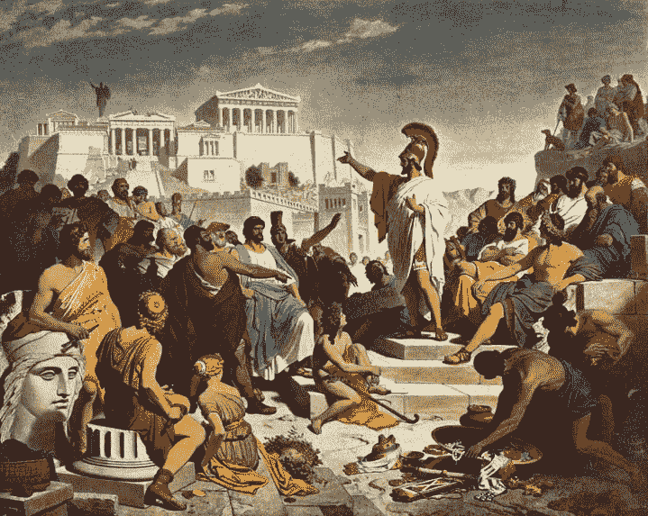

# 合格意见书:向提高效率和信任扩展 dpo

> 原文：<https://medium.com/coinmonks/qualified-demarchy-extending-dpos-towards-improved-efficiency-and-trust-8c730af763a?source=collection_archive---------2----------------------->

*区块链治理中的效率、公平和安全共识机制。*

# 与委托证明利益相关的争议

DPoS(一个共识系统，因其发明者丹·拉里默而出名/臭名昭著，他是 [Bitshares](https://bitshares.org) 、 [Steemit](http://steemit.com) 和 [EOS](https://eos.io) 的创始人)的核心概念是引入关键、固定代表的角色。这些代表(由社区投票选出的成员)致力于确保区块链的安全，通常会获得丰厚的经济回报。作为回报，社区获得了一个快速安全的网络(速度比大多数其他公共区块链/加密货币都要快)。

为了确保代表保持诚实，社区有权投票淘汰任何被证明是不良行为者的代表(称为块生产者)。

尽管设计了聪明的机制和动态来确保系统尽可能保持廉洁，但加密货币社区的许多受人尊敬的成员对 dpo 仍有许多批评。

不深入讨论( [1](/@evolutionos/evolutions-response-to-vitalik-c54ef0304e47) 、 [2](https://vitalik.ca/general/2017/12/17/voting.html) 、 [3](https://vitalik.ca/general/2018/03/28/plutocracy.html) 、 [4](https://busy.org/@anonymint/consortium-blockchains-e-g-dpos-and-tendermint-can-t-internet-scale) 、 [5](https://steemit.com/eos/@dan/in-defense-of-consortium-blockchains) )，可以总结出大多数批评倾向于 DPoS 的人的因素等式。相比之下，丹·拉里默的一些反驳基于一种更乐观的观点，即大多数人都是好演员，如果被赋予有效投票的权力，坏演员的影响将被最小化。

大多数担忧与常见的社会问题有关，例如:勾结、卡特尔、操纵、选民冷漠、购买选票、选民无足轻重、贿赂、诱导、重复投票、集权。

我认为——尽管这些担心是有道理的——在预测这种系统的成败方面仍然存在很大的不确定性。目前，在区块链治理的早期阶段，还不存在任何合格的权威机构可以几乎肯定地预测区块链治理的这些试验的结果。

而这应该是意料之中的。这样的系统调用了多种学科，如心理学、博弈论、经济学、数学、网络效应、密码学和计算机科学。这个领域可能需要几年或几十年才能稳定下来，最终允许预测模型出现。

目前，我们只能估计和猜测结果。这是区块链革命更令人兴奋的方面之一；还有许多事情有待尝试、检验和决定。这场革命刚刚开始，丹·拉里默、维塔利克·布特林和中本聪等人类似于爱迪生和特斯拉斯，或者这个新兴颠覆性行业的乔布斯、凯斯和盖茨。

# 治理模型中的迭代

在这种不确定的情况下，也许明智的做法是开发足够灵活的系统来适应这些不断变化的环境。这是 [EOS](https://eos.io) 背后的智慧的一部分——一个考虑到治理模式灵活性而设计的平台。

EOS 的主要 genesis 模块将包括一个初始治理模型(由[模块的](http://block.one) [Thomas Cox](/@thomas.cox_39839) 领导)。一个)。一旦主要的区块链在 EOS 平台上推出，社区和代表们将很快控制区块链的命运，早期的治理模式将(有希望)演变为一个为更大多数人服务的系统。

即使批评者是正确的——主要的 EOS 区块链不会产生公平的治理模式——并且许多预测的灾难被证明是真实的，替代的治理模式可以同时建立在 EOS 平台上。

这种替代模式的一个早期例子是 [Evolution](https://evolutionos.com) 区块链(也建立在核心 EOS 平台上),它旨在实现更公平的财富分配，并包括更多的代表。可能会有更多的团体继续尝试各种其他的治理理念。其中一些选择可能会成功，而另一些可能会失败。

美妙之处在于，现在——人类历史上第一次——有能力重复治理的理念。这是一个非常强大的发展，我怀疑这场革命的最终影响将以我们无法预测的方式彻底改变人类的经历。

# 改善残疾人组织的合格意见书

可以尝试的一个可能的替代方案或演进是引入[意见书](https://www.uow.edu.au/%7Ebmartin/pubs/89demarchy.html)的概念，作为区块链的治理结构。

选区制(也称为 sortition，或 [lottocracy](https://aeon.co/essays/forget-voting-it-s-time-to-start-choosing-our-leaders-by-lottery) 是一种通过抽签随机选择公职人员的方法。在古希腊，sortition 不仅为公民提供了政治教育，也是平等原则的实际应用。

*我在上一篇文章***中提出了一个草根替代联合国的模式。**

*尤其是意见书，可能有许多区块链组织的实际用途，因为一些内在的廉洁倾向。*

*合格的意见书不同于其他意见书模式，因为合格的候选人——具有实际经验和能力——是事先挑选出来放在甄选人才库中的。一旦该组被过滤，随机排序机制可以选择适当的代表。*

*此外，可以通过一定规模的请愿书触发的投票机制召回代表。这种模式可能存在两种类型的请愿:内部请愿(由治理系统内的同行呼吁)或外部请愿(由公众呼吁)。每种类型的请愿可能有不同的门槛，以达到任何个人职位的罢免投票。*

*与民主投票相比，合格的意见书(结合罢免代表的能力)具有许多优势，例如:*

*   *合格的意见书消除了与魅力四射、受人欢迎的职业政治家进行昂贵竞选的需要。*
*   *通过排序选择候选人的相对容易性可以允许单个代表到下一个代表的非破坏性的、交错的和有效的过渡。*
*   *很有可能准确反映实际人口统计数据，包括年龄和性别。*
*   *由于最终选择过程的随机性，游说、培养、贿赂、收买选票和施加影响变得更加困难。*
*   *一个合格的政权减少了允许政党、特殊利益集团和寡头政治形成的条件和权力渠道。*

*在诸如 EOS 的系统的块生产者的选择和条款中，该过程的流程如下:*

***【A】**证明获得足够区块生产商(BP)产能的基本资格。*

***【B】**评估潜在代表的能力是否足够(真)或不足(假)。*

***【C】**如果为“真”，BP 候选人将在他们的 rein/term-limit 期间进入选择库(与其他候选人一起)。如果“错误”, BP 候选人需要再次尝试达到合格标准，否则他们决定退出候选人资格。*

***【D】**池中 BP 候选随机排序。获胜者成为 BP，非获胜者保持待命状态(EOS 为活动 BP 和待命 BP 共享相同或相似的建议奖励)。*

***【E】**如果在任何获胜者执政期间，请愿号码被触发并达到，则该代表可以被召回。一旦一个成功的请愿引发了强制投票，社区选择保留/放弃有问题的 BP。*

***【F】**如果 BP 仍然存在，并且在其统治期间没有触发其他请求，一旦统治结束，BP 将被放回备用 BP 选择池。(转到“C”部分)。*

***【G】**如果 BP 被投票否决，Bp 必须进入流程的最开始部分(“A”部分)。*

****注:选择 BP 的方式是错开它们在全年中的统治，以防止对网络的任何重大破坏****

*一些优点是，没有必要投票选举一名代表担任 BP 职位，因此没有必要购买选票，预先准备将被认为是非常低效的，不需要长时间的竞选活动，更大的区块生产商多样性可以增加更广泛、更公平的代表性，并分享通胀回报。*

*在这样的制度下，当虐待发生时，有明确的问责和惩罚途径。即使发起的请愿最终没有让 BP 出局，这样的请愿对 BP 来说也是一个明确而强烈的改善激励。*

# *结论*

*合格意见书是针对标准 dpo 的一些批评提出的解决方案，同时也有望提高效率。这一理念延伸并支持了丹尼尔·拉里默(Daniel Larimer)的论断，即“绝大多数人的意图是好的”，并有效地翻转了投票程序以用于清除坏演员，而不是花时间选择最有前途和最有魅力的演员(与现代政治一样，这可能与他们所传达的相反)。如果大多数人的意图是好的，那么选择就没有问责和惩罚制度那么重要了。*

*数字技术几乎改变了他们遇到的每一个行业。这背后的部分原因是快速和廉价迭代的能力。DPoS 允许尝试、测试和迭代人类治理系统。经济激励确保人们的大型网络在一个确定的生态系统中协作、合作和竞争。随着时间的推移，可以发现新的模式、机制和动态，这些模式、机制和动态具有特定的效果，并提高了参与者的效率和意愿。*

*治理很可能是区块链真正的“杀手级应用”，货币只是被归入更大的治理保护伞下的激励组件。*

*在区块链革命的推动下，随着合格意见书被提议作为授权证明利害关系的实验的补充，我们在快速变化的现代世界中朝着改善人类治理制度的道路上又多了一个模型。*