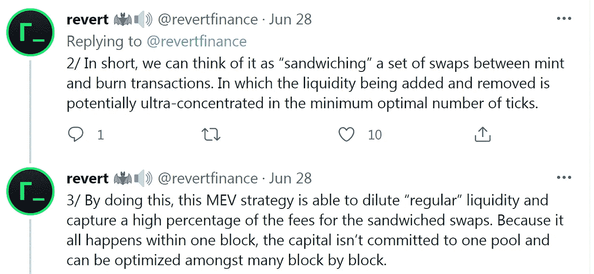
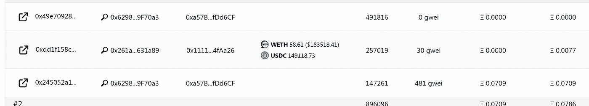
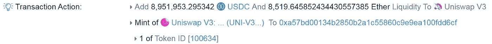
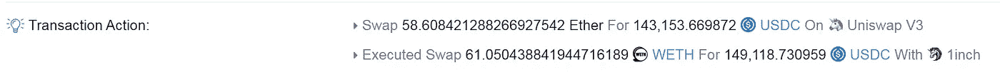
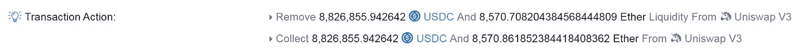
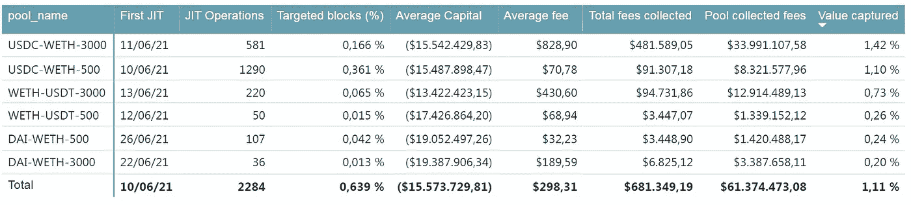
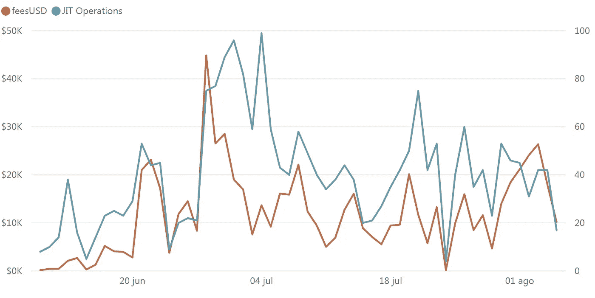

# 量化 Uniswap v3 中的“即时”流动性

> 原文：<https://medium.com/coinmonks/quantifyng-just-in-time-liquidity-in-uniswap-v3-23ac1db729c5?source=collection_archive---------2----------------------->

## 第一部分。分析什么是 JIT 流动性以及 JIT 流动性如何影响常规 LP 的回报

一些 flashbots 搜索者对 JIT 流动性策略的利用可能会成为 Uniswap v3 用户的一个担忧，因为它可能会产生降低 LPs 回报的短期影响，并且从长期来看，如果常规流动性提供商变得不愿意提供流动性，则可能会对 Uniswap v3 协议的长期稳定性产生一些怀疑。在本文中，我将尝试量化这一策略的影响，并阐明这个仍然有些模糊的话题。

# 什么是“即时”流动性？

首先，为了清楚地解释这种策略是如何运作的，我将引用 twitter 上的一条重要线索:

这一战略对 Uniswap v3 行为者的主要影响可以概括为:

*   **交易员**由于流动性激增，预期价格影响减少，但在所有流动性都是 JIT 的极端情况下，价格发现将极其困难。
*   **不使用这种策略的流动性提供者****随着应计费用的减少，预期收益减少，但非永久性损失不会。**

## **识别“即时”流动性操作**

**JIT 流动性的提供者要求使用私有中继，如 flashbots，以便组织将形成“三明治”的交易(在块的开始添加流动性，在互换后移除流动性)。JIT 流动性发生在一个特定的区块，要求大资本集中在最狭窄的可用范围内，以稀释其余有限合伙人提供的活跃流动性。**

**这种操作的一个例子是块 12931127 中的 flashbots 捆绑包#2:**

****

**根据 Uniswap 的图表数据，JIT LP 加 8，951，953.29 USDC 8，519.64 乙醚的总美元价值约为 29，824.445 美元。**

****

**通常，这个池的活跃分笔成交点的流动性在 300 万美元到 400 万美元之间，因此这一新增量占该块可用流动性的 80%到 90%。**

****2-** [**JIT LP 在他的捆绑包中包括有意义的掉期**](https://etherscan.io/tx/0xdd1f158c51b72792ded55f09147522d926a99e4fda77cf8c37592c9dbf44c0b5) 总计 58.61 ETH 掉期，尽管理论上任何数量的掉期都是可行的，但大多数 JIT 流动性三明治只包括一个巨额掉期:**

****

****3-** [**JIT LP 移除**](https://etherscan.io/tx/0x245052a15ae6929c665f0e10c7b0817e9863546825a07f03bb9565303f7d209f) 8，826，855.94 [USDC](https://etherscan.io/token/0xa0b86991c6218b36c1d19d4a2e9eb0ce3606eb48) 和 8，570.708 ETH 的流动资金并收取 0，1536 ETH 的费用(从收取金额中减去移除金额计算):**

****

**代币金额的差异接近 50 ETH，因此 JIT LP 收取大约 80%的掉期，将池 LP 的应计费用从 0.17853 ETH(0.3%的费用)稀释到 0,02223 ETH。**

****4- JIT LP 向矿工**支付 0，070，856 ETH **的贿赂/费用**，以使他的包裹被开采。**

**并非所有的 JIT 操作看起来都有正的 EV 值，至少考虑到链上数据，然而，不管 JIT 流动性是否有利可图，stratetgy 都通过稀释某个块的应计费用来降低定期 LP 回报。**

**在本系列的下一章，我将尝试分析考虑搜索方的这种 MEV 策略的总回报。**

# **识别 JIT 流动性操作的数据模型**

**为了计算这些操作摊薄的费用，我将使用 Uniswap v3 图表中的数据，如以下步骤所述:**

****1 查询自 6 月 1 日以来特定池的所有“mints”、“burns”**(uni swap v3 池合同的流动性减少事件)**和“collects”**(流动性减少加上应计费用)，查找以下参数:**

*   **区块号、交易 Id、原产地 EOA 和支付的天然气价格**
*   **铸造、焚烧和收集的代币数量(包括兑换成美元价值的总金额)**
*   **LP 选择的价格范围，表示为(tickLower，tickUpper)**

****2** 这种方法不适用于 EIP-1559 年后发生的 JIT 流动性操作。**

****3** **组在同一街区**发生的**由同一 EOA 发起**的造币、焚烧、收集**。****

****4 将每次 JIT 流动性操作的应计费用**计算为收集的令牌总数减去消耗的令牌总数。**

****5** 查询 uniswap v3 图的 poolDaydata，以便**估计池**生成的总费用，并将其与 JIT 操作提取的费用进行比较。**

**我的 Github 中提供了一个 python 脚本，其中包含了用于运行该分析的代码**

# ****ETH/stables 池的结果****

**上述工作流程已应用于 9 个资金池(瑞士联邦理工学院/USDC、瑞士联邦理工学院/戴和瑞士联邦理工学院/USDT *每个资金池 3 个费用等级)，但仅在其中 6 个资金池中观察到 JIT 流动性操作。下表提供了总体结果:**

****

**考虑到不同资金池产生的总费用，JIT 流动性似乎还没有占据太多份额。**

**查看生成的时间序列数据，没有 JIT 流动性增长的清晰模式:**

****

## ****结论:****

*   **JIT 流动性不是一种广义的 MEV 或 LP 策略，因为它针对不到 1%的块，并且似乎仅由一个参与者运行。**
*   **没有结论，是否有更多的操作空间，或者更多的搜索者应该竞争同样的机会。**
*   **JIT 流动性并没有显著降低定期 LP 回报。**
*   **JIT 流动性不是一种无风险的 MEV 策略，因为如果孤立地分析，可能会导致损失。**
*   **显然，这些业务是由一家运营商运营的，该运营商使用 [0xa57bd0013](https://etherscan.io/address/0xa57Bd00134B2850B2a1c55860c9e9ea100fDd6CF) …作为代理合同，这引发了一个问题，即这种策略是否对其他 MEV 搜索者或做市商有积极意义，或者我们只能等待它的爆发。**

****在**[**Twitter**](https://twitter.com/JNP7771)**联系我或者加入** [**LP 咖啡馆**](https://discord.gg/HwX5a6uSGB) **不和谐继续讨论****

**在我的 [github](https://github.com/JNP777/Quantifying-JIT-liquidity-Uni_v3) 上有一个回购协议，里面有所有使用过的代码**

> **加入 [Coinmonks 电报频道](https://t.me/coincodecap)，了解加密交易和投资**

## **另外，阅读**

*   **[尤霍德勒 vs 考尼洛 vs 霍德诺特](/coinmonks/youhodler-vs-coinloan-vs-hodlnaut-b1050acde55a) | [Cryptohopper vs 哈斯博特](https://blog.coincodecap.com/cryptohopper-vs-haasbot)**
*   **[币安 vs 北海巨妖](https://blog.coincodecap.com/binance-vs-kraken) | [美元成本平均交易机器人](https://blog.coincodecap.com/pionex-dca-bot)**
*   **[如何在印度购买比特币？](/coinmonks/buy-bitcoin-in-india-feb50ddfef94) | [WazirX 评论](/coinmonks/wazirx-review-5c811b074f5b) | [BitMEX 评论](https://blog.coincodecap.com/bitmex-review)**
*   **[比特币主根](https://blog.coincodecap.com/bitcoin-taproot) | [Bitso 回顾](https://blog.coincodecap.com/bitso-review) | [排名前 6 的比特币信用卡](/coinmonks/bitcoin-credit-card-bc8ab6f377c6)**
*   **[如何购买 Ripple (XRP)](https://blog.coincodecap.com/buy-ripple-india) | [非洲最好的加密交易所](https://blog.coincodecap.com/crypto-exchange-africa)**
*   **[非洲最佳加密交易所](https://blog.coincodecap.com/crypto-exchange-africa) | [胡交易所评论](https://blog.coincodecap.com/hoo-exchange-review)**
*   **[eToro vs 罗宾汉](https://blog.coincodecap.com/etoro-robinhood)|[MoonXBT vs by bit vs Bityard](https://blog.coincodecap.com/bybit-bityard-moonxbt)**
*   **[Stormgain 回顾](https://blog.coincodecap.com/stormgain-review) | [Bexplus 回顾](https://blog.coincodecap.com/bexplus-review) | [币安 vs Bittrex](https://blog.coincodecap.com/binance-vs-bittrex)**