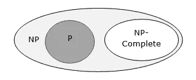
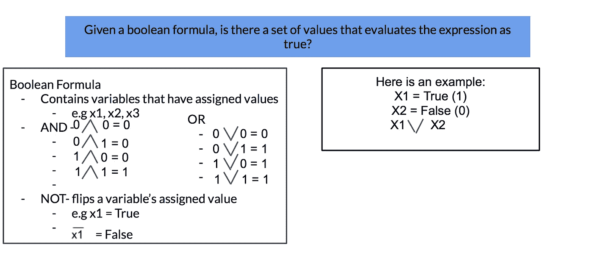
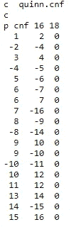

# 量子+NP-完全=没问题

> 原文：<https://medium.com/coinmonks/quantum-np-complete-no-problem-9fd5d5f8b2e0?source=collection_archive---------4----------------------->

## 自 20 世纪 50 年代以来，我们一直无法解决 NP 完全问题。如果得到解决，其中一些问题可以改变世界。

什么是 NP 完全问题？

NP vs P vs NP-Complete

NP 完全问题是一类复杂问题，目前还没有高效的算法。

以下是一些真实的例子:

## **让我们拯救生命。**

在基因分析中，基因是根据它们对某些条件的相似反应而聚集在一起的。当发现一组相连的基因时，我们可以利用它来获得关于特定疾病的重要见解，并进行药物靶向。

## **高效的交通路线将有益于环境**

旅行推销员问题要求找到在一个城市内从一个目的地旅行到另一个目的地的最有效的路线，同时访问该路线上的各个目的地。如果我们解决了这个问题，我们可以成倍地减少像 FedX 和 UPS 这样的公司在运输上花费的时间和资源。环境也会喜欢这个；交通运输目前产生了大气中 26%的 GHG。这个百分比将呈指数下降。

这两个都是 NP 完全问题。显然，如果我们能找到解决这些问题的方法，它们将解决许多人文学科的问题。且不说这只是两个；还有数不清的问题在解决后会产生重大影响。

有趣的部分来了:

## 如果我们能为一个 NP-完全问题找到一个有效的算法，就能为所有这样的问题找到一个有效的算法。

换句话说:

1.  我们找到了解决一个 NP 完全问题的有效算法
2.  我们使用该算法来解决上述 NP 完全问题以及其他问题
3.  我们解决了世界上的许多问题

当然，这样做是说起来容易做起来难。'

在考虑潜在的解决方案时，我决定寻找一种不同的计算方法，也许能够解决 NP 完全问题。

## 量子领域:有一种量子计算算法可以解决特定的 NP 完全问题。

## **格罗弗算法**

Grover 算法是一种量子算法，用于搜索非结构化数据集。

No, not this Grover.

## **这个算法为什么特别？**

它提供了一个**二次加速。**

假设我们在 n=10 个⁰数的数据集中寻找“4”。经典算法将使用 O(10 ⁰) [O(n)]运算。但是格罗弗的算法会使用 o(√10⁰)[o(√10^n]运算。

**如果你感兴趣，这里有一个关于格罗弗算法如何工作的更深入的探究**

有些搜索问题可以表示为一个函数，f 和 x 作为输入。

f(x) = 1(如果 x 是解)，f(x) = 0(如果 x 不是搜索问题的解)。

当应用神谕(一种黑盒操作)时，量子位首先使用哈达玛门被置于均匀叠加状态。

神谕被用来寻找解决搜索问题的方法。如果我们有一个有 N 个问题和 M 个解决方案的搜索问题，oracle 被应用 O( √N/M)次来找到这个问题的解决方案。

## Grover 算法可以在一类称为 3SAT 问题的特定 NP 完全问题上实现:

在我们看 3SAT 之前，让我们先了解一下 SAT 是什么:

SAT 或可满足性问题寻找一组使布尔公式为真的变量。让我们仔细看看:

3SAT 问题略有不同。3SAT 问题要求每个子句中有 3 个变量。例如，问题可能是这样的:(x1∨x2∨x3)∧(x4∨x5∨x6)

**如果 Grover 的算法可以解决 3SAT 问题，我们或许可以解决其他 NP 完全问题。而且很多这种 NP 完全的问题可以解决一些世界上最大的问题。**

我最近使用 IBM 的 QISKit 在一个 3SAT 问题上实现了 Grover 的算法，遇到了一个常见的问题。

我用了上面的 3SAT 问题。

output

我收到了上面的输出。

很明显，这个算法在这种情况下不起作用。原因？量子模拟器无法使用足够数量的量子位来解决这个问题。这是量子计算机今天面临的最大挑战之一。他们没有足够的纠错量子位来解决实际问题。

尽管如此，IBM 目前正致力于优化 Grover 的算法，以便在问题上运行该算法需要更少的量子位。

虽然现在还不能解决 NP 完全问题，但是随着量子计算机和量子算法的进步，在不久的将来可以成为现实。解决 NP-Complete 问题意味着我们将能够发现更多关于我们的基因来对抗疾病、优化运输、能源等等。可能性是无限的。