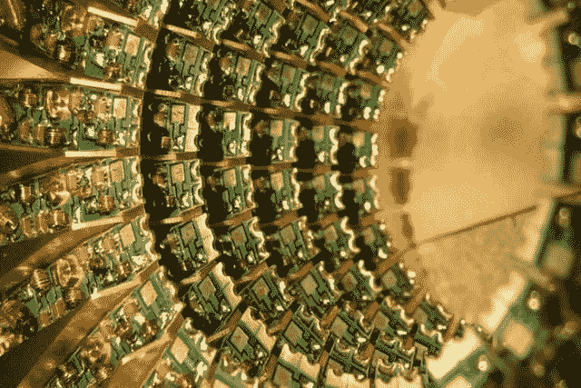

# 基于量子鲁棒哈希签名

> 原文：<https://medium.com/coinmonks/quantum-robust-hash-based-signatures-2c11d2739d38?source=collection_archive---------1----------------------->

公钥方法为我们提供了认证发送者和方法完整性的方法。不幸的是，大多数用于创建这些签名的方法，如素数因子分解(如 RSA)和椭圆曲线方法，都将被量子计算机破解。本文概述了一些基于散列的签名方法，它们可以作为基于散列的签名的基础。