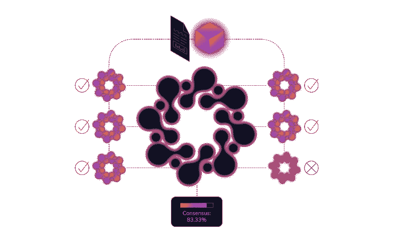
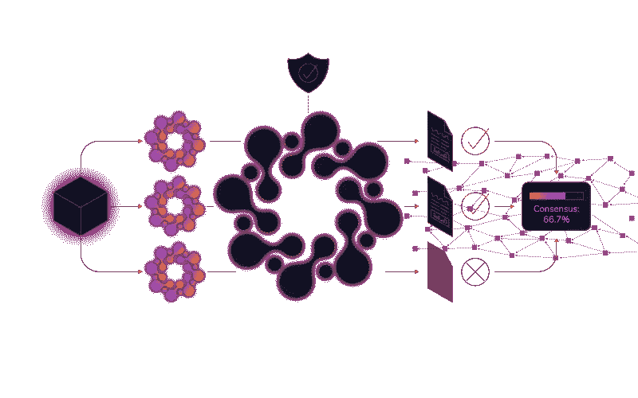
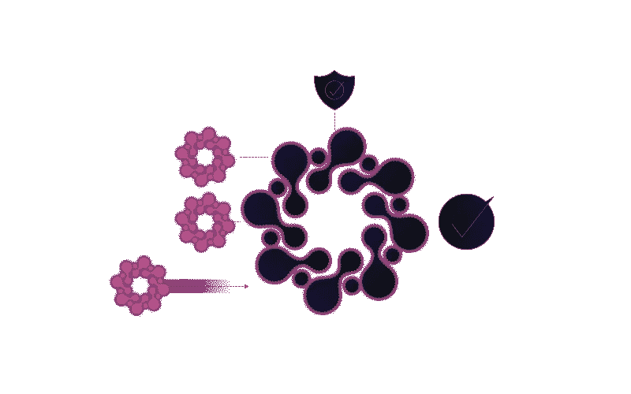
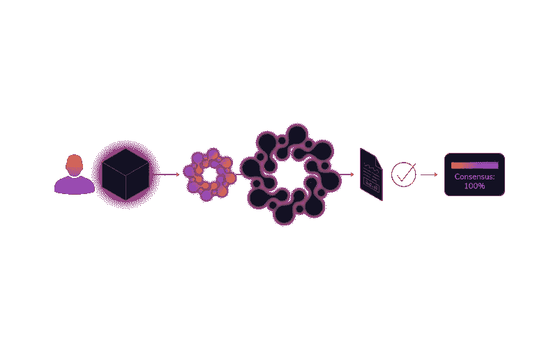
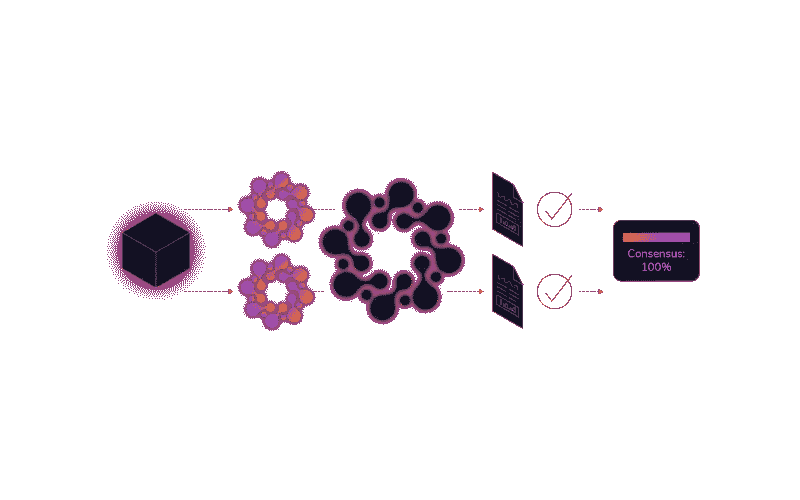
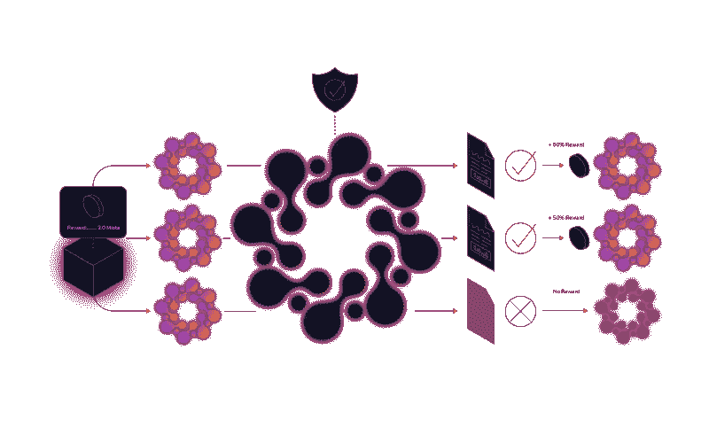
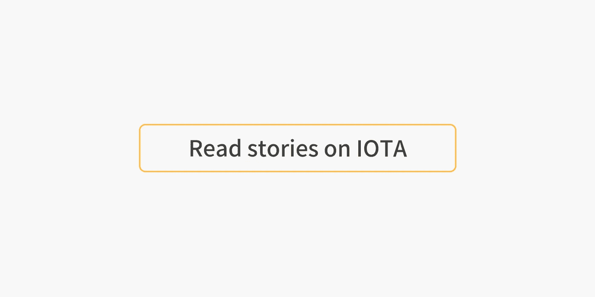

# Qubic:基于群体的计算——由 IOTA 提供支持第 2 部分

> 原文：<https://medium.com/coinmonks/qubic-quorum-based-computations-powered-by-iota-52e13c46bdde?source=collection_archive---------4----------------------->

**第二部分-神谕&法定人数**

([链接到第一部分](/@Zass27/qubic-quorum-based-computations-powered-by-iota-3770fbd62341))

在一个完美的世界里，我们可以直接让神谕来运行我们的计算。但可悲的是，我们生活在一个恶意行为者试图利用他人的世界，要么通过影响他们的结果，要么在他们看到机会时直接从他们那里窃取。因此，我们需要增加额外的保护措施来防范恶意行为者。我们将需要能够信任计算结果，无论哪个 oracle 进行处理。

在 Qubic 协议中，实现这一点的方式是通过强制法定人数共识。因为我们不能像某些区块链解决方案那样，期望每个 oracle 运行所有现有的 qubics 并验证所有结果，所以我们使用法定人数来就结果达成共识。

这意味着在 Qubic 系统中，一组神谕将组合成一个集合，其中所有成员将处理同一组 qubic，并且每个神谕将在 Tangle 上发布其对每个 qu BIC 的处理结果。这将允许 qubic 所有者决定大会的法定人数共识。如果他们不能形成法定人数(议会中至少三分之二的先知同意这个结果)，那么这个结果将不会被 qubic 的所有者接受。

在集会中保持诚实的动机和成为先知的动机是一样的:qubic 所有者提供的奖励。这个奖励将会分配给大会中为那个库比奇产生法定人数结果的先知们。如果你想出一个篡改或错误的异议结果，你将错过奖励。如果你决定不参与处理 qubic，情况也是如此。没有处理就意味着没有奖励。

注意，一个 qubic 拥有者可以通过选择一个更大的组件来增加处理结果的可信度，或者甚至有可能让多个随机组件处理 qubic。这完全取决于数据的重要性以及他愿意支付的报酬金额。

# 信任数字

在分布式计算中:

> ***法定人数*** *是分布式事务为了被允许在* [*分布式系统*](https://en.wikipedia.org/wiki/Distributed_system) *中执行操作而必须获得的最小票数。*

这类似于该词更早、更为熟悉的用法，因为它适用于立法机构:

> **法定人数是审议大会(使用议会程序的机构，如立法机关)处理该团体事务所必需的最低人数。**

*在库比奇的例子中，“审议大会”是一个特定的神谕团体，法定人数是该团体投票权的最低百分比，必须达成共识才能认为结果是有效的。没有法定人数，结果被认为是不确定的，因此无效。*

*Qubic 使用法定人数来就输入数据和计算结果达成一致，例如，当从 oracle 汇编中检索数据时，或者当处理基于法定人数的计算时。在这两种情况下，基本上是一个硬币的两面，只有当所有参与者中至少有 2/3 同意时，数据才被认为是有效的。因此有了这个术语:*基于法定人数的计算*法定人数使得恶意行为者难以伪造数据，并且降低了偶然或无意的错误数据的影响。*

*虽然让多个设备处理相同的计算看起来有些浪费，但这是在不可信的分散系统中保持数据未被篡改的高度确定性的唯一方法。重要的是，当其他协议期望每个网络参与者参与每个计算时，Qubic 只期望特定集合中的神谕参与给定的计算。事实上，Qubic 甚至允许单 oracle 程序集，这意味着相同的协议可以在更有效的环境中使用，在这些环境中，操作员是可信的，或者结果的有效性很容易验证。*

# *集合的形成*

**

*神谕可以是可信的，也可以是不可信的。可信神谕通常是那些由 qubic 所有者直接控制的神谕，或者那些随着时间的推移已经获得了值得信赖的声誉的神谕。请注意，后者不允许 100%的保证，但允许对一个已知的值得信赖的 oracle 的高度信任。*

*然而，在一般情况下，大多数 oracles 不受任何特定用户的信任。因此，大多数神谕生命周期中的一个重要步骤是成为一个集合体的一部分，它与一个适当的激励结构相结合，是一种用于在一个不信任的环境中提供信任的机制。特别是，先知保持诚实的动机是承诺的处理奖励，只有当他们交付法定结果时，他们才会收到。假设大多数不可信的预言将因此以预期的方式执行——这些预言被称为“诚实预言”。*

*无论我们是否只与可信的神谕打交道，都将对我们如何以及为什么组成我们的集会产生影响。类似于处理分布式数据的 CAP 定理，Qubic 在给定的集合中最多支持分布式计算的三个属性中的两个:去中心化、延迟和信任。以下部分探讨了一些最常见的用例。*

# *单 ORACLE 程序集*

**

*在最低的极端情况下，单个受信任的 oracle 可以形成自己的程序集，由自己作为唯一的成员组成。这种模式以分散化为代价，优先考虑延迟和信任。这种组件在两种情况下是有用的:*

1.  *处理来自完全信任 qubic 的所有者的 qu BIC；或者*
2.  *处理量子信息，其结果计算起来很昂贵，但很容易验证。*

*一个例子:来自一个制造商的一组传感器，它们本身需要外包处理或外部输入数据。在这种情况下，制造商可以设置一台可信的 oracle 机器来处理这些传感器的量子位。由于 oracle 机器设计为与传感器协同工作，因此可以优化延迟，信任系数可以是 100%。不受信任的 oracle 无法将其自身插入到该程序集中。此外，因为已经存在对神谕处理量子比特的激励(例如，制造商需要它)，所以处理奖励可以保持为零。*

*其他协议可以用来处理这种情况，但 Qubic 提供了一个标准化和可扩展的解决方案。当传感器组变得太大以至于单台机器无法处理时，Qubic 可以轻松地将更多可信的 oracle 机器添加到组件中。此外，如果传感器本身已经运行简单的 Qubic，将它们的数据发送到 Tangle，qu BIC 就不需要单独的协议，并减少了实现开销。*

# *双 ORACLE 程序集*

**

*在由于操作者是已知的和可信的而可以使用单 oracle 组件的情况下，扩展组件以包括用于冗余的备份 oracle 可能是有利的。*

*以上面的例子为例，假设唯一的 oracle 机器出现故障，并由于故障报告了不正确的结果。因为信任是假定的，所以接受的结果将是不正确的。增加冗余将使有缺陷或故障的机器更容易被发现。只要两个神谕都达到法定人数，就会对机器的功能有高度的信心。一旦只提供一个结果(即，一个 oracle 出现故障)，或者更糟:出现冲突的结果(即，一个 oracle 出现故障)，结果立即变得可疑，系统可以在派出技术人员时正常停止。*

*为了增加冗余，可以将更多的 oracle 机器添加到组件中。只要达到法定数量，系统作为一个整体就可以保持正常运行，即使面对一台或多台出现故障或崩溃的 oracle 机器。因为这个例子也依赖于制造商提供的激励，并且假设信任神谕，所以同样不需要奖励。*

*虽然仍然以分散化为代价来优先考虑延迟和信任，但在这种情况下，延迟将不是最佳的，因为达成共识需要时间。*

# *更大的组件*

**

*由两个以上不可信的预言组成的集合很可能成为标准，特别是由未知操作者公开处理的量子。这种模式以延迟为代价优先考虑去中心化和信任。在大型集会中，信任是通过激励系统，即奖励来提供的。*

*创建可信系统的一个简单方法是简单地比较每个 oracle 的结果。然而，奖励本身引入了一个不可告人的动机:利用系统获得比应得更多的奖励。有两种明显的方法可以做到这一点:*

1.  *如果报酬或投票权在神谕中平均分配(每个神谕的份额相等)，一个神谕可以冒充多个神谕来进行 Sybil 攻击。为了防止这种情况，Qubic 要求 oracles 在程序集开始处理 qu BIC 之前参与资源测试阶段。*
2.  *如果结果是公开发布的，oracle 可以通过不做任何处理来欺骗，并简单地复制正在形成的仲裁结果。我们称之为教室袭击。为了防止这种情况，结果分两步公布。oracle 首先提交一个提交事务，该事务唯一地标识了 Oracle 及其结果，但没有给出答案。直到后来，他们才发布 reveal 交易，消费者阅读这些交易以找到结果。*

*([链接至第三部分](/@Zass27/qubic-quorum-based-computations-powered-by-iota-66aa61ca4916))*

*

**Click to learn more about IOTA***