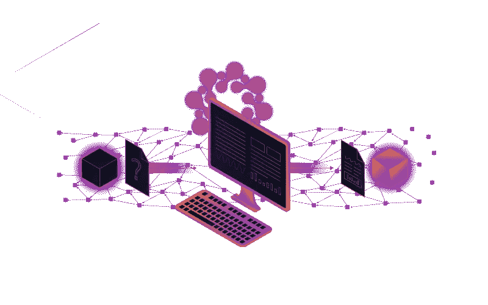
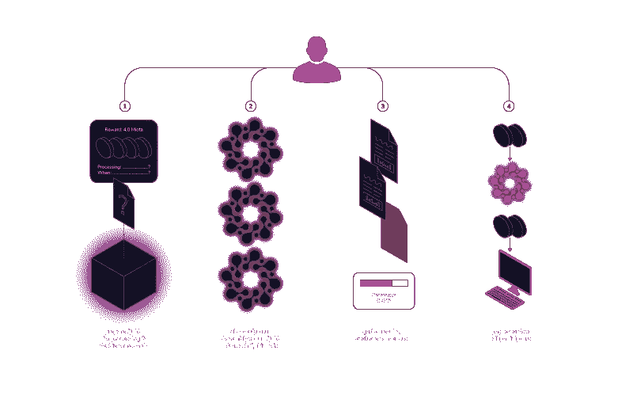
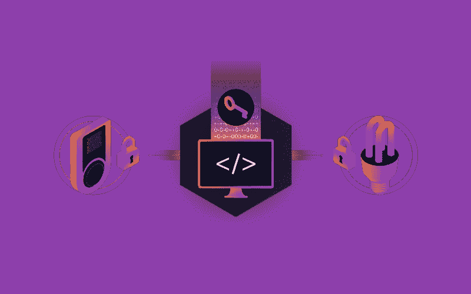

# Qubic:基于群体的计算——由 IOTA 提供支持第 3 部分

> 原文：<https://medium.com/coinmonks/qubic-quorum-based-computations-powered-by-iota-66aa61ca4916?source=collection_archive---------3----------------------->

**第三部分——深入探究量子力学**

([链接至第二部分](/@Zass27/qubic-quorum-based-computations-powered-by-iota-52e13c46bdde))

从本质上讲，单个量子是预先包装好的基于群体的计算任务。Qubic 利用 IOTA Tangle 将 qu BIC 打包并从它们的所有者分发到将要处理它们的 oracles。

Qubics 在正常的 IOTA 事务中作为消息发布，并且包含关于如何以及何时处理它们的特殊指令，称为元数据。Oracles 可以读取 qubic 元数据，以决定是否执行相关奖励所需的处理。启用 Qubic 的 IOTA 节点(简称为 Q 节点)可以根据其运营商设置的参数自动处理大部分决策。

量子任务是用一种叫做凯西的中间三进制函数式编程语言来指定的。Qubic 编程模型允许数据在整个系统中从 qubic 流向 qubic。从技术上讲，qubics 是事件驱动的，这意味着它们直接监听 Tangle 的输入数据，并在输入数据发生变化时运行。由于量子将他们的结果发送回 Tangle，运行一个量子可以导致许多其他量子以某种“连锁反应”的方式运行。量子位充当其它量子位的触发器，而其它量子位又触发其它量子位，等等。

换句话说，量子可以在休眠状态下生活在缠结上。当特定的输入数据变得可用或改变时，它们将“醒来”并开始处理，这可能导致其他量子比特的级联随着新结果变得可用而醒来。这允许一个非常动态的编程环境，因为你可以在任何时候添加新的量子，并将它们绑定到你喜欢的任何输入数据。

更重要的是，任何人都可以发布一个包含他们想要运行的 qubic 代码的交易，为了获得适当的奖励，可以看到结果显示在 Tangle 中。

# 量子生命周期

以下步骤概述了 qubic 的生命周期:

*   准备 qubic 进行处理
*   决定提供的奖励
*   决定在哪个程序集运行 qubic
*   将 qubic 附加到组件(或该组件的特定时期)
*   等到组件开始处理 qubic
*   收集提交的处理结果
*   评估法定人数共识
*   收集显示的处理结果
*   结果出来后，向法定人数参与者支付承诺的奖励。
*   为了准备 qubic，所有者将凯西代码和 qubic 元数据打包到 IOTA 事务中。包含凯西码和量子位元数据的 IOTA 事务被称为量子位事务。在这方面，Qubic 利用 IOTA 协议提供的零值、纯数据交易机制。

然后，所有者通过在 Tangle 中查找提供有关 oracle 程序集信息的特定事务，来选择哪个程序集将处理 qubic。这些被称为组装交易。将 qubic 事务附加到 assembly 事务会通知 Oracle qu BIC 可用于处理。

那么，神谕就是处理量子的 Q 节点算子。他们监听 qubic 事务的 tangle，并构建一个私有的子 Tangle 来跟踪它们。Qubic 事务必须是格式良好的和有签名的，否则节点将拒绝处理它们。

一旦 qubic 交易通过验证，节点将准备 qubic 在节点的特定硬件上运行，并安排 qubic 进行处理。一旦量子比特被处理，达到了法定数量，结果被发送到 Tangle，就会发生两件事:1)量子比特再次进入休眠状态，等待输入的下一次改变，2)级联效应被触发，因此相关的量子比特旋转起来，开始处理新的输入。

# 量子定义语言:ABRA

凯西是一种中间的基于三进制的函数式编程语言。

凯西一直受限于最先进的硬件。像物联网本身一样，Qubic 旨在运行在各种各样的硬件上。为了能够在不同的硬件平台上运行相同的代码，qubics 被封装在这种**中级**语言中，这实质上意味着这种语言有助于为特定的硬件进行简单的翻译或解释。这使得 Qubic 在很大程度上独立于硬件。

一种**功能性**编程语言允许更容易的分析来证明代码的正确性。编写正确的程序不是一件小事。我们在过去已经看到，即使是简单的智能合约也很难没有 bug。拥有一种适合自动化分析的语言是对传统命令式语言的巨大改进。作为一个额外的好处，函数式程序有助于大量使用并行化，这意味着一个更大的程序的不同部分可以并发运行，以利用多个 CPU 甚至多个设备。

最后，凯西是基于三进制的，因为三进制系统可以节省大量能源，这是物联网设备的一个重要考虑因素。一个三进制数字，一个 trit，可以代表 1.58 位。因此，三进制系统所需的布线数量可以减少到等效二进制系统的大约 64%，从而导致相应的能量减少。

凯西由函数组成，而函数本身又可能由函数组成——渐近收敛于可能返回三元值或空值的函数，表示逻辑分支的终止。没有控制流，但是当数据流经这些函数时，它会隐式地进行分支和合并。给定的端点被视为返回某个值的幸存函数分支。

因此，凯西属于一种被称为[数据流编程](https://en.wikipedia.org/wiki/Dataflow_programming)的编程范式，并且适合所谓的[波流水线](https://dl.acm.org/citation.cfm?id=891514)。数据可以流经处理器的几个阶段，而不需要同步或缓冲延迟。这已经被证明能够实现传统流水线系统可能实现的时钟速率的 2 到 7 倍。

关于优化的最后一点:凯西将为最常见的平台提供一个预定义的基本函数库。尽管大多数功能都是在非常低的级别定义的，但凯西的性质允许我们在必要时用更有效的硬件特定实现来覆盖功能。

像 IOTA 一样，Qubic，特别是凯西，为无许可合作提供了进一步的机会，以帮助迭代、改进和创建我们的共同愿景。

([链接至第四部分](/@Zass27/qubic-quorum-based-computations-powered-by-iota-bb58432baea))

**Click to learn more about IOTA**