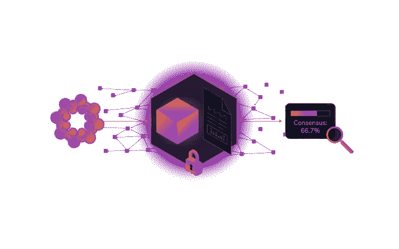

# Qubic:基于群体的计算——由 IOTA 提供支持第 4 部分

> 原文：<https://medium.com/coinmonks/qubic-quorum-based-computations-powered-by-iota-bb58432baea?source=collection_archive---------5----------------------->

**第四部分-量子比特协议**

([链接至第三部分](/@Zass27/qubic-quorum-based-computations-powered-by-iota-66aa61ca4916))

Qubic 协议规定了 qu BIC 的构造、执行和进化生命周期。它利用 IOTA 协议在各种参与者之间进行安全、分散的通信。此外，由于 IOTA 有其自己的内置支付系统，IOTA 令牌用于为 qubic 运营商提供激励系统。任何人都可以自己决定，在什么样的门槛上，奖励才变得足够有趣，值得参与。

Qubic 为人们运行节点提供了巨大的激励:让其他人使用多余的计算能力或存储能力，从而提供有用的服务，并为此获得报酬。q-node 可以为旧的、被遗弃的 PC 带来新的生命，它们可以为传统的加密货币矿工提供一种通过进行有用的计算而不是解决无意义(和浪费)的密码难题来赚钱的方法。

未来，Qubic 将利用这种全球范围内未使用的计算能力来解决各种计算问题。Qubic 针对物联网进行了优化——低能耗和小内存占用——但这并不排除大规模计算，特别是对于可能并行化和分布在大量处理器上的计算。

# 量子时代

通过以 IOTA 事务的形式在 Tangle 上发布一组全局参数来启动组装。oracles 随后可以使用这个程序集事务来查找程序集，并决定是否要加入它。

新神谕不能简单地随机加入集会。相反，程序集可以在某些预定义的时间间隔(称为时期)向新的 oracles 开放。在一个纪元中，组成集合的神谕都是已知的和固定的。在每个时期内，所有的神谕都将处理相同的一组事件，从而触发相同的一组量子运行。

每个历元都有一个确切的开始时间和持续时间，它们作为全局参数在 Tangle 上作为一个事务发布。epoch 事务还详细说明了在 epoch 期间其他 oracles 是否可以以及如何加入程序集。一个纪元本身分成两个不同的阶段:T4 资源测试阶段和量子处理阶段。

# 阶段 1:资源测试

为了防止 Sybil 攻击的可能性，程序集要求 oracles 提供资源的证明。Qubic 系统在这方面非常灵活。它可以接受不同的资源证明方式，甚至允许混合不同的证明类型，这取决于特定的程序集需求。此类证明类型的示例:工作证明(PoW)、利益证明(PoS)、带宽证明、频谱证明等。

想要参与组装的 Oracles 将需要在每个纪元开始时的所谓的*资源测试阶段*期间提供资源证明。epoch 参数将指定资源测试阶段将持续多长时间，以及需要提供什么类型的证明。结果不仅会显示每个 oracle 都是一个独立的实体，还会以*权重因子*的形式显示每个 oracle 的相对能力。

# 赌注和权衡因素

每种类型的资源证明都有一个关联的利害关系因子，该因子决定了它在程序集中资源证明类型之间的相对投票权。集合发起者将作为唯一的股份持有者开始，并且不需要单独的股份证明。发起者可以决定将一些其他可信的先知作为独立的不需要证明的利益相关者添加到程序集中，这些利益相关者具有他们自己预先定义的利益相关因素。或者，基于一些资源证明，该集合可以向任何想要加入的先知开放。这种风险因素由这些先知共享，并根据他们的权重因素分配给他们。

相对股权因素决定了议会中每个先知的比例投票权。qubic 所有者提供的任何奖励都将与这一投票权成比例地分配给神谕。

假设股权因素是工作证明(PoW)。在资源测试阶段，加入集合的新先知会尽可能多次地解决某个密码难题。PoW 方法可以由 qubic 指定为历元参数的一部分。希望参与组装的 Oracles 需要在资源测试阶段结束时提供它们的资源证明，这将定义它们在当前时期的权重因子。

当集合仅由无证据利益相关者组成时，在纪元开始时的资源测试阶段是不必要的，并且 qubic 处理阶段可以立即开始。

在一个时期内的任何时刻，任何参与的 oracle 都可以通过附加调整事务来建议对赌注的组成或其他时期参数进行调整。每个 oracle 都可以通过将投票附加到事务来对该调整进行投票。如果在时期结束时达到了法定结果，则新的参数与指定它们何时生效的时期事务一起被公布。

这意味着程序集可以负责任地控制自己的引导阶段，以敏捷的方式响应技术的变化，并且程序集的创建者可以随着时间的推移安全地脱离自己。他们可以动态地响应网络中的变化，无论这意味着通过减少 epoch 持续时间来增加 oracle 周转时间，还是与其他组件合作来分担工作。允许对网络条件进行优化是 Qubic 协议的优点之一。

# 奖励作为激励

奖励分配给根据各自的权重因子返回正确法定人数结果的先知。每个神谕执行相同的工作量以达到相同的结果，所以问题出现了:为什么要给更强大的神谕更多的奖励？答案是双重的:

1.  防止一个强大的神谕冒充几个不太强大的神谕。被模拟的 oracles 的权重之和永远不会超过其没有模拟的权重。因此，多次模仿不会带来任何好处。
2.  给予神谕经济上的激励，使其倾向于包含类似神谕的集合。

一个不太强大的神谕将无法跟上集会的其他成员，但可以在一个类似的对等群体中获得更多的奖励。一个更强大的甲骨文公司将闲置其过剩的处理能力，因此它也可以在一个类似的同行群体中获得更多的回报。

结果是不同的组件提供不同等级的处理能力，相应的奖励也不同。然而，在每一次集会中，奖励会被更平均地分配，因为群体中神谕的权重会非常相似。经济力量确保每个组合的回报达到合理的平衡。具有相似权重的神谕组也有助于防止一个神谕过度影响法定人数。

Qubic 的所有者可以决定在或多或少强大的组件上运行他们的 qu BIC 的成本与时间效益，同样，经济力量将推动这一选择。

# 第二阶段:处理

一旦资源测试阶段完成，参与集合的先知将开始处理已经附加到集合(或纪元)的量子。

由于凯西中间语言的功能性质，给定相同的输入数据，qubic 将总是产生完全相同的输出结果数据。因此，一个量子比特将处理它的输入，最终以一个稳定的输出状态结束。量子位完全处理其输入所需的时间称为*量子*。请注意，量子是以*逻辑时间*计量的，而不是以*实时时间*计量的，因为每个量子的实际处理时间可能会有所不同。换句话说，quant 是一个计数器或迭代器。

凯西不允许无限循环，因此量子必须在有限的时间内结束:也就是量子。量子比特的输入在量子内有一个预定义的调用时间限制，以防止无限循环。当所有级联量子位处理完它们的输入并发布结果时，量子化就结束了。Quants 还用于定位来自不同 oracles 的相同计算任务的结果。

由于凯西强加的这些限制，重要的是要注意一个量子比特在单个(或有限个)纪元内不是图灵完全的。然而，Qubic 允许在不确定数量的历元上的图灵完全性。

在输出数据成为其他量子位的输入数据之前，可以延迟若干量子位的输出数据。这允许在确定某些量子将被触发时有更大的灵活性，并且可以被认为是“流逝(逻辑)时间的证明”

就在一个时期结束之前，所有 oracles 都会发布一个事务，该事务充当其内部处理状态的快照。这些快照可以在下一个纪元开始时由任何新参与的 oracles 使用，因此适用仲裁一致规则。最后，下一个时期开始于新的资源测试阶段。

# 防止教室袭击

为了防止课堂攻击(通过复制他人的结果作弊)的可能性，qubics 在两个独立的事务中向 Tangle 提交结果:一个*提交*事务，随后是一个*显示*事务。

# 提交事务

在提交事务中，将在不透露实际结果的情况下确定仲裁结果。

每个 oracle 在 Tangle 上的提交事务中发布其计算结果。提交事务包括:

*   一种独特的识别值，称为盐
*   结果数据的散列
*   与 salt 连接的结果数据的散列
*   验证神谕的签名

这保证了其他 oracles 不能简单地复制结果，但是仍然可以比较得到的哈希值，以查看是否达到了对结果的仲裁决定。

# 显示交易

一旦在提交阶段达到了法定人数(2/3 的 oracle 使用相同的结果散列进行了提交事务)，每个 Oracle 在显示事务中将它们的计算结果发布到 Tangle，允许 qubic 所有者使用这些结果。

qubic 所有者现在可以将承诺的奖励分配给那些对正确的法定人数结果做出贡献的先知，并且在提交阶段将结果的正确散列与他们的唯一标识值相结合(意味着他们没有作弊)。

# 关于时间戳的一个注记

时间戳在 IOTA 和 Qubic 中有多种功能。例如，资源测试结果必须在给定的时间范围内公布。时间戳对于历史调查也很有用，但前提是它们具有高度的准确性。对于这些函数中的任何一个，都需要一种确定时间戳置信度的有效方法。IOTA 基金会自己的 Serguei Popov 博士和他的团队在他们的论文 [*中详细描述了两种时间戳方法。Qubic 可能会利用这些方法中的一种或两种，等待对其性能和能力的进一步研究。*](https://assets.ctfassets.net/r1dr6vzfxhev/4iQXZ7bZGwSsE26SkqOQao/2ebf046578dabec5c1d3c48ed442c86f/On_timestamps_in_the_Tangle.pdf)

([链接到第五部分](/@Zass27/qubic-quorum-based-computations-powered-by-iota-51c8517d0c57))

**Click to learn more about IOTA**