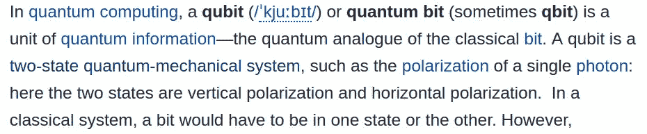
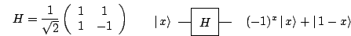
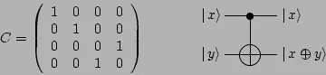

# 量子位——萨满的观点

> 原文：<https://medium.com/coinmonks/qubits-a-shaman-perspective-c8904a8375dc?source=collection_archive---------1----------------------->

## *数据工程师的逆向工程实验。或者从应用编程接口迈出理解量子计算的第一步*


A Screenshot from the game “Everything” [https://en.wikipedia.org/wiki/Everything_(video_game)](https://en.wikipedia.org/wiki/Everything_(video_game))

“我们的经验当然刺激我们创造了数字的概念——十进制与我们十个手指的联系足以证明这一点。如果一个人可以想象生活在太阳上的智慧生物，那里的一切都是气态的，那么他们大概没有数字的概念，也没有“事物”的概念。“他们可能有数学，但最基本的分支是拓扑学。一些太阳能爱因斯坦可能会发明算术，并想象一个世界，这将是适用的，但这个主题会被认为是太难的男生。”(伯特兰·罗素，*《伯特兰·罗素的哲学》*，保罗·阿瑟·席尔普主编，埃文斯顿和芝加哥:西北大学，1944 年，第 697 页。)

# 哲学机器——一个量子故事

对于那些还没有注意到的人来说，这只是一个小消息:*随着 IBM 的 QX 服务在 IBM BlueMix [1]上运行，世界已经进入了量子计算时代*。

让我们搜索一下…

作为一名软件开发人员，我很难完成线性代数，也不能完全忍受微积分。不过，我通常可以用逻辑工作(感谢布尔爵士和拉塞尔爵士)一些基本的基石出来，创造适当的工作算法；尤其是如果有制作精良的第三方库可以支持我的无知。

作为一个算法练习，我在这里写下我从查看**量子信息软件包**【2】和 **Q#语言文档**【3】中了解到的内容，这两个主要工具最近分别由 qiskit developing initiative 和微软开源和发布，用于在下一代计算机上执行计算。让我们看看我们能从数字逻辑出发理解多少 Q 程序。

图书馆的大门是什么？其**应用编程接口**显而易见。以我的拙见，界面之于软件，就像哲学和诗歌之于知识一样。界面包含魔力，同样的单词也包含符号…

# 收集材料:我认为我对数字的了解

第一个基本假设是从:

*   基于二进制的数学领域，其中一切都是以 2 为底的对数，整数通常是从右向左或从左向右读取的 8 或 16 位序列。

收件人:

*   复数领域，另一种数学抽象，假设虚数的存在，定义被认为不可能用实数计算的量。量子计算机正在处理具有虚部和实部的复数。

作为一名软件开发人员，我必须创建自己的设备来访问这个相当难以接近的知识领域。让我们从一些基于[鸭子分型](https://en.wikipedia.org/wiki/Duck_typing)和[功能](https://en.wikipedia.org/wiki/Functional_programming)编程的假设开始。为了进入虚数的领域，我们可能需要一些深思熟虑的咒语。

咒语 1:数字可以被认为是“实体”，或者更具体地说是数量，但在本体论上，它们是定义在“单位”、“零”、“空”、“运算”和“同一性”概念上的属性的集合。

*似是而非的例子*:“2”是一个数，也是一个量。在本体论上，除了名称之外，任何东西都是单位对自身的加法(运算)。

咒语 2:让我们假设，有一个所谓的“上本体”(一个精确定义数字运算的字典)，其中我们已经定义了所有的运算，我们领域的单位和身份；我们可以很确定地定义任何实数(通过定义这个“抽象的东西”的属性，这是一个数，见鸭子打字:如果它像鸭子一样叫，它像鸭子一样走，它就是一只鸭子！).这是一个常见的练习，就像让我们定义一些从他们的 [GCD](https://en.wikipedia.org/wiki/Greatest_common_divisor) 开始的数字列表。

> [直接在您的收件箱中获得最佳软件交易](https://coincodecap.com/?utm_source=coinmonks)

[](https://coincodecap.com/?utm_source=coinmonks)

*例*:查看函数组合【4】的定义。计算机功能可能非常类似于数学运算:

```
*#*
*# composition of a multiplication and an addition*
*# w times z plus j equals y*
*#*
y = add(multiply(w,z), j) *#*
*# the paradoxical example above explained as a computer function*
*#*
unit = 1 *# this is 1, the unit*
add(unit, unit) *# this is 2 with no "two" word!*
add(add(unit, unit), unit) *# and magic this is 3 with no "three" word!*#
# two numbers defined as multiples of their GCD
#
n1, n2 = 30, 15
a = multiply(gcd(n1, n2), 2)
b = gcd(n1, n2)
```

# 关于复数

要移动，我们需要创建一个完整的卷轴…跟着我。

第一卷:看一看维基百科，复数[5]被定义为

```
c = a + bi
```

其中“a”是实部，“bi”是虚部。


[http://en.wikipedia.org/wiki/Complex_number](http://en.wikipedia.org/wiki/Complex_number)

第二卷:注意复数可能是外来的，但是它的定义暗示了我们所熟悉的实数所使用的完全相同的运算

第三卷:量子计算机可以对复数和实数进行运算，这要归功于一种基于工程物质状态的新架构设计，这种设计使得利用一种叫做*量子位*的单元来处理信息成为可能。

# 进入可能性的领域

关于一个量子位[6][7]:

```
a qubit is a unit of information that can have a state of 0 or 1or a state of superposition of both (0 and 1)
```



[https://en.wikipedia.org/wiki/Qubit](https://en.wikipedia.org/wiki/Qubit)

```
a Quantum computer can perform computations by leveraging the
 possibility of its unit to be 0 and 1 at the same time (as above,
 superposition)A superposition is a state in which the two possible states are
 added (superposed). Can "Superposing" be defined as other
 operations are, like adding or multiplying? Can we
 add it to our "upper-ontology"
```


Wikipedia

就我们在这个实验中使用的设置而言，似乎我们在这里有一个新的“超级运算”添加到我们的上层本体论，这个“运算”是由量子电路在由量子比特组成的注册表上执行的计算。让我们在下一节看看它实际上意味着什么。这可以被看作是操作/功能的一个新的类别/级别，例如，由于量子态，使得属性或操作成为可能。

# 新领域:莫比乌斯条纹机

虚数“I”不在实数的范围内(就像平方为-1 的数)，复数领域的运算在许多模型中非常适用于解释物理现象。许多解释我们对现实的感知的数学都是基于这种计算。

在我非常非常有限的量子物理学知识的背景下，我不能真正完全掌握这些概念，但是，看，由于我在工作和编程方面的专业知识，(Web-)**API(应用程序编程接口)**以及对**语义 Web** 概念和 **Python** 的熟悉，我可以使用一种更容易理解的语言来阅读这个主题(与所涉及的数学相比)。通过编程概念访问要容易得多，因为与数学和形式逻辑相比，它利用了用更“人类自然”的语法表达的逻辑。我绝对需要尝试在这些巨人的肩膀上冲浪！[8]使用我的薄 API 板。

> 编写代码的起点是`[**QuantumProgram**](https://www.qiskit.org/documentation/_autodoc/qiskit.QuantumProgram.html#qiskit.QuantumProgram)`对象。量子程序是电路、…、量子寄存器对象和经典寄存器对象的集合。QuantumProgram 方法可以将这些电路发送到量子硬件或模拟器后端，并收集结果以供进一步分析。[2]
> 
> …由三个经典位组成的寄存器在给定时刻只能存储一个数字。输入量子位和量子寄存器:… [10]
> 
> 量子位通常是一个微观系统，如原子、核自旋或极化光子。一组 *n* 量子位被称为一个*量子寄存器*，大小为 *n* 。[10]

```
"""
Code taken from the documentation at [2] **"""
from** **qiskit** **import** QuantumProgram
qp = QuantumProgram()# create a quantum register
qr = qp.create_quantum_register('qr', 2)
# create a binary register
cr = qp.create_classical_register('cr', 2)
# define your circuit and its registers
qc = qp.create_circuit('Bell', [qr], [cr])
```

> 最常见的量子门是哈达玛门，一个单量子位门 *H* 执行被称为哈达玛变换的酉变换



[https://www.quantiki.org/sites/default/files/wiki_images/6/62/Img44.png](https://www.quantiki.org/sites/default/files/wiki_images/6/62/Img44.png)

```
# circuit starts from first position in the register
qc.h(qr[0])  # apply H operation on the first position of the reg
```

> 为了纠缠两个(或更多)量子位，我们必须将我们的量子门扩展到两个量子位的量子门。最流行的两量子位门是受控非(C-NOT)，也称为异或或测量门。如果第一(控制)量子位是∣ 1⟩，它翻转第二(目标)量子位，如果控制量子位是∣ 0⟩.，它什么也不做门由酉矩阵表示:[10]



[https://www.quantiki.org/sites/default/files/wiki_images/5/57/Img76.png](https://www.quantiki.org/sites/default/files/wiki_images/5/57/Img76.png)

```
# apply CNOT operation between first and second on the quantum register
qc.cx(qr[0], qr[1])# measure the output
qc.measure(qr[0], cr[0])
qc.measure(qr[1], cr[1])

result = qp.execute('Bell')# Get the histogram data of circuit 'Bell' **print**(result.get_counts('Bell'))
```

`get_counts`方法输出一个*状态计数*对的字典:

```
{'00': 531, '11': 493} 
```

该电路所有可能状态的叠加具有上述状态计数对中定义的频率(对于 *00* 状态和 *11* 状态)。我们可以注意到一个简单的两个量子位的注册表是如何产生如此复杂的叠加态的。我们上面称之为“叠加运算”的结果是一个直方图。

在这本非常有趣的 Jupyter 笔记本中可以找到一个更有说服力的例子。[打印一个超级定位的表情符号](https://github.com/QISKit/qiskit-tutorial/blob/master/0_hello_world/quantum_emoticon.ipynb)。

对于无限概率驾驶来说足够近吗？【9】大概不是。但是访问量子后端至少让我感觉:几千年后，知识仍然是(忠实的)掷骰子游戏。我认为科学通常是一个很好的赌注。

**参考文献:**

[1] [IBM QX](https://quantumexperience.ng.bluemix.net/)

[2] [量子信息软件包](http://qiskit.org/)

[3][Q #编程语言](https://docs.microsoft.com/en-us/quantum/quantum-qr-intro?view=qsharp-preview)

【4】[维基百科:函数构成](https://en.wikipedia.org/wiki/Function_composition_(computer_science))

[5] [维基百科:复数](https://en.wikipedia.org/wiki/Complex_number)

【6】[维基百科:量子位](https://en.wikipedia.org/wiki/Qubit)

【7】[维基百科:量子叠加](https://en.wikipedia.org/wiki/Quantum_superposition)

【8】[维基百科:站在巨人的肩膀上](https://en.wikipedia.org/wiki/Standing_on_the_shoulders_of_giants)

【9】[维基百科:无限概率驱动](https://en.wikipedia.org/wiki/Technology_in_The_Hitchhiker%27s_Guide_to_the_Galaxy#Infinite_Improbability_Drive)

[10] [Quantwiki](https://www.quantiki.org/wiki/basic-concepts-quantum-computation)

**一些代码:**

* [量子计算机](https://github.com/corbett/QuantumComputing/blob/master/QuantumComputer.py)

*[https://github.com/rnowotniak/qclib](https://github.com/rnowotniak/qclib)

*[https://python spot . com/an-introduction-to-building-quantum-computing-applications-with-python/](https://pythonspot.com/an-introduction-to-building-quantum-computing-applications-with-python/)

感谢:

* [广达杂志](https://www.quantamagazine.org/tag/quantum-computing/)

* [鹦鹉螺](http://nautil.us)

特别感谢:

*生态

* J.L .博尔赫斯

*莫比乌斯