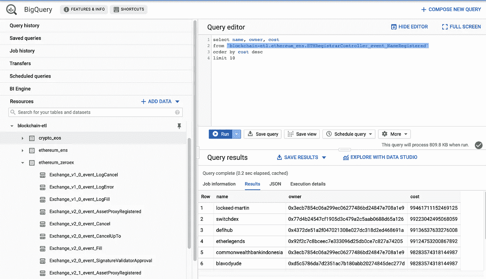

# 在 Google BigQuery 中用 SQL 查询 ENS 和 0x 契约事件

> 原文：<https://medium.com/coinmonks/query-ens-and-0x-events-with-sql-in-google-bigquery-4d197206e644?source=collection_archive---------0----------------------->

*   现在可以在 Google BigQuery 中轻松查询解析过的 [ENS](https://ens.domains/) 、 [0x](https://0x.org/) 以及更多(见下文)智能合约事件: [0x 表](https://console.cloud.google.com/bigquery?p=blockchain-etl&d=ethereum_zeroex&t=Exchange_v2_1_event_Fill&page=table)、 [ENS 表](https://console.cloud.google.com/bigquery?p=blockchain-etl&d=ethereum_ens&t=ETHRegistrarController_event_NameRegistered&page=table)。这些表格几乎是实时的。
*   您可以轻松地将您感兴趣的任何以太坊合约的事件添加到公共`blockchain-etl`数据集中。请在下面查找说明。

## 在 BigQuery 中访问数据集

在您的浏览器中打开数据集链接( [0x 表格](https://console.cloud.google.com/bigquery?p=blockchain-etl&d=ethereum_zeroex&t=Exchange_v2_1_event_Fill&page=table)、 [ENS 表格](https://console.cloud.google.com/bigquery?p=blockchain-etl&d=ethereum_ens&t=ETHRegistrarController_event_NameRegistered&page=table))后，您应该能够在左侧看到`blockchain-etl`项目和其中的可用数据集:



您可以选择每个表，查看其模式、详细信息，并在右下角预览数据。

尝试将该查询粘贴到右上方的编辑器中，并单击**运行**按钮**查询`ETHRegistrarController_event_NameRegistered`表:**

```
**select** name, owner, cost
**from** `blockchain-etl.ethereum_ens.ETHRegistrarController_event_NameRegistered`
**order** **by** cost desc
**limit** 10
```

## 添加数据集和表

按照这里的说明[https://towards data science . com/how-to-get-any-ether eum-smart-contract-into-big query-in-8 mins-Bab 5 db 1 fdeee](https://towardsdatascience.com/how-to-get-any-ethereum-smart-contract-into-bigquery-in-8-mins-bab5db1fdeee)。

## BigQuery 中可用的其他数据集

*   `[blockchain-etl.ethereum_kyber](https://console.cloud.google.com/bigquery?cloudshell=false&p=blockchain-etl&d=ethereum_kyber&page=dataset)`(针对凯博网络)
*   `[blockchain-etl.ethereum_compound](https://console.cloud.google.com/bigquery?cloudshell=false&p=blockchain-etl&d=ethereum_compound&page=dataset)`(用于复合词)
*   `[blockchain-etl.ethereum_airswap](https://console.cloud.google.com/bigquery?cloudshell=false&p=blockchain-etl&d=ethereum_airswap&page=dataset)`(对于 AirSwap)
*   `[blockchain-etl.ethereum_axie](https://console.cloud.google.com/bigquery?cloudshell=false&p=blockchain-etl&d=ethereum_axie&page=dataset)`(轴粗糙度)
*   `[blockchain-etl.ethereum_dex_ag](https://console.cloud.google.com/bigquery?cloudshell=false&p=blockchain-etl&d=ethereum_dex_ag&page=dataset)`(对于德克斯。AG 令牌线)
*   `[blockchain-etl.ethereum_maker](https://console.cloud.google.com/bigquery?cloudshell=false&p=blockchain-etl&d=ethereum_maker&page=dataset)`(针对马克尔道)
*   `[blockchain-etl.ethereum_uniswap](https://console.cloud.google.com/bigquery?cloudshell=false&p=blockchain-etl&d=ethereum_uniswap&page=dataset)`(用于 Uniswap 交换)
*   `[blockchain-etl.ethereum_idex](https://console.cloud.google.com/bigquery?cloudshell=false&p=blockchain-etl&d=ethereum_idex&page=dataset)`(针对 IDEX 交易所)
*   `[blockchain-etl.ethereum_etherdelta](https://console.cloud.google.com/bigquery?cloudshell=false&p=blockchain-etl&d=ethereum_etherdelta&page=dataset)`(用于以太网增量交换)
*   `[blockchain-etl.ethereum_kleros](https://console.cloud.google.com/bigquery?cloudshell=false&p=blockchain-etl&d=ethereum_kleros&page=dataset)`(用于 Kleros)
*   `[blockchain-etl.ethereum_bounties_network](https://console.cloud.google.com/bigquery?cloudshell=false&p=blockchain-etl&d=ethereum_bounties_network&page=dataset)`(用于悬赏网络)

完整列表:[https://github . com/区块链-ETL/以太坊-ETL-air flow/tree/master/DAGs/resources/stages/parse/table _ definitions](https://github.com/blockchain-etl/ethereum-etl-airflow/tree/master/dags/resources/stages/parse/table_definitions)

[](https://coincodecap.com)

> [在您的收件箱中直接获得最佳软件交易](https://coincodecap.com/?utm_source=coinmonks)

[](https://coincodecap.com/?utm_source=coinmonks)