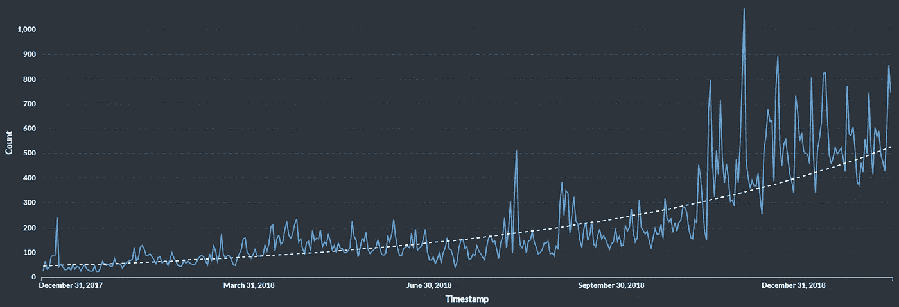

# 用 SQL 查询以太坊

> 原文：<https://medium.com/coinmonks/query-ethereum-with-sql-c3da1c01870f?source=collection_archive---------1----------------------->

TL；DR——你现在可以使用我们的 eth.events **SQL 数据库**轻松**查询以太坊区块链**。下至**智能合约事件级别**，已经**丰富并解码**为人类可读文本，并且**用来自以太坊主网[和各种其他网络](https://account.eth.events/status)的最新块实时更新**。您可以非常快速地在此 [**注册**](https://account.eth.events/auth/signup) **立即获得免费无限制访问**。

在本文中，您可以了解

*   如何使用以太坊区块链数据的 **SQL 演示用例**的可视化
*   自己尝试 SQL 以太坊搜索引擎
*   我们用来存储丰富以太坊数据的区块链 SQL 数据模型
*   **除了现有的弹性搜索索引，我们为什么选择提供区块链 SQL 数据库**
*   我们如何将以太坊 **SQL 数据库添加到我们的技术堆栈**
*   我们的**实时、重组安全以太坊 SQL 索引的状态概述，适用于所有以太坊链**

# 以太坊 SQL 数据用例:DAI 每天唯一的接收者

一张图片胜过千言万语，所以看看我们使用以太坊 SQL 索引创建的示例用例:

Ethereum SQL data use case: DAI Unique Recipients per Day [https://insights.eth.events/public/dashboard/52bf213a-59cf-4e63-a57e-d0d63175f310](https://insights.eth.events/public/dashboard/52bf213a-59cf-4e63-a57e-d0d63175f310)

图表显示的是 [@MakerDAO](https://twitter.com/MakerDAO) stablecoin“戴”每天唯一的收件人(地址)。就在 2017 年 12 月 18 日[发布之后](/makerdao/dai-is-now-live-ad87e34fc826)展示了最初的兴奋。尽管夏季有一点停滞，但自从 7 月初[提高债务上限](/makerdao/we-raised-the-roof-fbe8663442d1)和 2018 年 9 月[就职治理投票](/makerdao/introducing-the-governance-voting-ui-for-the-maker-foundational-vote-3fa669551ce1)以来，戴的用户群一直在强劲增长。随着越来越多的[稳定资本用例](/makerdao/stablecoins-use-cases-44e696ba8633)变得明显，以及当[多抵押品戴最终推出](/makerdao/the-road-to-mainnet-release-21931d47f857)时，虚线趋势线在未来可能会上升得更快。

这张简单的图表展示了一类**用例，其中利用强大的 SQL 数据库非常适合**存储丰富的以太坊区块链数据。使用 JSON-RPC API 查询 Ethereum 客户端会花费很长时间，因为您必须用多个请求遍历整个链。即使这样，您也必须手动将智能协定方法名称解码成人类可读的格式。最后，您可能需要将数据可视化，以便发现趋势并与同行讨论。

如果你 [***点击这个链接***](https://insights.eth.events/public/dashboard/52bf213a-59cf-4e63-a57e-d0d63175f310) ，你可以玩一些过滤器来感受一下**实际上是在和区块链数据**一起工作来获得洞察力。
在这个演示中，我们使用了**开源工具元数据库作为我们的可视化层**。查看全面的[元数据库文档](https://www.metabase.com/docs/latest/)中的广泛特性。

*如果您想使用元数据库来可视化您自己的区块链查询，请随时* [*联系我们*](mailto:contact@eth.events) *，我们可以为您设置。*

# 自己试试以太坊 SQL 搜索引擎

要访问原始 SQL 接口，您首先需要**检索您的访问凭证**。你可以注册一个免费账户，然后马上在[https://account.eth.events/](https://account.eth.events/)获得 SQL 访问凭证，只需几秒钟(或者查看我们详细的[分步指南](https://eth.events/news/get-your-free-eth-events-api-key-3-steps-to-start-your-ethereum-queries/))。然后你需要**决定一个合适的 PostgreSQL 客户端**来访问我们的以太坊数据库。我们建议使用免费的 [PGAdmin4](https://www.pgadmin.org/download/) ，但是任何其他支持 PostgreSQL 11 的客户端都可以。

SQL client pgAdmin4 accessing Ethereum blockchain data

**按照账户后端中提到的方式设置您的 SQL 连接**。如果您需要帮助或出现任何错误，请随时向我们寻求帮助。
你可以在这里找到我们的 [SQL 文档](https://docs.eth.events/en/latest/sql/index.html)，包括一个带有 [**实体关系图**](https://docs.eth.events/en/latest/sql/schema/index.html) 的**数据库模式描述以及一个简短的 [SQL 教程](https://docs.eth.events/en/latest/sql/tutorials/index.html)。**

然而，请记住**以太坊 SQL 接口仍处于测试阶段**，因此该服务可能不会持续可用，并且数据库模式可能每天都有变化。

*我们或许还能帮助您确定并可视化与您的特定用例相关的数据。请发送电子邮件至*[*contact @ eth . events*](mailto:contact@eth.events)*，我们很高兴看到我们的数据被用于许多新的用途！*

# 以太坊 SQL 索引的数据模型

该实体关系图显示了以太坊 SQL 数据库的**模式:**

Data model for the Ethereum SQL index | [https://docs.eth.events/en/latest/sql/schema/index.html](https://docs.eth.events/en/latest/sql/schema/index.html)

# SQL 表和数据源

从以太坊区块链中读取块 *(Block)* 、事务 *(TX)* 和日志 *(Log)* 。*跟踪*是特定于客户端的—这里我们只保存来自奇偶校验节点的数据。

*调用*和*事件*表包含了我们的一些丰富的数据，例如合同方法的解码名称(分别在*方法*和*事件*列中)。为了丰富数据，我们使用表*契约*和*令牌*来匹配散列等。如你所见，我们只有在拥有 ABI 合同的情况下，才能使数据可读。
*如果您有兴趣监控您自己的(非公开)合同—* [*联系我们*](mailto:contact@eth.events) *，我们可以非常轻松地整合您的 ABI，以便您可以更轻松地为您的业务案例解读数据。*

此时*合同*、*令牌*和*链接*中的大部分数据都是从以太扫描中提取的。特别是关于合同 ABIs，我们一直在讨论建立一个独立的注册管理机构。
*如果你想帮助或者可以提供资助来支持这个帮助整个以太坊生态系统的使命——请* [*联系我们*](mailto:contact@eth.events) *。*

在*契约*、*调用*或*事件*的封闭表中，*参数被编码为 JSON 数组*。在引用契约的情况下，这意味着创建时的构造函数参数。
你可以在 [**我们的 SQL 文档**](https://docs.eth.events/en/latest/sql/schema/index.html) 中找到**以太坊区块链 SQL 数据模型更详细的图表和描述。**

# 除了 Elasticsearch 之外，我们为什么增加了 SQL access

我们的[以太坊区块链的弹性搜索指数](https://docs.eth.events/en/latest/elastic/index.html)提供了闪电般快速的数据访问，甚至是智能合约事件级别的复杂查询。那么，为什么要添加一个 SQL 数据库(在我们的例子中是 Postgres)？

主要原因是，与 Elasticsearch 查询 DSL 相比，更多的人更熟悉作为查询语言的 SQL。SQL 已经存在了很长时间，许多不同的商业和开源 SQL 数据库产品都非常遵循 SQL 标准。同样**许多人自己不是开发人员**可以使用或者至少阅读 SQL 查询。虽然许多业务领域用户在讨论数据时会需要图表，但他们中的大多数人都熟悉行和列的表格格式，甚至可能知道如何使用 Excel 电子表格来组合和汇总数据。
**可视化层实际上是我们通过 SQL 提供以太坊数据的另一个原因**。虽然 Elasticsearch 可以包含在许多商业智能工具中，如 [Grafana](https://grafana.com/) 、 [Kibana](https://www.elastic.co/products/kibana) 或 [Plotly](https://plot.ly/) ，但还有一整套其他程序或库可用，如 [Tableau](https://www.tableau.com/) 、 [QlikView](https://www.qlik.com/us/products/qlikview) 或 [Jetbrains DataGrip](https://www.jetbrains.com/datagrip/) ，它们将更容易地与 SQL 数据进行交互。

我们将在未来发布 SQL 和 Elasticsearch 区块链数据索引之间更全面的比较。但是现在您可以放心，无论您是通过 Elasticsearch API 还是我们的 SQL 以太坊索引使用 eth.events，**您都可以访问相同的数据——使用智能合约和令牌信息进行丰富和解码**以方便您的使用。索引是用最新的块实时更新的**，SQL 和 Elasticsearch 都支持**非常快的查询响应时间**。从这个意义上来说，它提出了一个解决上述挑战的方案:[“为什么从以太坊区块链读取数据很难，如何加快读取速度”](/@eth.events/why-reading-data-from-the-ethereum-blockchain-is-hard-and-how-to-speed-it-up-cd7f5badf73e)**

# **我们如何将以太坊 SQL 数据库添加到我们的技术堆栈中**

**我们的技术架构使得通过 Postgres 添加 SQL 变得相对容易，所以你现在可以用最常用的查询语言搜索以太坊区块链的数据。这一切都始于我们以太坊的客户加入 Mainnet。我们使用 Geth 和奇偶校验作为归档节点来获取所有的原始区块链数据。让 Geth 和奇偶校验客户端都处于活动状态可以为我们的基础架构增加冗余和弹性，这是我们能够提供企业级服务级别协议(SLA)的一个因素。一些区块链私人财团也不支持每个客户端，例如[能源网络基金会(EWF)](http://energyweb.org/) 的 Tobalaba 链仅在这一点上依赖于平价客户端。
我们排出数据，并将其放入我们的 [**Apache Kafka**](https://kafka.apache.org/) **流数据管道** /消息队列。以太坊数据然后在我们的[**Apache Storm**](http://storm.apache.org/)**集群**拓扑中进行**转换和丰富，并发送到我们的数据库层。
虽然我们之前只使用了 Elasticsearch，但现在我们简单地添加了另一个拓扑来将以太坊数据输入 PostgreSQL 数据库。****

**为了能够将大约 2 TB 的以太坊区块链数据加载到服务器中，我们不得不在配置上做了很多改动，还调整了 Java 数据库抽象层(JDBC)。如你所知，任何 **SQL 关系数据库都需要比基于文档的弹性搜索更彻底的结构**或模式。因此以太坊的数据流相当庞大且无序，需要明智地引导。SQL 数据库的另一个特点是依赖于约束和索引，特别是以太坊数据的历史导入。**

# **所有以太坊链的以太坊 SQL 实时索引**

**然而，更重要的是，随着新数据块在网络中传播，我们的 **SQL 索引会实时更新**！这之所以成为可能，是因为没有缓存、批处理或任何延迟数据丰富和索引的东西。这对于我们的 Elasticsearch API 来说已经是可能的了，但它也适用于以太坊 SQL 索引。这也使**数据重组变得安全**，因为在被节点通知后，用新验证的块更新索引以及删除旧条目只是亚秒级的操作。**

****

**Real-time status of eth.events Ethereum SQL indexed networks | [https://account.eth.events/status](https://account.eth.events/status)**

**这些很棒的功能不仅仅是以太坊主网才有的，所有以太坊测试网**(rops ten，Kovan，Rinkeby)** 。当然，我们也可以根据请求**快速索引基于以太坊的私人区块链**，就像我们对 EWF Tobalaba 连锁店所做的那样。目前我们已经通过 Elasticsearch API 提供了这些，但几天后也将在 SQL 中提供。我们还在开发一个 eth.events 虚拟设备，这样 eth.events 的实例就可以在私有网络或 VPN 中运行。【https://account.eth.events/status[**你可以在这里看到**指数状态的完整列表****](https://account.eth.events/status)**

***如果我们缺少您正在使用的链条，请* [*告诉我们*](mailto:contact@eth.events) *！***

****建造愉快，保持卓越！****

> **[在您的收件箱中直接获得最佳软件交易](https://coincodecap.com/?utm_source=coinmonks)**

****

***原载于 2019 年 2 月 20 日*[*eth . events*](https://eth.events/news/query-ethereum-with-sql/)*。***